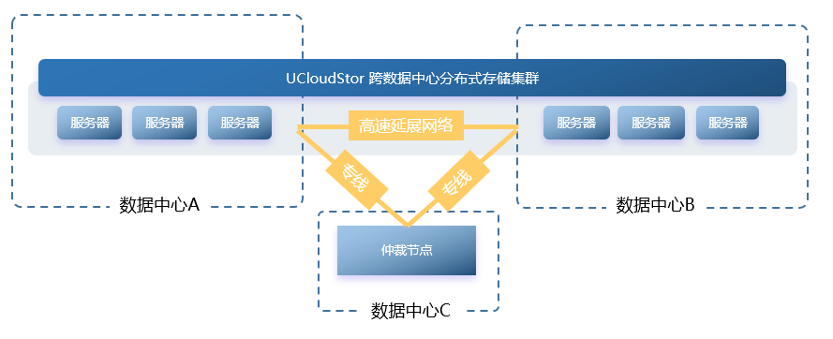

# 8 双活数据中心

## 8.1 概述

出于数据隐私和安全性考量，私有云解决方案成为构建数字化转型的基础底座，通过“同城双活”及“两地三中心”的高可用架构保障生产环境稳定性和业务过程连续性。同时私有云在企业数字化转型中可提供更加快速灵活的IT资源交付和管控，支撑业务创新和变革。

私有云平台具备多数据中心部署和统一管理能力，帮助用户降低双活数据中心的建设门槛，快速实现业务跨数据中心的故障转移保障机制，从而进一步提升并保障业务连续性。

双活数据中心方案采用两个相互独立、互为备份的数据中心，可理解为在两个数据中心采用一套集群统一建设一套私有云平台，并共享一个互联网/企业内网出口。

当一个数据中心出现故障或宕机，可在另一个数据中心之间进行实时数据同步和故障切换，避免业务系统因单点故障而中断，确保业务任何情况都能保持稳定运行。同时双活数据中心具备高度的可扩展性，可根据客户的需求进行自定义配置和扩容，满足不同业务场景下的需求。

通过平台提供的双活数据中心能力，对数据安全和业务连续性保障进行全面梳理和支撑，提升系统可靠性和连续性，助力企业在数字化转型中创造优质价值。

## 8.2 部署结构

在部署结构上，需将计算集群和存储集群的服务节点均一分为二，分别部署于两个数据中心，如10台计算节点，6台存储节点。

* 则在A数据中心部署5台计算节点和3台存储节点，B数据中心部署3台存储节点。

* 将A数据中心的5台计算节点和B数据中心的5台计算节点构建为一个计算集群

* 将A数据中心的3台存储节点和B数据中心的3台存储节点构建为一个存储集群。

两个数据中心的节点间网络可为二层或三层网络通信，需将两个数据中心间通过专线打通内网，保证两个数据中心间网络性能，避免影响分布式存储或虚拟机存储服务的性能。

由于双活数据中心仅在物理上部署在两个数据中心，逻辑上为一套云平台的一个集群，故平台VPC内网可直接通过物理网络进行通信，创建在两个数据中心计算节点上的虚拟机实例均可在一个VPC网络内。

两个数据中心共享统一的互联网/企业网出口，即外网EIP为统一出口，创建在两个数据中心计算节点上的虚拟机实例均可绑定统一出口配置的外网EIP，并可通过外网IP与互联网或企业内网进行通信，并支持随实例进行浮动迁移。

双活数据中心的存储节点共同构建为一套存储集群，共享一套分布式存储系统，将存储管理服务分别部署于两个数据中心和一个仲裁数据中心，避免数据中心脑裂，保证数据中心存储服务的可用性。

分布式存储数据冗余机制通过4副本的方式将分别将2副本存放于2个数据中心，采用数据同步、数据复制、多级故障域及故障自恢复等技术，实现数据在不同数据中心间的强一致同步，提高数据的可用性和可靠性。

云平台管理服务分别部署于两个数据中心和一个仲裁数据中心，采用分布式系统架构，保障云平台调度和管理服务的健壮性和可用性，使私有云在多个数据中心健康运行。

## 8.3 双活机制

**(1)**  **跨数据中心强一致性数据保障机制，防止单点故障和数据丢失**

平台内置分布式存储，作为私有云解决方案的核心存储系统。依托跨数据中心的存储双活能力，可实现跨数据中心强一致性数据保障，是双活数据中心方案的核心技术之一。

通过将数据存储在多个数据中心中，并采用数据同步和数据复制等技术，实现数据在不同数据中心之间的双向同步和备份，提高数据的可用性和可靠性，防止数据中心单点故障和数据丢失。在数据中心之间的网络质量符合方案要求的前提下，可以实现RPO=0，RTO≈0，保证数据零丢失。

**(2)**  **跨数据中心故障转移机制，有效降低故障恢复时间**

平台默认提供本地故障转移调度策略和机制，当物理服务器发生宕机或故障时，实现在同数据中心内进行故障转移，即：将故障物理机的云实例，向另一台有空闲资源的物理机上迁移并启动，从而大幅降低系统的故障恢复时间，RPO=0，RTO<5min。

跨数据中心的故障转移机制，在优先采用本地调度策略的基础上，增加多数据中心调度属性，当数据中心出现极端的故障时，在对应用不做任何改造的条件下，将云实例迁移至健康数据中心的物理机，实现业务系统跨数据中心的容灾恢复，RPO=0，RTO<5min。

**(3)**  **跨数据中心在线迁移机制，多数据中心资源平衡**

在线迁移是计划内的云主机热迁移操作，即：云主机内的业务应用保持着持续对外服务的同时，云主机在不同的物理机之间进行在线跨物理机迁移，业务应用近似无感知。

跨数据中心在线迁移机制，即提供多数据中心迁移能力，使在线迁移不受限于同一数据中心。跨数据中心在线迁移机制，可以有效的进行多数据中心之间的资源平衡，以及计划内的跨数据中心热迁移。

**(4)**  **跨数据中心分布式管理服务机制，保障系统健康运行**

跨数据中心分布式管理是一种基于分布式系统架构的管理服务，用于支撑私有云平台本身健壮性的一组管理服务，同时可保障私有云在多个数据中心健康运行。该服务机制支持跨数据中心运行，通过将管理功能和资源分布到不同的数据中心，以实现跨数据中心的分布式管理和协作。

* **管理服务自愈能力**

基于分布式系统的建设原理，通过智能化和自动化的管理策略，可以自动监控和维护多个数据中心内的健康状况，减少人工干预和管理成本。在面临数据中心级别故障或异常情况时，管理服务可自动检测、定位、诊断和修复，从而保证云平台的稳定性和可靠性。

* **可视化监控**

提供全面的可视化监控和报告功能，帮助管理员了解云平台的状态和性能，及时发现和解决问题。

* **统一管理接口**

提供统一的管理接口和管理策略，方便管理员对整个系统进行集中化的管理和协作。

## 8.4 双活收益

**(1)**  **降低双活数据中心建设门槛**

传统的双活数据中心建设是一项较为复杂的集成类项目，项目周期长、涉及的软硬件产品多、运维成本高、建设效果参差不齐。

平台将双活数据中心建设所需的基础能力标准化和产品化，客户在建设过程中无需集成第三方产品，采用私有云平台标准的建设步骤即可快速完成双活数据中心的建设。同时配合平台轻量化特性，有效降低双活数据中心的建设成本。

**(2)**  **进一步提升应用的业务连续性**

通过双活数据中心建设，可在不改造业务系统的情况下，实现业务系统的跨数据中心故障转移机制，即跨数据中心宕机迁移和跨数据中心在线迁移，从而再次提升系统的业务连续性。

**(3)**  **为跨数据中心双活应用的建设夯实基础**

通过双活数据中心建设，即完成必要的双活数据中心基础建设，并内置一定的故障转移机制，为双活应用的改造提供充分准备。

用户仅需为应用增加跨数据中心的访问流量调度机制和业务系统本身的跨数据中心高可用，即可完成跨数据中心的双活应用改造。

## 8.5 方案场景

私有云双活数据中心解决方案，可帮助客户进一步提升业务系统的可靠性，同时保障数据安全和隐私性，通过降低建设建设门槛和复杂性，提升建设效率，赋能客户加快数字化转型的进程。适用场景如下：

1. 高可用性要求较高的应用场景，如金融、电商、物流等行业，在业务高峰期和数据中心故障时，能够保证系统的稳定运行。
2. 考虑建设灾备数据中心的客户，可在数据中心出现故障时，快速将应用切换到另一个数据中心，保证业务的连续性和数据安全性。
3. 建设双活数据中心需要付出高额成本的客户，平台双活数据中心可实现异地备份和故障转移，降低运营成本；同时支持在多个数据中心之间实现负载均衡和资源共享，有效提高资源利用率和运营效率。
4. 对于数据安全和合规性的有较高要求的客户，平台双活数据中心，提供数据备份和异地容灾能力，保证客户业务的数据的安全性和完整性，同时基于私有云的管理机制及安全等保，全面满足监管和合规要求。

私有云全面的双活数据中心能力，已在多个行业客户案例中得到验证。如某专注于智能营销云的大型集团，需针对数据爬虫、网站及大数据分析业务资源进行多数据中心部署和有效运营。

为保障客户业务的连续性和安全性，私有云平台提供双活数据中心能力，通过跨数据中心的数据强一致性保障、故障转移及跨数据中心统一管理等机制，为客户提供跨城双活灾备方案，使客户通过一套云平台统一管理并调度多数据中心资源，在提升业务连续性和数据可靠性的同时，大幅降低运营成本、提高资源利用效率。

