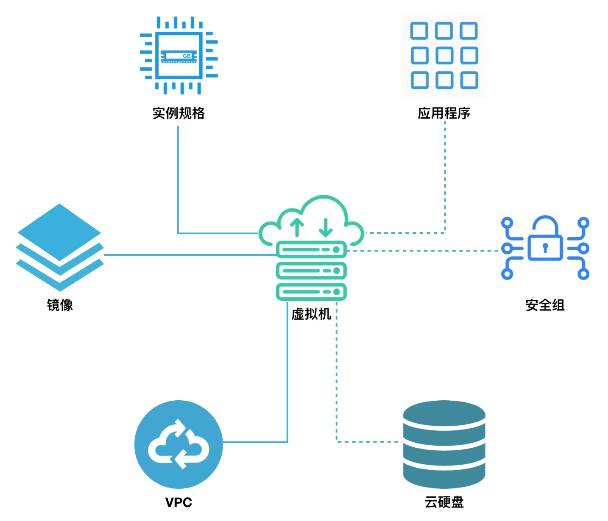
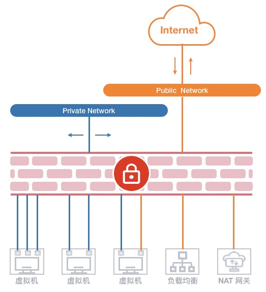
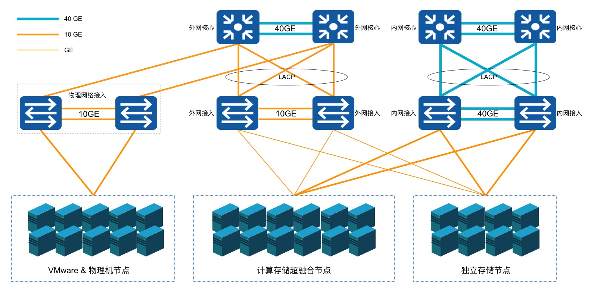
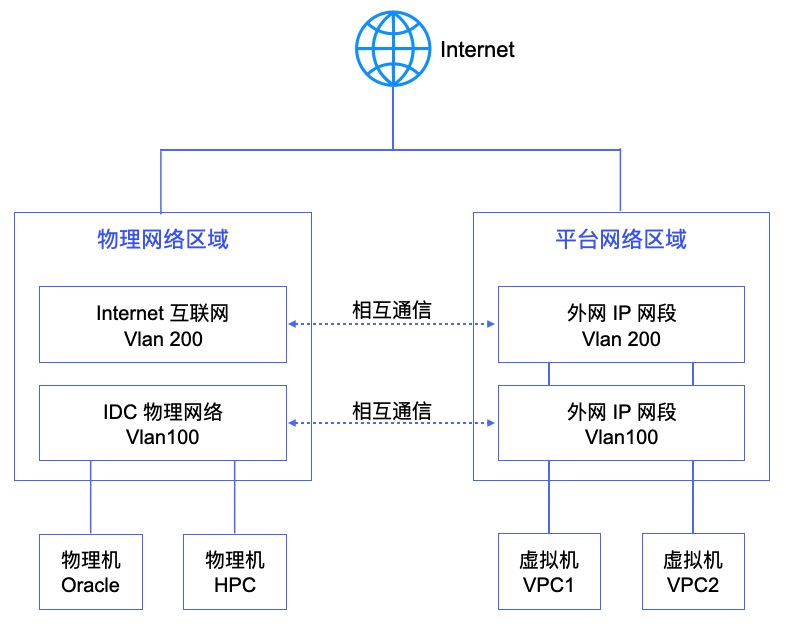
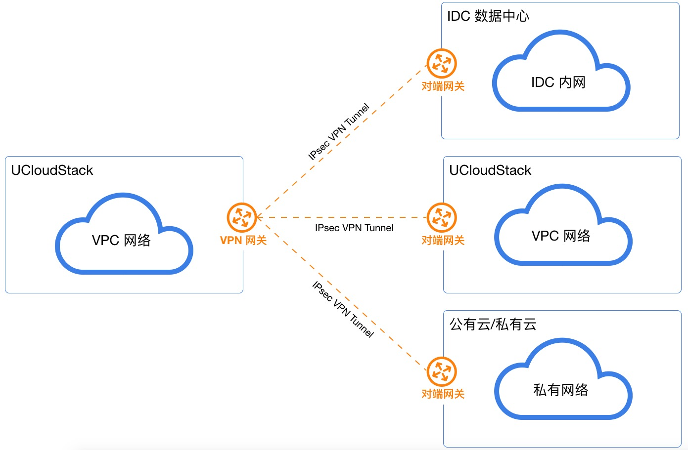

# 4 核心产品服务

## 4.1 基本概念

### 4.1.1 地域

地域 ( Region ) 指 UCloudStack 云平台物理数据中心的地理区域，是云平台中的一个逻辑概念，指资源部署的物理位置分类，可对应机柜、机房或数据中心，如上海、北京、杭州、主数据中心、备数据中心等。

通常一个数据中心对应一套UCloudStack云平台，可支持部署多个计算和存储集群；数据中心之间资源和网络完全物理隔离，可通过一套管理平台管理遍布各地数据中心的私有云平台。

地域在平台也称为数据中心，通常数据中心之间完全隔离以保证最大程度的稳定性和容错性。作为平台最大的资源定义，一个地域即部署一套UCloudStack云平台。

平台默认内置一个地域，管理服务通过本地数据中心云平台提供的API端点管理地域内计算、存储及网络资源。支持对数据中心内资源的生命周期管理，包括计算集群、存储集群、外置存储、基础镜像及自制镜像等资源的查看和维护。

* 不同地域间完全物理隔离，云平台资源创建后不能更换地域；
* 不同地域间网络完全隔离，资源内网不能互通，可通过公网或专线进行网络通信；
* 私有网络 VPC 和负载均衡服务支持相同地域部署。

### 4.1.2 集群

集群 ( Set ) 是 UCloudStack 物理资源的逻辑划分，用于区分不同配置规格及不同存储类型的服务器节点。区域、集群、物理服务器的逻辑关系如下：

* 一个地域可包含多个集群，使用统一云管理平台进行集群管理和运营，云资源仅支持在单集群调度；
* 一个集群至少由 3 台服务器节点组成，集群内服务器须具有相同的 CPU/内存、磁盘类型及操作系统；
  * 服务器为计算&存储融合节点时，不同磁盘类型的节点划分为一个集群，如 SSD 计算节点集群；
  * 服务器为独立存储节点时，不同磁盘类型的节点划分为一个集群，如 SATA 存储节点集群；
* 通常一个集群的服务器建议接入同一组接入交换机，业务数据网络仅在集群内进行传输；
* 若采用独立存储节点，可将其与计算节点划分为一个集群进行磁盘挂载；
* 虚拟机仅支持跨集群挂载分布式块存储设备，用于数据存储。

云平台支持将 X86、ARM、GPU 等异构计算集群统一管理，并可统一管理 SSD、STAT、NVME 多种架构存储集群，并分别可对集群用量进行数据统计。 用户可将虚拟资源部署于不同的计算集群，并分别对虚拟资源挂载不同存储集群的块存储设备。同时云平台虚拟化可通过 ISCSI 协议对接 IPSAN 商业存储设备，为云平台虚拟机提供集群中高性能块存储服务，同时可利旧企业用户的集中存储设备，整体节省信息化转型的总拥有成本。

管理员控制台可对数据中心的计算集群、存储集群及外置存储集群进行便捷的管理和维护，同时平台可对集群进行权限控制，用于将部分物理资源独享给一个或部分租户使用，适用于专属私有云场景。

#### 4.1.2.1 计算集群

计算集群是一组配置、用途相同的计算节点（物理机）组成，用于部署并承载平台上运行的虚拟计算资源。一个数据中心可部署多个不同类型的计算集群，如 X86 集群、ARM 集群、GPU 集群等，不同的集群可运行不同类型的虚拟机资源，如 GPU 集群可为租户提供 GPU 虚拟机，ARM 集群可为租户提供基于 ARM 或国产化 OS 的虚拟机。

为保证虚拟机高可用，平台基于集群维度提供虚拟化智能调度策略，包括打散部署、在线迁移、离线迁移及宕机迁移，即虚拟资源可在集群内的所有计算节点中进行调度、部署及迁移，提升业务的可用性。

- **打散部署**

  平台租户创建虚拟机时默认会将创建的虚拟机尽量打散部署于集群内的所有节点上，保障硬件或软件故障等异常情况下租户业务服务的可用性。

- **在线迁移**

  手动将一台虚拟机从集群的一个物理机迁移到另一台物理机，释放源物理机的资源，支持随机分配和指定物理节点两种模式。

- **离线迁移**

  手动将一台关机的虚拟机从一个集群迁移到另一个集群，调整集群的机器数量，支持指定集群迁移。

- **宕机迁移**

  运行虚拟机的物理机出现异常或故障导致宕机时，调度系统会自动将其所承载的虚拟资源快速迁移至集群内健康且负载正常的物理机，尽量保证业务的可用性。

基于在线迁移、离线迁移和宕机迁移的逻辑，通常在部署上推荐将相同 CPU 和内存配置的物理机节点规划为一个计算集群，避免因 CPU 架构或配置不一致，导致虚拟机迁移后异常或无法启动。

默认情况下平台会根据 CPU 平台架构设定集群名称，管理员可根据平台自身使用情况修改集群名称；同时支持管理员管理计算集群内的物理机和计算实例。

集群默认对所有租户开放权限，平台支持对计算集群进行权限控制，用于将部分物理计算资源独享给一个或部分租户使用，适用于专属私有云场景。修改集群权限后，集群仅可对指定的租户开放并使用，无权限的租户无法查看并使用受限的集群创建虚拟资源。

#### 4.1.2.2 存储集群

存储集群为平台分布式块存储集群，通常由一组配置相同的存储节点（物理机）组成，用于部署并承载分布式存储资源。一个数据中心可部署多个不同类型的存储集群，如 SSD 集群、SATA 集群、容量型集群、性能型集群等，不同的集群可提供不同类型的云盘源，如 SSD 存储集群可为租户提供 SSD 类型的云硬盘。

平台通过分布式存储集群体系结构提供基础存储资源，并支持在线水平扩容，同时融合智能存储集群、多副本机制、数据重均衡、故障数据重建、数据清洗、自动精简配置、QOS 及快照等技术，为虚拟化存储提供高性能、高可靠、高扩展、易管理及数据安全性保障，全方面提升存储虚拟化及云平台的服务质量。

分布式存储集群默认支持 3 副本策略，写入数据时先向主副本写入数据，由主副本负责向其他副本同步数据，并将每一份数据的副本跨磁盘、跨服务器、跨机柜分别存储于不同磁盘上，多维度保证数据安全。在存储集群中存储服务器节点无网络中断或磁盘故障等异常情况时，副本数据始终保持为 3 副本，不区分主副本和备副本；当存储节点发生异常副本数量少于 3 时，存储系统会自动进行数据副本重建，以保证数据副本永久为三份，为虚拟化存储数据安全保驾护航。

默认情况下平台会根据存储架构设定集群名称，管理员可根据平台自身使用情况修改集群名称；同时支持管理员管理存储集群。

集群默认对所有租户开放权限，平台支持对存储集群进行权限控制，用于将部分物理存储资源独享给一个或部分租户使用，适用于专属私有云场景。修改集群权限后，集群仅可对指定的租户开放并使用，无权限的租户无法查看并使用受限的集群创建云盘资源。

## 4.2 虚拟机

### 4.2.1 虚拟机管理概述

虚拟机是 UCloudStack 云平台的核心服务，提供可随时扩展的计算能力服务，包括 CPU 、内存、操作系统等最基础的计算组件，并与网络、磁盘等服务结合提供完整的计算环境。通过与负载均衡等服务结合共同构建 IT 架构。

* UCloudStack 云平台通过 KVM ( Kernel-based Virtual Machine ) 将物理服务器计算资源虚拟化，为虚拟机提供计算资源；
* 一台虚拟机的计算资源只能位于一台物理服务器上，当物理服务器负载较高或故障时，自动迁移至其它健康的物理服务器；
* 虚拟机计算能力通过虚拟 CPU ( vCPU ) 和内存表示，存储能力通过云存储容量和性能体现；
* 虚拟机管理程序通过控制 vCPU、内存及磁盘的 QoS ，用于支持虚拟机资源隔离，保证多台虚拟机在同一台物理服务器上互不影响。

虚拟机是云平台用户部署并运行应用服务的基础环境，与物理计算机的使用方式相同，提供创建、关机、断电、开机、重置密码、重装系统、升降级等完全生命周期功能；支持 Linux、Windows 等不同的操作系统，并可通过 VNC 、spice 等方式进行访问和管理，拥有虚拟机的完全控制权限。虚拟机运行涉及资源及关联关系如下：

如图所示，实例规格、镜像、VPC 网络是运行虚拟机必须指定的基础资源，即指定虚拟机的 CPU 内存、操作系统、虚拟网卡及 IP 信息。在虚拟机基础之上，可绑定云硬盘、弹性IP、弹性网卡及安全组，为虚拟机提供数据盘、公网 IP 、弹性网络及网络防火墙，保证虚拟机应用程序的数据存储和网络安全。

在虚拟化计算能力方面，平台提供 GPU 设备透传能力，支持用户在平台上创建并运行 GPU 虚拟机，让虚拟机拥有高性能计算和图形处理能力。**支持透传的设备包括 NVIDIA 的 K80、P40、V100、2080、2080Ti、T4 及 华为 Atlas300** 等。

### 4.2.2 实例规格

实例规格是对虚拟机 CPU 内存的配置定义，为虚拟机提供计算能力。CPU 和内存是虚拟机的基础属性，需配合镜像、VPC 网络、云硬盘、安全组及密钥，提供一台完整能力的虚拟机。

* 默认提供 1C2G 、2C4G 、4C8G 、8C16G 、16C32G 、32C64G 等实例规格；
* 支持自定义实例规格，提供多种 CPU 内存组合，以满足不同应用规模和场景的负载要求；
* 支持升降级虚拟机 CPU 和内存配置，可通过更改实例规格进行调整；
* 实例规格通过关机后变更，需重新启动虚拟机生效；
* 实例规格与虚拟机生命周期一致，虚拟机被销毁时，实例规格即被释放。

平台支持自定义规格，创建虚拟机规格支持根据不同的集群创建不同的规格，即可为不同的机型创建不同的规格，租户创建虚拟机选择不同机型时，即可创建不同规格的虚拟机，适应不同集群硬件配置不一致的应用场景。可分别定义 CPU 和内存：

- CPU 规格支持（C）：除 1 以外，以2的倍数进行增加，如 1C、2C、4C、6C ，最大值为240C。
- 内存规格支持（G）：除 1 以外，以2的倍数进行增加，如 1G、2G、4G、6G ，最大值为 1024G。

创建出的规格即可被所有租户看到并使用，可根据业务需求在不同的集群中创建不同的规格。

平台为虚拟机提供完整生命周期管理，用户可自助创建虚拟机，并对虚拟机进行关机、断电、开机、重置密码、重装系统、升降级配置、热升级、制作镜像、修改业务组、修改名称/备注、修改告警模板及删除等基本操作；同时支持与虚拟机相关联资源的绑定和解绑管理，包括弹性网卡、云硬盘、外网IP及安全组等。

* 关机是对虚拟机操作系统的正常关机，断电是将虚拟机强制关机；

* 重装系统即更换虚拟机镜像，Linux仅支持更换Linux类型镜像，Windows仅支持更换Windows类型镜像；

* 在线升降级配置是对虚拟机的规格配置进行升级或降级的变更操作；规格配置包括CPU和内存等，变更过程中无需停止在运行的业务，变更完成后无需重启云主机即可生效。

* 销毁虚拟机会自动删除实例规格、系统盘及默认虚拟网卡，同时会自动解绑相关联的虚拟资源；

* 一个虚拟机支持绑定多个云硬盘、弹性网卡、外网IP及安全组。

虚拟机完整生命周期包括启动中、运行、关机中、断电中、关机、启动中、重装中、删除中及已删除等资源状态，各状态流转如下图所示：

###  4.2.3 热升级

UCloudStack虚拟机支持在线热升级。热升级指在虚拟机开机（running）状态下，支持升级虚拟机的CPU、内存等。升级完成后虚拟机的配置会即刻生效，对运行在虚拟机中的原有业务无任何影响。

### 4.2.4 镜像管理服务

镜像（ Image ）是虚拟机实例运行环境的模板，通常包括操作系统、预装应用程序及相关配置等。虚拟机管理程序通过指定的镜像模板作为启动实例的系统盘，生命周期与虚拟机一致，虚拟机被销毁时，系统盘即被销毁。平台虚拟机镜像分为基础镜像和自制镜像。

#### 4.2.4.1 基础镜像

基础镜像是由 UCloudStack 官方提供，包括多发行版 Centos 、Ubuntu 及 Windows 等原生操作系统。
* 基础镜像默认所有租户均可使用，默认提供的镜像包括 Centos 6.5 64 、Centos 7.4 64 、Windows 2008r2 64 、Windows 2012r2 64 、Ubuntu 14.04 64 、Ubuntu 16.04 64。
* 基础镜像均经过系统化测试，并定期更新维护，确保镜像安全稳定的运行和使用；
* 基础镜像为系统默认提供的镜像，仅支持查看及通过镜像运行虚拟机，不支持修改；
* Linux 镜像默认系统盘为 40GB ，Windows 镜像默认系统盘为 40GB ，支持创建时进行系统盘容量扩容，也可以在虚拟机创建后做系统盘扩容操作（需要用户手动进入虚拟机内部进行文件系统扩容操作）。
* 支持管理将租户自制或导入的镜像复制为基础镜像，作为默认基础镜像共享给平台所有租户使用；同时支持管理员修改基础镜像的名称备注及删除基础镜像。
* 支持重装系统，即更换虚拟机镜像，Linux 虚拟机仅支持更换 Centos 和 Ubuntu 操作系统，Windows 虚拟机仅支持更换 Windows 其它版本的操作系统；

> **Windows 操作系统镜像为微软官方提供，需自行购买 Lincense 激活。**

#### 4.2.4.2 自制镜像

自制镜像由租户或管理员通过虚拟机自行制作或自定义导入已有的自有镜像，可用于创建虚拟机，除平台管理员外，平台的租户自身也有权限查看和管理。

- 支持管理员和租户制作、导入和导出自定义镜像；同时管理员可导出镜像仓库中的所有自制镜像。
- 支持管理员和租户通过自制镜像创建虚拟机、删除自制镜像、修改自制镜像名称。
- 支持平台管理员和租户自有ISO镜像导入，自制镜像以及ISO镜像归属于云平台租户。

ISO镜像是一种将光盘或DVD中的数据以文件的形式保存在计算机硬盘上的方法。当需要使用一个全新的操作系统时，可以选择使用包含操作系统介质的ISO镜像，直接使用ISO介质引导并安装到虚拟机中。通过这种方式，可以快速的部署一个全新的云主机。在部署完成后通常会进行以下操作，用于进一步提升将来的部署效率。

* 将安装完操作系统的虚拟机，修改符合企业标准的系统参数，并转化成一个标准的云主机镜像，方便下一次更加高效的创建一个符合企业信息化标准的全新云主机实例。

* 进一步部署相关的业务系统，转化成一个包含业务系统的云主机镜像，以提升下一次部署相同业务时的效率，同时也保障业务系统的符合企业信息化标准规范。

自制镜像和ISO镜像可用于创建虚拟机，并支持用户下载虚拟机镜像到本地，同时镜像管理支持查看镜像、修改名称和备注、从镜像创建虚拟机、导入镜像、下载镜像及删除镜像等生命周期管理。

为方便平台镜像模板文件的共享，平台支持管理员将一个自制镜像复制为一个基础镜像，使一个租户的自制镜像共享给所有租户使用，适用于运维部门制作模板镜像的场景，如自制镜像操作系统的漏洞修复或升级后，制作一个自制镜像并复制为基础镜像，使所有租户可使用新的镜像文件升级虚拟机系统。

#### 4.2.4.3 镜像存储

基础镜像和用户自制镜像默认均存储于分布式存储系统，保证性能的同时通过三副本保证数据安全。

* 镜像支持 QCOW2 格式，可将 RAW、VMDK 等格式镜像转换为 QCOW2 格式文件，用于 V2V 迁移场景；
* 所有镜像均存储于分布式存储系统，即镜像文件会分布在底层计算存储超融合节点磁盘上；
* 若为独立存储节点，则分布存储于独立存储节点的所有磁盘上；
* 地域的镜像只能创建本地域的虚拟机，不支持跨地域镜像创建虚拟机。

### 4.2.5 安全组

安全组（ Security Group ）是一种类似 [IPTABLES](https://en.wikipedia.org/wiki/Iptables) 的虚拟防火墙，提供出入双方向流量访问控制规则，定义哪些网络或协议能访问资源，用于限制虚拟资源的网络访问流量，支持 IPv4 和 IPv6 双栈限制，为云平台提供必要的安全保障。

#### 4.2.5.1 实现机制

平台安全组基于 Linux Netfilter 子系统，通过在 [OVS](http://www.openvswitch.org/) 流表中添加流表规则实现，需开启宿主机 IPv4 和IPv6 包转发功能。每增加一条访问控制规则会根据网卡作为匹配条件，生成一条流表规则，用于控制进入 OVS 的流量，保证虚拟资源的网络安全。

安全组仅可作用于同一个数据中心内具有相同安全需求的虚拟机、弹性网卡、负载均衡、 NAT 网关等，工作原理如下图所示：

安全组具有独立的生命周期，可以将安全组与虚拟机、弹性网卡、负载均衡、NAT 网关绑定在一起，提供安全访问控制，与之绑定的虚拟资源销毁后，安全组将自动解绑。

- 安全组对虚拟机的安全防护针对的是一块网卡，即安全组是与虚拟机的默认虚拟网卡或弹性网卡绑定在一起，分别设置访问控制规则，限制每块网卡的出入网络流量；
- 如安全组原理图所示，安全组与提供外网 IP 服务的虚拟外网网卡绑定，通过添加出入站规则，对南北向（虚拟机外网）的访问流量进行过滤；
- 安全组与提供私有网络服务的虚拟网卡或弹性网卡绑定，通过添加出入站规则，控制东西向（虚拟机间及弹性网卡间）网络访问；
- 安全组与外网类型的负载均衡关联，通过添加出入站规则，可对进出外网负载均衡的外网 IP 流量进行限制和过滤，保证外网负载均衡器的流量安全；
- 安全组与 NAT 网关绑定，通过添加出入站规则，可对进入 NAT 网关的流量进行限制，保证 NAT 网关的可靠性和安全性；
- 一个安全组支持同时绑定至多个虚拟机、弹性网卡、NAT 网关及外网负载均衡实例；
- 虚拟机支持绑定一个内网安全组和一个外网安全组，分别对应虚拟机默认的内网网卡和外网网卡上，其中外网安全组对绑定至虚拟机的所有外网 IP 地址生效；
- 弹性网卡仅支持绑定一个安全组，与虚拟机默认网卡绑定的安全组相互独立，分别限制对应网卡的流量；
- 外网负载均衡和 NAT 网关实例仅支持绑定一个安全组，可更换安全组应用不同的网络访问规则。

支持创建虚拟机时不指定安全组，支持虚拟机启动后再进行调整，支持随时修改安全组的出入站规则，新规则生成时立即生效，可根据需求调整安全组出/入方向的规则。支持安全组全生命周期管理，包括安全组创建、修改、删除及安全组规则的创建、修改、删除等生命周期管理。支持将VPC网络中的实例划分为不同的安全组的功能，并为每个安全组定义不同的安全组规则。

#### 4.2.5.2 安全组规则

安全组规则可控制允许到达安全组关联资源的入站流量及出站流量，提供双栈控制能力，支持对 IPv4/IPv6 地址的 TCP、UPD、ICMP、GRE 等协议数据包进行有效过滤和控制。

每个安全组支持配置 200 条安全组规则，根据优先级对资源访问依次生效。**规则为空时，安全组将默认拒绝所有流量；规则不为空时，除已生成的规则外，默认拒绝其它访问流量。**

**支持有状态的安全组规则，可以分别设置出入站规则，对被绑定资源的出入流量进行管控和限制。**每条安全组规则由协议、端口、地址、动作、优先级、方向及描述六个元素组成：

- 协议：支持 TCP、UDP、ICMPv4、ICMPv6 四种协议数据包过滤。
  - ALL 代表所有协议和端口，ALL TCP 代表所有 TCP 端口，ALL UDP 代表所有 UDP 端口；
  - 支持快捷协议指定，如 FTP、HTTP、HTTPS、PING、OpenVPN、PPTP、RDP、SSH 等；
  - ICMPv4 指 IPv4 版本网络的通信流量；ICMPv6 指 IPv6 版本网络的通信流量。
- 端口：源地址访问的本地虚拟资源或本地虚拟资源访问目标地址的 TCP/IP 端口。
  - TCP 和 UDP 协议的端口范围为 1~65535 ；
  - ICMPv4 和 ICMPv6 不支持配置端口。
- 地址：访问安全组绑定资源的网络数据包来源地址或被安全组绑定虚拟资源访问的目标地址。
  - 当规则的方向为入站规则时，地址代表访问被绑定虚拟资源的源 IP 地址段，支持 IPv4 和 IPv6 地址段；
  - 当规则的方向为出站规则时，地址代表被绑定虚拟资源访问目标 IP 地址段，支持 IPv4 和 IPv6 地址段；
  - 支持 CIDR 表示法的 IP 地址及网段，如 `120.132.69.216` 、 `0.0.0.0/0` 或 `::/0` 。
- 动作：安全组生效时，对数据包的处理策略，包括 “接受” 和 “拒绝” 两种动作。
- 优先级：安全组内规则的生效顺序，包括高、中、低三档规则。
  - 安全组按照优先级高低依次生效，优先生效优先级高的规则；
  - 同优先级的规则，优先生效精确规则。
- 方向：安全组规则所对应的流量方向，包括出站流量和入站流量。
- 描述：每一条安全组规则的描述，用于标识规则的作用。

**安全组支持数据流表状态，规则允许某个请求通信的同时，返回数据流会被自动允许，不受任何规则影响。即安全组规则仅对新建连接生效，对已经建立的链接默认允许双向通信。**如一条入方向规则允许任意地址通过互联网访问虚拟机外网 IP 的 80 端口，则访问虚拟机 80 端口的返回数据流（出站流量）会被自动允许，无需为该请求添加出方向允许规则。

> 注：通常建议设置简洁的安全组规则，可有效减少网络故障。

### 4.2.6虚拟机存储

虚拟机的系统盘和数据盘存储支持块存储和商业存储作为后端存储，并统一池化为云硬盘，用户可以像使用物理机硬盘一样的格式化并建立文件系统来使用云硬盘，

针对虚拟机的云硬盘和数据安全，平台支持云硬盘加密特性，使用LUKS加密规范来对磁盘全盘加密，保护用户的数据不被未经授权的访问者获取，甚至在磁盘丢失或被盗的情况下也可以保证数据的机密性。

支持用户自主为虚拟机开通分配第二存储网卡，第二存储网卡可用于挂载共享卷、文件存储和备份存储。

**(1)**  **云硬盘**

一种基于分布式存储系统为虚拟机和数据库服务提供持久化存储空间的块设备。云硬盘基于网络分布式访问，为虚拟机提供高安全、高可靠、高性能及可扩展的数据磁盘。可用于虚拟机的系统盘和数据盘。

* 支持对云硬盘类型的系统盘进行扩容、快照及加密。

* 支持对云硬盘类型的数据盘进行绑定、解绑、扩容、快照、续费及加密。

* 支持通过云硬盘创建并启动虚拟机。

* 支持将云硬盘设置为共享盘，多个虚拟机同时进行挂载使用。

**注**：平台支持对云硬盘本身进行全生命周期管理，包括云盘创建、查看、绑定、解绑、扩容、克隆、删除、续费、快照、设为共享盘等，详见【云硬盘】章节描述。

**(2)**  **商业存储SAN**

云平台虚拟化支持对接商业存储设备，如IPSAN、FCSAN等存储阵列，为云平台虚拟机提供集群中高性能块存储服务，同时可利旧企业用户的集中存储设备，整体节省信息化转型的总拥有成本。

* 支持将SAN存储类型的LUN磁盘作为虚拟机的系统盘和数据盘。

* 支持SAN存储类型的磁盘创建并启动虚拟机，并支持对磁盘进行加密。

* 支持将SAN存储类型的磁盘设置为共享盘，多个虚拟机同时进行挂载使用。

* 支持对SAN存储类型的磁盘进行绑定和解绑操作，同时支持管理员将LUN分配给不同的租户进行使用。

* 提供异步复制功能；提供增量Failback能力，保障在主LUN异常情况下，从LUN可读写，并支持从LUN增量反向同步；支持在线设置异步远程复制pair的数据复制速率策略，支持复制策略可设置。

**(3)**  **共享云硬盘**

共享云硬盘是一种数据块级存储设备，能够同时支持多个云服务器并发读写访问。这种存储设备具有多挂载点、高可靠性等特点，适用于需要支持集群和高可用性（HA）能力的关键企业应用场景，多个云服务器可以同时访问一个共享云硬盘。

支持将云硬盘、SAN存储LUN设备为共享盘，并作为虚拟机的数据盘，使多个虚拟机同时对共享盘进行数据读写操作。同时支持对共享盘进行创建、绑定、解绑、扩容、克隆、续费及删除等操作。

### 4.2.7 虚拟网络

#### 4.2.7.1虚拟网卡

虚拟网卡（ Virtual NIC ）是虚拟机与外部通信的虚拟网络设备，创建虚拟机时随 VPC 网络默认创建的虚拟网卡。虚拟网卡与虚拟机的生命周期一致，无法进行分离，虚拟机被销毁时，虚拟网卡即被销毁。**有关 VPC 网络详见 VPC网络 章节**。

虚拟网卡基于 Virtio 实现，QEMU 通过 API 对外提供一组 Tun/Tap 模拟设备，将虚拟机的网络桥接至宿主机网卡，通过 OVS 与其它虚拟网络进行通信。

* 每个虚拟机默认会生成 2 块虚拟网卡，分别承载虚拟机内外网通信。
* 在虚拟机启动时，根据选择的 VPC 子网自动发起 DHCP 请求以获取内网 IP 地址，并将网络信息配置在一块虚拟网卡上，为虚拟机提供内网访问。
* 虚拟机启动后，可申请公网 IP （外网 IP）绑定至虚拟机，提供互联网访问服务。
  * 绑定的外网 IP 会自动将公网 IP 信息配置在另一块虚拟网卡上，为虚拟机提供外网访问；
  * 一个虚拟机支持绑定 50 个外网 IPv4 和 10 个 IPv6 地址 。
* 不支持修改虚拟网卡的 IP 地址，手动修改的 IP 地址将无法生效。
* 每块虚拟网卡支持绑定一个安全组，提供网卡级别安全控制。
* 支持虚拟网卡 QoS 控制，提供自定义设置虚拟网卡的出/入口带宽。

平台默认提供 2 块虚拟网卡，若业务有 2 块以上网卡需求可通过绑定弹性网卡，为虚拟机提供多网络服务。

#### 4.2.7.2 弹性网卡

弹性网卡（ Elastic Network Interface, ENI ）是一种可随时附加到虚拟机的弹性网络接口，支持绑定和解绑，可在多个虚拟机间灵活迁移，为虚拟机提供高可用集群搭建能力，同时可实现精细化网络管理及廉价故障转移方案。

弹性网卡与虚拟机自带的默认网卡（一个内网网卡和一个外网网卡）均是为虚拟机提供网络传输的虚拟网络设备，分为内网网卡和外网网卡两种类型，同时均会从所属网络中分配 IP 地址、网关、子网掩码及路由相关网络信息。

- 内网类型的弹性网卡所属网络为 VPC 和子网，同时从 VPC 中自动或手动分配 IP 地址。
- 外网类型的弹性网卡所属网络为外网网段，同时会从外网网段中自动或手动分配 IP 地址，且分配的 IP 地址与弹性网卡生命周期一致，仅支持随弹性网卡销毁而释放。
- 当网卡类型为外网时，网卡会根据所选外网 IP 的带宽规格进行计费，用户可根据业务需要，选择适合的付费方式和购买时长。

弹性网卡具有独立的生命周期，支持绑定和解绑管理，可在多个虚拟机间自由迁移；虚拟机被销毁时，弹性网卡将自动解绑，可绑定至另一台虚拟机使用。

**弹性网卡具有地域（数据中心）属性，仅支持绑定相同数据中心的虚拟机。一块弹性网卡仅支持绑定至一个虚拟机，x86 架构虚拟机最多支持绑定 6 块弹性网卡，ARM 架构虚拟机最多支持绑定 3 块网卡。**

外网弹性网卡被绑定至虚拟机后，不影响虚拟机默认网络出口策略，包含虚拟机上弹性网卡绑定的外网 IP 在内，以第一个有默认路由的 IP 作为虚拟机的默认网络出口，用户可设置某一个有默认路由的外网 IP 为虚拟机默认网络出口。

每块弹性网卡仅支持分配一个 IP 地址，并可根据需要绑定一个安全组，用于控制进出弹性网卡的流量，实现精细化网络安全管控；如无需对弹性网卡的流量进行管控，可将弹性网卡的安全组置空。

用户可通过平台自定义创建网卡，并对网卡进行绑定、解绑及修改安全组等相关操作，对于外网弹性网卡还可进行【调整带宽】操作，用于调整外网弹性网卡上的外网 IP 地址的带宽上限。

弹性网卡具有地域、网卡类型、VPC、子网、外网网段、外网 IP 带宽、IP 及安全组等属性，支持创建、绑定、解绑、绑定安全组、解绑安全组及删除弹性网卡等生命周期管理。

* 地域：弹性网卡仅支持绑定至相同地域的虚拟机。
* 网卡类型：弹性网卡的网络接入类型，支持 VPC 内网和 EIP 外网两种类型。
* VPC/子网：一块内网弹性网卡仅支持加入至一个 VPC 和子网，创建后无法修改 VPC 和子网。
* 外网网段：一块外网弹性网卡仅支持从一个外网网段中分配 IP 地址，创建后无法修改。
* 外网 IP 带宽：外网网卡分配 IP 地址的带宽。
* IP地址：支持手动指定和自动获取弹性网卡在子网或外网网段内的 IP 地址，一块弹性网卡仅支持 1 个 IP 地址，创建后无法修改 IP 地址；
* 安全组：每块弹性网卡支持绑定一个安全组，提供网卡级别安全控制，详见安全组；
* MAC 地址：每块弹性网卡拥有全局唯一 MAC 地址；

弹性网卡整个生命周期包括创建中、未绑定、绑定中、已绑定、解绑中、已删除等状态，状态流转如下图所示：

#### 4.2.7.3VPC网络

私有网络（ VPC ——Virtual Private Cloud ）是一个属于用户的、逻辑隔离的二层网络广播域环境。在一个私有网络内，用户可以构建并管理多个三层网络，即子网（ Subnet ），包括网络拓扑、IP 网段、IP 地址、网关等虚拟资源作为租户虚拟机业务的网络通信载体。

私有网络 VPC 是虚拟化网络的核心，为云平台虚拟机提供内网服务，包括网络广播域、子网（IP 网段）、IP 地址等，是所有 NVF 虚拟网络功能的基础。私有网络是子网的容器，不同私有网络之间是绝对隔离的，保证网络的隔离性和安全性。

VPC 网络具有数据中心属性，每个 VPC 私有网络仅属于一个数据中心，数据中心间资源和网络完全隔离，资源默认内网不通。租户内和租户间 VPC 网络默认不通，从不同维度保证租户网络和资源的隔离性。

虚拟机在创建时必须选择一个VPC网络和子网，不可进行变更。同时虚拟机从VPC的子网中分配 IP地址、网关、DNS等。有关VPC和子网详见【VPC网络】章节描述。

#### 4.2.7.4外网流量直传

平台支持IPv4/IPv6双栈网络，每个虚拟机最多支持绑定50个IPv4和10个IPv6外网IP地址，默认以第一个有默认路由的IP地址（包括外网弹性网卡的IP地址）作为虚拟机的默认网络出口；同时在虚拟机中查看已绑定的外网IP地址及网络路由，虚拟机访问外网的流量直接通过虚拟网卡透传至物理网卡与外部网络通信，提升网络传输的性能。

外网IP信息包括虚拟机及绑定的外网弹性网卡IP，仅支持将有默认路由的外网IP设为虚拟机默认网络出口。可通过列表信息查看已绑定外网IP的详细信息及相关管理操作，如图所示已绑定外网IP信息包括IP地址、IP版本、IP类型、出口、带宽、路由类型、绑定时间及状态。

* IP指当前已绑定外网IP的IP地址及网段名称（网段是由平台管理员自定义的外网IP地址池）；

* IP版本是指当前已绑定外网IP的IP版本，包括IPv4和IPv6；

* IP类型是指当前已绑定外网IP的IP类型，包括直通和NAT；

* 出口指当前IP是否为虚拟机的默认出口，一台虚拟机最多支持两个默认出口（IPv4和IPv6各一个）；

* 带宽指当前IP地址的带宽上限，带宽上限由申请外网IP地址时指定；

* 路由类型指当前IP地址所属网段下发路由的类型（网段路由策略由平台管理员自定义），包括默认路由和非默认路由，仅支持将有默认路由的外网IP设为虚拟机默认网络出口。
* 默认路由类型指虚拟机绑定该IP地址时，会自动下发目标地址为0.0.0.0/0的路由到虚拟机中；
* 非默认路由指虚拟机绑定该IP地址时，会下发管理员为网段配置的指定目标地址路由，如为虚拟机下发目标地址为10.0.0.0/24的路由；
*  若绑定至虚拟机的多个外网IP地址均为默认路由类型，默认以第一个有默认路由的IP地址作为虚拟机的默认出口。

用户可通过外网IP管理控制台的操作项，进行外网IP地址的绑定、解绑及设为默认出口操作，并支持批量解绑。有关外网IP的详细描述详见【外网IP】。

**注意**：绑定至虚拟机的外网弹性网卡的IP地址同时会展示至外网IP列表，支持设为出口操作但不支持解绑，可通过解绑弹性网卡进行弹性网卡外网IP的解绑和释放。。

### 4.2.8 隔离组      

隔离组，虚拟机资源的调度策略机制，用于控制云主机的分布以保证业务高可用性。用户可以自定义虚拟机与其他虚拟机或宿主机之间的亲和关系。

隔离组支持多种策略类型，包括分为亲和性、反亲和性及强制亲和、强制反亲和多种调度类型。。

* **亲和性策略**

允许将相关的虚拟机实例或虚拟机组合部署在同一物理主机上，以实现更高的性能和资源利用率。

* **反亲和策略**

反亲策略即也称非亲和性策略，将虚拟机实例分散在不同的物理主机上。这种配置可用于降低单点故障的风险，提高系统的可靠性和容错性。

* **强制亲和策略**

强制亲和策略指定了一组虚拟机需要被部署在同一物理主机上的要求。这意味着虚拟机将被强制性地分配到同一物理主机上，以实现更高的互联性、网络带宽共享或者其他紧密耦合的需求。通过强制亲和策略，可以确保一组相关的虚拟机能够在同一物理主机上运行，提高性能和资源利用率。

* **强制反亲和策略**

强制反亲和策略则是相反的概念，它制定了一组虚拟机不应该被部署在同一个物理主机上。这意味着虚拟机将被强制性地分散在不同的物理主机上，以提高容错性和可用性。通过强制反亲和策略，可以防止一组关键的虚拟机因为物理主机故障或维护导致的单点故障而同时失效。

### 4.2.9USB透传

平台支持USB透传功能，物理机USB设备可直接透传至该物理机上所运行的云主机，USB设备包含以下两种模式：

* **直通**

将USB设备加载到此物理机上的云主机，迁移云主机时需要卸载此USB设备。

* **转发**

将USB设备加载到此物理机所在计算集群内的云主机，迁移云主机时不需要卸载此USB设备。

### 4.2.10VNC登录

VNC（Virtual Network Console）是UCloudStack为用户提供的一种通过WEB浏览器连接虚拟机的登录方式，适应于无法通过远程登录客户端（如SecureCRT、PuTTY等）连接虚拟机的场景。通过VNC登录连到虚拟机，可以查看虚拟机完整启动流程，并可以像SSH及远程桌面一样管理虚拟机操作系统及界面，支持发送各种操作系统管理指令，如CTRL+ALT+DELETE。

支持用户获取虚拟机的VNC登录信息，包括VNC登录地址及登录密码，适用于使用VNC客户端连接虚拟机的场景，如桌面云场景。为确保VNC连接的安全性，每一次调用API或通过界面所获取的VNC登录信息有效期为300秒，如果300秒内用户未使用IP和端口进行连接，则信息直接失效，需要重新获取新的登录信息；同时用户使用VNC客户端登录虚拟机后，300秒内无任何操作将会自动断开连接。

支持用户获取虚拟机的Spice登录信息，包括Spice登录地址及登录密码，同样适用于使用Spice客户端连接虚拟机的场景，如桌面云场景，与VNC连接一致，限制有效期300秒，保证连接的安全性。

### 4.2.11高级特性

平台虚拟机支持自定义主机名称、自定义DNS、自定义CPU启动模式、自定义MAC、自定义启动集、自定义密码及自定义虚拟机保活等。

* **自定义主机名称**

支持自定义虚拟机的主机名称

* **自定义DNS**

  虚拟机默认DNS指定为 114.114.114.114，支持自定义虚拟机的DNS，最多支持自定义两个DNS地址。同时云解析DNS支持IPv4和IPv6。

* **自定义MAC地址**

支持自定义虚拟机的MAC地址。

* **自定义CPU启动模式**

虚拟机启动时CPU使用的模式，分为默认（Custome）和直通（Host-Passthrough），其中直通模式下，在线迁移仅支持CPU同架构物理机之间迁移。

* **自定义启动集**

支持自定义将虚拟机实例添加进启动集，启动集满足强制反亲和性和非强制反亲和性策略。

* **自定义密码强制要求**

满足包含密码策略的复杂登录密码强制要求，可配置密码最小、最大字符数、必须包含的字符（可设置大写字母、小写字母、数字、特殊字符）。

*  **自定义虚拟机保活模式**

自定义虚拟机保活模式，可触发云主机自动重启，提高云主机可用性。高可用模式时永不停止的进行虚拟机保活，模式为无时不进行保活操作。

* **自定义数据**

自定义初始化脚本，经过BASE64编码，最大1M，可在初次启动和每次开机/重装/重启时执行。选择的虚拟机镜像支持Cloud-init时，支持输入。

## 4.3 GPU虚拟机

### 4.3.1概述

平台提供GPU设备透传能力，支持用户在平台上创建并运行GPU虚拟机，让虚拟机拥有高性能计算和图形处理能力。

GPU虚拟机可以提供更好的成本效益。通过共享和灵活分配GPU资源，可以更有效地利用硬件资源，降低硬件投资和运营成本。同时虚拟机的动态调整和弹性扩展功能，可以根据实际需求进行资源分配，避免资源浪费。

* 支持用户选择GPU颗数，选择GPU规格创建GPU虚拟机，GPU虚拟机与虚拟机的管理功能和生命周期一致。

* 支持虚拟机以vGPU方式使用GPU资源。

* 支持用户关机状态下修改虚拟机配置解绑GPU。

管理员可以根据用户的请求和优先级，灵活地分配和管理GPU的容量和性能，以实现资源的最佳利用。支持透传的设备包括NVIDIA的K80、P40、V100、2080、2080Ti、T4及华为Atlas300等。

针对GPU虚拟机，平台支持最高配置4颗GPU芯片，为使GPU虚拟机发挥最佳性能，平台限制最小CPU内存规格为GPU颗数的4倍以上：

* 1颗GPU芯片最小需要4核8G规格

* 2颗GPU芯片最小需要8核16G规格

* 4颗GPU芯片最小需要16核32G规格

### 4.3.2应用场景

* **GPU资源共享**

GPU虚拟机允许多个用户共享同一台物理服务器上的GPU资源。每个虚拟机实例可以分配物理服务器上的一个或多个GPU资源，以满足不同用户的需求。

* **高性能图形处理**

GPU虚拟机提供了强大的图形处理能力，可以加速图形密集型任务，如游戏渲染、图像处理和视频编码等。通过虚拟化技术，多个用户可以同时享受到高性能的图形处理能力。

* **GPU加速计算**

GPU虚拟机不仅可以用于图形处理，还可以用于加速通用计算任务。虚拟机实例可以利用GPU的并行计算能力，加速科学计算、机器学习、数据分析、AI训练、AI推理等工作负载。

## 4.4云硬盘

### 4.4.1 云硬盘概述

云硬盘是一种基于分布式存储系统为虚拟机提供持久化存储空间的块设备。具有独立的生命周期，支持随意绑定/解绑至多个虚拟机使用，并能够在存储空间不足时对云硬盘进行扩容，基于网络分布式访问，为云主机提供高安全、高可靠、高性能及可扩展的数据磁盘。

存储系统兼容并支持多种底层存储硬件，如通用服务器（计算存储超融合或独立通用存储服务器）和商业存储，并将底层存储硬件分别抽像不同类型集群的存储资源池，由分布式存储系统统一调度和管理。在实际应用场景中，可以将普通 SATA 接口的机械盘统一抽像为【SATA 存储集群】，将 SSD 全闪磁盘统一抽象为【SSD 存储集群】，分别由统一存储封装后提供平台用户使用。

如示意图所示，将 SATA 存储集群的资源封装为普通云盘，将 SSD 全闪存储集群的资源封装为高性能云盘。平台的虚拟机和数据库服务可根据需求挂载不同存储集群类型的磁盘，支持同时挂载多种集群类型的云硬盘。云平台管理员可通过管理员控制台自定义存储集群类型的别名，用于标识不同磁盘介质、不同品牌、不同性能或不同底层硬件的存储集群，如 EMC 存储集群、SSD 存储集群等。

通常 SSD 磁盘介质的云硬盘的性能与容量的大小成线性关系，容量越大提供的 IO 性能越高，如对 IO 性能有强烈需求，可考虑扩容 SSD 磁盘介质的云硬盘。

分布式存储底层数据通过 PG 映射的方式进行数据存储，同时以多副本存储的方式保证数据安全，即写入至云平台存储集群的数据块会同时保存多份至不同服务器节点的磁盘。

多副本存储的数据提供一致性保证，可能导致写入的多份数据因误操作或原始数据异常导致数据不准确；为保证数据的准确性，云平台提供硬盘快照能力，将云盘数据在某一时间点的数据文件及状态进行备份，在数据丢失或损坏时，可通过快照快速恢复数据，单块云硬盘可提供快照额度不少于50个。包括数据库数据、应用数据及文件目录数据等，可实现分钟级恢复。

### 4.4.2 功能与特性

云硬盘由统一存储从存储集群容量中分配，为平台虚拟资源提供块存储设备并共享整个分布式存储集群的容量及性能；同时通过块存储系统为用户提供云硬盘资源及全生命周期管理，包括云硬盘的创建、绑定、解绑、扩容、克隆、快照及删除等管理。

云硬盘容量是由统一存储的从存储集群容量中分配的，所有云硬盘共享整个分布式存储池的容量及性能。

- 支持云硬盘创建、挂载、卸载、磁盘扩容、删除等生命周期管理，单块云硬盘同时仅能挂载一台虚拟机。
- 支持在线和离线的方式扩容磁盘容量，磁盘扩容后需要在虚拟机的操作系统进行磁盘容量的扩容操作。
- 为保证数据安全性及准确性，云硬盘仅支持磁盘扩容，不支持磁盘缩容。
- 云硬盘最小支持 10G 的容量，步长为 1GB ，可自定义控制单块云硬盘的最大容量。
- 云硬盘具有独立的生命周期，可自由绑定至任意虚拟机或数据库服务，解绑后可重新挂载至其它虚拟机；
- 虚拟机最多支持绑定 25 块云硬盘；
- 支持云硬盘克隆，即将云硬盘内的数据复制成为一个新的云硬盘；
- 支持对云硬盘进行快照备份，包括虚拟机的系统盘快照及弹性云盘快照，并可从快照回滚数据至云硬盘，用于数据恢复和还原场景；
- 支持对全局及每一块云硬盘的 QoS 进行配置，可根据不同业务模式调整磁盘的性能，以平衡平台整体性能；
- 支持设置存储集群类型权限，即可以将部分存储资源设置为租户独享，满足需要独享底层存储资源的场景。
- 支持从云硬盘创建虚拟机，云硬盘需要有能正常启动的镜像系统。

支持自动精简配置，在创建云硬盘时，仅呈现分配的逻辑虚拟容量。当用户向逻辑存储容量中写入数据时，按照存储容量分配策略从物理空间分配实际容量。如一个用户创建的云硬盘为 1TB 容量，存储系统会为用户分配并呈现 1TB 的逻辑卷，仅当用户在云硬盘中写入数据时，才会真正的分配物理磁盘容量。

高性能型云硬盘的性能与容量的大小成线性关系，容量越大，提供的 IO 性能越高，如果对IO性能有强烈需求，可考虑扩容性能型云硬盘。UCloudStack 云硬盘完整生命周期包括创建中、可用、挂载中、已挂载、卸载中、扩容中、已删除等资源状态，各状态流转如下图所示：

### 4.4.3 应用场景

* **普通云硬盘（SATA+SSD缓存）**
  * 适用于对容量要求较高且数据不被经常访问或 I/O 负载低的应用场景；
  * 需要低成本并且有随机读写 I/O 的应用环境，如大型视频、音乐、离线文档存储等；
* **高性能云硬盘（SSD/NVME）**
  * 适用于 I/O 负载高且数据经常被读写的应用场景；
  * 中大型关系数据库；
  * 中大型开发测试环境；
  * 中大型实时响应服务类环境；

* **高性能云硬盘（HDD)**
  * 企业办公、虚拟桌面；
  * 大型开发测试；
  * 转码类业务；
* **标准型云硬盘**
  * 不常访问的工作负载；
  * 一般访问的工作负载；

## 4.5共享云盘

共享云硬盘是一种支持多个云服务器并发读写访问的数据块级存储设备，具备多挂载点、高并发性、高性能、高可靠性等特点。主要应用于需要支持集群、HA（High Available，指高可用集群）能力的关键企业应用场景，多个云服务器可同时访问一个共享云硬盘。

用户可通过指定共享硬盘的类型、容量及名称即可快速创建一块云硬盘，作为虚拟机的共享数据盘。

支持将云硬盘及商业存储LUN设置为共享盘，并作为虚拟机的数据盘，使多个虚拟机同时对共享盘进行数据读写操作。同时支持对共享盘进行创建、绑定、解绑、扩容、克隆、续费及删除等操作。共享云硬盘支持在线扩容，即共享云硬盘必须在“可用”状态下进行扩容，在线扩容后可在虚机内刷新容量。

## 4.6快照服务

云平台分布式存储支持磁盘快照能力，可降低因误操作、版本升级等导致的数据丢失风险，是平台保证数据安全的一个重要措施。

快照是某一时间点一块云盘的数据状态文件，可以理解云硬盘某个时刻的数据备份，云硬盘的数据写入和修改不会对已创建的快照造成影响。

支持定时快照策略，即一个可周期性执行的自动创建快照的策略，快照策略与快照分离，拥有独立的生命周期。在实际应用中，磁盘快照可降低因误操作、版本升级等导致的数据丢失风险，可大致应用于以下业务场景：

* 容灾备份：定时为云硬盘制作快照，当系统出现问题时，可快速回退，避免数据丢失。

* 版本回退：在业务做重大升级时，建议预先做好快照，当升级版本出现系统问题无法修复时，可通过快照恢复到历史版本。

用户可为某块云硬盘创建快照，同时支持对虚拟机系统盘进行快照备份。为保证数据及磁盘的安全：

* 仅支持对未绑定及已绑定的硬盘进行快照操作，若硬盘在扩容或快照中，无法进行快照备份；

* 创建快照时，不可进行磁盘挂载/卸载及修改虚拟机状态（如开机或关机），否则可能会导致快照创建异常；

* 快照仅捕获已写入硬盘的数据，不包含应用程序或操作系统缓存在内存中的数据，建议在快照暂停对硬盘的I/O操作后进行快照制作，如关机或卸载硬盘。

平台支持对已绑定虚拟机的系统盘及数据盘进行快照操作，并支持将快照回滚操作，即将快照数据回滚到关联的云硬盘，以满足数据恢复的应用场景。同时支持通过快照创建云硬盘，自定义快照名称。 

**(1)**  **回滚快照**

某一时刻的快照数据回滚到关联的云硬盘，应对快照数据恢复的应用场景。回滚时云硬盘必须处于未绑定或绑定的虚拟机必须处于关机状态，仅支持正常状态的快照进行回滚操作。

**(2)**  **从快照创建云硬盘**

创建的硬盘大小与快照的原始硬盘大小相等，继承加密属性，从快照创建云硬盘，该云硬盘只能与快照所对应的原始云硬盘归属同一存储集群，可以用系统盘快照创建的云硬盘创建虚拟机。

**(3)**  **快照删除**

平台快照为增量快照，后续快照只保留前一块快照的变化数据，当用户删除中间某个快照后，只会删除该快照中未被后序快照引用的Block，被引用部分的Block将记录到后续快照。

支持用户删除一块硬盘的任何一个快照，假设用户对一块硬盘做了10个快照，删除任何一个快照，都不影响快照回滚后的数据。

* 用户删除第1个快照，则系统会将第1个快照中的数据合并至第2个快照中，保证通过第2个快照回滚的数据准确性；

* 用户只删除了第2个快照，则系统会只会删除快照2中未被快照3引用的数据块，被3引用的数据块会被自动记录至快照3中，保证快照3快照回滚数据的准确性。

## 4.7商业存储服务

### 4.7.1概述

云平台默认提供分布式存储作为虚拟化的后端存储，为云平台用户提供高可用、高性能、高可靠及高安全的存储服务。同时云平台虚拟化支持对接商业存储设备，如IPSAN等存储阵列，为云平台虚拟机提供集群中高性能块存储服务，同时可利旧企业用户的集中存储设备，整体节省信息化转型的总拥有成本。

外置存储服务是云平台为企业用户提供的商业存储服务，目前支持ISCSI协议、FC协议对接商业存储，将商业存储作为虚拟化后端存储池，提供存储池管理及逻辑卷分配，可直接作为虚拟机的系统盘及数据盘进行使用，即只要支持ISCSI协议、FC协议的存储设备均可作为平台虚拟化的后端存储，适应多种应用场景。

### 4.7.2功能特性

平台支持存储设备的对接和管理，并支持将存储设备中的LUN分配给租户，由租户将LUN分配或挂载至虚拟机的系统盘或数据盘，进行数据的读写，具体功能特性如下：

l 支持存储设备资源池的录入管理，并支持一键扫描ISCSI设备、FC设备中已创建的LUN存储卷信息。

l 支持将已扫描的LUN存储卷分配给平台租户，使租户有权限使用磁盘作为虚拟机的系统盘或数据盘。

l 支持租户将有权限的LUN存储卷信息作为虚拟机的系统盘，使虚拟机直接运行直商业存储中，提升性能。

l 支持租户将有权限的LUN存储卷信息作为虚拟机的数据盘。

l 支持将存储卷重新分配给平台其它租户。

基于以上功能特性，平台可支持直接使用商业存储设备作为虚拟化的后端存储，为虚拟机提供传统商业存储设备的存储空间，同时不影响商业存储中的其它LUN为其它业务提供存储服务。

平台基于ISCSI协议、FC协议对接商业存储，在对接中需要将存储设备的LUN映射到平台计算节点，使平台计算节点上运行的虚拟机可直接使用映射的LUN；同时为保证虚拟机的高可用，需要将LUN同时映射到一个集群内的所有计算节点，即所有计算节点均可挂载并使用映射的存储卷，以保证宕机迁移时可在每个计算节点挂载该存储卷信息。

l 当虚拟机所在的计算节点故障时，平台会自动触发虚拟机宕机迁移，即将虚拟机迁移至计算集群内正常的计算节点上，使虚拟机可正常提供服务。

l 虚拟机使用的LUN存储卷已被映射到集群内所有计算节点，当虚拟机在集群内迁移至新节点后，可直接使用已映射的LUN存储启动虚拟机的系统盘或数据盘，并正常挂载至虚拟机，保证虚拟机迁移后业务正常。

ISCSI协议、FC协议各有侧重：ISCSI基于TCP/IP协议，设备对协议的支持一致性好；FC协议速度快，需要购置专门的交换机，支持用户根据需求随意搭配。

平台仅将商业存储的LUN作为存储卷进行使用，不对存储卷本身进行管理，如LUN的创建、映射、扩容、快照、备份、回滚、克隆等。

### 4.7.3 使用流程

在使用外置存储前，需要平台管理者或存储设备管理者，将外置存储与平台的计算节点网络打通，使计算节点可与存储设备间直接内网可互相通信。

物理存储设备及网络准备好后，即可与平台进行对接并使用平台提供的外置存储服务，整个对接过程需要存储设备管理员、平台管理员及平台租户三个角色进行操作，其中与平台相关的为平台管理员和平台租户的操作，如下图流程所示：

**1.**   **存储设备管理员管理存储卷**

所有存储卷的管理均由存储设备管理员自行在商业存储的管理系统上进行操作，包括存储卷（Lun）的创建和映射，同时包括存储卷的扩容、快照、备份及删除等相关生命周期管理。

**2.**   **存储设备管理员映射存储卷至集群计算节点**

创建好的Lun，由存储设备管理员在存储设备上映射到所有计算节点（如果新增计算节点，需再次进行映射），同时也可进行多路径映射。

**3.**   **平台管理员录入并管理存储设备**

* 针对ISCSI存储

存储卷LUN映射成功后，由【平台管理员】在管理控制台“外置存储-ISCSI”中进行ISCSI存储池或存储设备的录入，录入时需要指定存储设备的ISCSI地址，如172.18.12.8:8080。

* 针对FC存储：无需录入设备地址。

**4.**   **平台管理员扫描已映射的LUN信息**

* **ISCSI存储：**

录入的存储设备后，由【平台管理员】在存储设备中一键扫描ISCSI存储设备中已被映射至集群节点上的存储卷设备及信息。

* **FC存储：**

存储卷LUN映射成功后，由【平台管理员】在管理控制台“外置存储-FC SAN”中进行扫描，即可将系统中存在的存储设备添加到平台。

**5.**   **平台管理员为租户分配LUN设备**

由【平台管理员】将扫描成功的LUN存储卷设备指定给租户，一个存储卷同一时间仅支持分配给一个租户，分配后租户在外置存储设备中即可查询已分配的存储卷设备，并可进行创建虚拟机或挂载虚拟机。

**6.**   **平台租户使用LUN存储卷设备**

平台租户通过控制台外置存储可直接查询已分配的存储卷，并在创建虚拟机时指定系统盘类型为外置存储，或者也可直接将LUN存储卷直接挂载给已有虚拟机，作为虚拟机的数据盘进行使用。

平台租户使用外置存储服务的前提是存储卷已映射并分配给租户，租户只需要简单的绑定即可便捷的使用平台提供的外置存储设备，并可进行弹性绑定、解绑及设为共享硬盘。

## 4.8私有网络VPC

### 4.8.1 VPC 概述

UCloudStack 通过软件定义网络 （ SDN ）对传统数据中心物理网络进行虚拟化，采用 OVS 作为虚拟交换机，VXLAN 隧道作为 OverLay 网络隔离手段，通过三层协议封装二层协议，用于定义虚拟私有网络 VPC 及不同虚拟机 IP 地址之间数据包的封装和转发。

私有网络（ VPC ——Virtual Private Cloud ）是一个属于用户的、逻辑隔离的二层网络广播域环境。在一个私有网络内，用户可以构建并管理多个三层网络，即子网（ Subnet ），包括网络拓扑、IP 网段、IP 地址、网关等虚拟资源作为租户虚拟机业务的网络通信载体。

私有网络 VPC 是虚拟化网络的核心，为云平台虚拟机提供内网服务，包括网络广播域、子网（IP 网段）、IP 地址等，是所有 NVF 虚拟网络功能的基础。私有网络是子网的容器，不同私有网络之间是绝对隔离的，保证网络的隔离性和安全性。

可将虚拟机、负载均衡、弹性网卡、NAT 网关等虚拟资源加入至私有网络的子网中，提供类似传统数据中心交换机的功能，支持自定义规划网络，并通过安全组对虚拟资源 VPC 间的流量进行安全防护。

> 可通过 IPSecVPN、专线及外网 IP 接入等方式将云平台私有网络及虚拟资源与其它云平台或 IDC 数据中心组成一个按需定制的混合云网络环境。

VPC 网络具有数据中心属性，每个 VPC 私有网络仅属于一个数据中心，数据中心间资源和网络完全隔离，资源默认内网不通。租户内和租户间 VPC 网络默认不通，从不同维度保证租户网络和资源的隔离性。因此支持不同租户间VPC网段地址重叠。

### 4.8.2 VPC 逻辑结构

一个 VPC 网络主要由私有网络网段和子网两部分组成，如下图所示：

**（1）私有网络网段**

VPC 网络所属的 CIDR  网段，作为 VPC 隔离网络的私网网段。关于 CIDR 的相关信息，详见 [CIDR](https://en.wikipedia.org/wiki/Classless_Inter-Domain_Routing) 。创建 VPC 网络需指定私有网段，平台管理员可通过管理控制台自定义 VPC 私有网络的网段，使租户的虚拟资源仅使用管理员定义网段的 IP 地址进行通信。平台 VPC 私有网络 CIDR 默认支持的网段范围如下表所示：

| 网段                         | 掩码范围 | IP 地址范围                   | 默认配置/可配置项 |
| :--------------------------- | -------- | ----------------------------- | ----------------- |
| 10.0.0.0/8                   | 8 ~ 29   | 10.0.0.0 - 10.255.255.255     | 可配置项          |
| 10.0.0.0/16                  | 16 ~ 29  | 10.0.0.0 - 10.10.255.255      | 默认配置          |
| 172.16.0.0/16～172.29.0.0/16 | 16 ~ 29  | 172.16.0.0 - 172.29.255.255   | 可配置项          |
| 192.168.0.0/16               | 16 ~ 29  | 192.168.0.0 - 192.168.255.255 | 默认配置          |

> 由于 DHCP 及相关服务需占用 IP 地址，私有网络 CIDR 网段不支持 `30` 位掩码的私有网段。

**（2）子网**

子网（ Subnet ）是 VPC 私有网络的基础网络地址空间，用于虚拟资源间内网连接。

* 一个私有网络至少由一个子网组成，子网的 CIDR 必须在 VPC 的 CIDR 网段内；
* 同一私有网络内子网间通过`公共网关`连接，资源默认内网互通，可部署虚拟机、负载均衡、NAT 网关、 IPSecVPN 网关等；
* 同一个 VPC 子网间默认通过公共网关进行互通；
* 子网 CIDR 网段拔码最小为 `29` 位，不支持 `30` 、`32` 位掩码的子网网段； 
* 每个子网中，使用第一个可用 IP 地址作为网关，如 `192.168.1.0/24` 的网关地址是 `192.168.1.1` 。
* VPC子网支持跨AZ部署，子网部署方式可以选择多可用区部署。

> 当子网中存在虚拟资源时，不允许删除并销毁私有网络和子网资源。

### 4.8.3 VPC 连接

平台对常用网络设备均进行软件定义及组件抽像，通过将 VPC 网络与虚拟机、弹性网卡、外网 IP、安全组、NAT 网关、负载均衡、VPN 网关、MySQL 数据库、Redis 缓存及专线等组件连接，可快速构建和配置繁杂的网络环境及混合云场景，如下图所示：

* 虚拟机默认内网网卡（创建时自带的虚拟网卡）加入同一个 VPC 网络实现虚拟机间网络通信，并可通过安全组保证虚拟机东西向流量安全。
* 虚拟机默认外网网卡（创建时自带的虚拟网卡）可直接绑定多个外网 IP 地址实现 Internet 访问，同时可绑定与 IDC 物理网络相连的外网 IP 地址实现物理网络打通，结合安全组管控虚拟机南北向流量的同时，构建安全可靠的混合接入环境。
* 虚拟机的弹性网卡加入不同的 VPC 网络及子网，实现精细化网络管理及廉价故障转移方案，同时将安全组与弹性网卡绑定，通过安全组规则多维度保障私有网络及虚拟资源的安全。
* 虚拟机与 UDB、URedis 服务加入同一个 VPC 网络，满足业务应用和数据库、缓存服务连通场景。
* 相同 VPC 网络的虚拟机可通过 NAT 网关及外网 IP 连接，共享外网 IP 访问 Internet 或 IDC 数据中心网络，并可通过 DNAT 端口映射对外提供业务服务。
* 相同 VPC 网络的虚拟机加入至内网 ULB 后端服务节点，提供 VPC 网络内负载均衡服务。
* 相同 VPC 网络的虚拟机加入到外网 ULB 后端服务节点，结合 ULB 关联的外网 IP ，提供外网负载均衡服务。
* 相同 VPC 网络的虚拟机通过 IPSecVPN 网关可与不同 VPC 网络的虚拟机进行内网互联，实现 VPC 间互通。
* 通过 IPSecVPN 网关打通不同 VPC 间的网络，使两个 VPC 间的虚拟机可直接进行内网通信。
* 采用 IPSecVPN 网关或专线将平台与本地 IDC 数据中心及第三方云平台连通，构建安全可靠的混合云环境。

> 外网 IP 可用于打通 IDC 数据中心的物理网络，应用与虚拟机直接与物理机进行内网通信的场景；IPSecVPN 网关用于打通第三方云平台或 IDC 数据中心的虚拟网络，应用于不同云平台间通过 VPN 安全连接场景。

### 4.8.4 功能与特性

平台 VPC 网络基于租户控制台和 API 提供隔离网络环境、自定义子网、子网通信及安全防护等功能，并可结合硬件及 DPDK 等技术特性提供高性能的虚拟网络。

* 隔离的网络环境

  私有网络基于 [OVS](http://www.openvswitch.org/)（ Open vSwitch）组件，通过 [VXLAN](https://datatracker.ietf.org/doc/rfc7348/) 隧道封装技术实现隔离的虚拟网络。每一个 VPC 网络对应一个 VXLAN 隧道号（VNI），作为全局唯一网络标识符，为租户提供一张独立且完全隔离的二层网络，可通过在私有网络中划分多个子网作为虚拟资源的通信载体，用于连通多个虚拟资源。不同的 VPC 网络间完全隔离，无法直接通信。

* 自定义子网

  支持在一个 VPC 网络内进行三层网络规划，即划分一个或多个子网。提供自定义 IP 网段范围、可用 IP 网段及默认网关，可在子网中通过虚拟机部署应用程序和服务。支持在子网中增加多个弹性网卡，分别指定子网中的 IP 地址，并绑定至部署应用程序的虚拟机，用于精细化管理应用服务的网络访问。

* 子网通信

  每一个子网都属于一个广播域，VPC 网络默认提供网关服务，同一个 VPC 内不同子网通过网关进行通信。

* 安全防护

  云平台提供内网安全组和外网防火墙，通过协议、端口为虚拟资源提供多维度安全访问控制，同时基于虚拟网卡及虚拟实例的网络流量进行上下行的 QoS 控制，全方位提高 VPC 网络的安全性。安全组为有状态安全层，可分别设置出入方向的安全规则，用于控制并过滤进出子网 IP 的数据流量。

* 高性能虚拟网络

  SDN 网络分布式部署于所有计算节点，节点间通过 20GE 冗余链路进行通信，并通过所有计算节点负载内网流量，为云平台提供高可靠及高性能的虚拟网络。

云平台在保证网络隔离、网络规模、网络通信及安全的同时，为租户和子帐号提供 VPC 子网的创建、修改、删除及操作审计日志等全生命周期管理。用户创建虚拟机、NAT 网关、负载均衡及 VPN 网关等虚拟资源时可指定需加入的VPC 网络和子网，并可查询每个子网的可用 IP 数量。

VPC 网络具有数据中心属性，仅支持指定相同数据中心的虚拟资源到 VPC 网络中，且每个 VPC 网络的子网网段必须在 VPC 网络的 CIDR 网段中。平台会通过管理员配置的 VPC 网络，为每个租户和子账号提供默认的 VPC 网络和子网资源，方便用户登录云平台快速部署业务。

平台会通过管理员配置的VPC网络，为每个租户和子账号提供默认的VPC网络和子网资源，方便用户登录云平台快速部署业务。

### 4.8.5 自定义路由

提供自定义网络规划能力，支持子网和虚拟机级别的自定义路由能力，用于控制子网出流量的走向。用户可通过自定义路由配置子网内路由策略，包括目的地址、下一跳类型、下一跳，下一跳类型指虚拟机、VIP和自定义类型等。

**(1)**  **目的端口**

目的端即为您要转发到的目标网段，目的网段描述仅支持网段格式，如果您希望目的端为单个 IP，可设置掩码为32（例如172.16.1.1/32）。

**(2)**  **下一跳类型**

| **下一跳类型** | **说明**                               |
| :------------- | -------------------------------------- |
| Local          | 不可编辑，提供VPC互通能力              |
| NAT网关        | NAT网关，不可编辑，NATGW下发的路由     |
| IPSecVPN       | IPSecVPN，不可编辑，IPSecVPN下发的路由 |
| 公共服务       | 公共服务，不可编辑                     |
| VIP            | VIP，可编辑，VIP                       |
| 虚拟机         | 虚拟机，可编辑，虚拟机资源             |
| 自定义         | 自定义，可编辑，自定义地址             |

**（3）下一跳**

指定具体跳转到的下一跳实例，如网关或云服务器 IP 等。

支持子网路由的添加、修改、删除操作。

### 4.8.6 网络拓扑

VPC网络子网提供网格拓扑，用于查看子网的使用情况和拓扑状态。

VPC网络支持IPv4/IPv6双栈，在VPC详情支持查看VPC内资源拓扑。

支持用户查看子网详细使用情况，各资源占用子网IP、绑定资源ID、MAC等详细信息。

### 4.8.7 VPC互通

网络互通功能用于实现同租户两个VPC之间的网络互通，租户可以通过网络互通功能将两个VPC之间建立连接，让用户可以使用私有IP地址在两个VPC之间进行通信，体验类似两个VPC在同一个网络中。

* 配置网络互通时，两端VPC的网段（CIDR）不能重叠，否则可能会造成路由冲突，导致配置不生效。

* 两个VPC之间不能同时建立多个VPC连接。

* VPC中存在连接时，VPC网关不能关闭。

支持VPC网络互通连接和断开，并可支持用户查看当前VPC网络已联通的VPC网络。

## 4.9 组播

### 4.9.1概述

作为一种与单播（Unicast）和广播（Broadcast）并列的通信方式，组播（Multicast）技术能够有效地解决单点发送、多点接收的问题，从而实现了网络中点到多点的高效数据传送，能够节约大量网络带宽、降低网络负载。

利用网络的组播特性方便地提供一些新的增值业务，包括在线直播、网络电视、远程教育、远程医疗、网络电台、实时视频会议等互联网的信息服务领域。

组播是主机间一对多的通讯模式，组播是一种允许一个或多个组播源发送同一报文到多个接收者的技术。组播支持在VPC内的组播通信，组播源将一份报文发送到特定的组播地址，组播地址不同于单播地址，它并不属于特定某个主机，而是属于一组主机。一个组播地址表示一个群组，需要接收组播报文的接收者都加入这个群组。

* **组播组**

用IP组播地址进行标识的一个集合。任何用户主机（或其他接收设备），加入一个组播组，就成为该组成员，可以识别并接收发往该组播组的组播数据。

* **组播源**

信息的发送者称为“组播源”，一个组播源可以同时向多个组播组发送数据，多个组播源也可以同时向一个组播组发送报文。组播源通常不需要加入组播组，由源端DR负责管理组播源的注册和SPT（Shortest Path Tree）的建立。

### 4.9.2 组播组成员

所有加入某组播组的主机便成为该组播组的成员，组播组中的成员是动态的，主机可以在任何时刻加入或离开组播组。组播组成员可以广泛地分布在网络中的任何地方。

### 4.9.3 组播路由器

支持三层组播功能的路由器或交换机。组播路由器不仅能够提供组播路由功能，也能够在与用户连接的末梢网段上提供组播组成员的管理功能。

### 4.9.4 组播地址

IANA（Internet Assigned Numbers Authority，互联网编号分配委员会）将D类地址空间分配给IPv4组播使用。IPv4地址一共32位，D类地址最高4位为1110，因此地址范围从224.0.0.0到239.255.255.255，具体分类及含义详见下表描述：

| **地址范围**                                          | **含义**                                                     |
| :---------------------------------------------------- | ------------------------------------------------------------ |
| 224.0.0.0～224.0.0.255                                | 永久组地址。IANA为路由协议预留的IP地址（也称为保留组地址），用于标识一组特定的网络设备，供路由协议、拓扑查找等使用，不用于组播转发。 |
| 224.0.1.0～231.255.255.255 233.0.0.0～238.255.255.255 | ASM组播地址，全网范围内有效。说明： 其中，224.0.1.39和224.0.1.40是保留地址，不建议使用。 |
| 232.0.0.0～232.255.255.255                            | 缺省情况下的SSM组播地址，全网范围内有效。                    |
| 239.0.0.0～239.255.255.255                            | 本地管理组地址，仅在本地管理域内有效。在不同的管理域内重复使用相同的本地管理组地址不会导致冲突。 |

### 4.9.5 组播转发机制

在组播模型中，IP报文的目的地址字段为组播组地址，组播源向以此目的地址所标识的主机群组传送信息。因此，转发路径上的组播路由器为将组播报文传送到各个方位的接收站点，往往需要将从一个入接口收到的组播报文转发到多个出接口。

为保证组播报文在网络中的传输，必须依靠单播路由表或者单独提供给组播使用的路由表（如MBGP路由表）来指导转发；

为处理同一设备在不同接口上收到来自不同对端的相同组播信息，需要对组播报文的入接口进行RPF（Reverse Path Forwarding，逆向路径转发）检查，以决定转发还是丢弃该报文。RPF检查机制是大部分组播路由协议进行组播转发的基础。

## 4.10 外网 IP

外网弹性 IP（ Elastic IP Address ，简称 EIP ），是平台为用户的虚拟机、NAT 网关、VPN 网关及负载均衡等虚拟资源提供的外网 IP 地址，为虚拟资源提供平台 VPC 网络外的网络访问能力，如互联网或 IDC 数据中心物理网络，同时外部网络也可通过 EIP 地址直接访问平台 VPC 网络内的虚拟资源。

EIP 资源支持独立申请和拥有，用户可通过控制台或 API 申请 IP 网段资源池中的 IP 地址，并将 EIP 绑定至虚拟机、 NAT 网关、负载均衡、VPN 网关上，为业务提供外网服务通道。

### 4.10.1 物理架构

在私有云平台中，允许平台管理员自定义平台外网 IP 资源池，即由平台管理员自定义平台访问外网的方式，外网 IP 网段资源池在添加至云平台前，需要通过物理网络设备下发至计算节点连接的交换机端口。

如上图物理架构示意图所示，所有计算节点需要连接网线至物理网络的外网接入交换机，并在物理网络的交互机上配置所连接端口允许透传 Vlan 的网络访问方式，使运行在计算节点上虚拟机可通过外网物理网卡直接与外部网络进行通信：

* 若通过外网 IP 访问互联网，需要物理网络设备上将自定义的外网 IP 网段配置为可直通或 NAT 到互联网；
* 若通过外网 IP 访问 IDC 数据中心的物理网络，需要在物理网络设备上将自定义的外网 IP 网段配置为可与 IDC 数据中心网络通信，如相同的 Vlan 或 Vlan 间打通等。

> 物理网络架构为高可用示意图，实际生产环境架构可进行调整，如内外网接入交换机可合并为一组高可用接入交换机，通过不同的 Vlan 区分内外网等。

### 4.10.2 逻辑架构

物理网络架构及配置确认后，在平台层面需要分别添加互联网 IP 网段和 IDC 物理网段至云平台 IP 网段资源池中，租户可申请不同网段的 EIP 地址，并将通往不同网络的 EIP 地址绑定至虚拟机默认外网网卡，使虚拟机可通过外网 IP 地址同时访问互联网和 IDC 数据中心物理网络。

如逻辑架构图所示，用户在平台中分别添加通往 Internet (Vlan200) 和通往 IDC 物理网络（Vlan100）的网段至云平台。网段举例如下：

* Vlan200 的网段为`106.75.236.0/25` ，配置下发默认路由，即虚拟机绑定网段的 EIP 将会自动下发目标地址为 0.0.0.0/0 的默认路由；
* Vlan100 的网段为`192.168.1.0/24` ，仅下发当前网段路由，即虚拟机绑定网段的 EIP 仅下发目标地址为 192.168.1.0/24 的指定路由。

租户可分别申请 Vlan200 和 Vlan100 的 EIP 地址，并可将两个 EIP 同时绑定至虚拟机。平台会将 EIP 地址及下发路由直接配置至虚拟机外网网卡，并通过 SDN 控制器下发流表至虚拟机所在的物理机 OVS ，物理机 OVS 通过与物理机外网网卡接口及交换机进行互联，通过交换机设备与互联网或 IDC 物理网络进行通信。

当虚拟机需要访问互联网或物理网络时，数据会通过虚拟机外网网卡直接透传至物理机的 OVS 虚拟交换机，并通过 OVS 流表将请求转发至物理机外网网卡及物理交换机，经由物理交换机的 Vlan 或路由配置将数据包转发至互联网或 IDC 物理网络区域，完成通信。

如上图 VPC1 网络的虚拟机同时绑定了 Vlan100 和 Vlan200 网段的 EIP 地址，Vlan100 EIP 为 `192.168.1.2` ，Vlan200 EIP 为 `106.75.236.2` 。平台会直接将两个 IP 地址直接配置至虚拟机的外网网卡，通过虚拟机操作系统可直接查看配置到外网网卡的 EIP 地址；同时自动下发两个 IP 地址所属网段需要下发的路由到虚拟机操作系统中，虚拟机的默认路由指定的下一跳为 Vlan200 互联网网段的网关，使虚拟机可通过 `106.75.236.2`  IP 地址与互联网进行通信，通过 `192.168.1.2`  与物理网络区域的 Oracle 及 HPC 高性能服务器进行内网通信。

整个通信过程直接通过虚拟机所在物理机的物理网卡进行通信，在物理网卡和物理交换机性能保障的前提下，可发挥物理网络硬件的最佳转发性能，提升虚拟机对外通信的转发能力。同时所有外网 IP 流量均可通过平台安全组在平台内进行流量管控，保证虚拟机访问平台外部网络的安全性。

### 4.10.3 EIP通信模式

平台的外网IP与物理网络通信支持直通和NAT-EIP两种模式，适应多种访问外网的场景。

* **直通模式**

直接将EIP地址配置至虚拟机，在虚拟机中下发EIP网段的默认路由，通过虚拟网卡直接透传至物理机网络，与平台外网进行通信，可有效减少网络性能损耗，适于对EIP性能要求较高的应用场景。

* **NAT-EIP模式**

虚拟机通过公共VPC网关（NAT网关）与平台外网进行通信，该模式不会侵入虚拟机网络配置，即在虚拟机中不会进行外网IP地址及路由配置，适用于虚拟机仅提供单个IP地址向外提供服务的场景。

当使用NAT-EIP绑定模式绑定云主机时，云主机内部仅可查看虚拟机所属VPC网络的IP地址及相关相息。虚拟机通信时通过VPC网关上的EIP进行对外通信，VPC网关可服务于该VPC下所有子网的虚拟机。

对比直通EIP直接绑定在云主机的模式，NAT-EIP代理模式可避免部分应用无法处理多IP的路由信息，导致应用运行运行异常，提高虚拟机外网通信的兼容性。

当无需使用NAT-EIP时，可通过禁用VPC网关关闭NAT-EIP能力。对于已经创建的VPC网关，也可通过启用VPC网关使用NAT-EIP，虚拟机可同时绑定直通模式外网IP和NAT模式外网IP。

**注**：虚拟机镜像特性不支持qemu-ga时，创建虚拟机不可申请直通EIP，可在虚拟机创建完成后绑定NATEIP，绑定NATEIP需要开启VPC网关。开启VPC网关会消耗平台2C2G计算资源。

### 4.10.4 功能特性

EIP 为浮动 IP ，可随故障虚拟机恢复漂移至健康节点，继续为虚拟机或其它虚拟资源提供外网访问服务。

当一台虚拟机所在的物理主机发生故障时，智能调度系统会自动对故障主机上的虚拟机进行宕机迁移操作，即故障虚拟机会在其它健康的主机上重新拉起并提供正常业务服务。若虚拟机已绑定外网 IP ，智能调度系统会同时将外网 IP 地址及相关流表信息一起漂移至虚拟迁移后所在的物理主机，并保证网络通信可达。

* 支持平台管理员自定义外网 IP 资源池，即自定义外网 IP 网段，并支持配置网段的路由策略。租户申请网段的外网 IP 绑定至虚拟资源后，下发目的路由地址的流量自动以绑定的外网 IP 为网络出口。
* 外网 IP 网段支持下发默认路由和指定路由，下发默认路由代表默认所有流量均以绑定的外网IP为出口，指定路由为管理员指定目的地址的流量以绑定的外网IP为出口。
* **提供 IPv4/IPv6 双栈能力，管理员可自定义管理 IPv4 和 IPv6 网段资源池，并支持同时绑定 IPv4/IPv6 地址到虚拟机，为虚拟机提供双栈网络通信服务。**

- 支持外网 IP 网段的权限管控，可指定所有租户或部分租户使用，未被指定的租户无权限申请并使用网段 EIP。
- EIP 具有弹性绑定的特性，支持随时绑定至虚拟机、NAT 网关、裸金属、负载均衡、VPN 网关、高可用VIP等虚拟机资源，并可随时解绑绑定至其它资源。
- 虚拟机支持绑定 50 个外网 IPv4 和 10 个外网 IPv6 地址，以第一个有默认路由的外网 IP 作为虚拟机的默认网络出口。
- 提供外网 IP 网段获取服务，支持租户手动指定 IP 地址申请  EIP，并提供 IP 地址冲突检测，方便用户业务网络地址规划。
- 平台管理员可自定义外网 IP 网段的带宽规格，租户可在带宽规格范围内配置外网 IP 的带宽上限。
- 目前仅支持QEMU-Agent机器绑定直通模式弹性外网IPv6。
- 支持外网IP自定义时间范围查看出网/入网带宽和出网/入网流量。

外网IP具有数据中心属性，仅支持绑定相同数据中心的虚拟资源。用户可通过平台自定义申请EIP，并对EIP进行在线创建、绑定、解绑、查询、调整带宽、删除等相关操作。

## 4.11 高可用VIP

### 4.11.1 概述

高可用VIP（High available Virtual IP Address，简称HAVIP），高可用虚拟IP地址，是归属于VPC内某个子网内的可漂移内网IP，用户可将HAVIP与高可用服务结合，以便在服务出现故障时进行服务入口的漂移，以实现服务的高可用。

用户可通过API接口或控制台申请高可用VIP，用于服务的高可用，创建高可用VIP前需保证账户至少拥有一个VPC网络和子网。

支持高可用VIP的申请、更新、删除等管理操作，支持更新VIP关联虚拟机，并支持替换、删除、新增虚拟机。

### 4.11.2 工作机制

HAVIP作为一个不绑定特定设备的浮动IP，通常和高可用软件（Keeplived、Heartbeat、Failover Cluster）配合使用，用于搭建高可用主备集群，如HA负载均衡、主备版数据库等。本文以Keepalived为例介绍HAVIP的工作原理，示例图如下：

* Master和Slave均安装Keepalived，配置从控制台申请出来的HAVIP为VRRP VIP，分别设置优先级（priority值）。

* Keepalived中的VRRP协议通过对比两台虚拟机的初始优先级大小，选举出Master服务器。

* Master服务器向外发送ARP报文，宣告VIP，实现VIP和MAC的地址映射更新（arp缓存）。

* 宣告VIP生效后，真正对外提供服务的服务器为Master服务器，通信的内网IP为HAVIP。

* Master服务器周期性发送VRRP报文给Slave服务器。若Master服务器异常，Slave服务器在一定时间内没有收到VRRP报文，则会将自己设置为Master，并对外发送ARP更新（GARP），报文携带自己的MAC地址。

* Slave服务器将作为Master服务器对外提供通信服务，外部访问的报文将转发至Slave处理，直至实现Realserver切换。

## 4.12 NAT 网关

### 4.12.1 产品概述

NAT 网关（ NAT Gateway ）是一种类似 [NAT](https://zh.wikipedia.org/wiki/网络地址转换) 网络地址转换协议的 VPC 网关，为云平台资源提供 SNAT 和 DNAT 代理，支持互联网或物理网地址转换能力。平台 NAT 网关服务通过的 SNAT 和 DNAT 规则分别实现 VPC 内虚拟资源的 SNAT 转发和 DNAT 端口映射功能。

* SNAT 规则：通过 SNAT 规则实现 VPC 级、子网级及虚拟资源实例级的 SNAT 能力，使不同维度的资源通过 NAT 网关访问外网。
* DNAT 规则：通过 DNAT 规则，可配置基于 TCP 和 UDP 两种协议的端口转发，将 VPC 内的云资源内网端口映射到 NAT 网关所绑定的外网 IP，对互联网或 IDC 数据中心网络提供服务。

作为一个虚拟网关设备，需要绑定外网 IP 作为 NAT 网关的 SNAT 规则出口及 DNAT 规则的入口。NAT 网关具有地域（数据中心）属性，仅支持相同数据中心下同 VPC 虚拟资源的 SNAT 和 DNAT 转发服务，

虚拟机通过 NAT 网关可访问的网络取决于绑定的外网 IP 所属网段在物理网络上的配置，若所绑定的外网 IP 可通向互联网，则虚拟机可通过 NAT 网关访问互联网；若所绑定的外网 IP 可通向 IDC 数据中心的物理网络，则虚拟机通过 NAT 网关访问 IDC 数据中心的物理网络。

### 4.12.2 应用场景

用户在平台使用虚拟机部署应用服务时，有访问外网或通过外网访问虚拟机的应用场景，通常我们会在每一台虚拟机上绑定一个外网 IP 用于和互联网或 IDC 数据中心网络进行通信。真实环境和案例中，可能无法分配足够的公网 IP ，即使公网 IP 足够也无需在每一台需要访问外网的虚拟机上绑定外网 IP 地址。

- 共享 EIP ：通过 SNAT 代理，使多台 VPC 内网虚拟机共享 1 个或多个外网 IP 地址访问互联网或 IDC 数据中心的物理网络。
- 屏蔽真实 IP ：通过 SNAT 代理，多台 VPC 内网虚拟机使用代理 IP 地址通信，自动屏蔽真实 IP 内网地址。
- VPC 内网虚拟机提供外网服务：通过 DNAT 代理，配置 IP 及端口转发，对互联网或 IDC 数据中心的网络提供业务服务。

### 4.12.3 架构原理

平台产品服务底层资源统一，NAT 网关实例为主备高可用集群架构，可实现 NAT 网关故障自动切换，提高 SNAT 和 DNAT 服务的可用性。同时结合外网 IP 地址，根据 NAT 配置为租户虚拟资源提供 SNAT 和 DNAT 代理。

在产品层面，租户通过申请一个 NAT 网关，指定 NAT 网关可允许通信的子网，通过绑定【外网 IP】使多子网下虚拟机与互联网或 IDC 数据中心物理网进行通信，具体逻辑架构图如下：

- 平台支持同 VPC 多子网虚拟机使用 NAT 网关访问互联网或 IDC 数据中心网络。

- 当多个子网中未绑定外网 IP 的虚拟机关联 NAT 网关时，平台将自动在虚拟机中下发访问外网的路由。

- 虚拟机通过下发的路由，将访问外网的数据通过 NAT 网关透传至已绑定的【外网 IP】。

- 透传至外网 IP 的数据通过平台 OVS 及物理网卡将数据包发送至物理交换机，完成数据 SNAT 的通信。

- 当外网需要访问 VPC 中的虚拟机服务时，可通过 NAT 网关端口转发，使互联网或 IDC 物理网通过 NAT 网关已绑定的 IP+端口 访问 VPC 内网服务。

  **注**：NAT网关实例底层由虚拟机进行构建，虚拟机配置为2C4G。

### 4.12.4 功能特性

云平台提供高可用 NAT 网关服务，并支持网关的全生命周期管理，包括外网 IP 、SNAT 规则及 DNAT 端口转发及监控告警，同时为 NAT 网关提供网络及资源隔离的安全保障。

一个 VPC 允许创建 20 个 NAT 网关，相同 VPC 下所有 NAT 网关中 SNAT 规则不可重复，即 20 个 NAT 网关中的 SNAT 规则不允许重复。场景举例：

- 当 NATGW (VPC：192.168.0.0/16）中创建了子网（192.168.0.1/24）的 SNAT 规则，则相同 VPC 下 NATGW 不可在创建子网（192.168.0.1/24）为源地址的 SNAT 规则，当 NATGW01 中该子网规则删除后，才可进行创建。
- 当 NATGW (VPC：192.168.0.0/16）中创建了 VPC 级别的规则，则相同 VPC 下不可在创建 VPC 级别的规则。
- 当 NATGW (VPC：192.168.0.0/16）中创建了 虚拟机（192.168.1.2） 的 SNAT 规则，则相同VPC 下 NATGW 不可在创建虚拟机（192.168.1.2） 为源地址的 SNAT 规则。
- 单NAT网关可支持60万并发连接数，100条SNAT规则和30条DNA规则。

#### 4.12.4.1 SNAT 规则

NAT 网关通过 SNAT 规则支持 SNAT（Source Network Address Translation 源地址转换）能力，每条规则由源地址和目标地址组成，即将源地址转换为目标地址进行网络访问。平台 SNAT 规则支持多种场景的出外网场景，即源地址包括 VPC、子网、虚拟机三种类型：

- VPC 级别：指 NAT 网关所属 VPC 下的所有虚拟机可通过 NAT 网关访问外网。
- 子网级别：指 NAT 网关所属 VPC 下被指定子网中的所有虚拟机可通过 NAT 网关访问外网。
- 虚拟机级别：指 NAT 网关所属 VPC 下被指定的虚拟机才可通过 NAT 网关访问外网。

规则的目标地址为 NAT 网关绑定的外网 IP 地址，通过规则策略即可将源地址在 VPC 、子网、虚拟机的 IP 地址转换为网关绑定的外网 IP 进行网络通信，即通过 SNAT 规则虚拟机可在不绑定外网 IP 的情况下与平台外网进行通信，如访问 IDC 数据中心网络或互联网。

SNAT 规则中不同源地址类型的规则优先级不同，以优先级高的规则为准：

**（1）源地址为 VPC **

- NAT 网关所属 VPC 下所有虚拟机均可通过 NAT 网关访问外网。

**（2）源地址为子网 CIDR**

- 子网下虚拟机可通过 NAT 网关访问外网。
- 每个子网仅可创建一条 SNAT 规则，不允许重复。
- 支持为子网下虚拟机单独配置 SNAT 规则，优先级高于源地址为子网的 SNAT 规则。

**（3）源地址为虚拟机IP**

- 虚拟机可通过 NAT 网关访问外网。
- 每个虚拟机 IP 仅可创建一条 SNAT 规则，不允许重复。
- 源地址为虚拟机 IP 的 SNAT 规则优先级高于源地址为子网的 SNAT 规则。

SNAT 规则的目标地址可以为 NAT 网关已绑定的外网 IP 。

> 一个 NAT 网关默认可创建 100条 SNAT 规则。

用户配置 SNAT 规则后，NAT 网关会自动下发默认路由至源地址匹配的虚拟机，使虚拟机通过 SNAT 规则的外网 IP 访问外网。具体通信逻辑如下：

- 虚拟机未绑定 IPv4 外网 IP ，则默认通过 NAT 网关访问外网。
- 虚拟机已绑定 IPv4 外网 IP 且存在默认网络出口，则通过虚拟机默认网络出口访问外网。
- 虚拟机已绑定 IPv4 外网 IP 且无默认网络出口，则通过 NAT 网关访问外网。

虚拟机通过 NAT 网关访问外网时，使用的外网 IP 取决于 SNAT 规则的配置，会将 IP 地址作为虚拟机的出口。

#### 4.12.4.2 DNAT 规则

NAT 网关支持 DNAT（Destination Network Address Translation 目的地址转换），也称为端口转发或端口映射，即将外网 IP 地址转换为 VPC 子网的 IP 地址提供网络服务。

支持TCP和UDP两种协议的端口转发，支持对端口转发规则进行生命周期管理。用户可通过端口转发为NAT网关配置端口映射，将VPC子网内虚拟机内网端口映射到NAT网关的外网IP，使虚拟机可对外网提供服务。

每条规则由协议、源IP（外网IP）、端口、目的IP（虚拟机IP）、目的端口五元组组成，即将源IP的端口请求转发至目的IP的端口，使用户直接通过源IP地址访问VPC内网虚拟机提供的服务。

* 协议：指DNAT端口转发规则的转发协议，支持TCP和UDP，创建时必须指定，默认为TCP。

* 源IP：DNAT端口转发规则的源IP地址，即NAT网关的所绑定的外网IP，一条规则仅支持一个外网IP。

* 源端口：DNAT端口转发规则的源端口，即NAT网关所绑定的外网IP暴露出来的端口。仅支持指定未创建的源端口，相同协议下不支持重复的源端口规则。

* 目的IP：DNAT端口转发规则的目的IP，即NAT网关所属VPC网络下虚拟机的内网IP地址。目的IP地址不受SNAT规则限制，即一台虚拟机可同时添加SNAT规则和DNAT规则。

* 目的端口：DNAT端口转发规则的目的端口，即目的IP虚拟机对外提供服务的端口。

* 端口范围为1~65535。

* 目的端口可与源端口相同或不同，如源端口为TCP:80，目的端口为TCP:8080，即代表将源IP地址的TCP 80端口流量转发至目的IP地址TCP 8080端口。

* 支持创建同一目的IP重复的目的端口，如将两个源地址为的80端口均转发至同一个目的地址的相同端口进行业务数据处理。

相同协议情况，不支持重复的源端口规则。同时DNAT规则支持多端口映射规则，即支持指定源端口为连续范围，如1024~1030。指定端口范围时，目的端口范围的数量必须与源端口一致。

NAT网关绑定外网IP时，端口转发规则为VPC子网内的虚拟机提供互联网外网服务，可通过外网访问子网内的虚拟机服务。

#### 4.12.4.3 网关外网IP

NAT网关支持绑定50个默认路由类型的IPv4外网IP地址，为NAT网关指定子网的虚拟资源提供共享的外网IP资源池，以提供更加灵活便捷的SNAT及DNAT能力。

用户可通过外网IP管理查看NAT网关已绑定的外网IP地址及信息，同时支持对NAT网关的外网IP进行绑定和解绑操作。

NAT网关不支持绑定IPv6及非默认路由类型的IPv4外网IP地址。

#### 4.12.4.4监控告警

平台支持对 NAT 网关进行监控数据的收集和展示，通过监控数据展示每一个 NAT 网关的指标数据，同时支持为每一个监控指标设置阈值告警及通知策略。支持的监控指标包括网络出/带宽、网络出/包量及连接数。

支持查看一个 NAT 网关多时间维度的监控数据，包括 1 小时、6 小时、12 小时、1 天、7 天、15 天及自定义时间的监控数据。默认查询数提成为 1 小时的数据，最多可查看 1 个月的监控数据。

#### 4.12.4.5 NAT 网关高可用

NAT 网关实例支持高可用架构，即至少由 2 个虚拟机实例构建，支持双机热备。当一个 NAT 网关的实例发生故障时，支持自动在线切换到另一个虚拟机实例，保证 NAT 代理业务正常。同时基于外网 IP 地址的漂移特性，支持在物理机宕机时，保证 SNAT 网关出口及 DNAT 入口的可用性。

#### 4.12.4.6 NAT网关安全

NAT 网关的网络访问控制可以关联安全组给予安全保障，通过安全组的规则可控制到达 NAT 网关 所绑定外网 IP 的入站流量及出站流量，支持 TCP、UDP、ICMP、GRE 等协议数据包的过滤和控制。

安全组及安全组的规则支持对已关联安全组的 NAT 网关的流量进行限制，仅允许安全组规则内的流量透传安全组到达目的地。为保证 NAT 网关的资源和网络安全，平台为 NAT 网关提供资源隔离及网络隔离机制：

**（1）网关高可用**

支持用户将单机版NAT网关升级为主备版，满足NAT网关高可用场景。当其中一个网关的虚拟机实例因故障宕机时，备实例会自动转换为主实例持续提供NAT网关的SNAT和DNAT服务。

**（2）资源隔离**

- NAT 网关具有数据中心属性，不同数据中心间 NAT 网关资源物理隔离；
- NAT 网关资源在租户间相互隔离，租户可查看并管理账号及子账号下所有 NAT 网关资源；
- 一个租户内的 NAT 网关资源，仅支持绑定租户内同数据中心的 VPC 子网资源；
- 一个租户内的 NAT 网关资源，仅支持绑定租户内同数据中心的外网 IP 资源；
- 一个租户内的 NAT 网关资源，仅支持绑定租户内同数据中心的安全组资源。

**（3）网络隔离**

- 不同数据中心间 NAT 网关资源网络相互物理隔离；
- 同数据中心 NAT 网关网络采用 VPC 进行隔离，不同 VPC 的 NAT 网关资源无法相互通信；
- NAT 网关绑定的外网 IP 网络隔离取决于用户物理网络的配置，如不同的 Vlan 等。

## 4.13 云防火墙

### 4.13.1 产品概述

云防火墙是一款云平台SaaS化的防火墙，可针对云上网络资产的互联网边界、VPC边界及云主机边界实现三位一体的统一安全隔离管控，是业务上云的第一道网络防线。

### 4.13.2 应用场景

 云防火墙是用户上云后的安全组件，支持全网流量识别、统一策路管控、入侵检测、日志等核心功能。

云防火墙不仅可以防护从互联网到业务的访问流量，同时还能控制业务到互联网的主动外联访问，并对业务和业务间的访问进行控制。

* 互联网边界访问控制

对出、人互联网的访问流量进行管控，拦截来自互联网的攻击和威胁，例如黑客入侵、挖矿和恶意流量等。

* 内网访问控制

对内网中ECS服务器之间的访问流量进行管控，对不同的业务进行安全隔离，避免因某个ECS存在安全风险从而对整个云上业务产生安全威胁。

* VPC边界访问控制

对VPC间的访问流量进行管控，实现VPC的分区防御。

* 入侵防御

对云资产主动外联的行为、互联网访问流量和内网ECS互访流量进行检测和分析，帮助客户实时了解网络流量动态，以判断哪些云资产已经处于风险状态，并对这些异常行为进行实时阻断，防御潜在的风险。

* 流量可视化

让客户全面了解资产的信息和访问关系，从而及时发现异常流量。

* 等保合规

存储云资产的访问日志，助力网站符合等保合规要求。

### 4.13.3 技术原理

云防火墙是结合云的部署便捷、弹性扩展等技术优势，为云上客户量身定制的融合访问控制、业务隔离、流量识别等功能的网络安全产品。

云防火墙主要由以下两个控制模块组成：

* 南北向流量控制模块：主要用户实现互联网到主机间的访问控制，支持4-7层访问控制。

* 东西向流量控制模块：主要是利用安全组对主机之间的交互流量进行控制，实现4层访问控制。

### 4.13.4 功能特性

云防火墙可统一管理南北向和东西向的流量，提供流量监控、精准访问控制、实时入侵防御等功能，全面防护客户的网络边界。

* 查看流量拓扑

展示云防火墙防护的云资产的流量拓扑图。

* 云上网络访问流量分析与攻击感知

提供已开启和未开启的防御能力总览，并为客户展示最近7天访问流量统计数据和已检测出的安全风险统计数据。

* 访问控制

（1）互联网边界防火墙

支持公网资产的入方向和出方向流量进行访问控制（南北向)；支持基于域名的访问控制，严格控制主动外联的出流量。正常情况下，访问控制策略不会影响您的业务。

（2）VPC边界

支持VPC间流量访问控制。正常情况下，访问控制策略不会影响您的业务。

（3）主机边界防火墙

支持內网ECS之间的访问控制（东西向)正常情况下，访问控制策略不会影响您的业务。

（4）安全组检查

支持检查ECS服务器安全组中存在高危风险的规则，并提供修复建议，帮助您更安全、更高效地使用安全组功能。

* 网络流量分析

（1）主动外联活动

实时监控云资产主动外联的行为。

（2）公网暴露

支持云上网络访问流量统计和分析。

（3）VPC互访

实时监控VPC专有网络之间的流量情况，帮助客户实时获取VPC网络流量数据，及时发现和排查异常流量。

* 攻击防护

（1）漏洞防护

实时检测可被攻击利用的漏洞，并提供针对此类漏洞的攻击防御能力。

（2）失陷感知

由威胁检测引擎实时检测入侵活动及其详细信息，并提供对应的处置方案。

（3）入侵防御

展示了云防火墙对互联网出方向、入方向的流量和VPC间流量防护的详细信息。

* 日志分析

（1）日志审计

提供日志审计和行为回溯功能。包括事件、流量、系统操作等日志。

（2）日志分析

实时地自动采集并存储出、入方向的流量日志，并进行分析；支持基于特定指标，定制实时的监测与告警，确保在关键业务发生异常时能及时响应。

* 多账号统一管理

支持多账号统一管理，帮助实现资源的统一管理。

* 资产异常情况通知

在资产出现流量异常、主机失陷、异常外联活动、漏洞风险、未开启保护等可以及时通过短信或邮件收到通知。

## 4.14 云负载均衡

### 4.14.1 负载均衡概述

负载均衡（ Load Balance ）是由多台服务器以对称的方式组成一个服务器集合，每台服务器都具有等价的地位，均可单独对外提供服务而无须其它服务器的辅助。平台负载均衡服务（简称 ULB—UCloudStack Load Balance）是基于 TCP/UDP/HTTP/HTTPS 协议将网络访问流量在多台虚拟机间自动分配的控制服务，类似于传统物理网络的硬件负载均衡器。

通过平台负载均衡服务提供的虚拟服务地址，将相同数据中心、相同 VPC 网络的虚拟机添加至负载均衡转发后端，并将加入的虚拟机构建为一个高性能、高可用、高可靠的应用服务器池，根据负载均衡的转发规则，将来自客户端的请求均衡分发给服务器池中最优的虚拟机进行处理。

支持内外网两种访问入口类型，分别提供 VPC 内网和 EIP 外网的负载访问分发，适应多种网络架构及高并发的负载应用场景。提供四层和七层协议的转发能力及多种负载均衡算法，支持会话保及健康检查等特性，可自动隔离异常状态虚拟机，同时提供 **SSL Offloading** 及 SSL 证书管理能力，有效提高整体业务的可用性及服务能力。

LB 支持收集并展示负载流量各种网络指标的监控数据，并可根据告警模板进行监控报警及通知，保证业务的正常运行。当前 ULB 为接入的虚拟机服务池提供基于 NAT 代理的请求分发方式，在 NAT 代理模式下，所有业务的请求和返回数据都必须经过 ULB ，类似 LVS 的 NAT 工作模式。

### 4.14.2 应用场景

平台提供外网和内网两种类型的负载均衡服务，分别对应外网服务和内网服务两种场景。用户可根据业务需求，选择创建对外公开或对内私有的负载均衡实例，平台会根据负载均衡类型分别分配外网 IP 地址或 VPC 私有网络的 IP 地址，即负载均衡的服务访问地址。

- 外网类型的负载均衡使用场景：
  - 部署在平台的业务服务需要构建高可用虚拟机集群，且需对互联网提供统一访问入口。
  - 部署在平台的业务服务需要构建高可用虚拟机集群，且需对 IDC 数据中心提供统一访问入口。
- 内网负载均衡使用场景：
  - 部署在平台的业务服务需要构建高可用虚拟机集群，且仅需对 VPC 内网提供统一访问入口。
  - 部署在 VPC 私有网络的虚拟机集群需要对其它用户或服务屏蔽真实 IP 地址，对客户端提供透明化服务。

> 用户也可将负载均衡服务分配的 IP 地址与自有域名绑定在一起，通过域名访问后端应用服务。

### 4.14.3 架构原理

一个提供服务的负载均衡，主要由 LB 实例（ LoadBalancer ）、虚拟服务器（ VServer ）、后端服务器（ Backend Real Server ）三部分组成。如架构图所示：

- LoadBalancer（ LB ）：负载均衡实例为主备高可用集群架构，可实现负载均衡器故障自动切换，提高接入负载均衡服务的可用性。同时结合内外网 IP 地址，根据 VServer 配置的监听器，将虚拟机加入到 Backend 成为 Real Server ，以实现业务的流量均衡与服务容错。
- Virtual Server（ VServer ）：监听器，每个监听器是一组负载均衡的监听端口配置，包含协议、端口、负载算法、会话保持、连接空闲超时及健康检查等配置项，用于分发和处理访问 LB 的请求。
- Backend Server Pool ：后端一组虚拟机服务器池，实际处理请求的真实服务器（RealServer），即真实部署业务的虚拟机实例。
- 外网 IP（ EIP ）：外网弹性 IP 地址，绑定至外网类型的 LB 实例上，对互联网或 IDC 数据中心提供业务负载均衡访问入口。
- 内网 IP （Private IP）：内网 IP 地址，内网类型 LB 实例提供服务的访问地址，通常是由创建内网负载均衡器时指定的 VPC 自动分配。

负载均衡器用于承载 VServer 及访问入口，VServer 负责访问入口地址的端口监听及请求分发。当负载均衡器接受到来自客户端的请求后，会通过一系列负载均衡算法，将访问请求路由分发到后端虚拟机服务器池进行请求处理，同时由 VServer 将处理结果返回给客户端。

* 通过加权轮询、最小连接数及基于源地址的负载均衡调度策略，进行业务请求流量转发，满足多场景业务负载需求，如加权轮询是按照后端服务器的权重进行请求转发，权重越大转发的请求越多。

- 通过会话保持机制，在请求会话的生命周期内，会将来自同一个客户端的会话转发至同一个虚拟机进行处理，适用于 TCP 长连接等应用场景。
- 通过健康检查机制，监控 RealServer 的运行状况及业务可用性，确保只将流量分发至业务健康的虚拟机。当 后端虚拟机业务不可访问时，调度器会停止向虚拟机分发负载流量；待虚拟机业务恢复正常后，会将虚拟机重新加入至 VServer 后端并分发流量至虚拟机。

**负载均衡器的工作模式为 NAT 请求代理，请求和返回均由负载均衡器进行转发和处理，即后端 RealServer 虚拟机处理请求后，会将请求返回给负载均衡 ，由负载均衡将结果返回给客户端。**

**负载均衡服务的负载均衡实例底层由虚拟机进行构建，默认为2C2G配置，支持用户对负载均衡的CPU配置进行变更，可变更的范围为1C、2C、4C、8C。**

### 4.14.4 功能特性

平台负载均衡服务提供四层和七层转发能力，支持内网和外网两种网络入口，在多种负载调度算法基础之上支持健康检查、会话保持、连接空闲超时、内容转发及 SSL Offloading 和 SSL 证书管理等功能，保证后端应用服务的可用性和可靠性。

- 负载均衡实例所在节点的集群类型，由平台管理员自定义，如x86机型和ARM机型，通过ARM机型创建的实例为ARM版负载均衡实例，已适配国产芯片、服务器及操作系统。
- 支持内网和外网两种类型负载均衡器，满足 VPC 内网、IDC 数据中心及互联网服务负载均衡应用场景。
- 提供四层和七层业务负载分发能力，支持基于 TCP、UDP、HTTP 及 HTTPS 协议的监听及请求转发。
- 支持加权轮询、最小连接数和基于源地址的的负载调度算法，满足不同场景的流量负载业务。
  - 加权轮询：基于权重的轮询调度，负载均衡器接收到新的访问请求后，根据用户指定的权重，按照权重概率分发流量至各后端虚拟机，进行业务处理；
  - 最小连接数：基于后端服务器最小连接数进行调度，负载均衡器接收到新的访问请求后，会实时统计后端服务器池的连接数，选择连接数最低的虚拟机建立新的连接并进行业务处理；
  - 源地址：基于客户端源 IP 地址的调度策略，采用哈希算法将来源于相同 IP 地址的访问请求均转发至一台后端虚拟机进行处理。
- 提供会话保持功能，在会话生命周期内，保证同一个客户端的请求转发至同一台后端服务节点上。四层和七层分别采用不同的方式进行会话保持 。
  - 针对 UDP 协议，基于 IP 地址保证会话保持，将来自同一 IP 地址的访问请求转发到同一台后端虚拟机进行处理，支持关闭会话 UDP 协议的会话保持；
  - 针对 HTTP 和 HTTPS 协议，提供 Cookie 植入的方式进行会话保持，支持自动生成KEY 和自定义 KEY。自动生成 key 是由平台自动生成 Key 进行植入，自定义 Key 是由用户自定义 Key 进行植入。
- 支持 TCP、HTTP 及 HTTPS 协议的连接空闲超时配置，自动中断在超时时间内一直无访问请求的连接。
  - 客户端向 LB 地址发送的请求，在平台会维护两个连接，一个由客户端到 LB，一个由 LB 到后端虚拟机；
  - 连接空闲超时是指由客户端到 LB 的连接空闲超时时间，若在超时周期内没有发送或接收任何数据，将自动中断从客户端到 LB 的连接；
  - 默认连接空闲超时周期为 60 秒，即在建立连接后的 60 秒内一直没有新的数据请求，将自动中断连接。
- 健康检查：支持基于PING、TCP、HTTP、HTTPS的健康检查,根据规则对后端业务服务器进行业务健康检查，可自动检测并隔离服务不可用的虚拟机，待虚拟机业务恢复正常后，会将虚拟机重新加入至 VServer 后端并分发流量至虚拟机。
  - 端口检查：针对四层和七层负载均衡，支持按 IP 地址 + 端口的的方式探测后端服务节点的健康状况，及时剔除不健康的节点；
  - HTTP 检查：针对七层负载均衡，支持按 URL 路径和请求 HOST 头中携带的域名进行健康检查，筛选健康节点。
- 内容转发：针对七层 HTTP 和 HTTPS 协议的负载均衡，支持基于域名和 URL 路径的流量分发及健康检查能力，可将请求按照域名及路径转发至不同的后端服务节点，提供更加精准的业务负载均衡功能。
- SSL 证书：针对 HTTPS 协议，提供统一的证书管理服务和 **`SSL Offloading `** 能力，并支持 HTTPS 证书的单向和双向认证。SSL 证书部署至负载均衡，仅在负载均衡上进行解密认证处理，无需上传证书到后端业务服务器，降低后端服务器的性能开销。
- HTTP 获取客户端真实 IP：HTTP 监听器支持附加 HTTP header 字段，通过 X-Forwarded-For 和 X-Real-IP 获取客户端真实 IP 地址。
- TCP 获取客户端真实 IP：TCP 监听器采用 Nginx  官方的 Proxy-Protocol  方案。
  - 使 LB TCP 监听收到客户端的请求后，在转发请求至后端服务节点时，将客户端的源 IP 地址封装在 TCP 请求数据包中，发送给后端服务节点，使服务端通过解析 TCP 数据包后即可获取客户端 IP 地址。
  - Proxy Protocol是一种 Internet 协议，用于将连接信息从请求连接的源传送到请求连接的目的地，通过为 TCP 报文添加 Proxy Protocol 报头来获取客户端源 IP，因此需要后端服务节点做相应的适配工作，解析 Proxy Protocol 报头以获取客户端源 IP 地址。Proxy-Protocol 官方文档详见：https://docs.nginx.com/nginx/admin-guide/load-balancer/using-proxy-protocol/ 。
- 获取监听器协议：HTTP 监听器支持附加 HTTP header 字段，通过 X-Forwarded-Proto 获取监听器的协议。
- 附加 HTTP HOST：HTTP 监听器支持附加 HTTP header 字段，通过 Host 附加 HOST 域名至 HTTP 请求中，用于适配需要检测 HTTP 头 HOST 字段的业务。
- 监控数据：负载均衡级别提供每秒连接数、每秒出/入流量、每秒出/入包数量的监控及告警；VServer 级别提供连接数、HTTP 2XX、HTTP 3XX、HTTP 4XX、HTTP 5XX 等监控数据及告警。
- 安全控制：通过安全组对外网负载均衡的访问进行安全管控，仅允许安全组规则内的流量透传负载均衡到达后端真实服务器，保证业务负载的安全性。
- 重定向功能：支持将HTTP访问重定向至HTTPS，HTTPS是加密数据传输协议，安全性较高。
- 访问日志：支持7层负载均衡开启日志管理功能，转储周期5分钟，日志默认保留6个月，过期自动删除。

负载均衡为用户提供业务级别的高可用方案，可以将业务应用同时部署至多个虚拟机中，通过负载均衡和 DNS 域名的方案设置流量均衡转发，实现多业务级别的流量负载均衡。当大并发流量通过负载均衡访问虚拟机业务时，可通过最小连接数、加权轮询等算法，将请求转发给后端最健壮的虚拟机进行处理，请通过负载均衡将请求结果返回给客户端，保证业务可用性和可靠性。目前负载均衡单实例最少支持100万以上并发连接数。

> 用户可通过智能 DNS 服务，将两个数据中心的负载均衡实例同时绑定至一个域名，使用 DNS 实现跨数据中心的业务容灾方案。

### 4.14.5 SSL证书

负载均衡支持HTTPS负载转发及SSL证书装载能力，确保用户业务受到加密保护并得到权威机构的身份认证。针对HTTPS协议的服务器证书和客户端证书，平台提供统一的证书管理服务，包括证书的上传、绑定、删除操作。

证书无需上传到服务节点，解密处理在负载均衡上进行，降低后端服务器的CPU开销，即HTTPS协议的监听器仅实现客户端至负载均衡器的HTTPS请求和SSL加解密，负载均衡至后端服务节点依然采用HTTP协议转发请求。

在上传和创建证书前需确认需要上传的证书类型，包括服务器证书和客户端证书，并按照证书格式要求上传或输入证书内容至平台。

* **服务器证书**

用户证明服务器的身份，HTTPS检查服务器发送的证书是否是由自己信赖的中心签发。部署并配置于负载均衡服务器中，为负载均衡后端服务节点的网站提供SSL服务器证书及验证。单向认证和双向认证均需要上传服务器证书和私钥内容。

支持服务器证书和SNI证书，解决一个服务器使用多个域名和证书的TLS扩展。

* **客户端证书**

客户端CA公钥证书用于验证客户端证书的签发者，HTTPS双向认证中需验证客户端提供的证书，才可成功建立连接。网站服务器用CA证书验证客户端证书的签名，如果没有通过验证，则拒绝连接。仅在双向认证时需要上传客户端证书并绑定到VServer监听器。

证书具有地址（数据中心）属性，仅支持关联相同数据中心的负载均衡资源，若一个证书需要在多个数据中心同时使用，需要在多个数据中心同时创建并上传证书。

负载均衡SSL证书支持用户上传.crt和.pem格式的证书文件，当SSL证书被VServer监听器关联时，平台会自动读取文件中的证书内容并装载至负载均衡VServer监听器中，使用户HTTPS应用通过SSL证书进行加解密。

证书文件格式支持Linux环境下PEM或CRT，不支持其他格式的证书，需进行证书格式转换才可上传。用户也可通过直接输入证书内容创建证书，在上传证书或输入证书内容前，需确保证书、证书链及私钥内容符合证书的格式要求。

* 若证书是 Root CA 机构颁发的唯一证书，则无需额外的证书，配置的站点即可被浏览器等访问设备认为可信

* 若证书是通过中级 CA 机构颁发的证书，则拿到的证书文件包含多份证书，需要人为将服务器证书与中间证书合并在一起填写或上传，俗称证书链。

* 在上传服务器证书时，需要用户同时上传证书的私钥内容。

### 4.14.6 LB安全性

**（1）网关高可用**

支持用户将单机版负载均衡升级为主备版，满足负载均衡网关高可用场景。当其中一个负载均衡的虚拟机实例因故障宕机时，备实例会自动转换为主实例持续提供负载均衡服务。

**（2）资源隔离**

- 负载均衡具有数据中心属性，不同数据中心间负载均衡资源物理隔离；
- 负载均衡资源在租户间相互隔离，租户可查看并管理账号及子账号下所有负载均衡资源；
- 一个租户内的负载均衡资源，仅支持绑定租户内同数据中心的 VPC 子网资源；
- 一个租户内的负载均衡资源，仅支持绑定租户内同数据中心的外网 IP 资源；
- 一个租户内的负载均衡资源，仅支持绑定租户内同数据中心的安全组资源。

**（3）网络隔离**

- 不同数据中心间负载均衡资源网络相互物理隔离；
- 同数据中心负载均衡网络采用 VPC 进行隔离，不同 VPC 的负载均衡资源无法相互通信；
- 负载均衡绑定的外网 IP 网络隔离取决于用户物理网络的配置，如不同的 Vlan 等。

## 4.15 IPSecVPN 

### 4.15.1 背景

用户在使用云平台部署并管理应用服务时，会有部分业务部署于 IDC 数据中心环境的内网或第三方公/私有云平台上，如 Web 服务部署于公有云平台，应用和数据库等应用部署于私有云，构建公有云和私有云混合部署环境。

在混合云的应用场景中，可以可通过专线的方式将两端网络的内网直接打通，且较好的保证网络可靠性和性能。但由于专线成本较高，仅适用于部分对网络时延要求较高的业务，为节省成本并与第三方平台建立点对点的网络通信，云平台提供 VPN 网关-IPsecVPN 连接的服务能力，允许平台侧 VPC 子网的资源直接与第三方平台内网的主机进行通信，同时也可为平台不同 VPC 网络间提供连接服务。

### 4.15.2 产品概述

IPsec VPN 是一种采用 IPsec 协议加密的隧道技术，由 Internet Engineering Task Force（[IETF](https://ietf.org/)）定义的安全标准框架，在互联网上为两个私有网络提供安全通道，通过加密保证连接的安全。有关 IPsec 可参考 [RFC2409](https://tools.ietf.org/html/rfc2409) （IKE—Internet Key Exchange 因特网密钥交换协议）和 [RFC4301](https://tools.ietf.org/html/rfc4301) （IPsec 架构）。

云平台 IPsecVPN 服务是基于 Internet 的网络连接服务，采用 IPsec（**I**nternet **P**rotocol **Sec**urity）安全加密通道实现企业数据中心、办公网络与平台 VPC 私有网络的安全可靠连接，同时也可使用 VPN 网关在 VPC 之间建立加密内网连接。网关服务为可容灾的高可用架构，同时支持用户选择多种加密及认证算法，并提供 VPN 连接健康检测及连接日志，保证隧道连接的可靠性、安全性及管理便捷性。

通过 IPsecVPN 服务，用户可将本地数据中心、企业分支机构与私有云平台的 VPC 私有网络通过加密通道进行连接，也可将用于不同 VPC 之间的加密连接。对端设备或系统仅需支持 IPsec 的 IKEv1 或 IKEv2 ，即可通过配置与平台的 VPN 网关进行互连，如通用网络设备或配置 IPsecVPN 的服务器。

### 4.15.3 逻辑架构

VPN 网关 IPsecVPN 服务由 VPN 网关、对端网关及 VPN 隧道连接三部分组成。

- **VPN 网关**

  平台侧 VPC 网络建立 IPsecVPN 连接的出口网关，通过关联 VPC 和外网 IP 与对端网关的 IPsecVPN 进行连接，用于平台私有网络和外部网络（如 IDC、公有云、私有云）之间建立安全可靠的加密网络通信。

- **对端网关**

  运行于外部网络端 IPsecVPN 网关的公网 IP 地址，即与私有云平台 VPN 网关进行隧道连接的网关 IP 地址，支持 NAT 转发的网关地址。

- **VPN 隧道**

  连接 VPN 网关和对端网关的加密隧道，结合相应的加密认证算法及策略，为平台 VPC 私有网络和外部私有网络建立加密通信的隧道连接。

一个 VPN 网关有且必须关联 1 个 VPC 网络和 1 个外网 IP 地址，与对端网关相对应，通过 VPN 隧道进行连接。IPsecVPN 支持点到多点的连接特性，使得 VPN 网关与对端网关可以为一对一或一对多的连接关系，即一个 VPN 网关可以同时与多个对端网关建立隧道。

VPN 隧道支持平台多个 VPC 子网与对端网络的多个网段通过隧道进行加密通信，平台 VPC 子网的网段与对端网络的网络不可重叠（本端与对端子网重叠会影响网络的正常通信）。

如上图案例所示，在云平台中的 VPC 网络已拥有 2 个子网，分别为 subnet1（`192.168.1.0/24`）和 subnet2（`192.168.2.0/24`）。在远端 IDC 数据中心下有 2 个内网网段，分别为 subnet3（`192.168.3.0/24`）和 subnet4（`192.168.4.0/24`）。

- 私有云平台 VPN 网关绑定 VPC 子网，并使用外网 IP 地址作为网络出口及远端数据中心的对端网关。
- 远端数据中心的平台的网关绑定数据中心子网，并使用另一个公网 IP 地址作为网络出口及私有云平台的的对端网关。
- 两端 VPN 网关分别建立 IPsecVPN 隧道，使用相同的预共享密钥及加密认证策略，经过第一阶段的 IKE 认证及第二阶段的 IPsec 认证，建立 VPN 连接通道。
- 两端网络的子网分别通过 VPN 隧道与对端网络的子网进行通信，打通跨数据中心、跨云平台的内网，构建混合云环境。

> IPsecVPN 通道在 Internet 网络中构建并运行，公网的带宽、网络阻塞、网络抖动会直接影响 VPN 网络通信的质量。

### 4.15.4 VPN 隧道建立

在建立 IPsecVPN 安全通道时，需要先在两个网关间建立 SA（Security Association 安全联盟）。SA 是 IPsec 的基础，是通信网关间对连接条件的约定，如网络认证协议（AH、ESP）、协议封装模式、加密算法（DES、3DES 和 AES）、认证算法、协商模式（主模式和野蛮模式）、共享密钥及密钥生存周期等。**SA 安全联盟的建立需要在两端网关上均约定并配置相同的条件，以确保 SA 可以对两端网关进行双向数据流通信保护。**

标准 IPsecVPN 建立 SA 的方式有手工配置和 IKE 自动协商两种，**私有云平台 VPN 网关服务使用 IKE 协议来建立 SA** 。IKE 协议建立在由 ISAKMP（Internet Security Association and Key Management Protocol，互联网安全联盟和密钥管理协议）定义的框架上，具有一套自保护机制，可在不安全的网络上安全地认证身份、交换及密钥分发，为 IPsec 提供自动协商交换密钥并建立 SA 服务。

- 身份认证：支持预共享密钥（pre-shared-key）认证，确认通信两端的身份，并在密钥产生之后对身份数据进行加密传送，实现对身份数据的安全保护。
- 交换及密钥分发：DH（Diffie-Hellman，交换及密钥分发）算法是一种公共密钥算法，通信两端在不传输密钥的情况下通过交换一些数据，计算出共享的密钥。

**IKE 通过两个阶段为 IPsec 进行密钥协商并建立 SA ：**

1. 第一阶段：通信两端彼此间建立一个已通过身份认证和安全保护的通道，即建立一个 IKE SA ，作用是为两端之间彼此验证身份，并协商出 IKE SA ，保护第二阶段中 IPsec SA 协商过程。支持 IKE V1 和 V2 版本，其中 V1 版本支持主模式（Main Mode）和野蛮模式（Aggressive Mode）两种 IKE 交换方法。

2. 第二阶段：用第一阶段建立的 IKE SA 为 IPsec 协商安全服务，即为 IPsec 协商具体的 SA ，建立用于最终的 IP 数据安全传输的 IPsec SA 。

IKE 为 IPsec 协商建立 SA，并将建立的参数及生成的密钥交给 IPsec ，IPsec 使用 IKE 协议建立的 SA 对最终 IP 报文加密或认证处理。通过 IKE 协议可为 IPsecVPN 提供端与端之间的动态认证及密钥分发，通过自动建立 IPsec 参数，降低手工配置参数的复杂度；同时由于 IKE 协议中每次 SA 的建立均需运行 DH 交换过程，可有效保证每个 SA 所使用密钥的互不相关，增加 VPN 通道的安全性。

**VPN 隧道成功建立连接后，将自动为所属 VPC 关联的本端子网下发到对端子网的路由，使本端子网访问远端私有网络的请求通过 VPN 网关及隧道进行转发，完成整个链路的打通。**

### 4.15.5 VPN 隧道参数

IPsecVPN 隧道 SA 协商建立需要配置相应的参数信息，包括隧道的基本信息、预共享密钥、IKE 策略及 IPsec 策略配置信息。两端的 VPN 在建立的过程中，需保证预共享密钥、IKE 策略及 IPsec 策略配置一致，IKE 策略指定 IPSec 隧道在协商阶段的加密和认证算法，IPSec 策略指定 IPSec 在数据传输阶段所使用的协议及加密认证算法。具体参数信息如下表所示：

**（1）基本信息**

* **名称/备注**：VPN 隧道连接的名称和备注。
* **VPN 网关**：VPN 隧道挂载的 VPN 网关，即隧道运行在云平台端的所属 VPN 网关。
* **对端网关**：VPN 隧道挂载的对端网关，即对端网关的互联网出口 IP 地址，如 IDC 数据中心的 VPN 网关。
* **本端网段**：VPN 网关所在 VPC 网络内需要和对端网络（如 IDC 数据中心）互通的子网，如 192.168.1.0/24 。本端网段用于第二阶段协商，不可与对端网段重叠。
* **对端网段**：IDC 数据中心或第三方云平台中需要与本端网段 VPN 通信的子网，如 192.168.2.0/24 。对端网段用于第二阶段协商，不可与本端网段重叠。

**（2）预共享密钥**

* **Pre Shared Key** ：IPsecVPN 连接的秘钥，用于 VPN 连接的协商，在 VPN 连接协商过程中，需保证本端与对端的密钥一致。

**（3）IKE 策略**

* **版本**：IKE 密钥交换协议的版本，支持 V1 和 V2 。V2 版对 SA 的协商过程进行简化且更加适应多网段场景，推荐选择 V2 版本。
* **认证算法**：为 IKE 协商过程中的报文提供认证，支持 md5、sha1 和 sha2-256 三种认证算法。
* **加密算法**：为 IKE 协商过程中的报文提供加密保护，支持 3des、aes128、aes192、aes256 四种加密算法。
* **协商模式**：IKE v1 的协商模式，支持主模式（main）和野蛮模式（aggressive）。
  * 主模式在 IKE 协商时需经过 SA 交换、密钥交换、身份验证三个双向交换阶段（6 个消息），而野蛮模式仅需要经过 SA 生成/密钥交换和身份验证两次交换阶段 （3 个消息）。
  * 由于野蛮模式密钥交换与身份认证一起进行无法提供身份保护，因此主模式的协商过程安全性更高，协商成功后信息传输安全性一致。
  * 主模式适用于两端设备的公网 IP 固定的场景，野蛮模式适用于需要 NAT 穿越及 IP 地址不固定的场景。
* **DH 组**：指定 IKE 交换密钥时使用的 Diffie-Hellman 算法，密钥交换的安全性及交换时间随 DH 组的扩大而增加，支持 1、2、5、14、24 。
  * 1：采用 768-bit 模指数（Modular Exponential，MODP ）算法的 DH 组。
  * 2：采用 1024-bit MODP 算法的 DH 组。
  * 5：采用 1536-bit MODP 算法的 DH 组。
  * 14：采用 2048-bit MODP 算法的 DH 组。
  * 24：带 256 位的素数阶子群的 2048-bit MODP算法 DH 组。
* **本端标识**：VPN 网关的标识，用于 IKE 第一阶段协商。支持 IP 地址和 FQDN（全称域名）。
* **对端标识**：对端网关的标识，用于 IKE 第一阶段协商。支持 IP 地址和 FQDN（全称域名）
* **生存周期**：第一阶段 SA 的生存时间，在超过生存周期后， SA 将被重新协商，如 86400 秒。

**（4）IPSec 策略**

* **安全传输协议：**IPSec 支持 AH 和 ESP 两种安全协议，AH 只支持数据的认证保护，ESP 支持认证和加密，推荐使用 ESP 协议。
* **IPSec 认证算法：**为第二阶段用户数据提供的认证保护功能，支持 md5 和 sha1 两种认证算法。
* **IPSec 加密算法：**为第二阶段用户数据提供的加密保护功能，支持 3des、aes128、aes192 和 aes256 四种加密算法 ，使用 AH 安全协议时不可用。
* **PFS DH 组：**PFS （Perfect Forward Secrecy，完善的前向安全性）特性是一种安全特性，指一个密钥被破解，并不影响其他密钥的安全性。PFS 特性为第二阶段协商的 Diffie-Hellman密钥交换算法，支持的 DH 组为支持 1、2、5、14、24 与关闭（Disable），Disable 适用于不支持 PFS 的客户端 。
* **生存周期：**第二阶段 SA 的生存时间，在超过生存周期后， SA 将被重新协商，如 86400 秒。

### 4.15.6 应用场景

VPN 网关 IPsecVPN 服务是基于 Internet 的网络连接服务，通过 IPsec 安全加密通道实现企业数据中心、办公网络与平台 VPC 私有网络的安全可靠连接，同时用户也可使用 VPN 网关在 VPC 之间建立加密内网连接。网关服务为可容灾的高可用架构，同时支持用户选择多种加密及认证算法，并提供 VPN 连接健康检测及连接日志，可满足不同的应用场景。

- VPC 到本地数据中心的连接：通过 IPsecVPN 服务将本地数据中心的内网主机和 VPC 网络的虚拟资源进行连接，构建混合云服务模式。
- VPC 到公有云 VPC 的连接：通过 IPsecVPN 服务将第三方公有云 VPC 私有网络和私有云 VPC 网络的虚拟资源进行连接，构建多云混合服务模式。
- VPC 到第三方私有云内网的连接：通过 IPsecVPN 服务将第三方私有云的 VPC 私有网络和 UCloudStack VPC 网络的虚拟资源进行连接，构建多云混合服务模式。
- VPC 到 VPC 的连接：通过 IPsecVPN 服务将 VPC 与的另一个 VPC 网络进行连接，实现 VPC 打通的场景。

### 4.15.7 使用流程

使用VPN网关IPsec服务前，需要明确场景并根据不同场景部署VPN及连接：

* 租户根据需要创建本端VPC网络及子网，并在子网中部署虚拟机。

* 租户根据需求指定VPN网关所在的VPC网络外网IP地址、安全组等参数创建高可用VPN网关。

* 租户根据对端网关的IP地址创建对端网关。

* 租户根据需求指定VPN隧道基本参数、预共享密钥、IKE策略及IPsec策略部署IPsev VPN隧道。

* 用户使用一致的VPN隧道参数对远端网关设备的VPN进行配置。（远端网关设备指IDC数据中心的VPN路由设备、不同于本端VPC的VPN网关或第三方云平台的VPN网关等）

* 根据需求配置VPC私有网络中需要通信主机的路由，若可以自动下发路由，则无需配置路由。

* 测试网络连通性，如本端VPC子网中虚拟机ping远端私有网络中的IP地址，验证通信是否正常。

通常情况下，IKE协议采用UDP的500和4500端口进行通信，IPsec的AH和ESP协议分别使用51或50号协议来工作，因此为保障IKE和IPsec的正常运行，需要确保应用IKE和IPsec配置的网关设备或防火墙已开放以上端口和协议的流量。

**注意**：IPSecVPN服务是基于互联网的加密通信服务，在使用IPSecVPN前需确认两端网关均有固定或NAT后的互联网IP地址。

## 4.16 裸金属

### 4.16.1 概述

裸金属为用户提供了统一纳管存量裸金属的能力，用户在控制台即可对已纳管的裸金属进行电源管理、访问远程控制台和查看硬件监控，装机等基础运维操作。

平台管理员可通过管理控制台或开放接口对裸金属进行全生命周期管理以及分配已经添加的裸金属给平台租户使用。

支持适配不同的机型，根据用户的个性化需求进行定制化开发。已适配支持包括X86架构和ARM架构服务器，具体机型如下：

* 浪潮SA5212M4

* 联想ThinkSystem SR650

* 联想ThinkSystem SR658

* 新华三R4900 G2

* 新华三UniServer R4900 G3

* 华为鲲鹏920

* 飞腾腾云S2500

* 支持裸金属服务器的IPMI网络与平台网络打通，将裸金属添加到云平台进行统一管理，并支持批量导入祼金属设备。

* 支持将添加至云平台的裸金属设备分配给租户，使租户及子账号可在控制台直接申请裸金属服务器进行使用。

支持租户对已申请的裸金属进行电源管理，访问远程控制台、查看硬件监控、重装系统等常用运维操作。如开机、关机、重启、准备控制台、控制台登录、释放控制台、装机、重装、强制关机及关机并重启等，同时支持为裸金属分配第二存储网卡。

### 4.16.2 使用流程

在使用裸金属服务前，必须提前准备好裸金属设备，并根据需求将裸金属服务器的IPMI网络及业务网络与平台网络进行打通，在通过平台录入设备信息，将设备添加给租户管理。裸金属服务的使用流程分为【平台管理员流程】和【租户流程】两大部分，具体如下：

**1.**   **硬件环境装备**

准备好硬件环境，配置物理网络交换机及服务器IPMI网络，使平台物理网络与IPMI网络可互相通信。

**2.**   **为租户添加裸金属**

由【平台管理员】为租户添加裸金属信息，包括服务器的名称、IPMI IP、IPMI User、IPMI PassWord、机架位置、标签及租户邮箱，支持批量导入裸金属信息。

**3.**   **裸金属管理**

由【平台租户】对已申请的裸金属进行生命周期管理，支持开启、关机、重启、准备控制台、控制台登录、释放控制台、新建装机、重装、重置密码、强制关机及关机并重新开机。

平台租户在获得平台管理员所授权使用的裸金属时，租户在控制台即可对已纳管的裸金属进行电源管理、访问远程控制台、查看硬件监控、重装系统等常用的运维操作。同时提供裸金属在线查询搜索功能，实现租户的自定义镜像创建裸金属实例。

平台管理员可对裸金属进行全生命周期管理以及分配已经添加的裸金属给平台租户使用。生命周期的管理内容包含：添加、查看、删除等，通过一系列配置后租户通过控制台即可对裸金属进行电源管理、访问远程控制台和查看硬件监控等基础运维操作。

### 4.16.3 监控信息

针对已纳管的裸金属服务器，监控大屏会将相关监控信息进行展示，其中包括监控CPU温度、电源功率、风扇转速、CPU使用率、CPU中断时间占比、磁盘读写IOPS、磁盘读写延时、网卡发送丢包率、出入网带宽、SYN请求数、正常连接状态数、平均负载等多种监控指标，让管理员和租户都能够第一时间掌握裸金属的运行情况。

## 4.17弹性伸缩

### 4.17.1 概述

弹性伸缩（Auto Scaling）是指在业务需求增长时自动增加计算资源（虚拟机）以保证计算能力，在业务需求下降时自动减少计算资源以节省成本；同时可结合负载均衡及健康检查机制，满足请求量波动和业务量稳定的场景。

用户可通过弹性伸缩服务，定制弹性伸缩组及伸缩策略，在伸缩组内资源量达到策略定义的阈值后，根据定制的虚拟机模板自动增减虚拟机数量，提升业务部署及运维的效率。

弹性伸缩服务支持水平伸缩和垂直伸缩两种类型，帮助用户保持应用系统的可用性，并允许用户定义扩缩容策略，可根据定时、周期策略自动添加、删除和云主机实例（水平伸缩），或者为云主机增加CPU和内存配置（垂直伸缩），为既定或实时的需求，提供有保障的云服务模式。

### 4.17.2 水平伸缩

水平伸缩负责将组内的实例数量维持在“期望”的水位，添加/缩减虚拟机的动作均由伸缩组进行操作，支持“自动伸缩”和“固定数量”两种模式维护伸缩组内的实例数量，适应多种自动伸缩场景。伸缩组是通过伸缩策略中对于伸缩规则及伸缩实例数来维护组内实例的期望水平，并通过虚拟机模板创建新的实例。

* 自动伸缩模式依据伸缩器的伸缩策略维护伸缩组中的实例数量；

* 固定数量模式依据用户指定的实例数量维伸缩组中的实例，即固定数量模式无需指定伸缩策略。

支持伸缩组预热时间，使虚拟机创建成功后，在预热时间内拉起应用程序以承接业务流量；同时支持虚拟机类型伸缩组关联负载均衡，为伸缩组中的虚拟机业务提供负载均衡服务，同时通过监听器的健康检查机制，判断伸缩组中所有实例的业务健康状况，自动剔除业务不健康的实例并新增健康实例到业务集群。

作为自动伸缩服务的最核心模块，支持水平伸缩的全生命周期管理，包括创建伸缩组、查看伸缩组、修改伸缩组、启动/禁用伸缩组、绑定/解绑负载均衡、查看伸缩日志及删除伸缩组等。

水平弹性伸缩的策略管理功能有助于维护伸缩组的运行状况和可用性。考虑到用户业务的多样性，伸缩服务提供多维度的指标，提升应对复杂业务场景的云资源弹性需求。

* 基于CPU阀值作为伸缩条件。

* 基于内存阀值作为伸缩条件。

* 基于TCP连接数作为伸缩条件。

* 基于整体并发数作为伸缩条件。

* 基于后端的延迟响应作为伸缩条件。

#### 4.17.2.1逻辑架构

水平伸缩从逻辑架构上可分为三部分，分别为伸缩组、伸缩器及虚拟机模板。

* 伸缩组：负责将组内的实例数量维持在“期望”的水位，添加/缩减虚拟机的动作均由伸缩组进行操作，支持“自动伸缩”和“固定数量” 两种模式维护伸缩组内的实例数量。
* 伸缩器：即伸缩策略，用于定义伸缩组内虚拟机伸缩的规则，可为伸缩组定义根据 CPU 使用率的阈值触发伸缩动作，支持定义伸缩组最小及最大实例数量，并可配置是否允许缩容。
  * 虚拟机类型根据CPU、内存使用率的阈值、EIP带宽规格触发伸缩动作；
  * 监听器类型根据负载均衡中Vsever的七层连接数、七-层QPS、七层响应时间、四层连接数、四层CPS的阈值触发伸缩动作。
* 虚拟机模板：用户根据需求自定义虚拟机模板，用于弹性伸缩时自动创建虚拟机的模板，同时支持通过虚拟机模板手动创建虚拟机。

伸缩组定义好伸缩模式后，伸缩组的实例“期望”值由伸缩策略接管并动态修改，最终由伸缩组负责虚拟机的动态扩容和缩容，新增虚拟机实例时会根据虚拟机模板创建新的虚拟机实例。

#### 4.17.2.2 伸缩组工作流程

伸缩组内的虚拟机实例可定义预热时间，指为虚拟机创建成功后需要一定的时间拉起应用程序以承接业务流量。因此在伸缩组发起创建虚拟机的请求后，在虚拟机创建成功并处于运行中状态时，伸缩组中虚拟机的状态为“启动中”，代表虚拟机在预热中，待超过预热时间后，会自动转换为“运行”，代表虚拟机为健康状态。

伸缩组每 15 秒 获取一次被其控制的所有虚拟机状态，判断是否需要添加或删除实例。若伸缩组关了负载均衡，则由负载均衡判断伸缩组内的实例是否健康，若不健康具体流程如下：

* 健康实例等于期望值

  伸缩组会自动将不健康（基于三个周期健康检测的判断）的实例移出伸缩组，并执行删除虚拟机操作。

* 健康实例大于期望值

  选择将最晚创建的健康虚拟机实例移出伸缩组，并执行删除虚拟机操作，同时将不健康的实例移出伸缩组并执行删除操作。

* 健康实例小于期望值

  伸缩组会自动以虚拟机模板发起创建实例操作，并将实例数量维持在期望值，同时会将不健康的实例移出伸缩组并执行删除操作。

#### 4.17.2.3 伸缩器工作流程

伸缩器会根据伸缩策略中设置的最小和最大实例值，每 15 秒采集一次伸缩组中健康实例的 CPU 监控数据，用于判断是否需要扩容或缩容伸缩组中的实例。

* 扩容

  若伸缩组中健康实例的 CPU 平均使用率大于伸缩策略定义的阈值，则会触发伸缩组进行扩容实例操作。

* 缩容

  通常伸缩组中健康实例的 CPU 平均使用率小于伸缩策略定义的阈值，则会触发伸缩组进行缩容实例操作。**为避免频繁的缩容导致伸缩组内集群服务震荡，缩容时会获取伸缩组过去 10 分钟内所有健康实例的 CPU 监控数据平均值，用于判断是否需要缩容伸缩组中的实例**。

#### 4.17.2.4 功能特性

水平伸缩通过伸缩组、伸缩策略及虚拟机模板共同维护集群内虚拟机的实例数量，虚拟机类型可结合负载均衡对伸缩组内虚拟机实例的业务健康进行检测并及时剔除处于不健康状态的虚拟机实例，保证整体集群业务的可用性和可靠性。监听器类型的伸缩组创建时需要绑定负载均衡。

**虚拟机伸缩类型**：支持设置CPU、内存使用率作为伸缩指标，可后续绑定负载均衡为伸缩组中资源提供负载均衡服务。

**监控器伸缩类型**：支持TCP、HTTP、HTTPS三种协议类型，选择TCP协议时伸缩指标可选四层连接数、四层CPS作为伸缩指标，选择HTTP以及HTTPS协议时可选择七层连接数、七层QPS、七层响应时间作为伸缩指标。

* **虚拟机模板**：伸缩组为组内新增虚拟机实例时所使用的虚拟机模板，即会根据所选虚拟机模板为组内新增虚拟机实例。

* **预热时间**：伸缩组内虚拟机实例创建成功后的预热时间，在预热时间内虚拟机可拉起应用程序以承接业务流量，预热中的虚拟机实例在伸缩组中处于【启动中】状态。创建时必须指定，默认为300s。

* **成员数量设置**：可设置最小成员数量和最大成员数量，调度后的资源数量不会超过设置的成员数量上下限。如果想要达到固定数量的效果，可以将最大成员数量、最小成员数量设置成一致。

* **是否允许缩容**：允许缩容时伸缩组会在未满足指标时减少资源数量，缩容时会给虚拟机内的业务进程发送SIGTERM信号，最多等待90秒后关闭并删除虚拟机，业务进程可利用该机制优雅关闭。

* **伸缩指标**：

​     虚拟机指标CPU、内存（单位%）

​     监听器指标七层连接数（个）、七层QPS（个/s）、七层响应时间（ms）、四层连接数（个）、四层CPS（个/s）

* **指标阈值**：统计标准10min内所有虚拟机监控数据的平均值

支持用户查看伸缩组的伸缩事件和已添加至伸缩组的实例信息，用于查看自动伸缩组所有执行动作及原因，方便用户对伸缩组集群业务进行维护。

支持用户启用或禁用一个伸缩组，伸缩组禁用后即为不可用状态，将不会在触发伸缩策略执行实例伸缩和健康检查，禁用伸缩组不影响伸缩组中已存在实例的正常运行。

水平伸缩服务提供伸缩组中所有实例的平均监控指标数据，并可通过告警模板对监控数据进行告警配置，在使伸缩指标触发扩缩容时，为用户发送告警邮件。

### 4.17.3 垂直伸缩

垂直伸缩是指根据伸缩指标对虚拟机的CPU、内存配置及EIP带宽维持在“期望”水位，添加/缩减的动作均由伸缩组进行操作。

垂直伸缩使用户可通过虚拟机的CPU/内存利用率为伸缩指标对虚拟机进行规格扩容，需要虚拟机支持热升级特性；同时支持对EIP带宽的伸缩，通过带宽使用率按需伸缩。

垂直伸缩支持虚拟机和EIP两种资源类型的伸缩组设置，其中虚拟机不支持缩容，需要支持热升级。

* 虚拟机伸缩指标包括CPU、内存。

* EIP伸缩指标为带宽使用率，并支持缩容操作。

* 扩容不能超过最大规格限制，缩容不能低于初始规格。

* 每次扩容后会有两分钟的冷却时间，刚扩容结束监控不一定准确，冷却时间可以保证下次获取监控准确。

## 4.18 备份服务

### 4.18.1 概述

备份服务是一种提供数据备份和恢复功能的服务。它允许用户将关键数据和文件复制到另一个存储介质，以便在数据丢失、损坏或灾难恢复时进行恢复。备份服务针对不同的云服务支持不同的备份类型：

支持对MySQL服务、Redis服务、对象存储、云硬盘（系统盘、数据盘）及文件存储等实例和数据进行定时自动备份和手动备份。

备份服务通过存储池和备份任务计划进行相关服务的备份操作，存储池为备份数据提供数据存储能力；备份任务计划提供备份任务的具体策略，并根据策略进行手动或自动的备份操作。

备份任务策略支持根据备份源类型、备份资源、备份类型、存储池及保留时间进行多维度定义，满足PaaS产品的备份场景需求。

平台会保存定时器执行的任务列表及执行结果记录，支持用户在定时器中查看每个任务的执行记录。

### 4.18.2 存储池

备份服务为用户提供备份数据的存储池管理，当前备份服务的存储池类型支持对象存储。

* 支持用户获取存储池上已关联的备份任务。

* 支持用户在平台上绑定存储池、更新存储池及解绑存储池。

* 支持跨Region备份

### 4.18.3 备份服务

平台支持各服务的备份任务管理，用于云服务数据和实例的备份场景。支持用户查看备份计划的信息，如备份计划的状态、存储池、源数据类型、源数据地域、源数据、备份策略、定时器、备份类型、备份保留时间(天)、创建时间及更新时间等；同时支持用户从备份计划的可用备份数据创建实例。备份任务下发后，可实现对虚拟机文件的细粒度恢复，恢复时可指定虚拟机中的某个文件或文件夹。

备份任务计划支持指定备份策略、备份源类型、备份资源、存储池、保留时间等。

**(1)**  **备份策略**

备份策略支持选择定时器和手动备份两种类型，可根据场景选择适合的备份策略。

* **定时器策略：**提供自动化任务功能，可用于定期执行一系列任务，可在指定的周期重复执行，且每个任务支持多个资源批量操作。

* 重复执行支持每天、每周、每月的指定时间执行任务。

* 每天支持单小时或每个小时进行定时任务的执行操作。
* 每周支持星期一至星期日单小时或每个小时执行操作。
* 每月支持每一天单小时或每个小时进行定时任务的执行操作。

* **手动备份：**提供手动执行任务的能力，制定好的备份计划，可进行手动操作，每操作一次则执行一次。

**(2)**  **备份源类型**

备份源类型支持对MySQL服务、Redis服务、对象存储实例、云硬盘（系统盘、数据盘）及文件存储实例进行自动备份和手动备份。各服务的备份机制如下：

* MySQL服务：支持逻辑备份、物理备份及快照备份。
* 逻辑备份支持选择数据库的全部表或部分表进行备份操作。

- 物理备份是指备份数据库的数据文件。

- 快照备份是指将MySQL服务的实例进行快照。

* Redis服务：支持逻辑备份。

* 云硬盘：支持快照备份，对云硬盘（系统盘、数据盘）进行快照操作。

* 对象存储：支持快照备份，对对象存储实例进行快照操作。

* 文件存储：支持快照备份，对文件存储实例进行快照操作。

**(3)**  **备份资源**

备份资源是指在当前备份源类型下，用户所拥有的具体资源，支持对多个资源进行批量备份操作。

**(4)**  **存储池**

存储池是备份计划中备份资源的备份数据存储资源，当前存储池资源仅支持对象存储，在创建备份前必须创建一个对象存储实例作为备份数据的存储池。

**(5)  保留时间**

支持设置备份的保留时间，超期后会自动删除。保留时间默认为30天，可在制订备份任务策略时进行自定义，时间范围可配置1~90天。
