# 6 运维运营管理

## 6.1 统一管理服务

云平台为底层异构计算、存储、网络等基础设施提供统一管理服务，支持将x86、ARM、龙芯、申威、GPU、SSD存储、HDD存储、商业存储等多种架构物理资源软件定义为统一抽象为计算和存储集群资源，为上层客户提供云资源服务能力。同时提供产品管理能力，满足产品规格的多级定义能力。

平台以不同的集群划分不同配置、不同架构、不同用途的服务节点，可在一个数据中心下部署多个不同类型的计算集群或存储集群，并通过一套云平台统一进行资源分发配置和管理，打平不同架构资源的管理面。

用户在平台上进行不同架构资源的部署时，只需选择适合的集群即可创建出相应架构的资源，如选择GPU集群，则可以创建GPU虚拟机，并可对所有资源进行统一的生命周期管理。

同时针对不同架构的资源，云平台通过云资源化的统一抽象，统一提供资源接入、账号认证、资源管理、计量计费、配额管理、监控告警、日志事件、统计分析及权限控制等，从下而上形成一个统一的整体，满足从数据中心到云服务的管理与运营场景需求，

云平台统一管理服务为企业用户提供租户视角和管理视角两套控制台，租户控制台用于平台租户虚拟资源管理，管理控制台用于平台管理者对云平台整体的运营运维。

* 租户控制台是为租户（主/子帐号）提供的Web云资源管理平台，支持租户主/子账号管理及权限控制，可对云平台所有产品服务的虚拟资源进行全生命周期管理，同时可对虚拟资源进行监控告警、计量计费及日志审计等管理。

* 管理控制台是为平台管理者及运维人员提供的Web运营运维管理平台，使用管理员账号统一管理整个云平台全局，拥有平台所有管理权限，包括全平台账号认证、多租户管理、资源管理、流程审批、计量计费、监控告警、审计日志、平台管理及运维迁移等管理功能模块，同时提供大屏监控服务，支持自由布局灵活投屏，提升平台资源的数据可视化效果。

为方便整个云平台资源的统一运维和运营，云平台在账号认证体系上提供平台管理账号、多租户管理、多地域管理全局资源视图、物理资源管理、虚拟资源管理、QoS配置、资源模板、标签管理、监控告警、通知组、操作日志、资源事件、回收站、计量计费、审批流程、报表统计、大屏监控及API控制台等服务，全面覆盖云平台运营运维的使用场景。同时为提升云平台运维规范性和一致性，支持统一密码管理、统一证书管理、统一巡检、统一许可、统一备份管理。

## 6.2 平台管理账号

### 6.2.1管理员概述

平台组织和账号管理分为租户侧和管理员侧两个维度。管理员侧认证通过系统管理员账号及权限提供。管理员用于全局管理和运营整个云平台，可通过管理员账号管理云平台的地域、集群、租户、管理员账号、资源、计费、审批、安全及平台全局配置等。

在部署私有云的客户视角，平台账号分为系统管理员和租户。系统管理员Admin账号是管理员控制台账号，可创建系统管理员和地域管理员，系统管理员和地域管理员都属于管理员，也可批量导入导出管理员账号并支持增删改查。管理员角色体系内容如下：

| 角色等级 | 默认           | 数据范围  | 功能范围                                                     |
| :------- | -------------- | --------- | :----------------------------------------------------------- |
| 系统级   | 系统管理员     | 系统+地域 | 地域管理、集群管理、物理资源管理、云资源管理、网络服务管理、容器服务管理、账号和组织管理、运营与管理、运维与管理、监控大屏、自定义UI管理、全局配置管理、服务目录管理、充值管理、订单管理、交易管理 |
|          | 系统只读管理员 | 系统+地域 | 地域查看、集群查看、物理资源查看、云资源查看、网络服务查看、容器服务查看、账号和组织查看、运营与查看、运维与查看、监控大屏、自定义UI查看、全局配置查看、服务目录查看、充值查看、订单查看、交易查看 |
| 地域级   | 地域管理员     | 地域      | 地域管理、集群管理、物理资源管理、云资源管理、网络服务管理、容器服务管理、账号和组织管理-我的账号、运营与管理、运维与管理、监控大屏、全局配置-产品策略管理、服务目录管理、订单管理、交易管理 |
|          | 地域只读管理员 | 地域      | 地域查看、集群查看、物理资源查看、云资源查看、网络服务查看、容器服务查看、账号和组织管理-我的账号查看、运营查看、运维查看、监控大屏、全局配置-产品策略查看、服务目录查看、订单查看、交易查看 |

系统管理员拥有平台所有管理权限，用于全局管理和运营整个云平台。可通过管理员账号管理云平台的地域、集群、租户、管理员、资源、计费、审批、安全及平台全局配置。

地域管理员拥有平台特定地域下的管理权限，用于运营整个云平台。可通过管理员账号管理云平台特定地域下的集群、资源、计费、审批及平台全局配置。

平台账号体系使用邮箱地址作为平台的登录账号，在使用前需确保提供的账号邮箱地址可用，方便接收告警邮件或找回密码等。

平台默认使用 admin@ucloud.cn 邮箱地址作为平台的管理员账号，使用管理员账号登录控制台即会自动登入管理员控制台，使用租户账号登录控制台会自动登入租户控制台。

平台支持LDAP认证：由LDAP服务器对登录请求进行认证，并根据LDAP服务器上用户，映射到管理系统中为用户授权。同时支持与LDAP/AD系统集成，实现账号同步。

### 6.2.2 管理员账号安全

作为平台管理员账号，拥有平台最高权限，针对管理员账号自身的安全平台提供修改登录密码、找回密码、双因子验证登录、登录访问限制、修改登录邮箱等安全防护功能。

* **修改登录密码**：在支持在使用管理员账号时，更改管理员密码。

* **找回密码**：平台支持管理员账号在忘记密码时通过控制台自主找回密码，找回密码时需通过邮箱进行验证，需确保管理员添加的账号为真实可用的邮箱

* **双因子验证**：平台为管理员账号提供免费的基于TOTP（Time-Based One-Time Password Algorithm）登录二次认证服务，开通本服务后，管理员每次登录控制台均需通过授权认证。支持国密硬件版和普通软件版，用户可根据需要通过部署进行配置，

* **登录访问限制**：为保证账号登录的安全及对特定安全场景的需求，平台提供账号登录访问限制能力，为管理员账号设置登录控制台和访问API的客户端IP地址，配置后管理员账号只能从指定的IP登录或发起API访问，保证管理员登录及资源管理的安全性。

 	- 支持配置多个IP地址或IP地址段，多个IP地址/段间使用英文逗号进行分隔。

​	 - 配置的IP地址或IP地址段为白名单模式，即配置的IP地址/段客户端才可正常登录控制台或访问API。

​	 -  默认不指定任何IP，代表不限制登录控制台和访问API的客户端IP地址，即默认全网可访问登录控制台。

* **修改登录邮箱**：平台支持管理员可通过管理员控制台右上角管理员账号头像中的【修改登录邮箱】来进行修改管理员的账号邮箱地址，用于将管理员账号修改为真实可用且实际需要接收告警邮件的邮箱地址。

同时平台支持获取系统管理员和地域管理员的 API 密钥信息，用于通过 API 接口查询平台全局资源及运行信息。

### 6.2.3 管理员账号管理

**(1)**  **自定义创建管理员**

平台管理员账号可创建系统管理员和地域管理员，地域管理员不可创建管理员，创建管理员时需要添加一个账号邮箱作为管理员的账户。

可同步设置账号首次登陆强制修改密码，同时支持对账户进行管理设置管理类别、是否只读及开通地域。

**(2)**  **冻结解冻管理员**

冻结管理员是指将一个管理员进行锁定，被成功冻结的管理员将无法登录云平台行。仅支持状态为【使用中】的管理员进行冻结操作。

当管理员被冻结后，管理员的状态为冻结中，支持具有管理权限的系统管理员解冻管理员，管理员解冻后，可正常登录控制台。

**(3)**  **地域授权管理**

地域授权管理可管理一个地域管理员在地域下的授权情况。只有在授权地域下，地域管理员才可在该地域正常使用服务。企业可以根据云平台实际运营情况管理系统管理员在对应地域的开通情况。

**(4)**  **删除管理员**

支持具有管理权限的系统管理员删除管理员账号，管理员账号被删除后，无法再登录平台。

## 6.3 多租户管理

### 6.3.1 概述

平台支持多租户模式，用于有多级组架构的企业，可将租户作为一个单独的公司进行运营，有效实现权限管理，降低总公司、子公司及不同部门资源混用造成的风险，并可实现对资源的审计。

租户主要为企业用户提供组织架构管理，是平台中一组资源的集合，提供资源隔离、子账号管理、权限控制、配额及价格配置等能力。不同租户间资源通过VPC网络及权限实现强隔离，所有主账号和子账号的资源、使用的费用、资源的配额及流程审批均以租户为单位。

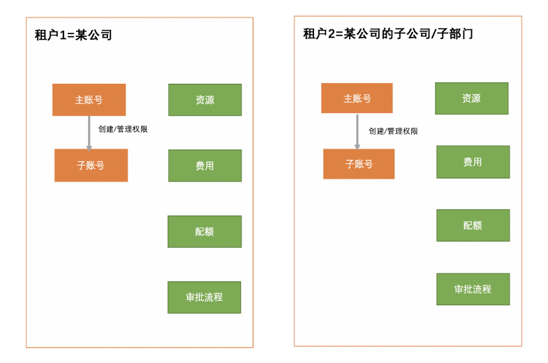

租户可由平台系统管理员创建，创建租户时默认会生成一个用户账号，此账号即为租户的主账号，也是租户下的管理人员；注册成功后需要管理员进行充值才可进行使用。

租户通过平台拥有云产品管理能力，支持按虚机ID/虚机名称/虚机状态/主机名称/用户名称/VPCIP/EIP筛选，租户可通过子账号名称，查看当前子账号的虚拟机资源实例及对该子账号CPU、内存使用率等；同时支持VPC、EIP、SLB、NAT等产品管理能力[[MOU1\]](#_msocom_1) 。

平台多租户管理的基本概念如下：

* **主账号**

一个租户必须有一个主账号，主账号默认有租户下所有资源及管理的全部权限。可通过主账号创建和管理子账号，并管理子账号的权限。

* **子账号**

子账号是主账号创建的用户，子账号在租户下的权限由主账号控制。一个租户可拥有多个子账号，支持对子账号进行资源管理的权限控制。

* **人员**

企业中的人员，人员需要使用账号登录云平台使用资源。

* **角色**

权限的集合，为用户和成员组赋予权限可获得调用相关API进行资源操作的能力。

* **项目组**

以项目组为维度进行资源规划，可为一个具体项目或者业务建立独立的资源池，实现资源更细粒度地管理。同时针对子账号的授权也是基于项目组维度进行授权。项目组只是逻辑上面的分组，不具有资源隔离的作用，租户所有资源均需要属于某个项目组。

* **流程审批**

为满足企业对核心云资源，如虚拟机、云硬盘、外网IP等资源使用的管控需求所引入的云资源工单审批流程。

* **审批管理**

审批管理仅平台管理员admin可以进行操作。

平台支持系统管理员对全局租户进行运营和管理，同时为租户的主账号提供自服务管理能力。

### 6.3.2 租户管理

支持管理员创建租户，创建租户时需要添加一个主账号作为租户的初始管理人员，支持同步设置账号登陆安全策略，首次登陆强制修改密码。

安全策略可设置密码长度、密码字符类型、密码有效时间、连续登录失败锁定、同一账号的接入点限制与ACL等各项策略。管理员可进行账号锁定/解锁，并对所管理用户的口令进行重置。

创建时可对租户进行管理设置，包括是否开启资源审批，自动审批，以及设置租户开通使用的地域。

账户创建后余额默认为0，需要进入管理员的充值管理页面，为租户充值后，租户下的账号才可正常创建和使用资源。

平台系统管理员可对平台的所有租户进行生命周期管理，如激活账号、修改名称、冻结、解冻、登录访问限制、开关审批流程、地域授权、修改邮箱、删除租户。同时可对租户进行主/子账号管理、配额管理、订单管理、交易管理、充值管理、价格管理及资源概览查看。

* **激活租户**：平台用户自行注册的账号默认为未激活状态，需用户通过激活链接激活账号后才可进行使用，同时平台支持管理员手动激活账号，使账号可正常登录并管理平台。

* **冻结租户**：将一个租户进行锁定，被成功冻结的租户，主/子账号将无法登录云平台，不影响租户内已创建的资源及业务的正常运行。

* **解冻租户：**租户解冻后，默认租户中的所有账号均会被解冻，并可正常登录控制台。

* **设置登录限制**：登录访问策略决定可以登录控制台和访问API的客户端IP地址，配置后账号只能从指定的IP登录或发起API访问，默认不指定任何IP，代表不限制登录控制台和访问API的IP地址。

* **开关辑审批流程**：开启或关闭一个租户下所有账号变更资源的审批流程方式，包括开启/关闭资源审批及开启/关闭自动审批。

* **地域授权管理**：通过地域授权管理可管理一个租户在地域下的授权情况。只有在授权地域下，租户下的账号才可在该地域正常使用服务。

* **修改邮箱**：支持管理员修改一个租户主账号的登录邮箱地址。

* **修改密码**：支持管理员修改一个租户主账号的登录密码。

* **删除租户**：支持管理员删除租户，删除前先进行账号冻结。

​	- 若租户下存在资源，则不可进行删除，需清空所有资源，才可进行租户删除。

​	- 删除租户后，租户下所有用户账号被清除，无法使用账号登录平台。

* **子账号管理：**支持查看并管理租户下已有主账号和子账号，包括查看账号信息、修改密码、冻结账号及解冻账号。

* **订单管理**：支持管理员查看单租户内的资源订单信息。

* **交易管理**：支持管理员查看租户内的交易记录信息。

* **资金管理**：管理员可为租户进行充值操作，并可查看单租户的充值记录信息；同时可为租户进行提现操作，并可查看租户的提现记录信息。

* **配额管理**：管理员可查看每个租户的当前配额信息，并可通过配置每个租户的在每个地域的资源配额。

* **价格管理**：管理员可查看租户当前每个产品的价格，并支持管理员对租户每种产品设置不同的折扣，如 9 折。

* **资源概览**：支持管理员查看每个租户当前的资源使用概览

在第三方账号体系方面，支持OAuth 2.0登录认证，用户可通过将企业内OAuth统一认证登录系统与云平台进行对接，使用企业统一登录用户即可登录并使用云平台的资源。

在平台成功对接OAuth认证后，在登录页面会提供第三方登录入口。企业用户可通过自有的OAuth统一认证平台登录跳转至云平台，同时也可通过云平台第三方登录入口通过统一用户密码认证登录云平台。

### 6.3.3 自服务界面

平台提供主账号自服务模式，支持自助注册流程，用户可通过注册链接，自动化的进行注册并使用云平台。账户创建后余额默认为0，需通过平台管理员进行账号充值，为租户充值后，租户下的账号才可正常创建和使用资源。

云资源管理平台提供用户自助服务界面，用户能够通过自助服务门户完成云资源申请、使用、修改、销毁等操作。

主账号自服务支持找回密码、修改登录密码、开启登录保护及登录访问限制等管理，并支持自行查看账号的基本信息、配额信息及面向开发者的API密钥。

* **找回密码**：支持主账号在忘记密码时通过控制台自主找回密码，找回密码时需通过邮箱进行验证。

* **修改登录密码**：平台支持用户修改账号登录密码，修改密码需要验证旧密码，若忘记旧密码，可联系管理员在后台帮助修改密码。

* **开启登录保护**：平台提供基于TOTP（Time-Based One-Time Password Algorithm）的免费登录二次认证服务，开通本服务后，账号登录控制台均需通过授权认证，支持国密硬件版和普通软件版，用户可根据需要通过部署进行配置。

* **登录访问限制**：支持主账号自行设置可登录控制台和访问平台API的客户端API地址。配置后租户下的所有账号只能从指定的IP登录或发起API访问，有效保证账户登录及资源的安全性。

​    - **账号信息**：支持主账号自行获取账号的基本信息、API密钥及配额信息。

​	- **API密钥**：提供当前账号的API密钥，用于管理并使用API接口。

	- **配额信息**：提供当前账号的配额信息，包括虚拟机数量、虚拟机CPU、虚拟机内存、VPC数量、子网数量、云硬盘数量、去硬盘容量、弹性网卡数量、外网IP数量、负载均衡数量、SSL证书数量、虚拟机模板数量、NAT网关数量、安全组数量、对象存储数量、文件存储数量、VPN网关数量、对端网关数量、VPN隧道数量、弹性伸缩组数量、伸缩策略数量、VIP数量等。

### 6.4.3 账号与权限

#### 6.4.3.1概述

平台支持对租户下的子账号进行权限管理，以项目组、角色权限、人员（子账号）及资源的授权绑定，实现平台资源级权限控制，如将租户下部分虚拟机授权给一个人员进行管理。具体权限工作机制和流程如下：

**(1)**  **以项目组进行资源分组管理**

平台以项目组为维度进行资源规划，可为一个具体项目或者业务建立独立的资源池，实现资源更细粒度地管理。同时针对子账号的授权基于项目组维度进行授权。

项目组帮助解决资源的精细化管理以及授权管理等复杂性问题。租户所有资源均需要属于某个项目组，分组的资源根据用户的角色授权决定用户是否对组中资源具有权限。

项目组只是逻辑上面的分组，不具有资源隔离的作用。主账号默认拥有租户下所有资源的管理权限，在主账号下创建资源时可不进这行项目组的配置。子账号创建资源时若不配置项目组则代表资源为默认项目组，若配置项目组则仅授权了项目组权限的子账号可进行查看或管理。

**(2)**  **以角色权限集群资源权限**

角色是一组权限的集合，包括系统默认内置角色和自定义角色。内置角色是平台根据应用场景提供的默认角色，可进行快速权限配置，若内置角色无法满足场景需求，可根据需求对角色进行自定义配置，向特定用户开放相应功能界面。

角色通过对资源权限进行集合配置管理，可支持的资源包括虚拟机、VPC、自制镜镜、外网IP、组播、NAT网关、负载均衡、裸金属、硬盘、快照、备份服务、弹性伸缩、VIP、VPN网关、商业存储、安全组、资源模板、MySQL、Redis、对象存储、文件存储、监控告警、API控制台及弹性伸缩等所有资源，并支持对所有资源的增、删、改、查及相关管理API的操作权限进行开启和关闭，以满足多场景用户权限管理及控制场景。

用户可将平台所有资源类型的API 操作项分类整合，形成符合特定场景的角色，并将角色和资源授权给子账号，使子账号具备所授权资源的角色权限，实现资源级精细化权限管控。

**(3)**  **以人员管理管理子账号并进行角色授权管理**

人员即子账号，是云平台内的一个账号实体，代表组织内需要访问云资源的人员，租户下支持创建一到多个子账号。

可通过角色授权进行权限管理，将角色、项目组资源与人员进行关联，实现将全部或所有资源以一种角色权限的集合授权给子账号，使子账号具备授权资源的角色及权限。

支持通过人员管理对租户下所有账号进行管理，建议谨慎地创建和管理组织下的账号，并为账号添加上适当的角色授权，防止权限扩大化，导致资源管理的混乱，影响企业IT资源使用的安全。

**通过账号权限管理的配置，可分别分配系统管理员、安全管理员及安全审计员三种角色，并分别赋予系统资源管理权限、安全配置和权限配置、日志事件审计权限，亦可实现三权分立的账号管理场景。**

#### 6.3.4.2 项目组管理

用户在创建资源时可选择资源所属的项目组，将资源加入到一个项目组，并可在后续将项目组的资源及角色权限与子账号进行关联，使子账号对项目组内的资源有相应的管理权限。

平台支持对项目组进行创建、删除、查看等基本管理，同时支持对项目组进行资源的转入转出管理。当项目组中存在资源时，无法删除项目组，需要将资源转移到其他项目组。

项目组管理通过转入转出资源管理项目组下的资源，具体说明如下：

* 转入资源到项目组时，可选择不在当前项目组下的所有资源，可以在资源列表处查看到资源所属项目组。

* 转出资源到其他项目组时，仅支持指定当前项目组下的资源，且转出到的项目组只能够时其他项目组。

* 资源被转出到其他项目组后，有该项目组授权的用户将无法再查看和管理此资源。 

* 资源转入/转出时以产品类型为维度，一次可以转入/转出同一产品类型下的多个资源。

**注**：VPN网关、负载均衡、伸缩组等相关产品服务均有多个维度资源，在转入转出时需将关联资源分配到同一组内。

#### 6.3.4.3 角色管理

角色是一组权限的集合，可将平台所有资源类型的API 操作项分类整合，形成符合特定场景的角色，并将角色和资源授权给子账号，使子账号具备所授权资源的角色权限，实现资源级精细化权限管控。

角色管理支持系统内置角色，默认包括管理员和只读用户两种角色：

* 管理员角色包含了租户下所有云资源操作和组织管理操作的授权。若对子账号无需进行精细地权限管理，可直接使用系统管理员为子账号进行角色授权，更快捷地进行操作。

* 只读用户：包含所有资源和组织管理功能的查看权限。

平台提供自定义角色的能力，支持用户自定义权限集群创建角色，并对角色进行修改、删除管理，同时支持用户查看一个角色已绑定的子账号。

**注**：创建角色时，系统默认勾选的操作，为各个模块必须要授权上的操作，建议不要取消，避免影响授权的完整性。

#### 6.3.4.4 人员管理

人员即子账号，是云平台内的一个账号实体，代表组织内需要访问云资源的人员，租户下支持创建一到多个子账号。

可通过角色授权进行权限管理，将角色、项目组资源与人员进行关联，实现将全部或所有资源以一种角色权限的集合授权给子账号，使子账号具备授权资源的角色及权限。

支持通过人员管理对租户下所有账号进行管理，可查看当前租户下所有子账号的相关信息，同时支持子账号创建、冻结子账号、解冻子账号、删除子账号及角色授权管理。

* **创建子账号**：具有子账号创建权限的账号可进行子账号的创建管理，并支持设计子账号的名称、邮箱、密码、授权范围、角色，并可开启首次登录修改密码。

* **冻结子账号**：冻结账号是指将一个账号进行锁定，冻结后将不允许登录控制台。

* **解冻子账号**：解冻账户是指解冻一个已冻结的账号，被成功解冻的的用户，可登录管理控制台。

* **删除子账号**：可对账户进行删除，删除账号后用户无法再使用此账号密码登录平台。删除后，可再使用账号邮箱在平台注册或创建新的账号。

* **角色授权管理**：支持对子账号进行角色授权管理，将全部资源或指定项目组的资源，以某个角色授权给子账号，使子账号对指定资源拥有指定角色的权限。

**注**：角色授权时，支持多个角色一起授权，最终子账号获得的权限为多个角色的权限的并集，即所有角色权限的集合。

## 6.4 多地域/多可用区管理

### 6.4.1 多地域概述

地域（Region）是云平台中的一个逻辑概念，指资源部署的物理位置分类，可对应机柜、机房或数据中心。通常一个数据中心对应一套UCloudStack云平台，可支持部署多个计算和存储集群；数据中心之间资源和网络完全物理隔离，可通过一套管理平台管理遍布各地数据中心的私有云平台。同时支持中心云、边缘云等统一纳管能力。

* 地域在平台也称为数据中心，通常数据中心之间完全隔离以保证最大程度的稳定性和容错性。

* 作为平台最大的资源定义，一个地域即部署一套云平台。平台默认内置一个地域，管理服务通过本地数据中心云平台提供的API端点管理地域内计算、存储及网络资源。

* 支持对数据中心内资源的生命周期管理，包括计算集群、存储集群、外置存储、基础镜像及自制镜像等资源的查看和维护。

多地域管理是指在一个组织或企业内部建立和管理多个数据中心，并将多个数据中心部署在不同的地理位置，提供更高的可用性、容错性和灵活性，使组织能够更好地满足地理分布和业务需求。

多地域管理支持在多个数据中心部署UCloudStack私有云平台，多套云平台通过统一管理界面进行运维运营管理，租户可在统一控制台使用多个地域下的私有云资源。

在私有云的部署结构上可以将一个机柜、模块或机房当作一个地域或数据中心，部署一套私有云平台，可应用于边缘节点构建、双活数据中心、两地三中心或政务云构建等场景。

多套UCloudStack云平台均通过上层统一云管平台进行统一管理，多套云平台共享一套账号认证、计量计费、监控告警、审计日志、API网关、操作界面及相关通用套件，每个数据中心的云平台资源均部署于自己的地域中，通过地域标识保证资源的隔离和安全性。

### 6.4.2 多地域特性

多地域管理通过一套控制台对多个地域的多套 UCloudStack 平台进行统一管理和调度，具有多地域部署、统一管理、安全隔离及平滑扩展等特性。

* **多地域部署**

多地域管理允许将私有云数据中心分布在不同的地理位置上，可以是不同的城市、国家或洲际，用于减少地理位置带来的单点故障风险，提高系统的可靠性和可用性。

* **统一管理**

为方便管理和监控多个地域的私有云数据中心，平台提供统一管理服务，支持对各个地域的集中管理，包括资源配置、监控和故障排除等能力。租户可在平台一键切换地域，并进行资源创建和管理；平台管理员可通过管理控制台统一管理整个私有云多地域架构，并为租户分配地域使用权限。

* **安全与隔离**

私有云多地域管理，提供安全和隔离机制，以确保各个地域之间的数据和资源不被未授权的访问。具备网络隔离、访问控制手段来实现，确保地域之前的独立性和安全性。

* **平滑扩展**

多地域管理具备平滑的扩展能力，以应对业务的变化和需求的增长。当需要增加新的地域或调整已有地域的规模时，多地域管理机制不影响现有业务，进行扩展和调整，而不会对整个架构产生太大的影响。

### 6.4.3 多地域管理

面向租户，平台支持资源多地域统一管理，通过地域切换按钮可进行不同地域的管理，在不同的产品服务页面，切换地域按钮将会仅展示和操作当前地域的资源和管理。

面向平台管理员，平台支持管理当前云平台已部署的所有地域，包括地域信息的查看、编辑地域信息、查看地域资源用量统计及地域资源管理等。同时支持对地域进行运营管理，将地域授权给一个或部分租户，满足地域资源独享的专属云场景。

* **地域信息获取**：支持系统管理员查看平台管理的所有地域列表，以及查看地域下CPU核数用量、内存用量、存储用量物理GPU用量及授权状态。

* **地域资源用量统计**：支持查看当前地域以及全部地域的资源使用情况，按照已分配个数和总配额生成扇形图，已分配数量为用户创建的资源总数，总配额为当前地域所有租户配额总和。支持查看多地域中资源使用率最高的前五个地域排行展示。

* **地域资源管理**：提供全平台所有每个地域物理资源的生命周期管理和运维能力，使平台管理员可通过控制台统一管控地域中整体物理资源，包括物理机资源（节点）、物理机纳管、镜像资源及外网网段资源。

* **地域授权管理**：通过地域授权管理可管理一个地域管理员在地域下的授权情况。只有在授权地域下，租户才可在该地域正常使用服务。企业可以根据云平台实际运营情况管理系统管理员在对应地域的开通情况。

私有云平台支持全局资源管理，包括物理资源管理和虚拟资源管理，全面满足云平台运营管理者对云平台资源的自主可控性需求。

## 6.5 全局资源视图

平台提供全局资源管理视图，针对多地域资源使用情况提供总体视图展示，支持查看单地域和全部地域资源的使用情况，方便平台管理者统计所有物理资源及云资源的使用状况并对其进行管理，比如在全局资源试图中可以查看资源已用比例、已创建并使用了多少虚拟机、存储空间等。并根据实际使用情况，可以进一步管理用户自身的虚拟机、存储空间等，使其更满足自身业务需要。

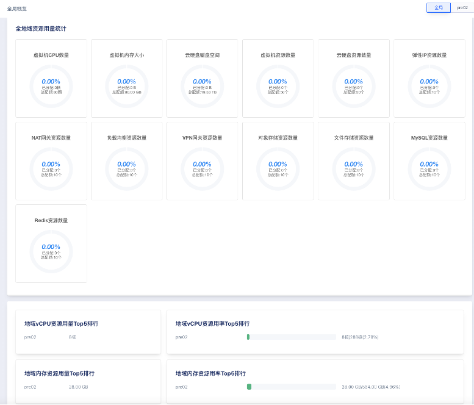

* 支持平台所有地域或单个地域的资源用量统计，如vCPU、内存及存储资源的资源总量、已分配量及未分配量。

* 支持平台所有地域或单个地域的配额用量统计，如虚拟机CPU数量、虚拟机内存大小、磁盘空间、虚拟机资源数量、云硬盘资源数量、EIP资源数量、NAT网关资源数量及相关产品的配额的总数及已分配数量。

* 支持平台所有地域或单个地域的vCPU、vCPU、内存、存储资源的使用率排行前五统计。

## 6.6 物理资源管理

物理资源管理是对平台的物理及事实存在的资源进行管理和调度，包括物理节点管理、集群管理、镜像管理、外网网段管理及专线接入管理等，集群管理详见基本概念【**集群**】章节描述。

### 6.6.1 物理节点管理

节点管理是指对地域内的所有计算节点的管理，包括查看节点信息、锁定、解锁、进入维护模式、退出维护模式及修改告警模板等，同时可支持对每个计算节点中已存在的计算实例、USB设备、网络设备、磁盘设备及集群信息进行查看和管理。

**(1)**  **节点信息**

支持查看节点的资源ID、IP地址、CPU信息（如CPU型号、CPU核心、CPU槽数、CPU线程）、CPU总量、内存总量、序列号、状态、架构、节点类型、地域及NTP信息。

同时支持查看节点所属的集群信息，如集群ID、集群类型、CPU用量、内存用量、GPU用量、物理GPU用量、vGPU用量、地域等。

**(2)**  **计算实例**

支持管理员通过节点详情页面，查看节点中的计算实例列表及信息，包括名称、计算实例ID、资源ID、所属租户、节点IP、镜像ID、GPU、CPU、内存、状态、创建时间及更新时间。

**(3)**  **监控告警**

支持查看节点机器的监控信息，包括：网卡入带宽、网卡出带宽、硬盘读吞吐、硬盘写吞吐、平均负载、内存使用率、空间使用率、硬盘读此书、网卡入包量、硬盘写次数、网卡出包量、CPU 使用率、TCP 连接数、阻塞进程数。

支持管理员根据节点监控指标修改相应的告警模板，用于监控节点的健康状态，并支持多种方式的告警通知。

**(4)**  **锁定节点**

节点被锁定后，新建计算实例不会被调度至计算节点，不影响节点内已有计算实例，可配合节点进入维护模式功能，以实现节点维护、升级等操作。

**(5)**  **解锁节点**

管理员将锁定的节点进行解锁，可对外提供计算服务，计算实例可被调度并部署至节点。

**(6)**  **进入维护模式**

当需要维护节点时，比如扩展内存、升级、修复硬件等维护场景下，平台支持将节点进入维护模式，使节点上的虚拟资源自动迁移至同计算集群中其他物理节点上，使节点处于空闲状态，确保对物理节点维护时不影响平台的虚拟资源运行，保证业务的可用性。节点进入维护模式前必须保证节点状态为已锁定。

**(7)**  **退出维护模式**

退出维护模式是指将节点重新加入至调度系统，为平台提供计算能力。仅支持状态为【维护模式】的节点退出维护模式，退出维护模式，将会自动恢复并进入至锁定状态，需进行解锁才可加入智能调度系统以提供计算能力。

**(8)**  **USB设备管理**

支持管理员通过节点页面，查看节点中USB设备列表及信息，包括设备名、设备ID、状态、厂商、类型、序列号、虚拟机、USB版本、所属租户，并支持对USB进行租户分配。

### 6.6.2 镜像管理

镜像是虚拟机所使用的镜像模板文件，如CentOS、Windows、Ubuntu、Debian等操作系统模板文件，平台的镜像文件均为QCOW2格式。镜像管理是平台为虚拟机提供的镜像仓库，支持基础镜像和自制镜像两种类型：

* 基础镜像是由平台官方默认提供，包括多发行版Centos、Debian、Ubuntu及Windows等原生操作系统；

* 自制镜像由租户或管理员通过虚拟机自行导出或自定义导入的自有镜像，可用于创建虚拟机，除平台管理员外仅账号自身有权限查看和管理。

**(1)**  **基础镜像**

平台默认会提供多发行版Centos、Debian、Ubuntu及Windows等原生操作系统的基础镜像，基础镜像默认所有租户均可使用。

* 支持管理将租户自制或导入的镜像复制为基础镜像，作为默认基础镜像共享给平台所有租户使用。

* 支持修改镜像的使用权限，赋予不同租户对应的镜像版本。

* 支持管理员修改基础镜像的名称备注及删除基础镜像。

**(2)**  **自制镜像**

自制镜像由租户或管理员通过虚拟机自行导出或自定义导入的自有镜像，可用于创建虚拟机，除平台管理员外仅账号自身有权限查看和管理。

* 支持管理将为租户导入自定义镜像，租户或平台管理员将第三方业务虚拟机以镜像的方式迁移到平台镜像仓库，作为业务迁移的重要通道。

* 支持用户导入Linux和Windows发行版及自定义镜像，并支持X86架构和aarch64两种系统架构镜像的导入。

* 云平台的镜像格式默认为RAW，用户上传VHD、VMDK、QCOW2、OVA、ISO等格式的镜像时，需先将镜像转换为QCOW2格式的镜像才可导入。

* 并支持管理员将租户的虚拟机导出为自制镜像，并支持管理员下载镜像仓库中的所有自制镜像。

* 支持管理员通过自制镜像创建虚拟机、删除自制镜像、修改自制镜像名称。

为方便平台镜像模板文件的共享，平台支持管理员将一个自制镜像复制为一个基础镜像，使一个租户的自制镜像共享给所有租户使用，适用于运维部门制作模板镜像的场景，如自制镜像操作系统的漏洞修复或升级后，制作一个自制镜像并复制为基础镜像，使所有租户可使用新的镜像文件升级虚拟机系统。

### 6.6.3 外网网段管理

外网网段是平台对外通信的网络，一般由管理员或运维人员通过物理网络分配并配置至云平台。外网网段是平台为租户分配外网IP的IP资源池，支持IPv4和IPv6两种IP类型，并支持配置网段路由并自动下发路由至平台虚拟机。

平台在部署时默认为配置一段外网网段，如果平台业务需求，也可由管理员在管理控制台上自助添加IP网段，在添加IP网段前需要保证物理交换机上已为节点外网网络配置Vlan及相关网段信息。

网段管理仅作为平台管理员将物理网络上的网段信息录入至云平台，使云平台的租户可申请外网网段是的IP地址作为虚拟资源的外网IP，与平台外网进行通信。

支持管理员对外网IP的网段进行维护及管理，包括IP网段、网关、外网网卡、VLAN、路由及网段权限等配置，方便云平台管理员对外网IP地址池的管理，同时支持IPv4和IPv6双栈IP资源池管理。

* 支持通过私有IP地址段模拟外网网段，在交换机或上层路由将私有IP地址段NAT到互联网。

* 支持为每个网段配置路由策略，即租户申请网段的外网IP绑定至虚拟资源后，下发目的路由地址的流量自动以绑定的外网IP为网络出口。路由策略提供默认路由、指定路由及暂不指定三种模式：

​		- 默认路由：即下发路由的目的地址为0.0.0.0/0，代表默认所有流量均以绑定的外网IP为出口。

​		- 指定路由：即管理员指定目的地址（如10.0.2.0/24）的流量以绑定的外网IP为出口。

​		- 暂不指定：即该网段不自动下发路由，仅可通过此外网IP地址与本网段进行通信。

* 支持管理员为云平台添加IPv4或IPv4版本的网段，使平台租户可同时申请IPv4和IPv6版本的外网IP，并绑定至虚拟机提供网络服务。

* 支持管理对每个网段的开放范围进行控制及修改，默认为所有租户（所有租户可申请并使用网段IP），支持配置为部分租户（指定的租户才可申请并使用网段IP，未指定租户无法查看并申请网段IP）。

* 支持管理员对每个网段添加标签，使EIP申请和创建虚拟机时可根据标签过滤出需要的线路。

*  支持管理员自定义外网网段IP地址的带宽规格，定义每个网段租户可申请的带宽范围。

为方便管理员和运维人员，平台提供外网网段的查看、修改等生命周期管理。外网网段管理与平台部署的物理网络及架构拓扑紧密相关，在维护外网网段前需确保物理网络配置完善后，至平台录入IP网段后才可使用。

### 6.6.4 专线接入管理

专线接入用于搭建用户本地数据中心与私有云VPC之间高速、低时延、稳定安全的专属连接通道。通过专线接入，可帮助用户实现混合云架构的网络数据面打通。

* 提供自助专线接入能力，支持设置本端与远端IPv4地址、远端子网网段、网卡、Vlan及带宽。

* 支持管理对每个专线的开放范围进行控制及修改，默认为所有租户（所有租户可使用专线接入与指定VPC互通），支持配置为部分租户（指定的租户才可使用专线接入与指定VPC互通。

* 支持有专线接入权限的租户在VPC互通中指定专线接入资源与VPC建立内网互信通道。

* 支持用户修改远端子网网段，适用于专接入远端网段变更的场景。

* 支持用户调整专线接入的带宽和专线接入的资源标签，并支持管理员对专线接入资源进行删除。

## 6.7 虚拟资源管理

平台为管理员提供全平台所有租户的虚拟资源全生命周期运营和管理能力，使平台管理员可通过控制台统一管控平台的整体虚拟资源。

虚拟资源管理包括租户端的所有产品服务，如虚拟机、虚拟机模板、隔离组、弹性网卡、VPC网络、外网IP、高可用VIP、组播、安全组、负载均衡、NAT网关、VPN网关、云硬盘、快照、商业存储磁盘、文件存储、对象存储、MySQL、Redis、备份、监控告警、资源事件等资源。

支持平台管理员为指定租户创建资源，创建的资源归属租户所有，同时支持管理员对平台所有租户的虚拟资源进行全生命周期管理，如创建、删除、修改、绑定、解绑等。

平台管理员为租户的虚拟资源绑定关联资源时，仅支持指定归属于租户的资源进行绑定，如仅支持管理员将归属于租户的外网IP绑定至相同租户的虚拟机。

## 6.8 QoS配置管理

平台全局默认提供全局云硬盘QoS配置，即新创建的云盘会根据平台公式赋予QoS值，限制平台用户对磁盘性能强行占用。同时平台支持管理员对平台所有租户的云硬盘自定义设置QoS值，仅当全局QoS配置开启时，管理员为每个云硬盘自定义的QoS才可生效。

每一块云硬盘创建出来后，管理员可在云资源管理——云硬盘列表上进行“QoS配置”，同时可对虚拟机详情磁盘中的系统盘进行QoS配置。

* **读/写IOPS**

当磁盘的Arch架构为HDD时，可设置的读/写IOPS范围为0~50000，默认值为1000，配置为0不限速。

当磁盘的Arch架构为SDD时，可设置的读/写IOPS范围为0~50000，默认值为计算公式根据当前硬盘容量计算的值，配置为0不限速。

* **读写带宽（MBps）**

当磁盘的Arch架构为HDD时，可设置的读/写带宽范围为0~1000Mbps，默认为100，配置为0则不限速。

当磁盘的Arch架构为SSD时，可设置的读/写带宽范围为0~1000Mbps，默认为计算公式根据前当前硬盘容量计算的值，配置为0则不限速。

硬盘扩容容量后，会根据计算公式重新计算新容量的QoS值，根据计算的QoS值重新设置硬盘的QoS。

* 若硬盘扩容前设置的QoS值<新容量QoS值，则以新容量QoS值为准。

* 若硬盘扩容前设置的QoS值>新容量QoS值，以扩容前设置的值为准。

硬件介质和容量会影响硬盘的读写IOPS和宽带速率，若配置的QOS超过硬件本身性能，以硬件性能为准。系统会默认分配QOS值，如需取消一块硬盘的限速功能，可将IOPS和宽带均配置为0。

QoS配置同时针对MySQL、对象存储、文件存储类的PaaS层产品提供QoS配置管理，用于限制PaaS产品使用磁盘的IOPS和带宽。

* 支持管理员对平台所有租户的文件存储自定义设置 QoS 值。

* 支持管理员对平台所有租户的对象存储自定义设置 QoS 值。

* 支持管理员对平台所有租户的MySQL自定义设置 QoS 值。

## 6.9 资源模板

资源模版支持租户预定义创建资源的参数配置，保存到模版中，便于后续快速创建，以及结合水平弹性伸缩完成业务节点的快速阔缩。

云平台用户可以通过指定机型、规格、镜像、云硬盘、VPC 网络、公网 IP、安全组及虚拟机相关基础信息一键创建虚拟机模板，用于从模板创建虚拟机实例。

* 虚拟机模板仅作为一资源创建的模板配置，不占用实际资源。

* 支持通过资源模板一键创建资源，创建时可进行配置变更。

* 支持用户更新资源模板的配置项和标签，并支持对资源模板进行克隆。

* 支持用户删除资源模板，删除后对通过资源模板创建的资源无影响。

## 6.10 标签管理

### 6.10.1 概述

标签用于标记各项云资源，从不同维度对具有相同特征的云资源进行分类、搜索和聚合，让资源管理变得更加方便。标签由一对键值对（key:value）构成，用户可根据需求自定义键值对内容，绑定不同资源。

* 支持标签批量创建，单次创建，删除标签功能。

* 支持查看资源，展示该条标签下所有绑定的资源。

* 支持绑定资源，可选择不同地域下不同资源类型进行绑定。

* 支持解绑资源，可批量解绑。

同时，标签支持资源创建时选择需要的标签进行添加，支持在资源界面对标签进行添加与删除操作。资源界面将会展示当前资源所绑定的标签键值对。

支持统一的搜索入口，可根据key/value，资源ID，资源类型，三个维度进行绑定资源到查询，灵活操作资源，可在云资源界面以及标签管理界面进行搜索，方便查询管理较大数量的标签，以及快速的匹配资源。通过标签筛选虚拟机，满足不同的角色分别管理云主机标签。

### 6.10.2 资源类型

租户侧支持的资源类型包括：虚拟机、虚拟机模版、镜像、VPC、子网、云硬盘、弹性网卡、快照、弹性IP、负载均衡、SSL证书、安全组、IP组、端口组、NAT网关、Redis、MySQL、对象存储、文件存储、VPN网关、对端网关、隧道、伸缩组、VIP、组播、隔离组。

管理侧支持的资源类型包括：外网网络、专线接入。

### 6.10.3 使用限制

* **标签命名限制**

标签键以及value值支持最大127位字符，不能为空，区分大小写-标签key以及value内容支持utf-8格式表示的大小写数字、汉字、数字、空格以及特殊字符

* **数量规范**

1个资源最多可以绑定50个标签-1个标签包含1个标签键和1个标签值（tagKey:tagValue）-1个资源上的同一个标签键只能对应1个标签值-单次批量创建标签数量最多不超过5个

* **资源状态限制**

虚拟机除过删除，删除中和失败的资源不能更新标签，其他状态下可修改资源绑定的标签内容。

## 6.11 监控告警

### 6.11.1 概述

监控告警是平台全线产品的运维监控及告警服务，提供全线资源实时监控数据及图表信息，可根据监控数据批量为资源设置告警策略，并在资源故障或监控指标超过告警阈值时，以邮件的方式给予通知及预警；同时监控告警服务实时为用户提供资源告警状态，让用户精准掌控业务和各云产品的健康状况，全方位保障业务的可靠性和安全性。

监控告警服务提供监控图表、告警模板、告警记录及通知组四大架构功能，整体架构功能均以监控数据为基准：

* 云平台通过智能化数据采集系统，租户对虚拟机、云硬盘、EIP 、负载均衡、NAT 网关、弹性伸缩、VPN 网关，对象存储，文件存储等资源指定的监控指标数据进行完整挖掘；管理员可对节点、计算集群、存储集群指定的监控指标数据进行完整挖掘。

* 云平台将采集来的监控数据存储至数据库中，并根据指定规则对数据进行检索及统计，通过指定的时间维度及数据粒度以图形化的方式显示监控图表。

* 基于已有的监控数据，用户可通过配置告警模板，为指定的监控指标指定告警阈值、持续时间、重要程度、通知组及选择对比方式，可通过设置告警持续时间，判定区分不同等级的告警及通知。

* 可为告警模板配置通知组，指定在发生告警时通知事件的通知人及通知方式。

* 在告警期间，可通过告警记录查询实时告警信息，以判断故障的发生时间和重要程度。

### 6.11.2 监控图表

监控图表指平台将智能化采集的资源运行数据，根据指定的资源及指标等筛选规则进行检索并统计，通过指定的数据粒度及时间维度以图形化的方式显示监控图表。通过监控图表，用户可以直观的查看并了解平台上已运行虚拟资源的性能、容量及网络状态等状态，及时了解资源的健康状况及故障节点。同时提供告警及性能管理能力，支持多维度告警/事件展示。

平台为租户构建的虚拟机、弹性 EIP 、负载均衡、NAT 网关、弹性伸缩、VPN 网关、对象存储、文件存储分别提供多种监控指标的实时和历史监控图表，并可根据监控指标项配置相关告警模板，用于阈值超标时给予告警及通知。

* **虚拟机监控图表**：通过虚拟机详情页面的监控信息栏可查看单台虚拟机的监控信息，包括网卡出/入带宽、网卡出/入包量、磁盘读/写吞吐、磁盘读/写次数、平均负载、空间使用率、内存使用率、CPU使用率、GPU使用率、GPU总显存、GPU显存使用量、GPU总消耗、GPU平均功耗、GPU温度；

* **弹性** **EIP** **监控图表**：通过 EIP 详情页面的监控信息可查看单个 EIP 资源的监控信息，包括网卡出带宽使用率、入带宽、出带宽、入包量、出包量；

* **负载均衡监控图表**：通过负载均衡详情页面的监控信息可分别查看负载均衡实例和VServer监听器的监控信息，监控图表包括LB每秒连接数、LB每秒网卡出/入流量、LB每秒网卡出包数量、VServer 连接数、HTTP 2XX、HTTP 3XX、HTTP 4XX、HTTP 5XX；

* **NAT网关监控图表**：通过 NAT 网关详情页面的监控信息可查看单个 NAT 网关的监控信息，包括网卡入带宽、网卡出带宽、连接数、网卡入包量、网卡出包量。

* **VPN** **网关监控图表**：通过 VPN 网关服务详情页面的监控信息可查看单个网关的监控信息，包括网关出/入带宽、网关出带宽使用率、网关出/入包量。

* **VPN** **隧道监控图表**：通过 VPN 隧道服务详情页面的监控信息可查看单个隧道的监控信息，包括隧道出/入带宽、隧道出/入包量及隧道健康状态。

* **对象存储监控图表**：通过对象存储服务详情页面的监控信息可查看，包括CPU使用率、内存使用率、对象数量、存储容量、当前存储量、存储容量使用率、存储总写吞吐、存储总读吞吐。

* **文件存储监控图表**：通过文件存储详情页面的监控信息可查看，包括CPU使用率、内存使用率、存储容量、当前存储量、存储容量使用率、存储总写吞吐、存储总读吞吐。

同时整个平台为全局节点、计算集群、存储集群提供多种监控指标的实时监控图表，并可按照用户的需求对告警模版进行配置，用于阈值超标的时给予告警和通知。

* **节点监控图表**：通过节点详情页面的监控信息可查看，包括CPU使用率、内存使用率、GPU使用率。

* **计算集群监控图表**：通过计算集群详情页面的监控信息可查看，包括CPU分配率、内存分配率、GPU分配率。

* **存储集群监控图表**：通过存储集群详情页面的监控信息可查看，包括存储分配率。  

监控图表可根据时间维度展示实时监控数据，同时支持查看 1 小时及自定义时间的监控数据及图表信息。

### 6.11.3 告警模板

告警模板是平台监控告警服务为用户提供的一种批量设置资源告警的功能，通过预先定义模板中的告警规则及通知规则，将模板中定义的规则应用到虚拟资源；若虚拟资源的监控指标数据达到或超过告警规则中设定的阈值及条件，则根据通知规则中定义的通知方式发送告警通知到指定的联系人。

根据不同的资源类型，可定制不同监控指标及阈值的告警规则，并可选择将监控指标应用至关联资源的单个网卡或磁盘设备，满足多种应用场景下的监控报警需求。

* 告警模板是由多条告警规则及关联资源构成的；

* 一个告警模板仅支持绑定一种类型资源，包括虚拟机、弹性 EIP 、负载均衡、NAT 网关、弹性伸缩、VPN 网关、对象存储、文件存储、节点、计算集群及存储集群等。

* 每个告警模板可包含多条告警规则，每条告警规则包含监控指标、对比方式、告警阈值、持续时间、重要程度及通知组；

* 每个告警模板仅支持绑定一个通知组，每个通知组可包含多个通知人，支持邮件的通知方式。

云平台支持用户和平台管理员为资源创建告警模板，并提供告警模板的全生命周期管理，用户可通过告警模板自定义所对应资源类型的告警规则，通过告警规则对资源进行监控指标的告警触发和处理。

告警规则是告警模板的核心，每个告警模板均由1条或多条告警规则组成。被绑定至告警模板的资源监控指标数据会根据告警规则中定义的阈值触发相关告警策略，并通过告警规则中的通知方式进行告警信息的通知，以便快速入处理告警或故障。

* 监控指标：仅可选择告警模板资源类型所包含的监控指标，一条告警规则仅支持一个监控指标：

* 对比方式：指监控指标的实际数据与告警阈值的比较方式，代表当前告警规则的告警逻辑，包括>=、<=、>、<：

​	- 当选择>=时，即代表监控数据大于或等于阈值时触发一次告警周期；

​	- 当选择<=时，即代表监控数据小于或等于阈值时触发一次告警周期；

​	- 当选择>时，即代表监控数据大于阈值时触发一次告警周期；

​	- 当选择<时，即代表监控数据小于阈值时触发一次告警周期；

* 告警阈值：指监控指标数据的临界值，与监控指标数据进行对比，符合对比方式即触发一次告警周期，如CPU使用率的告警阈值为80，对比方式为大于等于，即CPU使用率大于等于80%即触发一次告警周期；

* 持续时间：监控指标数据触发阈值持续的时间，持续时间内均达到告警阈值才会触发告警；

* 重要程度：用户可根据业务需要在创建告警规则时选择合适的等级，分为灾难、严重、一般、警告、信息几种 ，在告警记录中可根据重要程度进行记录的筛选；

* 通知组：即触发告警周期且需要发送通知时，发送告警通知的方式及联系人。

### 6.11.4 告警记录

告警记录告警模板定义的所有告警记录及信息，通过告警记录可查阅实时及历史告警信息，包括告警的指标说明、模版类型、标签、当前值、状态、重要程度及告警时间。

* 指标说明：触发当前告警记录的资源监控指标项，即数据来源；

* 模版类型：触发当前告警记录的资源类型及资源；

* 标签：显示磁盘空间使用率指标的数据盘信息；

* 当前值：即触发告警或恢复告警时当前告警记录监控指标的数据值；

* 状态：告警记录的当前状态，分为触发中、待触发、未触发，可根据需求进行状态的筛选；

* 重要程度：根据监控规则显示当前告警记录的重要程度，包含危险、重要、一般，可根据需求进行告警记录的筛选；

* 告警时间：触发告警规则的具体时间。

### 6.11.5 告警追踪

云平台发生告警事件后，支持用户以业务应用的视角对故障进行精准定位，支持对故障告警的过程进行协同跟进，包括故障报告、故障更新、初因分析、故障过程时间线等，为故障的深度复盘分析提供结构化数据支撑。

告警追踪过程链路清晰，从事件发生点倒追事件起因，具备链路追踪、链路告警和链路分析等功能，即时了解云服务健康度，掌控云业务流量。

告警追踪是为了故障改进，对故障指定明确的改进措施，确保每个深度复盘后的故障都能对业务连续性形成改进。

### 6.11.6 告警处理

告警处理指在告警事件发生后的处理过程，主要包括接手、挂起、忽略、催单、误报、取消等，对选择的告警进行处理。

## 6.12 通知组

通知组是监控报警发送告警通知的方式及联系人信息，通过对用户邮箱、Webhook地址的记录，将不同资源告警通过邮件或Webhook方式通知给通知人，以便划分全责，精细化处理告警通知。

在使用监控告警模板时，需要先创建一个通知组，添加相关联系人信息，并设置通知组的通知方式，以便关联告警模板。

通知组是一组通知人的组合，可以包含一个或多个联系人，在资源发生告警时会通过所设置的通知方式至所有通知人。

通知人是指告警规则发送通知的具体联系人，同一个联系人，可以加入多个通知组，支持邮件通知和Webhook通知两种方式。

* 邮件通知：支持配置联系人姓名及邮箱地址信息，用于发送告警通知至配置的联系人邮箱。

* Webhook通知：支持配置Webhook地址及发送警告信息的请求方式，请求方法支持GET和POST两种方式进行信息传输。

支持用户对通知组及组内的通知人进行自定义配置，并支持用户对已有的通知方式进行修订及删除。

## 6.13 操作日志

### 6.13.1 操作日志

操作日志是指用户在控制台或API对资源进行的操作行为及登录登出平台的审计信息。操作日志会记录用户在平台中的所有资源操作，提供操作记录查询及筛选，通过操作日志可实现安全分析、资源变更追踪以及合规性审计。

通过操作日志用户可查看整个平台单个地域或全部地域所有的资源操作及平台审计日志，同时可通过API查询租户内所有资源的操作日志及审计信息。

操作日志支持的的资源模包括面向租户的裸金属、虚拟机、USB、资源模板、镜像、VPC、云硬盘、外置存储、弹性网卡、外网IP、VIP、组播、安全组、负载均衡、NAT网关、VPN网关、对象存储、文件存储、MySQL、Redis、自动伸缩、监控告警模板、定时器、账户、API控制台、备份服务等。同时面向平台管理员可提供运维方面的操作日志。

平台支持获取日志的操作名称、所属模块、地域、关联资源、操作者、操作结果、备注及操作时间等信息；并支持导出用户的操作审计日志为本地Excel表格，方便账户管理和运营。

* 操作名称：指操作日志的操作名称，包括调用API的接口名称及操作的界面展示名称，如调整带宽。

* 所属模块：指操作日志操作的资源类型，如虚拟机类型。

* 地域：操作资源所属的地域。

* 关联资源：操作日志对应的资源标识符，并可查看一个操作中所有关联的资源标识，如绑定弹性IP对应的虚拟机ID和外网IP的ID。

* 操作者：操作日志对应的操作者，可追溯到具体的主账号和子账号。

* 操作结果：操作日志的结果，如操作成功、操作失败、参数异常、存储集群物理资源不足等。

* 备注：操作日志的备注信息。

* 操作时间：操作日志的操作时间。

为方便用户便捷的查看操作审计日志，平台提供日志管理能力，采用基于浏览器的用户界面，支持Chrome与Firefox等浏览器。同时支持日志的筛选和搜索检索，包括所属模块、操作状态及查询时间范围等纬度。日志采集器使用通用分布式日志采集器进行日志收集，支持系统、应用、中间件等日志的全量采集。

所属模块支持所有产品模块的筛选，同时支持查看全部资源的日志及审计信息，即不对所属模块进行筛选。操作状态支持状态为成功、失败的日志筛选，同时支持查看全部状态的日志和审计信息。查询时间范围支持1小时及自定义时间的日志筛选，最长可查询半年的操作日志。

### 6.13.2 通知规则

操作日志通知规则对资源操作日志进行监控并通过通知组进行事件信息的告知。支持用户为操作日志配置通知规则，当资源操作日志符合通知规则要求时，即发送监控邮件到通知组内的成员。

支持用户配置操作日志通知规则的监控地域、通知组、监控模块及监控级别等信息，并支持用户和平台管理员对操作日志的通知规则进行修改和删除。

* 监控地域：通知规则的地域信息。

* 通知组：邮件通知的通知组信息，仅支持选择一个通知组。

* 监控模块：监控的资源模块内容，如虚拟机、云硬盘等，支持批量配置多个模块。

* 监控级别：操作日志的操作结果，包括操作成功、操作失败。

## 6.14 资源事件

### 6.14.1 资源事件

资源事件是用于对云平台核心资源的部分操作及状态进行记录及通知，如资源生命周期状态的变化、操作运维执行情况、资源到期等。

资源事件记录用户在资源类型的部分核心操作事件，提供事件详细记录查询及筛选，并可配合通知规则及时通知用户、定位问题。

资源事件支持的的资源类型包括虚拟机、NAT网关、VPN网关、隧道、负载均衡、对象存储、文件存储、MySQL及Redis。支持获取资源事件的资源ID、资源类型、事件类型、事件等级、事件内容、事件发生次数、开始时间及更新时间。

* 资源ID：指资源事件监控的资源ID。

* 资源类型：当前资源事件记录所指定的资源类型。

* 事件类型：分为生命周期变化事件和操作运维事件，如虚拟机调度，虚拟机开关机，挂载磁盘等。

* 事件等级：事件等级的类型，包括正常、警告、错误。

* 事件内容：详细记录触发事件的具体信息。

* 发生次数：记录该事件累计触发次数。

* 开始时间：第一次资源事件发现的时间。

* 更新时间：第二次及以后触发资源事件的时间。

资源事件对整个平台及所有用户资源事件进行记录，为方便用户便捷的查看资源事件日志，支持事件日志的筛选和搜索检索，包括所属地域、资源类型、资源及事件周期等纬度；同时平台资源事件日志支持用户导出资源事件为本地Excel表格，方便用户查看和定位。

### 6.14.2 通知规则

资源事件通知规则对事件日志进行监控并通过通知组进行事件信息的告知。支持用户为资源事件配置通知规则，当事件日志符合通知规则要求时，即发送监控邮件到通知组内的成员。

支持用户配置资源事件通知规则的监控地域、通知组、监控模块及监控级别等信息，并支持用户和平台管理员对资源事件的通知规则进行修改和删除。

* 监控地域：通知规则的地域信息。

* 通知组：邮件通知的通知组信息，仅支持选择一个通知组。

* 监控模块：监控的资源模块内容，如虚拟机、负载均衡等。

* 监控级别：对实例正常运行的影响程度进行划分，含正常、警告、错误。

## 6.15 回收站

### 6.15.1 概述

平台提供资源回收站，是平台或租户资源删除或欠费自动释放的暂时保留区，用户删除的资源包括虚拟机、磁盘、EIP、自制镜像等资源，会在删除后自动进入回收站中。

云平台资源被用户手动删除及费用过期时，会自动进入回收站暂时留存。进入回收站中的资源平台默认保留时间为360000秒，可通过云平台管理员进行自定义保留时间的设置。

可基于不同的资源及计费模式设置资源保护期，包括关停保护期和释放保护期，支持以小时或天的计量单位，在云资源到期前可通过邮箱推送资源到期提醒。

保留期间用户可在回收站中查看资源的信息，如资源ID、资源名称、资源类型、过期时间、删除时间、是否自动销毁及预定销毁时间等，但不会主动销毁。

* 资源状态：当前资源的状态，包括已删除、销毁中。

* 资源类型：当前留存资源的资源类型，包括虚拟机、硬盘、外网IP、自制镜像等；

* 过期时间：指当前资源的费用过期时间，仅当资源类型为需计费的资源时有效，如虚拟机、磁盘、外网IP；

* 删除时间：指当前留存资源被手动删除或费用过期进入回收站的时间；

* 是否自动销毁：指当前留存资源是否会在留存期间自动销毁，可通过云平台管理控制台设置保留期后是否自动销毁资源：

​	- 若云平台全局配置为回收站资源自动销毁，则到达保留期后，将自动销毁资源；

​	-若云平台全局配置为回收站资源不自动销毁，则资源将永久留存在回收站，可通过手动恢复或销毁资源；

* 销毁时间：指当前留存资源将被自动销毁的时间，仅当云平台全局配置为回收站资源自动销毁时有效。

在回收站中的资源支持恢复、续费及销毁操作，保留时间到期后，资源会被彻底销毁，不可恢复。

为方便租户对回收站资源的维护，支持对进入回收站的资源进行批量操作，包括批量恢复资源、批量销毁资源及批量续费资源。

### 6.15.2 恢复资源

恢复资源是指手动恢复被误删而进入回收站的资源。

* 若资源被用户手动删除且无欠费的情况下，可直接通过恢复资源操作进行恢复；

* 若资源因账户欠费而自动进入回收站，则恢复资源时，需联系云平台管理员对账号进行充值后，通过“续费”操作对资源进行续费后，在进行资源恢复；

* 若全局未开启资源自动续费且账户余额充足，资源过期后会自动进入回收站，恢复资源时，需要先通过“续费”操作对资源进行续费后，在进行资源恢复。

### 6.15.3 续费资源

续费资源是指对资源的费用周期进行续费，仅支持需计费的资源进行“续费”操作。因欠费或费用到期自动进入回收站的资源被成功续费后，才可进行恢复操作。资源续费的周期根据计费方式会有所区别：

* 资源按按小时计费时：一次续费操作可续费1个小时，N次续费操作即续费N个小时。

* 资源按月计费时：一次续费操作可续费1个月，N次续费操作即续费N个月。

* 资源按年计费时：一次续费操作可续费1年，N次续费操作即续费N年的费用周期。

支持对回收站中的资源进行批量续费，批量续费时资源会按照资源的计费方式自动续费一个周期，如按时计费的资源，则自动续费一个小时；按月购买的资源，则自动续费一个月。

### 6.15.4 销毁资源

销毁资源是指用户手动销毁留存在回收站的资源，资源被销毁后无法恢复。支持用户批量对回收站中的资源进行批量销毁，以方便对账户的清理和维护。

## 6.16 计量计费

### 6.16.1 概述

平台为用户资源分配和使用提供计量计费服务，需计费的资源均支持包年包月、按小时付费、按小时月结、按日月结、免费试用等计费模式，支持在线续费。总体可分为按时、按年、按月三种计费方式，支持资源的计费、扣费、续费及过期回收等订单管理操作，同时基于基于账户提供充值、扣费等交易管理。

子账号共享主账号的账户余额，通过子账号创建的资源可直接通过共享余额进行扣费，并可通过主账号或子账号查看账户的交易流水及订单明细。

平台资源计费均为预付费模式，即无论按时、按年、按月付费，在资源创建时都需保证账户余额可满足一个计费周期的扣费，下一个计费周期开始前即进行扣费。

* 按时计费：一小时为一个计费周期，资源按照每小时的单价进行预扣费；

* 按月计费：一个月（非自然月）为一个计费周期，资源按照每个月的单价进行预扣费；

* 按年计费：一年（顺延年）为一个计费周期，资源按照每年的单进行预扣费；按年按月按时购买的资源支持随时升降级配置并在升级配置后自动补齐差价。

账户余额不足下一个计费周期时，资源即会自动进入回收站，需要对资源账号及资源进行续费操作后，才可恢复使用；对于文件存储、对象存储、外网网卡、NAT 网关、VPN网关、负载均衡资源，账户余额不足下一个计费周期时，资源会自动进行删除。

云平台管理员在全局开启“**资源自动续费**”且**账户余额充足**时，则资源在下一个计费周期会进行自动续费操作；若云平台管理员在全局关闭“**资源自动续费**”**且账户余额充足时**，则资源在下一个计费周期会自动进入回收站，需在回收站对资源进行续费操作，并恢复资源。

资源在创建时，所有计费资源的计费计价均会通过资源计价器按照计费方式进行展示，用于确认订单的费用。每个计费周期内的资源均支持释放和删除，当账户余额不足时，可通过云平台管理员进行充值。

在财务运营管理方面，平台提供完整的财务管理能力，包括订单管理、交易管理、充值管理、价格配置四大模块。

### 6.16.2 资源计价器

资源计价器为用户提供资源付费方式的选择，并展示付费模式下所有资源的费用信息及资源的“购买”确认按钮。

计价器中付费方式支持用户选择时、月、年，分别代表按时计费、按月计费、按年计费，其中选择月和年时，可以选择购买的月份数量和年份数量。

* 月份可选择 1 ~ 11 ，分别代表 1 个月或 11 个月；

* 年份可选择 1~ 5 ，分别代表 1 年或 5 年；

合计费用指当前订单中所有计费资源一个计费周期的费用合计，如一个虚拟机订单中，包括指定的 CPU 内存、云盘(若有)、EIP(若有)等资源按照付费方式的费用合计。

用户创建资源后，平台即从账号余额扣除合计费用金额，并产生一个新购订单及一笔扣费的交易流水。

### 6.16.3 资金管理

资金管理为平台运营管理提供租户账号充值及提现管理能力，使租户可使用租户的账户余额进行资源使用，同时支持将当前账号余额进行提现扣除。

#### 6.16.3.1 充值管理

云平台充值管理为管理运营者提供租户资金充值通道，支持平台内部充值和外部渠道充值两种，管理员可按照使用需求为租户充值金额。

外部渠道充值来源分为银行转账、支付宝支付、微信支付、新浪支付四种。平台内部充值是平台为租户赠送的余额。单次充值最小金额为100，最大为500000元。

管理员可通过充值管理查看租户及整个云平台的充值记录信息，支持获取充值单号、充值租户ID、主账号名称、主账号邮箱、充值渠道、充值金额及充值时间等信息。

* 充值单号：充值记录在云平台的唯一标识。

* 充值租户 ID：充值的租户 ID。

* 主账号名称：充值的租户下的主账号名称。

* 主账号邮箱：充值的主账号邮箱。

* 充值渠道：充值的渠道。

* 充值金额：充值的金额数。

* 创建时间：充值产生的时间。

支持管理员下载平台所有充值记录信息为本地 Excel 文件，方便平台运营管理和报表统计。

#### 6.16.3.2 提现管理

云平台充值管理为管理运营者提供租户资金提现通道，支持平台账户和外部账户两种，管理员可按照使用需求，为租户进行余额的提现扣除，提现金额不可超过账户当前余额。

管理员可通过提高管理查看租户及整个云平台的提现记录信息，包括提现单号、租户ID、主账号名称、主账号邮箱、源账号类型、提现金额、创建时间等。

* 提现单号：提现记录在云平台的唯一标识。

* 提现租户 ID：提现的租户 ID。

* 主账号名称：充值的租户下的主账号名称。

* 主账号邮箱：充值的主账号邮箱。

* 源账号类型：充值的金额类型，分为平台账户和外部账户。

* 提现金额：提现的金额数。

* 创建时间：提现产生的时间。

支持管理员下载平台所有提现记录信息为本地 Excel 文件，方便平台运营管理和报表统计。

### 6.16.4 价格配置

#### 6.16.4.1 基准价格

价格配置即平台全局的产品定价，平台支持对 5 个维度的资源项进行定价，包括 CPU、内存、磁盘、外网IP、GPU。单个云服务的实际出售价格，根据云服务所涉及到的计费资源项进行累加。

租户价格默认继承价格配置中的价格，可由管理员自定义租户价格的折扣，以适应平台运营的需求。

| **资源项** | **计费类型** | **计费规则**                                 |
| :--------- | ------------ | -------------------------------------------- |
| CPU        | 小时、月、年 | 每个集群每核CPU价格                          |
| 内存       | 小时、月、年 | 每个集群每GB价格                             |
| 硬盘       | 小时、月、年 | 每个集群每GB价格                             |
| 外网IP     | 小时、月、年 | 每个网段每MB价格，可以定义带宽不同梯度的价格 |
| GPU        | 小时、月、年 | 每个集群每颗GPU价格                          |

平台在初始化时，会对所有计费项进行初始定价，如果需要修改可在管理平台/运营与管理/价格配置中进行调整。**如果平台不需要计费，可以将所有计费项的价格设置为** **0** **。**

支持管理员通过价格配置控制台查看当前平台上每个地域下所有产品（计费资源）的价格信息，包括计费因子、属性、计费类型、计费规则、价格、单位、创建时间更新时间。

管理员可在全局价格配置处对每一个计费资源项的全局基准价格进行配置，价格修改后资源项的价格在全局进行变更；管理员对租户自定义的折扣不变，但最终折扣价会随着租户的折扣率进行变更。

* 全局资源项的小时基准定价被更新后，按小时付费的服务将在下一个计费周期按照新的基准价进行扣费。

* 全局资源项的月、年基准定价被更新后，对于已支付的按月和按年服务无影响，在下一个计费周期将按照新的基准价进行扣费。

管理员可在全局价格配置列表上对计费资源项进行价格更新，支持设置单个资源项针对不同集群的基准价。以虚拟机CPU为例，可设置单核vCPU的每小时价格为0.2431元，表示单核vCPU的小时单价为0.2431元。

同时平台针对外网IP的网段带宽，支持按梯度区间定价。如设置0M~5M的全局基准价格为1元，5M~99999999M的全局基准价格为10元，提升平台计费的可维护性。

#### 6.16.4.2 租户价格

管理员可针对租户的每个产品修改在地域及不同集群的价格，计费因子包括CPU、内存、磁盘、外网IP、GPU。租户创建虚拟资源时，通过计费因子的费用合计按照付费方式进行扣费。

* 针对CPU、内存、GPU等计算计费因子在不同的计算集群可定义并展示不同的价格及折扣。

* 针对磁盘在不同的存储集群可定义并展示不同的价格和折扣。

* 针对外网IP可展示并定义全局的价格和折扣。

* 针对不同的外网网段可展示并定义不同的价格和折扣。

租户在平台的资源价格默认继承平台全局的价格配置，管理员可通过租户价格列表查看每种资源在不同集群的基准价格，同时支持自定义每个租户的产品价格折扣，设置单个资源针对租户在不同集群的价格，

其中折扣为百分数，如90为基准价格的9折，即将租户CPU按月付费的价格打9折。修改后即会生效，租户已创建的资源不受影响，新创建的CPU资源将按照新的价格进行扣费。

修改租户的产品折扣只对本租户生效，不影响其它租户的价格，满足针对不同客户类型提供不同云资源价格的场景，提升运营效率。

### 6.16.5 订单管理

订单管理是平台为用户提供的订单查询及统计服务，通过订单管理可以查看平台所有租户账号及子账号订单记录，支持查看某个地域、 1 天、3天、 7 天、14 天、30 天及自定义时间的历史订单记录。

平台管理员可查看平台所有租户的订单记录数据，租户主账号与所有子账号的订单管理及数据相同，可通过一个账号查看租户内所有订单记录。

用户对资源进行创建、续费、变更配置或删除时，会分别产生新购、续费、升级、降级及退单等类型订单。订单的信息包括订单号、订单类型、资源ID、地域、订单金额、平台账户、外部账户、创建时间等。

* 订单号：指当前订单的全局唯一标识符；

* 订单类型：当前订单的类型，包括新购、续费、升级、降级及退单五种类型。

​	- 新购是指用户新创建的计费资源，包括虚拟机、云硬盘、弹性 IP、 外网网卡、文件存储、对象存储、NAT 网关、VPN网关、负载均衡、文件存储、对象存储、MySQL、Redis等；

​	- 续费是指预付费资源每一个计费周期续费时产生的订单，包括手动续费和系统自动续费；

​	- 升级是指按时按月按年计费的资源变更配置时产生的续费订单，如升级带宽、升级虚拟机配置等；

​	- 降级是指按时按月按年计费的资源变更配置时产生的续费订单，如降级带宽、降级虚拟机配置等；

​	- 退单是指按时按月按年计费的资源被删除时产生的退费订单。

* 资源 ID ：产生当前订单的资源标识符；

* 地域：当前订单资源所在的区域；

* 订单金额：当前订单金额，即订单在新购、续费、升级所付的费用及退单、降级所退的费用（退费展示为负值）；

* 平台账户：当前订单平台账户支付的金额；

* 外部账户：当前订单外部账户支付的金额；

* 创建时间：当前订单记录的生成时间，一个计费周期产生一个订单记录。

支持平台租户、子账号及管理员下载订单管理记录信息为本地 Excel 文件，方便平台运营管理和报表统计。

### 6.16.6 交易管理

交易管理是平台为用户提供的账号金额相关的收支明细，包括扣费、充值、退费及统计服务，支持查看某个地域、1天、3天、7天、14天、30天及自定义时间的历史交易记录

平台管理员可查看平台账号及子账号所有交易流水记录，租户主账号和所有子账号的交易管理及数据相同，可通地一个账号查看租户内所有交易记录信息。包括交易单号、交易类型、支出、收入、外部充值金额、平台充值金额及交易时间等。

* 交易单号：当前交易记录在全局唯一的 ID 标识符，以 trade 作为开头；

* 交易类型：当前交易记录的类型，根据平台对资源的不同操作，分别包括充值、扣费和退费：

​	- 充值指平台管理员通过后台为租户进行的充值操作；

​	- 扣费指系统针对每个资源生命周期的计费操作，如创建资源时，进行扣费操作；

​	- 退费指系统针对每个资源生命周期的计费操作，如删除资源时，进行退费操作；

* 支出：当前交易记录所扣费的金额，仅当交易类型为扣费时有效，充值显示为 0.00 ；

* 收入：当前交易记录进账的金融，当交易类型为充值和退费时有效，扣费显示为0.00 ；

* 外部充值余额：当前账户在当前交易记录发生后的外部充值余额；

* 平台充值余额：当前账户在当前交易记录发生后的内部充值余额；

* 交易时间：当前交易记录发生时间。

管理员可查看所属租户及平台全局所有交易信息，同时可通过自定义查询时间查看一定时间周期内产生的交易记录，并支持下载交易管理信息为本地Excel文件，方便平台运营管理。

### 6.16.7 账单管理

账单管理包括账单总览、资源账单、账单明细。其中账单总览可以查看费用趋势以及本月账单汇总，资源账单与账单明细支持筛选导出功能。

#### 6.16.7.1账单总览

账单总览支持查看单个租户及整个平台的费用趋势及本月账单汇总信息。

**(1)**  **费用趋势**

管理员通过费用趋势可自定义费用类型查看云平台或单个租户在近六个月内产生的总交易费用信息。

支持按租户进行批量查询费用趋势，同时可按照总费用、平台账户及外部账户分别查看费用趋势走向信息。

租户也可通过费用趋势查询租户内半六个月内产生的总交易费用信息。

**(2)**  **本月账单汇总**

本月账单汇总从按产品汇总、按租户汇总、按地域汇总、按项目组汇总、按订单类型汇总及按计费模式汇总六个方面用饼图展示，列表包括聚合类型、名称、总费用、平台费用及外部费用。

* **按产品汇总**

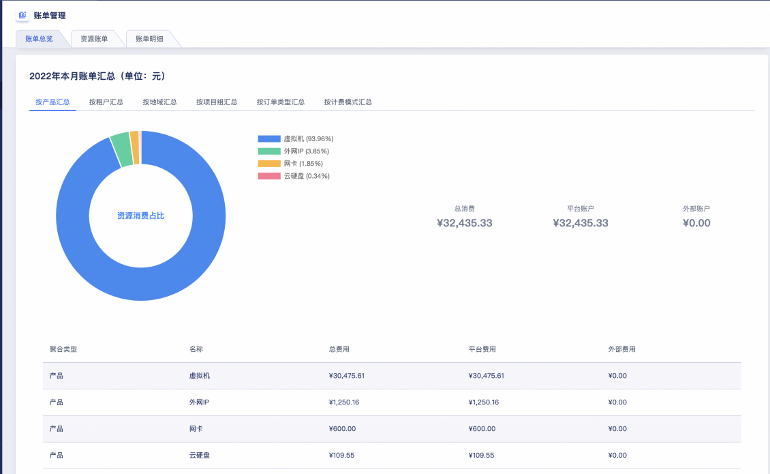

* **按租户汇总**

  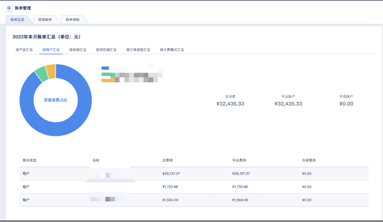

* **按地域汇总**

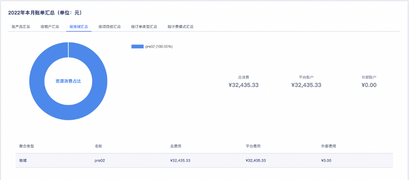

* **按项目租汇总**

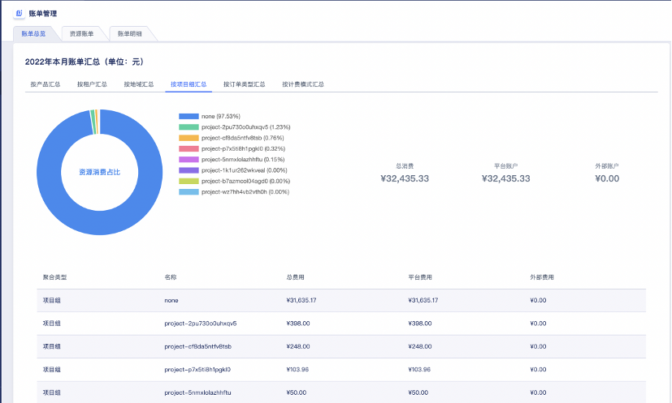

* **按订单类型**

  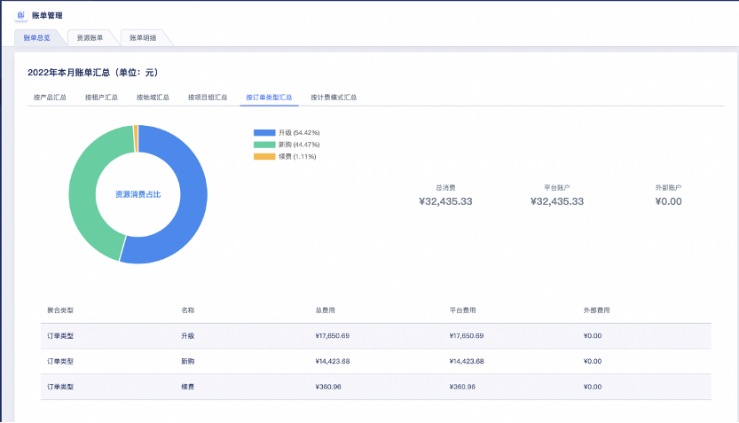

* **按计费模式汇总**

  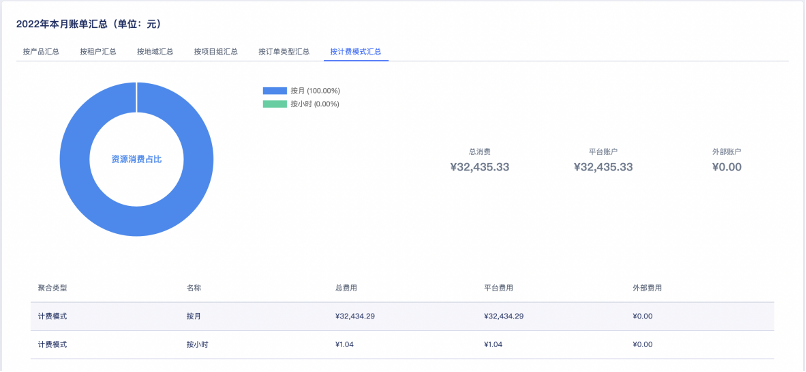

#### 6.16.7.2 资源账单

管理员和租户均可从账单周期/所属产品/计费模式/所属租户/所属地域/所属项目六个维度查看云平台及租户内的资源账单信息。

资源账单信息包括资源ID、地域、租户ID、主账号名称、主账号邮箱、所属产品、所属项目、计费模式、总费用、平台账户、外部账户及交易时间。

* 资源ID：账单的全局唯一标识符

* 地域：资源所在的地域信息

* 租户ID：产生订单的租户信息

* 主账号名称：充值的租户下的主账号名称

* 主账号邮箱：充值的主账号邮箱

* 所属产品：云平台的产品，包括虚拟机、云硬盘、外网IP、VPN网关、负载均衡、NAT网关、网卡、Redis、MySQL、文件存储、对象存储等。

* 所属项目：本次交易资源所绑定的项目

* 计费模式：按小时、月、年的计费模式

* 总费用：本次交易的总费用

* 平台账户：本次交易消费平台账户的金额

* 外部账户：本次交易消费外部账户的金额

* 交易时间：本次交易产生的时间

平台支持管理员和租户从账单周期、所属产品、计费模式、所属租户、所属地域、所属项目六个维度筛选资源账单，并导出到本地Excel文件，方便平台运营管理和报表统计。

#### 6.16.7.3 账单明细

管理员和租户均可从账单周期/所属产品/订单类型/计费模式/所属租户/所属地域/所属项目七个维度查看云平台的账单明细。

账单明细信息包括资源ID、交易单号、交易类型、订单号、订单类型、地域、租户ID、主账号名称、主账号邮箱、所属产品、所属项目、计费模式、总费用、平台账户、外部账户及交易时间。

* 资源ID：账单的全局唯一标识符

* 交易单号：交易记录在云平台的唯一标识

* 交易类型：账户充值和扣费均会生成一次交易记录，因此交易类型包括账户余额充值、免费账户充值及扣费

* 订单号：订单在云平台的唯一标识符

* 订单类型：包括升级和新购两种

* 地域：资源所在的地域信息

* 租户ID：产生订单的租户信息

* 主账号名称：充值的租户下的主账号名称

* 主账号邮箱：充值的主账号邮箱

* 所属产品：云平台的产品

* 所属项目：本次交易资源所绑定的项目

* 计费模式：按小时、月、年的计费模式

* 总费用：本次交易的总费用

* 平台账户：本次交易消费平台账户的金额

* 外部账户：本次交易消费外部账户的金额

* 交易时间：本次交易产生的时间

平台支持管理员和租户从账单周期、所属产品、订单类型、计费模式、所属租户、所属地域、所属项目七个维度筛选账单明细，并支持PDF\WORD\EXCEL等多种格式对账单的自动生成下载或导出到本地，方便平台运营管理和报表统计。

## 6.17 审批流程

### 6.17.1 概述

随着信息化数字转型在政企、教育、金融、制造等行业的实践和应用，企业对资源管理的标准化、流程化管理需求日益旺盛，对于云化资源同样需要设置标准的审批流程，满足平台资源的申请、审批业务的使用流程需求。

针对企业云化资源的管理，云平台为企业管理者提供的自助模式的资源审批服务，用于制定信息系统云化资源的标准使用流程，在租户或子账号需要使用或管理资源时，按照流程中定义的审批人和审批层级完成审批后，由平台自动化交付用户所需业务资源。

平台审批流程由平台管理员进行定义和发布，并由平台管理者设置是否为一个租户设置开通审批流程，支持手动审批和自动审批。

* **手动审批**

租户下主账号和子账号进行虚拟资源操作时需要走申请、审批流程，待审批通过后，平台会自动为用户创建或操作所需资源，并生成一条审批记录用于追溯。

* **自动审批**

租户下主账和子账号进行虚拟资源操作无需人工介入，系统将自动审批通过，并自动生成一条审批记录用于保留相关申请记录和审批记录。

开通资源审批的前提是设置审批流程，用于定义租户申请资源时，需要多少层级的审批，每一层级由谁进行审批，所有层级均通过后才可进行资源的创建和变更操作。为满足企业多种场景的审批业务，平台内置默认审批流程。

默认审批流程提供简单的审批逻辑，仅支持1级审批，当平台管理者为租户开启资源审批流程后，租户及子账号下资源的创建及变更申请统一由【平台管理员】进行审批，即平台管理员审批通过后，平台将自动执行资源的变更操作。

审批流程支持多种资源的变更操作，包括虚拟机、云硬盘、VPC、外网IP及负载均衡、弹性网卡，支持的变更如下：

* 虚拟机：创建虚拟机、修改配置、扩容系统盘、扩容数据盘；

* 云硬盘：创建云硬盘、扩容磁盘；

* VPC网络：创建VPC；

* 外网IP：创建外网IP、调整带宽；

* 负载均衡：创建负载均衡。

* 弹性网卡：调整IP带宽

### 6.17.2 使用流程

**(1)**  **管理员为租户开启审批流程**

管理员通过租户列表为租户开启审批流程，同时可开自动审批。开启后租户在创建虚拟机时即需要发起审批流程，待管理员进行审批后，平台会自动发起虚拟机的创建操作。

**(2)**  **租户申请变更资源**

由租户在租户控制台发起资源变更操作（本文以申请虚拟机为示例）：

* 进入虚拟机控制台，通过【创建虚拟机】进入虚拟机创建引导页面；

* 填写申请名称和申请备注，按照虚拟机的创建要求输入其它必填信息，点击【立即购买】提交申请。

* 提交申请后，页面会自动跳转至【申请管理】页面，并在申请列表中自动新增一条待审批的申请记录。

**(3)**  **管理员审批**

由平台管理员admin账号通过【审批管理】中的待办对租户的申请进行通过或拒绝的审批，完成审批流程。

* 若平台管理员通过申请，则租户的申请状态变更为【处理中】，并会自动执行虚拟机的创建操作，可通过虚拟机列表查看正在创建的虚拟机资源，待资源创建成功后，申请状态变更为【成功】。

* 若平台管理员拒绝申请，则租户的申请状态变更为【已拒绝】，申请的资源变更将不被执行，可联系平台管理员或查看审批备注了解拒绝原因。

审批结束后，管理员可通过审批管理中的已办审批列表查看平台上所有的审批记录及资源详细信息，方便后续针对平台和业务进行审计。

### 6.17.3 开启审批

平台支持管理员创建租户时为租户开启审批流程，同时支持为已创建的租户开启或关闭审批流程，方便平台的管理和运营。

* 平台默认审批流程是由平台管理员对资源申请进行审批，管理员新建租户时，支持为租户开启/关闭审批流程，并支持设置开启/关闭自动审批。

* 开启自动审批后，租户的主/子账号提供资源申请后，将自动进行审批，无需人工干预即可完成资源的审批和创建。

* 平台支持管理员为已创建的租户开启或关闭审批流程，同时支持开启或关闭自动审批

### 6.17.4 审批管理

审批管理为平台管理员提供整个云平台所有的审批流程记录，包括待办和已办两个部分。

* 待办：指租户发起资源变更申请后，需要管理员进行审批的记录。

* 已办：指管理员已经处理过的审批记录，包括通过和拒绝的所有记录。

**(1)**  **查看审批记录**

平台管理可在审批管理列表查看平台所有待办和已办审批记录，已办列表主要展示已由平台管理员审批过的申请记录；待办列表展示尚未被审批的申请记录。

通过待办和已办列表信息，管理员可分别查看需要处理及已处理的审批记录的列表信息，包括申请名称、资源类型、操作、账号邮箱、账号ID、创建时间、审批结果等。

待办列表的操作项中支持管理员对审批记录进行通过和拒绝操作，同时为方便平台运营支持管理员下载审批管理的待办及已办信息为本地Excel文件。

支持管理员查看每条审批记录对应的申请详情，包括申请的基本信息、资源信息、关联资源以及处理记录等。

租户在对资源进行变更并提交申请后，可查看申请记录及申请状态。租户可查看租户下所有已提交的申请记录，包括手工审批和自动审批的所有记录，并可查看申请信息、申请涉及到的资源的信息、申请的处理记录、申请的关联资源。

**(2)**  **通过申请**

租户发起资源变更申请后，管理员审批管理的待办列表中会生成一条审批记录，支持管理员对租户的申请进行通过操作，即同意用户的资源变更申请。审批通过后将自动为申请租户执行资源操作，下发资源或对资源执行变更。

**(3)**  **拒绝申请**

租户发起资源变更申请后，管理员审批管理的待办列表中会生成一条审批记录，支持管理员对租户的申请进行拒绝操作，即拒绝用户的资源变更申请。审批拒绝后申请将直接结束流程，不再执行资源操作。

## 6.18 报表统计

报表统计是平台用于汇总和分析平台内各种资源数据的机制，包括资源用量统计及资源统计表，将各种数据整理成易于理解和分析的形式，提高平台整体运营和管理的效率。

### 6.18.1 资源用量统计

资源用量是云平台聚合全平台资源监控，根据多维度查询和指标分析，展示资源使用情况，支持管理员创建监控报告并导出Excel表格。

支持创建资源用量报告，从资源用量周期、租户信息、项目组信息、资源类型四个维度对控制台资源进行统计。

支持虚拟机、计算集群和存储集群三种资源类型的自定义时间周期资源用量报告，支持范围为 1 小时 ~ 6 个月的用量，可选择1天/3天/7天/14天/30天/自定义，自定义可将开始时间和结束时间精确到小时。

* **计算集群资源用量报表信息**

地域、资源类型、资源ID、资源名称、架构、CPU超分比例、CPU总量、CPU分配量、CPU分配率、内存总量、内存分配量、内存分配率及统计时间。

* **存储集群资源用量报表信息：**

地域、资源类型、资源ID、资源名称、集群架构、总量、已分配量、已分配率、已使用量、已使用率及统计时间。

* **虚拟机资源用量报表信息：**

地域、资源ID、资源名称、资源类型、租户ID、项目组ID、状态、CPU规格、内存规格、GPU规格、CPU平均使用率、CPU最大使用率、内存平均使用率、内存最大使用率、磁盘分区使用情况及统计时间。

当资源类型为虚拟机时，可查看虚拟机CPU使用率分布和虚拟机内存使用率分布，以使用率为横轴，虚拟机数量为纵轴进行统计。

支持资源用量统计的自动创建策略，通过制定保留数量、重复周期、执行时间、资源用量周期。

* 保留数量：需要保留的数量，超出此数量的最旧的将被删除。

* 重复周期支持单次、每天、每周、每月、间隔多种模式，单次执行默认当天执行，若执行时间已过则为次日执行；间隔支持按分种或和小时进行间隔执行。

* 资源用量周期：生成时间范围内的资源用量报告。

支持查看平台所有创建的资源用量报表，并支持管理员删除资源用量报告。方便运营数据的统计，平台支持导出资源用量报告为本地Excel表格文件。

### 6.18.2 资源统计表

资源统计表是呈现平台各类云资源清单的离线Excel表格，用户可以统一收集各云资源的基本信息，用于报表分析和自定义的数据处理。

平台支持虚拟机、云盘、快照、弹性网卡、VPC资源、安全组、外网IP、VIP、NAT网关、VPN网关、负载均衡、Redis、MySQL等信息报表统计。

* 虚拟机资源：名称、资源描述、资源ID、状态、所属租户、宿主机IP、VPC ID、VPC名称、子网ID、子网名称、集群名称、镜像、GPU、CPU、内存、系统盘总量、数据盘总量、CPU使用率、内存使用率、磁盘使用率、IP、计费方式、项目组、项目组名称、标签、高可用标签、创建时间、过期时间。

* 云盘资源：名称、资源描述、资源ID、状态、是否加密、所属区域、所属租户、租户ID、集群架构、集群、挂载主机、硬盘类型、硬盘容量、绑定资源类型、绑定资源ID、计费方式、项目组、项目组名称、标签、创建时间、过期时间、云硬盘读写速率、云硬盘IO吞吐量等。

* 快照资源：名称、资源描述、资源ID、状态、是否加密、所属租户、租户ID、硬盘ID、硬盘类型、项目组ID、项目组名称、标签、快照来源、创建时间。

* 弹性网卡资源：名称、资源描述、资源ID、状态、所属租户、租户ID、网卡类型、IP地址、所属网络、绑定资源类型、绑定资源ID、绑定资源名称、安全组、项目组、项目组名称、标签、创建时间、过期时间、付费方式。

* VPC资源：名称、资源描述、资源ID、状态、所属租户、租户ID、网段、子网数量、VPC网关状态、项目组、项目组名称、标签、创建时间。

* 安全组资源：名称、资源描述、资源ID、状态、所属租户、租户ID、规则数量、绑定资源数量、项目组ID、项目组名称、标签、创建时间。

* 外网IP资源：名称、备注、资源ID、状态、所属租户、租户ID、IP地址/网段、IP版本、带宽、绑定资源ID、路由类型、计费方式、项目组、项目组名称、标签、创建时间、过期时间。

* VIP资源：名称、资源描述、资源ID、状态、租户邮箱、租户ID、关联资源、关联类型、VIP类型、IP地址、所属网络、项目组、项目组名称、标签、计费方式、创建时间、过期时间。

* NAT网关资源：名称、资源描述、资源ID、状态、机型、集群、租户邮箱、租户ID、IP、IP状态、VPC ID、VPC名称、子网、子网名称、安全组、安全组名称、项目组、项目组名称、标签、创建时间、过期时间、计费方式。

* VPN网关资源：名称、资源描述、资源ID、状态、机型、集群、租户邮箱、所属租户、IP、VPC、子网ID、隧道数量、计费方式、项目组、项目组名称、标签、创建时间、过期时间。

* 负责均衡资源：名称、资源描述、资源ID、状态、机型、集群、租户邮箱、租户ID、外网IP、内网IP、VPC ID、VPC名称、子网 ID、子网名称、安全组ID、安全组名称、vServer数量、计费方式、项目组、项目组名称、标签、创建时间、过期时间

* Redis资源：角色、名称、资源描述、资源ID、状态、所属租户、租户ID、机型、IP和端口、VPC ID、VPC名称、子网ID、子网名称、安全组、安全组名称、实例容量、计费方式、项目组ID、项目组名称、标签、创建时间、过期时间。

* MySQL资源：角色、名称、资源描述、资源ID、状态、机型、集群、存储类型、版本、所属租户、租户ID、ID、内存容量、数据盘容量、VPC ID、VPC名称、子网、安全组、安全组名称、计费方式、项目组ID、项目组名称、标签、创建时间、过期时间。

## 6.19 大屏监控

监控大屏是平台为企业提供的云平台资源可视化大屏，主要展示平台宏观维度的监控数据，帮助企业云平台运营者快速了解平台的整体运行情况，支持以图形化的形式查看资源统计信息；可定义每个内容的不同呈现形式，包括柱状图、饼图、仪表盘等。支持自定义拖拽模块及全屏展示，方便管理员进行分屏管理。

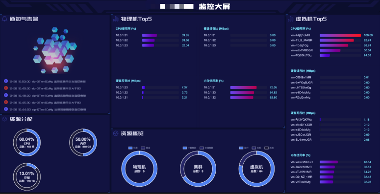

* 通知和告警：展示最近 5 条平台告警信息。

* 物理机 TOP5：展示CPU使用率、硬盘读吞吐、硬盘写吞吐、内存使用率在前 5 名的物理节点 IP 。

* 虚拟机 TOP5：展示CPU使用率、硬盘读吞吐、硬盘写吞吐、内存使用率在前 5 名的虚拟机 ID 。

* 裸金属 TOP5：展示CPU使用率、内存使用率在前 5 名的虚拟机 ID 。

* 资源分配：展示云平台 CPU、内存、存储的总容量以及已分配容量的百分比、资源使用率等历史趋势。

* 资源概览：展示物理机总量以及状态分布（可用、锁定）、计算集群和存储集群的数量分布、网络容量、虚拟机总量以及状态分布（运营、关机、其他）。

## 6.20 API控制台

云平台API控制台，通过界面提供对云平台API的调用和参数的解释说明。按照租户权限展示可以调用的API列表。

租户可以在页面添加请求参数，发送请求对当前账号的线上资源操作，请求发送成功后会在请求信息中展示当前请求状态，请求内容，以及响应结果，在API文档中展示响应文档，展示响应值的参数、类型及对应描述。

租户可按照产品模块查看对应产品子模块的API列表及API接口相关信息,支持按照API名称和描述进行模糊搜索。

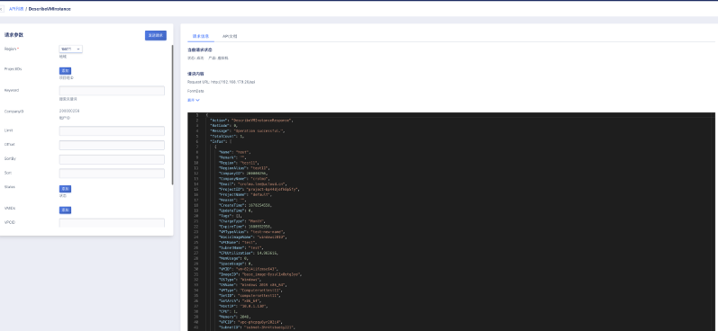

支持在API控制台直接发送请求，添加请求参数后点击发送请求，返回请求信息，包含当前请求状态、请求内容、响应信息。

API控制台根据调用和参数规则，支持与第三方平台的对接，包括但不限于其他云安全管理平台、算控制器等。

## 6.21 统一运营管理

### 6.21.1 产品上线

云产品可以通过运维运营管理平台统一上线，支持图形化的配置，在新产品上线时，提供小时级配置生效能力。上线后的产品和规格支持增删改查和批量导入导出能力，实现模板化的部署。

### 6.21.2 工单管理

在运维运营管理平台中可通过此功能创建工单，在导航栏中点击【工单管理】进入工单模块，或通过导航栏中进行提交和查看工单操作。

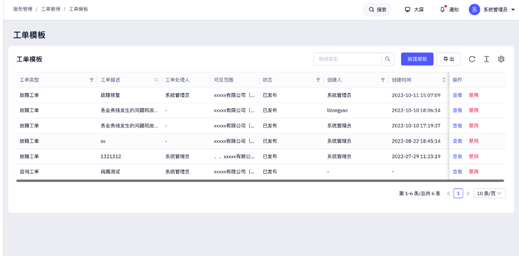

在工单处理时可选择，已创建的“用户”或者“角色”。填写完基本信息后，点击表单设计，对表单内容进行设计。可在左侧基础控件中将需要的控件拖拽至右侧。并可控件属性进行设置。完成所有编辑后点击发布。

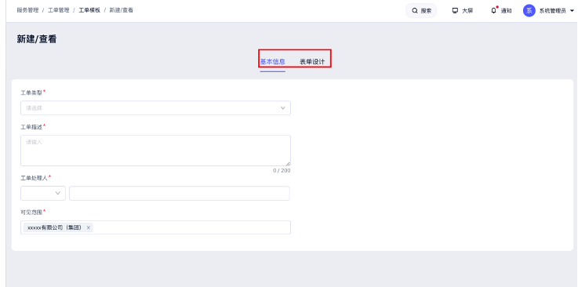

满足通过自定义工单模块，实现日常业务的流转办理；支持管理人员分级分权的工单管理，普通业务管理员仅能查看处理流转给自己的工单，超级管理员可以对所有工单进行增删改查操作。

配置同厂家远程运维服务平台，平台支持SOS一键提单，云端自动生成工单；支持自动生成分享码，允许授权工程师登录平台处理问题，可设置授权服务时长，并对调试过程的云端录像审计功能。

### 6.21.3 库存管理

运维运营管理平台提供数据中心库存管理能力，支持配置数据中心机房节点的产品库存；库存数值设置可以精细到产品规格粒度；使用用户在订单开通资源时，会受到库存限制，无法超出剩余库存下单。

### 6.21.4 查询设置

运维运营管理控制台可查看可售卖项价格设置，满足基于产品分类（计算、存储、网络、大数据、安全、数据库）、产品（云主机、裸金属服务器、云硬盘、对象存储、文件存储、云数据库）、产品组件、节点、计费单位（年、月、日、小时、按次）、规格编码、状态（未上架、已上架、已下架）等信息进行筛选查询；可以针对可售卖项价格进行增删查改操作。

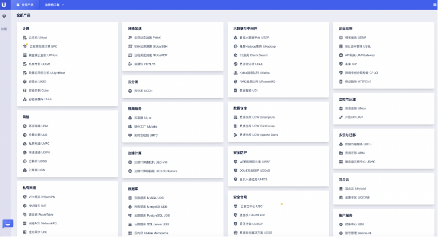

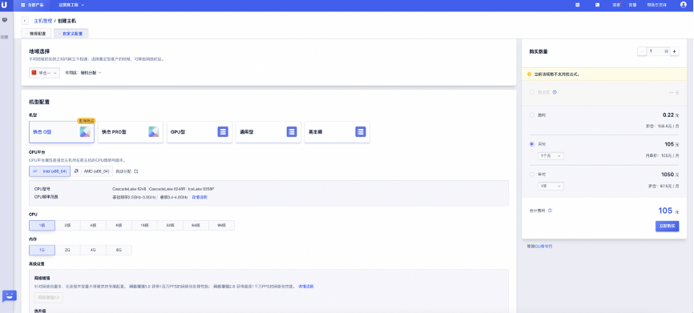

### 6.21.5 地址管理

云平台支持IP地址管理能力，可将IP地址按照网络设备互联IP、设备管理IP地址、loopback 地址的收集、终端IP地址等类别进行分类管理。
