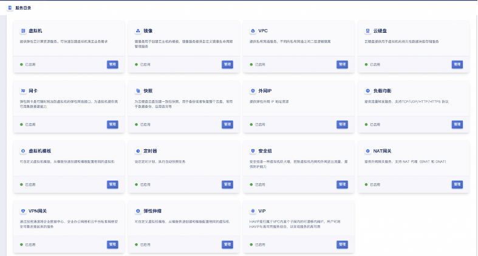

# 7 云平台管理

## 7.1 客制化能力

云平台为客户提供平台客制化能力，支持管理员自定义云平台UI展示样式，包括网站基本设置、监控大屏及登录页设置，如修改平台logo图片、登录页图片及标题等。

### 7.1.1 定义网站展示

网站设置是平台为企业和管理员提供的客制化能力，包括网站Favicon图片、网站Title、云平台Logo图片，即自定义云平台的Logo及浏览器标志等。同时支持设置是否展示帮助文档、收藏夹、默认语言及默认币种等配置。

* **网站Favicon图片**：浏览器标签页上展示的Favicon图片，必须为ico格式，最大不超过100KB，推荐尺寸48px*48px。

* **网站Title**：浏览器标签页上展示的网站说明，如中立安全可信赖的云计算服务商，支持中英文及特殊字符。

* **云平台Logo图片**：租户和管理员控制台导航栏上方的logo，允许管理员自定义，图片支持png、jpeg、jpg格式，最大不超过200KB，推荐尺寸352px*72px。

* **帮助文档**：允许管理员开启或关闭控制台上的帮助文档的展示。

* **收藏夹**：允许管理员开启或关闭控制上的收藏夹功能。

* **默认语言**：允许管理员开启或半闭英文控制台。

* **默认币种**：允许管理员修改默认币种，如CNY或USD。

### 7.1.2 定义监控大屏

云平台提供监控大屏默认为出厂设置，允许平台管理员自定义监控大屏的标题，同时支持管理员配置是否在监控大屏展示裸金属的监控信息。

### 7.1.3 定义登录页

登录页设置是平台为企业和管理员提供的登录客制化能力，包括登录页标题、登录页标题颜色、背景图、登录页面Logo、登录页联系电话、登录页输入框位置、登录页面版权、登录页描述信息、登录面输入框背景透明、OAuth登录开关及OAuth认证配置信息等。

* **登录页标题**：代表登录框上的标题描述，如私有云，可支持中英文及特殊字符。

* **登录页标题颜色**：代表登录框上标题的颜色，支持白色、黑色、红色、黄色、绿色、青色、蓝色、棕色、紫色、橙色、灰色及金色，以适应不同背景图片上文字的可读性。

* **背景图**：代表登录框后的背景图片，图片支持png、jpeg、jpg格式，最大不超过500KB。

* **登录页面Logo**：图片支持png、jpeg、jpg格式，最大不超过200KB，推荐尺寸352px*72px

* **登录页联系电话**：登录页的联系电话。

* **登录页输入框位置**：支持居中、居左和居右。

* **登录页面版权**：支持自定义登录页面的版本说明信息。

* **登录页描述信息**：登录面的描述信息，登录页账户输入区域位置设置为居中时不展示该信息。

* **登录面输入框背景透明**：可设置输入框为透明色，如不透明，背景色为白色。

* **OAuth认证**：支持OAuth 第三方统一登录，支持开启和关闭。开启时可进行OAuth服务端认证配置。

​	- **认证服务器地址**：OAuth服务提供商的认证服务器地址，用于向用户发出认证请求并授权给客户端

​	- **客户端****ID**：由OAuth服务提供商分配给客户端的唯一标识符，用于标识该客户端

​	-**请求响应类型**：OAuth认证流程中请求的响应类型，通常为code，表示请求授权码

	- **验证信息**：用于保护授权过程中的跨站请求伪造攻击（CSRF）攻击。该值将随着授权请求一起发送到OAuth服务提供商，然后在授权过程结束时返回客户端，以便客户端验证该值与请求时是否匹配。

## 7.2 平台系统配置

### 7.2.1 邮箱配置

邮箱设置是指平台邮件服务的配置，主要功能是找回密码、监控告警邮件的接收和发送。平台支持管理员定义邮箱的是否支持SSL、发件人邮箱地址、发件人邮箱密码、邮件服务器IP、邮箱服务器Port及邮件主题前缀。

* 邮箱支持SSL：配置邮箱是否支持SSL。

* 发件人邮箱地址:配置发件人的邮箱地址。

* 发件人邮箱密码：配置发件人邮箱密码

* 邮箱服务器地址:设置发件邮箱的IP地址

* 邮箱服务器端口：设置发件邮箱的端口，默认值为994，范围支持0-65535。

* 邮箱主题前缀：配置平台发送的提醒邮件的主题前缀，如私有云、政务云等。

**平台部署时默认必须提供邮箱设置，避免无法接收找回密码及监控告警邮件**。邮箱配置完成后，支持用户对邮箱是否配置正确进行测试。

### 7.2.2 磁盘设置

#### 7.2.2.1 全局磁盘QoS

硬盘管理支持管理员对平台全局云硬盘开启或关闭QoS控制，以保证平台所有租户云盘资源的性能可靠性。

1、平台默认全局开启磁盘QoS，即代表平台全局硬盘QoS生效，包括新建硬盘和已有硬盘的QoS。

* 硬盘默认创建出来会根据平台计算公式赋予QoS值。

* 已有硬盘的QoS根据已赋予的默认值或管理员修改的值生效。

* 配置为开启时，管理员为每个硬盘自定义的QoS才可生效。

2、配置为关闭时，平台全局硬盘QoS失效，包括新建硬盘和已有硬盘的QoS。

* 新创建的硬盘QoS不受限制。

* 已有硬盘的QoS不受限制。

* 配置为关闭时，管理员为每个硬盘自定义的QoS不会生效。

3、硬盘扩容容量后，会根据计算公式重新计算新容量的QoS值，根据计算的QoS值重新设置硬盘的QoS。

* 若硬盘扩容前设置的QoS值<新容量QoS值，则以新容量QoS值为准。

* 若硬盘扩容前设置的QoS值>新容量QoS值，则以扩容前设置值为准。

#### 7.2.2.2 全局磁盘设置

平台针对磁盘支持配置共享盘绑定虚拟机数量，并支持自定义每个云硬盘可创建的快照数量。

* **共享盘绑定虚拟机数量：**支持限制共享云硬盘和共享外置存储盘可同时绑定的虚拟机数量，范围为2~30个。

* **单个硬盘快照数量：**设置单个硬盘创建快照的数量上限，默认为10个，支持的范围为0~200个，0代表单个硬盘创建快照的数量不受限制，管理员可根据平台实际使用情况调整上限数值。

### 7.2.3 网络设置

网络设置支持管理员对平台的VPC网段和内网带宽进行配置。

* VPC网段设置：支持管理员为平台租户设置VPC可使用的CIDR网络，支持配置多段VPC网段。如10.0.0.0/16,172.16.0.0/16,192.168.0.0/16。

* 内网带宽是指平台VPC网络内网带宽的QoS，支持带宽QoS范围为0~8192Mbps。

### 7.2.4 计费配置

**(1)**  **平台计费功能**

支持开启和关闭平台的计费功能，若关闭平台计费功能，平台所有资源的购买费用均为零，但系统依然会有交易和扣费记录产生。如无特殊情况，请勿关闭自动续费功能，防止资源过期。

**(2)**  **自动续费开关**

管理员为平台设置【资源是否自动续费】，默认值为是，即租户在账户余额充足时，将自动对租户下已有的计费资源进行续费。

若管理员关闭资源自动续费时，将不再对租户下资源进行自动续费，资源到期后会即变更为已过期状态，7天内不进行续费将会自动进行删除或进入回收站。

### 7.2.5 回收策略

云平台支持管理员对全局资源开启或关闭删除能力，若开启则允许平台所有租户删除资源。若关闭资源删除能力，平台所有租户无法删除资源。

为保证资源的保留期和安全性，平台在资源删除时提供回收站能力，允许平台管理员自定义回收站策略，如资源是否自动销毁、自动销毁周期及过期资源是否自动删除进入回收站等。

* **回收站资源是否自动销毁**

设置资源进入回收站后，是否在固定周期后销毁，默认为开启状态；如果实际使用中，无需自动销毁进入回收站的资源，可关闭此配置。

* **回收站资源自动销毁周期**

资源删除进入回收站后自动删除的周期，仅当开启回收站资源自动销毁时有效，默认值为360000秒，支持的范围为1~360000秒。

* **过期资源是否自动删除进回收站**

开启后，虚拟机、云硬盘、外网IP等资源过期7天后会自动进入回收站。进入回收站时，虚拟机关联的资源将会被解绑。若平台的过期资源无需删除，则会自动变更为已过期状态，待7天后自动进行删除。

## 7.3 平台数据备份

平台数据备份服务是针对平台自身的数据库及配置文件进行备份，保证平台本身的数据安全性。支持平台数据库和配置文件备份。

* **平台数据库备份：**平台部署后会自动生成一条自动备份策略。备份文件存放地址：/data/backups/taishancms-xxx.gz，默认每天备份一次。

* **平台配置文件备份**：平台部署后会自动生成一条自动备份策略，备份文件存放地址：/data/backups/configs-xxx.tar.gz，默认每天备份一次。

默认定时策略为每小时备份一次，过期时间为10天。支持管理员修改定时策略，并支持平台管理员查看自动策略的每次执行记录。

自定义策略支持过期时间和重复周期配置，其中过期时间支持1~99999天，重复周期支持单次、每天、每周、每月及间隔等策略。

## 7.4 服务目录

服务目录是为云平台管理员提供一个统一的云服务管理入口，可快速查看和管理平台整体云服务的开通和授权情况，包括基础服务和高级服务两类。

**基础服务：**平台基础服务目录，包括虚拟机、镜像、VPC、云硬盘、网卡、快照、外网IP、负载均衡、资源模版、安全组、NAT网关、VPN网关、弹性伸缩、VIP、监控告警、组播、隔离组、运维。

**高级服务**：平台高级组件服务目录，包括应用商店、Redis、MySQL、对象存储、文件存储、备份服务、API控制台、外置存储、裸金属及USB透传。

已授权的服务为平台已经通过License开通授权的服务，未授权服务为平台暂未授权的服务。针对已授权的服务，平台支持管理员关闭和开启服务，并支持管理员为服务添加或移除租户，满足平台租户服务运营需求。

**(1)**  **关闭服务**

平台支持将已授权的服务整体关闭，服务关闭后，平台所有用户无法再使用此服务。

若有租户在服务下已存在资源，则无法关闭服务，关闭前需确保所有租户下此服务资源已被清空。

 **注**：关闭服务功能使用场景较少，仅当云平台需要整体下线一项云服务时进行操作。

**(2)**  **开启服务**

平台支持将已关闭的服务进行整体开启，服务开启后，平台已开添加至服务的用户可正常使用该服务。

**(3)**  **为服务移除租户**

平台支持为一个服务移除租户，满足平台运营中需要指定某项或者某几项云服务开放给部分租户的使用场景。

当租户被移除后，租户下的所有账号将无法使用此服务，登录后将直接提示服务处于未授权状态。 

**(4)**  **为服务添加租户**

平台支持为一个服务添加租户，已被移除服务授权的租户，可以通过添加租户的方式重新进行授权。为服务添加租户后，租户下的所有账号均可正常使用此云服务。

## 7.5 自定义规格

规格配置是平台为企业和管理员提供的自定义规格能力，管理人员可通过自定义规格配置调整云平台上架云产品服务的规格类型，包括虚拟机、硬盘、外网 IP 等。

* 虚拟机支持定义 CPU 和内存规格；

* 硬盘支持定义租户可创建云盘的容量范围；

* 外网 IP 支持定义租户可申请外网 IP 的带宽范围。

平台针对虚拟机、硬盘、外网 IP 会默认提供建议型的规格，管理员可根据企业需求对规格进行变更，包括查看、删除、修改等。

**(1)**  **创建规格**

平台支持创建虚拟机CPU/内存的规格，云硬盘和外网IP的规格由平台默认生成，仅支持修改。

创建虚拟机规格支持根据不同的集群创建不同的规格，即可为不同的集群创建不同的规格，租户创建虚拟机选择不同集群时，即可创建不同规格的虚拟机，适应不同集群硬件配置不一致的应用场景。可分别定义CPU和内存：

* CPU规格支持（C）：除1以外，以2的倍数进行增加，如1C、2C、4C、6C，最大值可为240C。

* 内存规格支持（G）：除1以外，以2的倍数进行增加，如1G、2G、4G、6G，最大值可为1024G。

**(2)**  **修改规格**

创建出的规格即可被所有租户看到并使用，可根据业务需求在不同的集群中创建不同的规格，同时支持管理员对已创建和默认生成的规格值进行修改。

* 虚拟机产品规格支持修改CPU和内存值，其中CPU可指定1、2、4、8、16、24、32、64；内存可过年费定1、2、4、8、16、24、32、64、128，可根据业务需要自定义组合CPU和内存规格。

* 硬盘产品规格支持修改容量范围的最小容量和最大容量，其中最小容量和最大容量可设置的范围为10GB到8000G，即平台允许租户创建的云硬盘最小为10GB，最大支持可到32TB ，可根据业务需要调整最小值和最大值。

* 外网IP规格支持修改带宽范围的最小带宽和最大带宽，其中最小带宽和最大带宽可设置的范围为1Mb到10000Mb，即平台允许租户申请的外网IP最小为1Mb最到为10000Mb，可根据业务需要调整最小值和最大值。（注：每个虚拟机默认生成 2 块虚拟网卡且最多绑定6张弹性网卡）

**(3)**  **删除规格**

支持管理员删除指定自定义虚拟机规格，不支持删除硬盘和外网IP的规格。规格删除后平台租户即不可在所属集群中创建当前规格的虚拟机，但不影响通过该规格创建资源的正常运行。

虚拟机规格在每个集群内会生成一条无法删除的默认规格，以避免平台上所有规格均被删除，导致无法创建虚拟机。

## 7.6 配额管理

配额（quota）是一个租户（包含子账号）针对每种虚拟资源在一个地域下可创建的数量或容量限制。通过限制每个租户拥有的资源配额，可有效共享并合理分配云平台物理资源，提升资源利用率的同时，满足云平台上每一个账户的资源需求。

**配额管理生效的前提是全局配置中【是否开启配额管理】的配置项为是，否则配额管理的配置值则不生效。**

云平台全局提供每种资源在每个数据中心的默认配额，即每个租户创建时默认提供的资源配额模板。平台管理员可通过租户管理中的配额管理自定义每个租户的资源配额。租户主账号及所拥有的子账号不可自定义修改资源配额数量，仅提供查看配额。

子账号和主账号共享租户的资源配额，即每种资源配额为主账号和所包含的所有子账号可创建的资源数量或容量之和。如租户对于云硬盘的配额为10，则租户的主账号及所有子账号可创建的云硬盘数量上限不可超过10个。

对于虚拟机、云硬盘、外网IP删除或未续费进入回收站的资源，不占租户资源配置，恢复资源时会检查资源配额。

管理员可根据平台实际使用情况调整默认配额，调整后及时生效，平台所有已有租户的配额将按照新的配额标准执行，新创建的租户也会按照新的配额标准设置配额限制。

目前配额限制主要包括虚拟机、虚拟机模版、镜像、VPC数量、VPC子网、云硬盘、网卡、外网IP、安全组、负载均衡、负载均衡SSL证书、VPN网关、NAT网关数量、文件存储等。支持管理员查看平台全局配额配置，同时支持管理员对配额项进行修改操作。

平台支持为单个租户调整配额，修改全局配额设置不影响为租户自定义的配额设置。全局配额后修改后，若租户已有的产品数量超过设置值，不影响租户已有的资源运行；若租户将资源删除后，则无法再创建超过配额值的资源。

## 7.7 一键巡检

键巡检，是平台提供的用来检查云平台健康情况的特性能力。通过对平台管理节点、计算节点、存储节点及平台自身的服务进行巡检扫描，检查平台节点CPU、内存、磁盘等资源的使用情况，使管理员更方便地对问题进行评估。

巡检主要是对平台进行全面扫描，包括管理节点的时间源同步检查、CPU使用率、内存使用率检查、磁盘使用率检查；计算节点的物理机CPU平均使用率检查、物理机内存使用率检查、物理机系统盘已用容量检查等，一键巡检内容如下：

| 巡检类型 | 巡检项                   | 巡检项含义                             | 结果展示                                                     | 巡检建议                                                     |
| :------- | ------------------------ | -------------------------------------- | :----------------------------------------------------------- | ------------------------------------------------------------ |
| 管理节点 | 时间源一致性检查         | 检查是否设置时间源同步                 | 提供节点当前时间源，和推荐时间源                             | 若检测到时间源与集群内其他节点时间源不一致或物理机系统时钟未与时间源同步，请SSH登录对应系统，检查时间源配置 |
|          | CPU使用率检查            | 检查云平台管理节点CPU的使用占比        | 提供当前占比，若超过80%，提供最高使用率的五个进程            | 若检测到云平台CPU使用率在10分钟内持续的超过80%的使用率，请尽快联系平台相关人员进行热升级或问题评估，以继续正常使用本平台功能 |
|          | 内存使用率检查           | 检查云平台管理节点内存的使用占比       | 提供当前占比，若超过80%，提供最高使用率的五个进程            | 若检测到云平台内存使用率在10分钟内持续的超过80%的使用率，请尽快联系平台相关人员进行热升级或问题评估，以继续正常使用本平台功能 |
|          | 磁盘容量检查             | 检查云平台管理节点磁盘的使用占比       | 提供当前占比，若超过70%，提供占比最高的十个文件路径和文件大小 | 若检测到云平台磁盘数据容量已占用管理节点所在磁盘超过70%的容量，请尽快联系平台相关人员进行磁盘检查和扩容，以继续正常使用本平台功能 |
|          | 管理服务检查             | 检查云平台管理服务的运行情况           | 提供当前服务名称及状态，若服务异常，提供异常的节点IP         | 若检测到服务状态异常，请根据提供的节点信息，SSH登录对应系统，检查服务的状态 |
| 计算节点 | 物理机CPU平均使用率检查  | 检查云平台上物理机CPU平均使用率        | 提供当前占比，若超过80%，提供最高使用率的五个进程            | 若检测到物理机CPU平均使用率超过70%，请登录物理机系统，确认物理机上是否存在异常进程。若未存在异常进程，建议考虑对集群进行扩容 |
|          | 物理机内存使用率检查     | 检查云平台上物理机内存平均使用率       | 提供当前占比，若超过80%，提供最高使用率的五个进程            | 若检测到物理机内存使用率超过80%甚至90%，请立即登录物理机系统，检查物理机上是否存在业务异常，并按需优化运行业务。必要时，建议对集群进行扩容 |
|          | 物理机系统盘已用容量检查 | 检查云平台上物理机系统盘使用率和使用量 | 提供当前占比，若超过70%，提供占比最高的十个文件路径和文件大小 | 若检测到物理机系统盘容量使用率超过70%甚至90%，请立即登录至物理机系统，检查并清理对业务无影响的数据 |

支持用户下载巡检报告，通过浏览器将巡检报告下载到本地。通过巡检报告可查看详细的报告内容，如地域、节点、名称、巡检项、巡检结果、现状、分数、建议以及最高使用率。

当巡检结果异常时，展示当前设备参数现状及针对性的建议，并展示导致结果异常的主要文件名称及大小，使管理人员及时了解物理机状态并介入处理。同时针对已完成巡检任务的巡检报告，平台支持管理员删除巡检报告。

## 7.8 统一授权

统一授权支持客户按需对基础服务模块和增值服务模块分开授权，支持用户按照x86/arm架构区分授权节点，根据业务需求选择各模块授权的生效时间和失效时间，平台通过授权证书激活保证了密钥不可克隆验证的唯一性。

平台为用户提供完整的授权管理能力，包括授权管理和节点管理两大模块。

### 7.8.1 授权管理

管理员可通过【信息采集】下载当前平台硬件及服务授权需求信息，并将信息发送给平台运营平台，运营平台确定用户需求生生授权证书，并由平台管理员将证书上传至支平台。

通过授权管理用户可查看平台基础许可、拓展许可和服务许可，并可详细了解产品授权的状态、生效时间、失效时间和数量限制等信息。

* **基础许可**：支持云计算基础设施管理系统套件-标准版、云计算基础设施管理系统套件-信创版和分布式块存储套件的授权；

* **拓展许可**：支持云套件功能拓展、高级网络扩展、裸金属服务、USB透传服务、GPU服务、弹性伸缩服务、商用存储服务、文件存储服务、对象存储服务、MySQL 5.7服务、Redis 4.0服务和异构平台迁移软件服务的授权。

* **服务许可**：支持云计算基础实施管理系统+增值服务5*8维保服务、云计算基础实施管理系统+增值服务7*24维保服务和金牌VIP维保服务。

### 7.8.2 节点管理

用户可通过节点管理查看平台所有节点授权状态及节点信息情况等。如节点IP地址、序列号、角色、授权状态、CPU型号、CPU总量、内存总量和架构等。

同时用户可通过节点管理查看授权节点的基本信息、CPU信息和Memory信息。

## 7.9 平台管理能力

### 7.9.1 统一云服务能力

平台为用户提供自助式的服务界面，用户能够通过自助服务门户完成对云资源申请、使用、修改、销毁等操作。同时能够为用户提供云主机、云硬盘、私有网络VPC、云防火墙、云负载均衡等服务能力。

### 7.9.2 多资源管理能力

多资源管理能力是指对计算资源池、存储资源池、网络资源池的管理。可实现在云平台中对计算资源池、存储资源池、网络资源池（包括私有网络和浮动IP）进行分类管理；可查看资源池相关信息，以及对资源池的可用容量进行监控。

### 7.9.3 软SDN服务能力

云管理平台提供软SDN服务，实现与底层硬件设备解绑。能通过SDN控制器实现对VPC网络的自动化配置，实现虚拟专有云、弹性公网IP、虚拟防火墙、虚拟负载均衡等网络服务的增加、删除、修改和查询，以确保开放性。

### 7.9.4 统一设备管理能力

云管理平台支持统一设备管理，提供统一设备管理能力，统一管理包括数据中心存储、服务器、网络设备（路由器、交换机）等。
