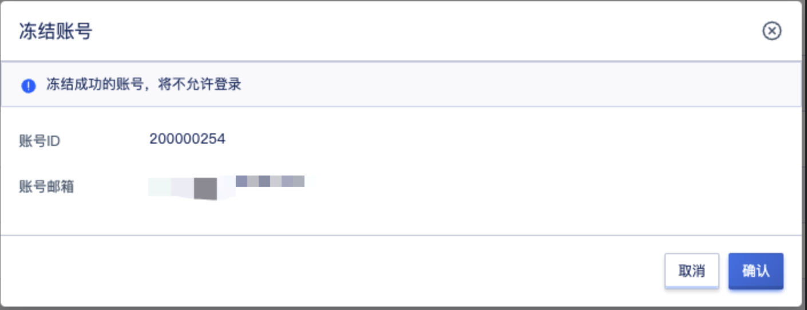
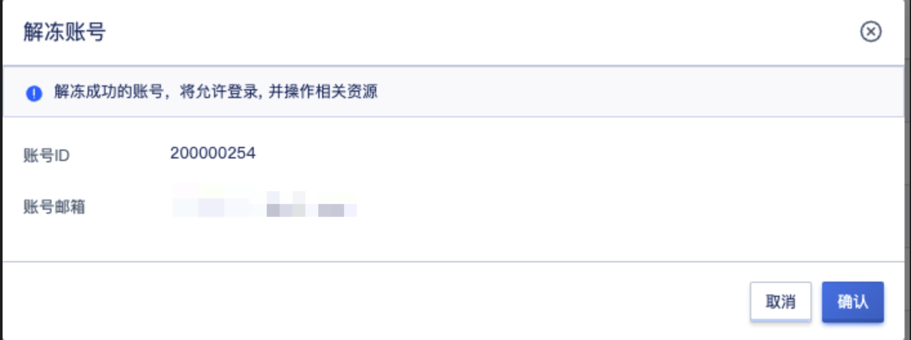
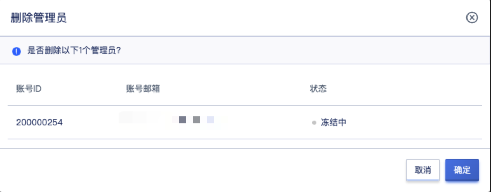

# 15 管理员

## 15.1 概述

管理员用于全局管理和运营整个云平台，可通过管理员账号管理云平台的地域、集群、租户、管理员、资源、计费、审批、安全及平台全局配置。

对用户来说，系统分为管理员和租户，系统管理员和地域管理员都属于管理员，管理员角色体系内容如下：

| 角色等级 | 默认           | 数据范围  | 功能范围                                                                                                                                                                            |
|----------|--------------|---------|---------------------------------------------------------------------------------------------------------------------------------------------------------------------------------|
| 系统级   | 系统管理员     | 系统+地域 | 地域管理、集群管理、物理资源管理、云资源管理、网络服务管理、容器服务管理、账号和组织管理、运营与管理、运维与管理、监控大屏、自定义UI管理、全局配置管理、服务目录管理、充值管理、订单管理、交易管理 |
|          | 系统只读管理员 | 系统+地域 | 地域查看、集群查看、物理资源查看、云资源查看、网络服务查看、容器服务查看、账号和组织查看、运营与查看、运维与查看、监控大屏、自定义UI查看、全局配置查看、服务目录查看、充值查看、订单查看、交易查看 |
| 地域级   | 地域管理员     | 地域      | 地域管理、集群管理、物理资源管理、云资源管理、网络服务管理、容器服务管理、账号和组织管理-我的账号、运营与管理、运维与管理、监控大屏、全局配置-产品策略管理、服务目录管理、订单管理、交易管理     |
|          | 地域只读管理员 | 地域      | 地域查看、集群查看、物理资源查看、云资源查看、网络服务查看、容器服务查看、账号和组织管理-我的账号查看、运营查看、运维查看、监控大屏、全局配置-产品策略查看、服务目录查看、订单查看、交易查看     |

## 15.2 创建管理员

系统管理员可创建系统管理员和地域管理员，地域管理员不可创建管理员，创建管理员时需要添加一个账号邮箱作为管理员的账户。可同步设置账号首次登陆强制修改密码，同时支持对账户进行管理设置管理类别、是否只读及开通地域。

## 15.2.1 创建系统管理员

* 账号名称：账号的名称标识
* 账号邮箱：账号的邮箱
* 账号密码：账号的登录密码
* 确认密码：再次确认账号的密码
* 首次登录强制修改密码：设置第一次登录时是否强制修改账号密码
* 管理类别：账号的管理类型，可选地域管理员、系统管理员
* 是否只读权限：账号权限是否只读

## 15.2.2 创建地域管理员

* 账号名称：账号的名称标识
* 账号邮箱：账号的邮箱
* 账号密码：账号的登录密码
* 确认密码：再次确认账号的密码
* 首次登录强制修改密码：设置第一次登录时是否强制修改账号密码
* 管理类别：账号的管理类型，可选地域管理员、系统管理员
* 是否只读权限：账号权限是否只读
* 开通地域：开通权限的地域

## 15.3 查看管理员列表

系统管理员可查看平台所有管理员的列表，并对管理员进行管理操作。

* 账号ID：账号的ID
* 账号邮箱：账号的邮箱地址
* 状态：账号的状态，包括使用中、冻结中
* 管理类别：账号的类别，包括系统管理员、地域管理员
* 权限：账号的管理权限，包括管理、只读
* 创建时间：账号的创建时间
* 操作：账号的操作项

## 15.4 冻结管理员

冻结管理员是指将一个管理员进行锁定，被成功冻结的管理员将无法登录云平台行。仅支持状态为【使用中】的管理员进行冻结操作，具有管理权限的系统管理员可通过管理员列表的冻结按钮进入冻结管理员的向导页面，如下图所示：

账号冻结后需进行解冻操作，才可正常使用。

## 15.5 解冻管理员

当管理员被冻结后，管理员的状态为冻结中，支持具有管理权限的系统管理员解冻管理员，如下图所示：

管理员解冻后，可正常登录控制台。

## 15.6 地域授权管理

通过地域授权管理可管理一个地域管理员在地域下的授权情况。只有在授权地域下，地域管理员才可在该地域正常使用服务。企业可以根据云平台实际运营情况管理系统管理员在对应地域的开通情况。

## 15.7 修改密码

支持具有管理权限的系统管理员修改管理员账号密码，以适应管理员账号忘记密码的场景。具有只读权限的系统管理员只可修改自己账号的密码。

## 15.8 删除管理员

支持具有管理权限的系统管理员删除管理员账号，管理员账号被删除后，无法再登录平台。

