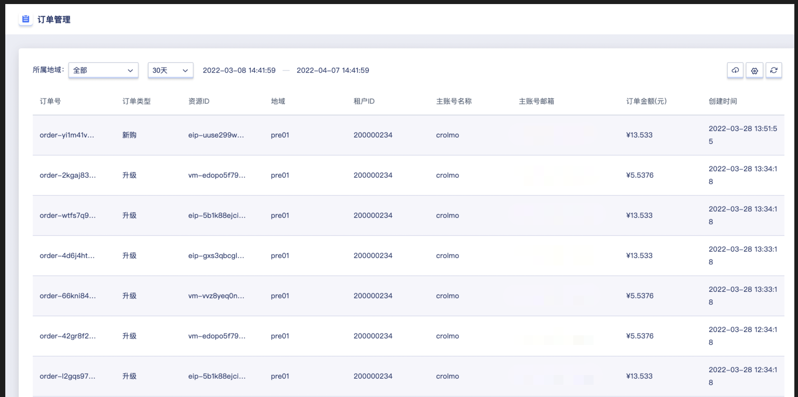
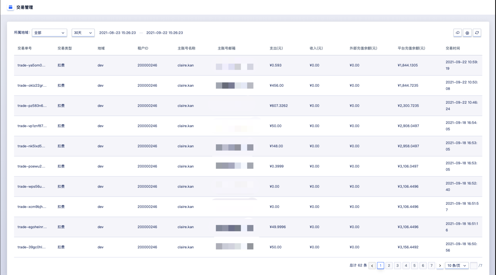
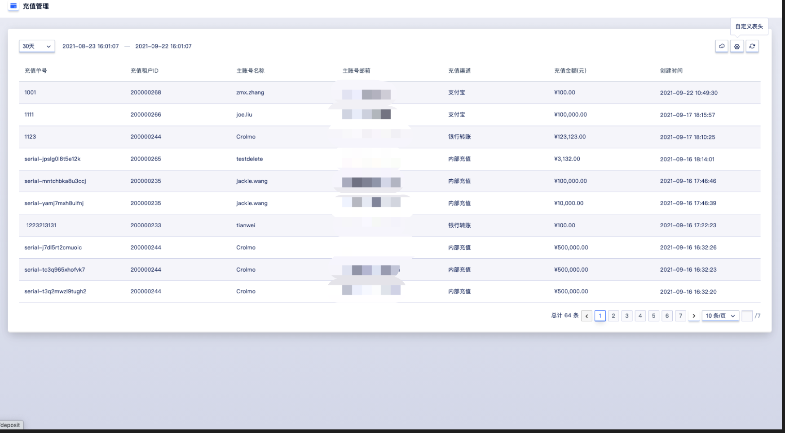
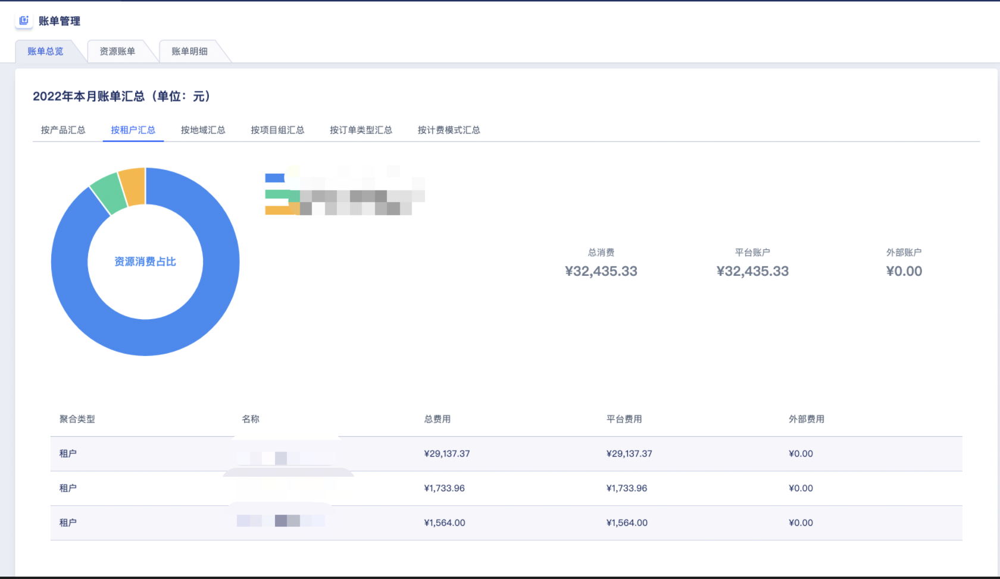
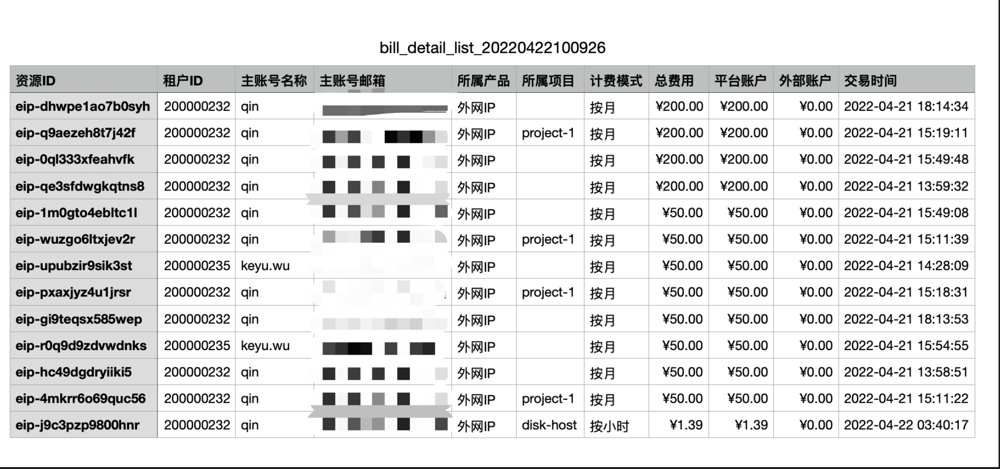

# 9 财务管理

## 9.1 概述

计费管理为用户资源分配和使用提供计量计费服务，需计费的资源均支持按时、按月、按年三种计费方式，支持资源的计费、扣费、续费及过期回收等订单管理操作，同时基于账户提供充值、扣费等交易管理。子账号共享主账号的账户余额，通过子账号创建的资源可直接通过共享余额进行扣费，并可通过主账号或子账号查看账户的交易流水及订单明细。

平台资源计费均为预付费模式，即无论按时、按年、按月付费，在资源创建时都需保证账户余额可满足一个计费周期的扣费，下一个计费周期开始前即进行扣费。

- 按时计费：一小时为一个计费周期，资源按照每小时的单价进行预扣费；
- 按月计费：一个月（非自然月）为一个计费周期，资源按照每个月的单价进行预扣费；
- 按年计费：一年（顺延年）为一个计费周期，资源按照每年的单价进行预扣费；

> 按年按月购买的资源支持随时升降级配置并在升级配置后自动补齐差价。

账户余额不足下一个计费周期时，资源即会自动进入回收站，需要对资源账号及资源进行续费操作后，才可恢复使用；对于删除不进入回收站的资源，账户余额不足下一个计费周期时，资源会自动进入已过期状态，并在 7 天后自行进行删除。

云平台管理员在全局开启"**资源自动续费**"且**账户余额充足时**，则资源在下一个计费周期会进行自动续费操作；若云平台管理员在全局关闭"**资源自动续费**"且**账户余额充足时**，则资源在下一个计费周期会自动进入回收站，需在回收站对资源进行续费操作，并恢复资源。

资源在创建时，所有计费资源的计费计价均会通过资源计价器按照计费方式进行展示，用于确认订单的费用。当账户余额不足时，可通过云平台管理员进行充值。

平台为管理员提供完整的财务管理能力，包括订单管理、交易管理、充值管理、价格配置四大模块。

- 订单管理：查看平台发生的所有订单记录，或者自定义查询时间段对订单记录进行查询。

- 交易管理：查看平台所有交易的扣费记录，或者自定义查询时间段对交易的扣费记录进行查询。

- 充值管理：查看平台所有的充值记录，或者自定义查询时间段对充值记录进行搜索。

- 价格配置：对平台售卖的云服务按照预定义的维度进行定价和定价修改。

## 9.2 订单管理

租户可在订单管理页面，可通过自定义所属地域和查询时间查看云平台在一定时间周期内产生的订单，如下图所示：

- 订单号：订单在云平台的唯一标识符。
- 订单类型：包括升级和新购两种。
- 地域：资源所在的地域信息。
- 租户ID：产生订单的租户信息。
- 主账号：产生订单的租户下的主账号。
- 订单金额：订单产生的金额。
- 创建时间：订单的发生时间。

支持管理员下载平台所有订单管理记录信息为本地 Excel 文件，为便平台运营管理和报表统计。

## 9.3 交易管理

租户可在交易管理页面，可通过自定义所属地域和查询时间查看云平台在一定时间周期内产生的交易信息，如下图所示：

- 交易单号：交易记录在云平台的唯一标识。
- 交易类型：账户充值和扣费均会生成一次交易记录，因此交易类型包括账户余额充值、免费账户充值及扣费。
- 地域：交易所属地域信息。
- 租户ID：产生交易的租户ID。
- 主账户名称：产生交易的租户下的主账号。
- 支出：本次交易支出的费用。
- 收入：本次交易收入的费用。
- 外部充值余额：本次交易后租户的外部充值余额。
- 平台充值余额：本次交易后租户的平台充值余额。
- 交易时间：本次交易产生的时间。

支持管理员下载平台所有交易记录信息为本地 Excel 文件，为便平台运营管理和报表统计。

## 9.4 充值管理

平台管理员可在充值管理页面，通过自定义查询时间查看云平台在一定时间周期内产生的充值记录信息，如下图所示：

- 充值单号：充值记录在云平台的唯一标识。
- 充值租户 ID：充值的租户 ID。
- 主账号名称：充值的租户下的主账号名称。
- 主账号邮箱：充值的主账号邮箱。
- 充值渠道：充值的渠道。
- 充值方式：充值的金额类型，分为账户余额和免费账户余额。
- 充值金额：充值的金额数。
- 创建时间：充值产生的时间。

支持管理员下载平台所有充值记录信息为本地 Excel 文件，为便平台运营管理和报表统计。

## 9.5 价格配置

### 9.5.1 概述

价格配置即平台全局的产品定价，平台支持对 5 个维度的资源项进行定价，包括 CPU、内存、磁盘、外网IP、GPU。单个云服务的实际出售价格，根据云服务所涉及到的计费资源项进行累加。租户价格默认继承价格配置中的价格，可由管理员自定义租户价格的折扣，以适应平台运营的需求。

| 资源项 | 计费类型   | 计费规则                                      |
|--------|--------|-------------------------------------------|
| CPU    | 小时、月、年 | 每个集群每核 CPU 价格                         |
| 内存   | 小时、月、年 | 每个集群每 GB 价格                            |
| 硬盘   | 小时、月、年 | 每个集群每 GB 价格                            |
| 外网IP | 小时、月、年 | 每个网段每 Mb 价格，可以定义带宽不同梯度的价格 |
| GPU    | 小时、月、年 | 每个集群每颗 GPU 价格                         |

平台在初始化时，会对所有计费项进行初始定价，如果需要修改可在管理平台/运营与管理/价格配置中进行调整。如果平台不需要计费，可以将所有计费项的价格设置为 0 。

### 9.5.2 查看价格配置

支持管理员通过价格配置控制台查看当前平台上每个地域下所有产品（计费资源）的价格信息，包括计费因子、属性、计费类型、计费规则、价格、单位、创建时间更新时间及操作项。

### 9.5.3 修改全局基准价

管理员可在全局价格配置处对每一个计费资源项的全局基准价格进行配置，价格修改后资源项的价格在全局进行变更；管理员对租户自定义的折扣不变，但最终折扣价会随着租户的折扣率进行变更。

* 全局资源项的小时基准定价被更新后，按小时付费的服务将在下一个计费周期按照新的基准价进行扣费。
* 全局资源项的月、年基准定价被更新后，对于已支付的按月和按年服务无影响，在下一个计费周期将按照新的基准价进行扣费。

管理员可在全局价格配置列表上对计费资源项进行价格更新，支持设置单个资源项针对不同集群的基准价，如下图以修改 CPU 在集群 `ComputeSetAAAA` 的按小时付费基准价为例：

管理员可为每个计费资源项修改基准价格，上图以虚拟机 CPU 为例，可设置单核 vCPU 的每小时价格为 0.2431 元，表示单核 vCPU 的小时单价为 0.2431元。同时平台针对外网 IP 的网段，支持按梯度区间定价，如下图所示：

管理员可针对外网网段（如图上 Bgp 网段） IP 带宽进行梯度区间定价，如 `0M~5M` 的全局基准价格为 1 元，5M~99999999M 的全局基准价格为 10 元，提升平台计费的可维护性。

## 9.6 账单管理

### 9.6.1 概述

账单管理包括账单总览、资源账单、账单明细。其中，账单总览可以查看费用趋势以及本月账单汇总，资源账单与账单明细支持筛选导出功能。

### 9.6.2 账单总览

管理员可通过导航栏进入账单管理控制台，查看账单总览。账单总览包括费用趋势与本月账单汇总两个模块。

### 9.6.3 费用趋势

管理员可在账单总览页面查看费用趋势，可通过自定义所属租户和费用类型查看云平台在近六个月内产生的交易信息，如下图所示：

### 9.6.4 本月账单汇总

本月账单汇总从按产品汇总、按租户汇总、按地域汇总、按项目组汇总、按订单类型汇总及按计费模式汇总六个方面用饼图展示，列表包括聚合类型、名称、总费用、平台费用及外部费用。

* 按产品汇总

* 按租户汇总

* 按地域汇总

* 按项目组汇总

* 按订单类型

* 按计费模式汇总

### 9.6.5 资源账单

管理员可从账单周期/所属产品/计费模式/所属租户/所属地域/所属项目六个维度查看云平台的资源账单信息，列表包括资源ID、地域、租户ID、主账号名称、主账号邮箱、所属产品、所属项目、计费模式、总费用、平台账户、外部账户及交易时间，如下图所示：

- 资源ID：账单的全局唯一标识符
- 地域：资源所在的地域信息
- 租户ID：产生订单的租户信息
- 主账号名称：充值的租户下的主账号名称
- 主账号邮箱：充值的主账号邮箱
- 所属产品：云平台的产品，包括虚拟机、云硬盘、外网IP、VPN网关、负载均衡、NAT网关、网卡
- 所属项目：本次交易资源所绑定的项目
- 计费模式：按小时、月、年的计费模式
- 总费用：本次交易的总费用
- 平台账户：本次交易消费平台账户的金额
- 外部账户：本次交易消费外部账户的金额
- 交易时间：本次交易产生的时间

### 9.6.6 导出资源账单

平台支持管理员从账单周期、所属产品、计费模式、所属租户、所属地域、所属项目六个维度筛选资源账单，并导出到本地 Excel 文件，为便平台运营管理和报表统计，如下图所示：

### 9.6.7 账单明细

管理员可从账单周期/所属产品/订单类型/计费模式/所属租户/所属地域/所属项目七个维度查看云平台的账单明细，列表包括资源ID、交易单号、交易类型、订单号、订单类型、地域、租户ID、主账号名称、主账号邮箱、所属产品、所属项目、计费模式、总费用、平台账户、外部账户及交易时间，如下图所示：

- 资源ID：账单的全局唯一标识符
- 交易单号：交易记录在云平台的唯一标识
- 交易类型：账户充值和扣费均会生成一次交易记录，因此交易类型包括账户余额充值、免费账户充值及扣费
- 订单号：订单在云平台的唯一标识符
- 订单类型：包括升级和新购两种
- 地域：资源所在的地域信息
- 租户ID：产生订单的租户信息
- 主账号名称：充值的租户下的主账号名称
- 主账号邮箱：充值的主账号邮箱
- 所属产品：云平台的产品，包括虚拟机、云硬盘、外网IP、VPN网关、负载均衡、NAT网关、网卡
- 所属项目：本次交易资源所绑定的项目
- 计费模式：按小时、月、年的计费模式
- 总费用：本次交易的总费用
- 平台账户：本次交易消费平台账户的金额
- 外部账户：本次交易消费外部账户的金额
- 交易时间：本次交易产生的时间

### 9.6.8 导出账单明细

平台支持管理员从账单周期、所属产品、订单类型、计费模式、所属租户、所属地域、所属项目七个维度筛选账单明细，并导出到本地 Excel 文件，为便平台运营管理和报表统计，如下图所示：

