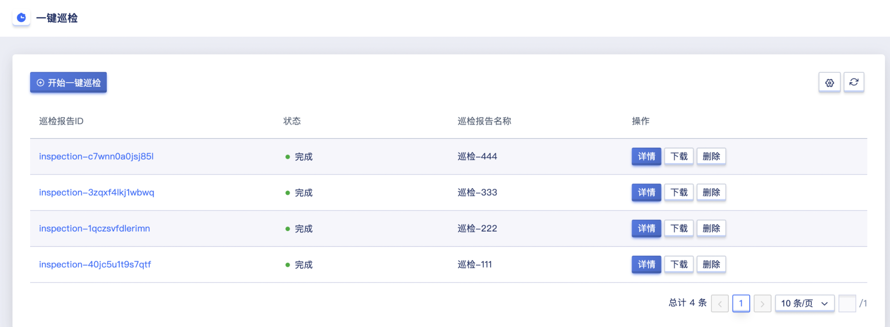
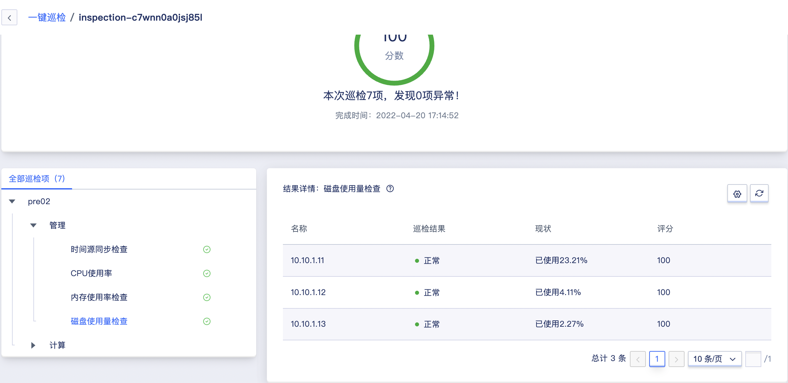

# 13 一键巡检

##  13.1 一键巡检 简介

### 13.1.1 概述

一键巡检，是用来检查云平台的健康情况。通过对管理节点、计算节点的巡检项扫描，从而检查平台节点CPU、内存、磁盘等资源的使用情况，使管理员更方便地对问题进行评估。

### 13.1.2 一键巡检内容

巡检主要是对平台进行全面扫描，包括管理节点的时间源同步检查、CPU使用率、内存使用率检查、磁盘使用率检查；计算节点的物理机CPU平均使用率检查、物理机内存使用率检查、物理机系统盘已用容量检查等，一键巡检内容如下：

| 巡检类型 | 巡检项                   | 巡检项含义                             | 结果展示                                                    | 巡检建议                                                                                                                              |
|----------|-----------------------|-----------------------------------|---------------------------------------------------------|-----------------------------------------------------------------------------------------------------------------------------------|
| 管理节点 | 时间源一致性检查         | 检查是否设置时间源同步                 | 提供节点当前时间源，和推荐时间源                             | 若检测到时间源与集群内其他节点时间源不一致或物理机系统时钟未与时间源同步，请SSH登录对应系统，检查时间源配置                             |
|          | CPU使用率检查            | 检查云平台管理节点CPU的使用占比        | 提供当前占比，若超过80%，提供最高使用率的五个进程             | 若检测到云平台CPU使用率在10分钟内持续的超过80%的使用率，请尽快联系平台相关人员进行热升级或问题评估，以继续正常使用本平台功能            |
|          | 内存使用率检查           | 检查云平台管理节点内存的使用占比       | 提供当前占比，若超过80%，提供最高使用率的五个进程             | 若检测到云平台内存使用率在10分钟内持续的超过80%的使用率，请尽快联系平台相关人员进行热升级或问题评估，以继续正常使用本平台功能           |
|          | 磁盘容量检查             | 检查云平台管理节点磁盘的使用占比       | 提供当前占比，若超过70%，提供占比最高的十个文件路径和文件大小 | 若检测到云平台磁盘数据容量已占用管理节点所在磁盘超过70%的容量，请尽快联系平台相关人员进行磁盘检查和扩容，以继续正常使用本平台功能       |
|          | 管理服务检查         | 检查云平台管理服务的运行情况                 | 提供当前服务名称及状态，若服务异常，提供异常的节点IP      | 若检测到服务状态异常，请根据提供的节点信息，SSH登录对应系统，检查服务的状态   
| 计算节点 | 物理机CPU平均使用率检查  | 检查云平台上物理机CPU平均使用率        | 提供当前占比，若超过80%，提供最高使用率的五个进程             | 若检测到物理机CPU平均使用率超过70%，请登录物理机系统，确认物理机上是否存在异常进程。若未存在异常进程，建议考虑对集群进行扩容              |
|          | 物理机内存使用率检查     | 检查云平台上物理机内存平均使用率       | 提供当前占比，若超过80%，提供最高使用率的五个进程             | 若检测到物理机内存使用率超过80%甚至90%，请立即登录物理机系统，检查物理机上是否存在业务异常，并按需优化运行业务。必要时，建议对集群进行扩容 |
|          | 物理机系统盘已用容量检查 | 检查云平台上物理机系统盘使用率和使用量 | 提供当前占比，若超过70%，提供占比最高的十个文件路径和文件大小 | 若检测到物理机系统盘容量使用率超过70%甚至90%，请立即登录至物理机系统，检查并清理对业务无影响的数据                                      |

## 13.2 创建一键巡检

云平台用户可通过控制台创建一键巡检。通过导航栏进入一键巡检控制台，点击“开始一键巡检”按钮进入创建巡检弹窗，如下图:

* 名称/备注：创建巡检时必须指定名称。
* 确认创建：点击确认后，会返回一键巡检列表页，通常创建成功后会显示“执行中”的状态，巡检完成会显示”完成“的状态。

## 13.3 查看一键巡检 
通过导航栏进入一键巡检控制台，可查看巡检列表及相关信息，包括巡检报告ID、状态、巡检报告名称、创建时间、报告生成耗时及操作项，操作项包括查看报告详情、下载及删除报告。

- 巡检报告ID：巡检报告ID是全局唯一标识符；
- 状态：巡检报告的状态，包括执行中、完成；
- 巡检报告名称：巡检报告的名称，创建时需指定；
- 创建时间：指巡检报告的创建时间；
- 报告生成耗时：指巡检报告从创建到【完成】的时间；

## 13.3.1 一键巡检列表 
复制巡检报告ID，在任何状态下均可进行操作。可通过巡检列表页面每个巡检报告ID右侧的“复制”按钮进行复制，一键巡检列表页如图所示：

## 13.3.2 一键巡检详情
用户可通过点击巡检列表的巡检报告ID，或操作栏的详情按钮，进入一键巡检详情页。详情页展示巡检分数、巡检项数量、异常数量、巡检完成时间以及全部巡检项。展开管理和计算节点可查看详细的数据，包括名称、巡检结果、现状及评分。当巡检结果异常时，结果详情下方会展示相应的建议。一键巡检详情如下图所示：

## 13.3.3 时间源同步检查
检查是否设置时间源同步，巡检结果【正常】时如下图所示。当巡检结果异常时，巡检结果为【警示】，现状为同步异常。

## 13.3.4 CPU使用率
检查云平台管理节点CPU的使用占比，巡检结果【正常】时如下图所示。当巡检结果异常时，巡检结果为【警示】且右上角有问号图标，将鼠标移动到问号图标处会展示导致结果异常的主要文件名称、PID以及已使用量。

## 13.3.5 内存使用率检查
检查云平台管理节点内存的使用占比，巡检结果【正常】时如下图所示。当巡检结果异常时，巡检结果为【警示】且右上角有问号图标，将鼠标移动到问号图标处会展示导致结果异常的主要文件名称、PID以及已使用量。

## 13.3.6 磁盘使用量检查
检查云平台管理节点磁盘的使用占比，巡检结果【正常】时如下图所示。当巡检结果异常时，巡检结果为【警示】且右上角有问号图标，将鼠标移动到问号图标处会展示导致结果异常的主要文件名称及大小。

## 13.3.7 管理服务检查
检查云平台管理节点磁盘的使用占比，巡检结果【正常】时如下图所示。当巡检结果异常时，巡检结果为【警示】且右上角有问号图标，将鼠标移动到问号图标处会展示导致结果异常的主要文件名称及大小。

## 13.3.8 物理机CPU平均使用率检查
检查云平台上物理机CPU平均使用率，巡检结果【正常】时如下图所示。当巡检结果异常时，巡检结果为【警示】且右上角有问号图标，将鼠标移动到问号图标处会展示导致结果异常的主要文件名称、PID以及已使用量。

## 13.3.9 物理机内存使用率检查
检查云平台上物理机内存平均使用率，巡检结果【正常】时如下图所示。当巡检结果异常时，巡检结果为【警示】且右上角有问号图标，将鼠标移动到问号图标处会展示导致结果异常的主要文件名称、PID以及已使用量。

## 13.3.10 物理机系统盘已用容量检查
检查云平台上物理机系统盘使用率和使用量，巡检结果【正常】时如下图所示。当巡检结果异常时，巡检结果为【警示】且右上角有问号图标，将鼠标移动到问号图标处会展示导致结果异常的主要文件名称及大小。

## 13.4 下载巡检报告
支持用户下载巡检报告，通过浏览器将巡检报告下载到本地。巡检报告下载完成后，可查看详细的报告内容，包括地域、节点、名称、巡检项、巡检结果、现状、分数、建议以及最高使用率。当巡检结果异常时，现状会展示当前设备参数，建议会展示针对性的建议，最高使用率会展示导致结果异常的主要文件名称及大小，使管理人员及时了解物理机状态。

## 13.5 删除巡检报告
支持用户删除巡检报告，可支持删除【完成】状态的巡检报告。用户可通过巡检列表进行巡检报告的删除操作。

