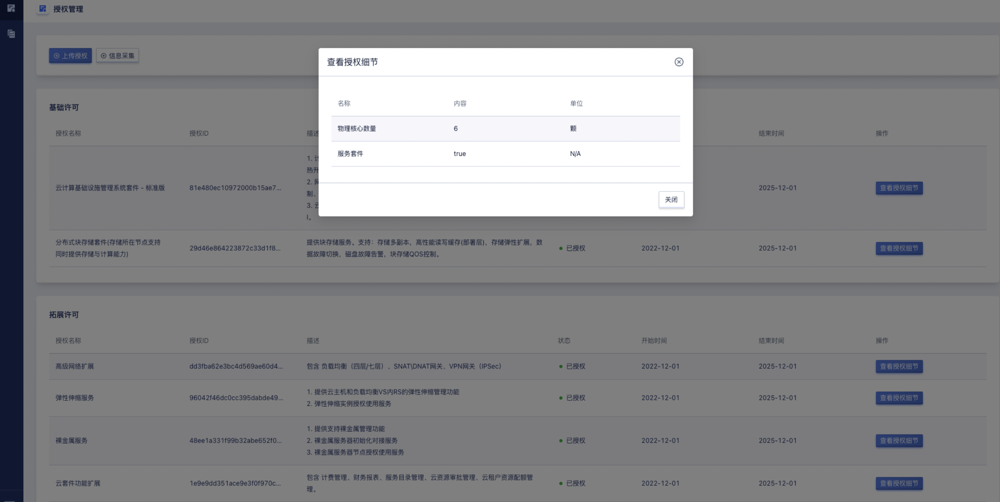

# 11 授权管理

## 11.1 概述

授权管理支持客户按需对基层模块和增值服务模块分开授权，支持用户按照x86/arm架构区分授权节点，根据业务需求选择各模块授权的生效时间和失效时间，平台通过授权证书激活保证了密钥不可克隆验证的唯一性。

平台为用户提供完整的授权管理能力，包括授权管理和节点管理两大模块。

- 授权管理：查看平台基础许可、拓展许可和服务许可，了解产品授权的状态、生效时间、失效时间和数量限制信息等。

- 节点管理：查看平台所有节点授权状态及节点信息情况等。

## 11.2 授权管理

管理员对平台的信息进行采集可点击【**信息采集**】按钮供运营平台使用，运营平台确定用户的需求生成授权证书再上传至平台可点击【**上传授权**】按钮使用，如下图所示：

### 11.2.1 查看基础拓展许可

基础许可：支持云计算基础设施管理系统套件-标准版、云计算基础设施管理系统套件-信创版和分布式块存储套件的授权；

拓展许可：支持云套件功能拓展、高级网络扩展、裸金属服务、USB 透传服务、GPU 服务、弹性伸缩服务、商用存储服务、文件存储服务、对象存储服务、MySQL 5.7 服务、Redis 4.0 服务和异构平台迁移软件服务的授权，如下图所示：

- 授权名称：授权产品名称；
- 授权ID：授权唯一标识；
- 描述：许可描述信息；
- 状态：项目授权状态；
- 开始时间：授权证书生效的时间；
- 结束时间：授权证书失效的时间；
- 操作：支持查看基础许可授权细节操作，如下图所示：

### 11.2.2 查看服务许可

服务许可：支持云计算基础实施管理系统 + 增值服务5 * 8维保服务、云计算基础实施管理系统 + 增值服务7 * 24维保服务和金牌VIP维保服务，如下图所示：

### 11.2.3 查看授权细节

授权管理支持查看产品授权细节，如下图所示：

- 名称：授权的产品名称；
- 内容：具体授权信息；
- 单位：授权产品单位。
## 11.3 节点管理

用户可通过节点管理页面查看节点 IP 地址、序列号、角色、授权状态、CPU 型号、CPU 总量、内存总量和架构，如下图所示：

- 名称：命名方式为平台节点对应的IP地址；
- 序列号：节点的序列号信息；
- 状态：查看平台节点角色和授权状态；
- CPU 型号：节点 CPU 型号信息；
- CPU 总量：节点 CPU 总量信息；
- 内存总量：节点内存总量信息；
- 架构：节点架构信息。

### 11.3.1 查看节点信息

节点管理支持通过节点名称访问节点基本信息、CPU信息和Memory信息，如下图所示：

