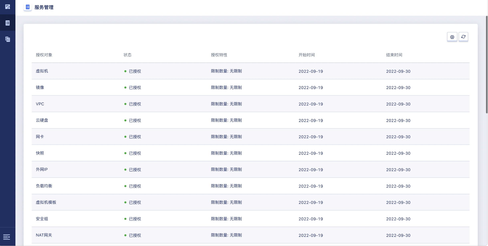
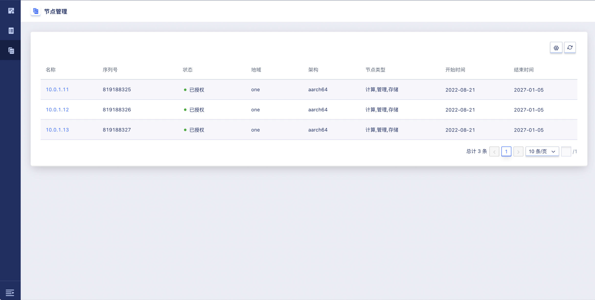
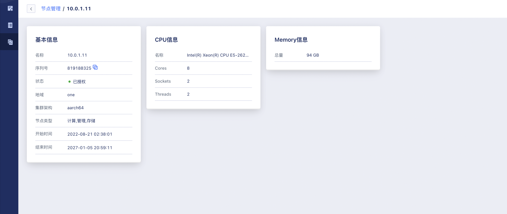

# 11 授权管理

## 11.1 概述

授权管理支持客户按需对基层模块和增值服务模块分开授权，支持用户按照x86/arm架构区分授权节点，根据业务需求选择各模块的授权生效时间和失效时间，平台通过授权证书激活保证了密钥不可克隆验证的唯一性。

平台为用户提供完整的授权管理能力，包括授权管理、服务管理和节点管理三大模块。

- 授权管理：查看客户的项目信息的授权状态及总揽授权对象信息等。
- 服务管理：查看所有授权对象的授权状态和数量限制信息，了解产品授权生效和失效时间等。
- 节点管理：查看平台所有节点授权状态及节点信息情况等。

## 11.2 授权管理

管理员对平台的信息进行采集供运营平台使用，运营平台确定用户的需求生成授权证书再上传至平台使用，如下图所示：

- 客户名称：授权验证的项目所属客户。
- 项目名称：授权验证所属的项目。
- 状态：项目授权状态。
- 授权作用对象：包含授权证书授权作用对象及授权特性。
- 开始时间：授权证书生效的时间。
- 结束时间：授权证书失效的时间。

授权管理支持查看授权作用对象信息，如下图所示：

## 11.3 服务管理

用户可通过服务管理查看授权对象的详细信息，了解到产品的数量限制、授权状态、生效和失效时间等，如下图所示：

- 授权对象：支持授权的产品，包含镜像、弹性伸缩、隔离组、运维、云硬盘、快照、负载均衡、安全组、应用商店、组播、MySQL、监控告警、外网IP、VPN、网关、物理机、VPC、网卡、虚拟机模板、NAT网关、对象存储、文件存储、VIP、虚拟机、Redis、数据库运维、外置存储、USB。
- 状态：授权对象的授权状态。
- 授权特性：显示对授权对象数量的限制。
- 开始时间：授权对象被授权生效的时间。
- 结束时间：授权对象被授权失效的时间。

## 11.4 节点管理

用户可通过节点管理页面查看节点授权状态、地域信息、授权生效后失效时间等，如下图所示：

- 名称：命名方式为平台节点对应的IP地址。
- 序列号：节点的序列号信息。
- 状态：平台节点授权状态。
- 地域：当前节点所在地域。
- 架构：节点架构信息。
- 节点类型：节点功能类型，可选择计算、管理、存储。
- 开始时间：节点授权生效时间。
- 结束时间：节点授权失效时间。

节点管理支持通过节点名称访问节点基本信息、CPU信息和Memory信息，如下图所示：

