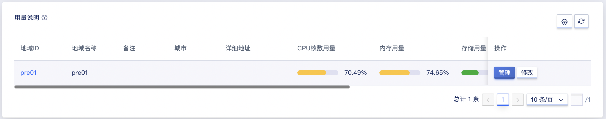
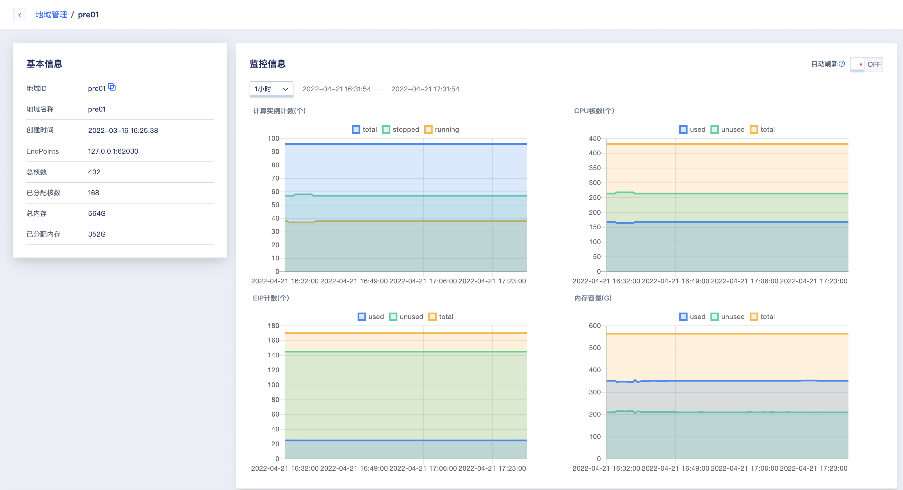
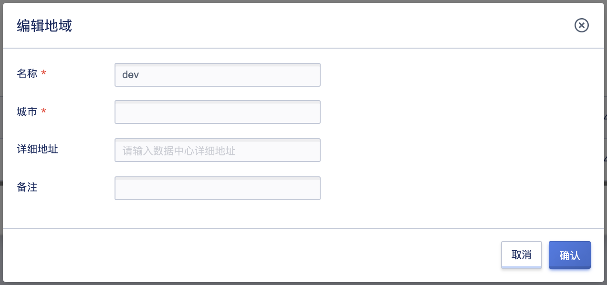

# 3 地域管理

地域（Region）是云平台中的一个逻辑概念，指资源部署的物理位置分类，可对应机柜、机房或数据中心。通常一个数据中心对应一套 UCloudStack 云平台，可支持部署多个计算和存储集群；数据中心之间资源和网络完全物理隔离，可通过一套管理平台管理遍布各地数据中心的私有云平台。

地域在平台也称为数据中心，通常数据中心之间完全隔离以保证最大程度的稳定性和容错性。作为平台最大的资源定义，一个地域即部署一套 UCloudStack 云平台。平台默认内置一个地域，管理服务通过本地数据中心云平台提供的 API 端点管理地域内计算、存储及网络资源。支持对数据中心内资源的生命周期管理，包括计算集群、存储集群、外置存储、基础镜像及自制镜像等资源的查看和维护。

## 3.1 查看地域

### 3.1.1 地域列表

通过管理员控制台左侧导致栏的【地域管理】即可进入地域列表页，可查看当前已有的地域列表，包括地域ID、地域名称、城市、详细地址、CPU核数用量、内存用量、存储用量、物理机GPU核数、GPU用量、状态、
EndPoints、创建时间，同时也可通过“自定义列表”按钮，自定义列表所需信息，如下图所示：

- 地域 ID：地域在平台的唯一标识符，如 `cn` ，通常也作为 API 接口的请求参数值。
- 地域名称：地域的名称，可通过独立的命名区分不同地域，比如北京数据中心一号机房。
- 城市：数据中心所在城市。
- 详细地址：数据中心所处详细地址。
- CPU核数用量：CPU核数总量、已用量、可用量的显示。
- 内存用量：内存总容量、已用量、可用量的显示。
- 存储用量：存储总容量、已用量、可用量的显示。
- 物理机GPU核数： GPU核数总量、已用量、可用量的显示。
- 状态：展示地域license授权状态，包括未授权/已授权/授权已过期三种状态。
- 创建时间：地域的创建时间

> 如一个地域已分配的 vCPU 和内存比例超过 80% 以上，代表地域下可用 vCPU 和内存资源较少，通常需要进行扩容；也可统计租户云资源使用率并及时释放云资源，确保真正需要使用资源的用户可分配到云资源。

### 3.1.2 地域详细信息

用户可在地域列表中点击地域名称，或者点击目标地域列表右侧的“管理”按钮进入当前地域的概览页面，查看地域的基本信息及监控信息，如下图所示：

概览页面展示基本信息和地域核心资源使用趋势的监控图表。

* 基本信息：主要展示基本信息包括地域ID、地域名称、创建时间、EndPoint、总核数、已分配核数、总内存、已分配内存。
* 监控信息：可查看地域的监控信息，其中监控指标包括计算实例数（总数/运行/停止）、CPU 核数（总核数/已用/可用）、内存容量（总容量/已用/可用）、EIP计数（总数/已用/可用）。可通过筛选按钮，调节图表的显示时间周期，满足根据不同时间颗粒度查看地域核心资源使用趋势的需求。

## 3.2 修改地域

支持管理员修改地域的名称，城市，详细地址以及备注等信息。名称即显示在租户控制台的地域筛选中的名称，城市和详细地址以及备注信息可以用以补充关于此数据中心的更多信息内容。在管理平台地域管理列表，点击对应地域右侧的【修改】按钮进行操作，如下图所示：

