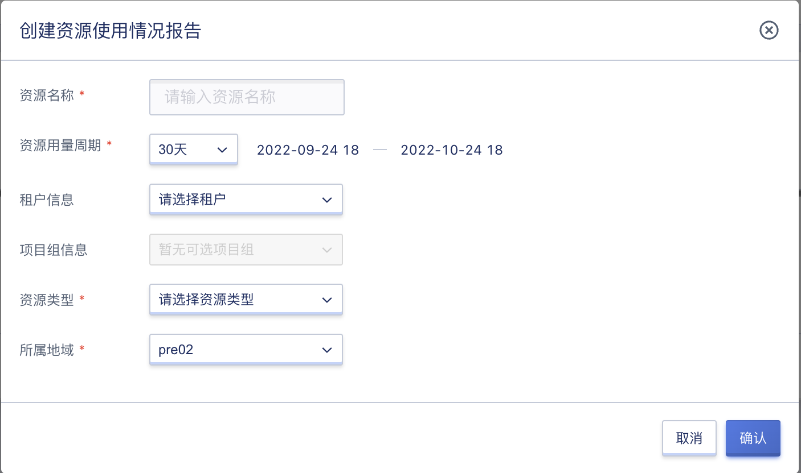
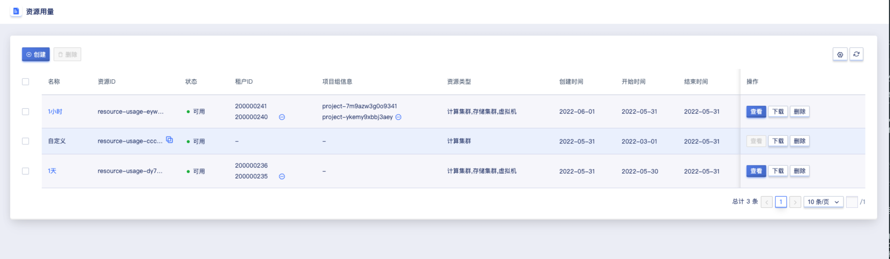
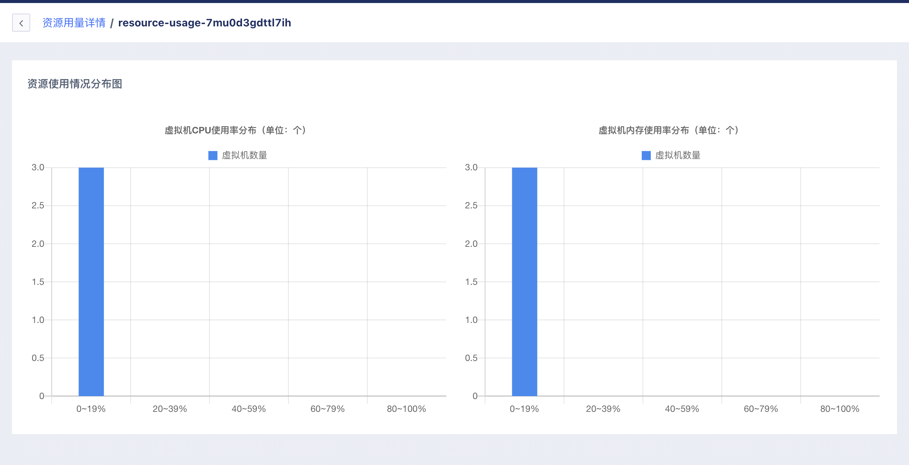

# 14 资源用量

## 14.1 资源用量 概述

资源用量是 UCloudStack 云平台聚合全平台资源监控，根据多维度查询和指标分析，展示资源使用情况，支持管理员创建监控报告并导出Excel表格。

## 14.2 创建资源用量报告

支持管理员创建资源用量报告，从资源用量周期、租户信息、项目组信息、资源类型四个维度对控制台资源进行统计。

可通过导航栏进入【资源用量】资源控制台，通过 “**创建**” 进入向导页面，如下图所示：

* 名称：资源用量报告的名称，创建时必须指定名称；
* 资源用量周期：范围为 1 小时 ~ 6 个月，可选择1天/3天/7天/14天/30天/自定义，自定义可将开始时间和结束时间精确到小时；
- 租户信息：租户信息可选择平台的租户；
- 项目组信息：项目组列表展示选择的租户下的项目组，若未选择租户，展示平台上全部项目组；
* 资源类型：资源类型可选择计算集群/存储集群/虚拟机。

## 14.3 资源用量报告列表

管理员通过导航栏进入资源用量控制台，可查看资源用量列表。

资源用量列表可查看平台上已创建的所有资源用量报告信息，包括名称、资源 ID、状态、租户 ID、项目组信息、资源类型、创建时间、开始时间、结束时间及操作项，如下图所示：

- 名称：资源用量报告的名称；
- 资源 ID：资源用量报告的ID作为全局唯一标识符；
- 状态：资源用量报告的状态，包括初始化、可用、删除中等状态；
- 租户 ID：资源用量报告所绑定的租户 ID；
- 项目组信息：资源用量报告所绑定的项目组信息；
- 资源类型：资源用量报告所绑定的资源类型；
- 创建时间：资源用量报告的创建时间；
- 开始时间：资源用量统计周期的开始时间；
- 结束时间：资源用量统计周期的结束时间；
- 操作：列表上的操作项是对单个资源用量报告的操作，包括查看、下载及删除。

## 14.4 查看资源用量详情

只有资源类型包含虚拟机的报告才能查看。资源使用情况分布图包括虚拟机CPU使用率分布和虚拟机内存使用率分布，以使用率为横轴，虚拟机数量为纵轴进行统计。管理员可点击资源用量控制台操作中的 “**查看**” 进行查看详情操作，如下图所示：

## 14.5 下载资源用量报告

支持管理员下载资源用量报告，可点击资源用量控制台操作中的 “**下载**” 进行下载报告操作。报告根据创建时的筛选项进行展示，资源类型选择计算集群、存储集群及虚拟机时，如下图所示：

* 计算集群

* 存储集群

* 虚拟机

* 虚拟机CPU使用率分布

* 虚拟机内存使用率分布

## 14.6 删除资源用量报告

支持管理员删除资源用量报告，可点击资源用量控制台操作中的 “**删除**” 进行删除资源用量报告操作，如下图所示：

