# 7 租户管理

## 7.1 概述

租户主要为企业用户提供组织架构管理，以及基于租户实现资源访问控制、审批流程、费用管理等功能。

**组织架构**

**概念解释**

* **租户**

  平台支持多租户模式，用于有多级组织架构的企业，可将租户作为一个单独的公司/子公司/部门进行运营，有效实现权限管理，除低总公司、子公司及不同部门资源混用可能造成的风险，并可实现资源审计。

  租户是平台中一组资源的集合，提供资源隔离、子账号、权限控制、配额及价格配置等能力。不同租户间资源通过 VPC 网络及权限实现强隔离；租户内所有主账号和子账号的资源、费用、配额及审批均归属于租户

- **账号**
  
  - **主账号**：一个租户默认有一个主账号，主账号即为租户下的初始管理人员，默认有租户下所有资源的管理权限以及组织管理权限。主账号可通过创建子账号，并管理子账号的权限。
  - **子账号**：子账号是主账号创建的用户，子账号在租户下的权限由主账号控制。一个租户可拥有多个子账号，支持对子账号进行资源管理的权限控制。
  
- **人员**：企业中的人员需使用账号登录云平台，可使用云平台资源。

- **角色**：权限的集合，为用户和成员组赋予权限可获得调用相关API进行资源操作的能力。

- **项目组**：以项目组为维度进行资源规划，可为一个具体项目或者业务建立独立的资源池，实现资源更细粒度地管理。同时针对子账号的授权，也是基于项目组的维度。

- **流程审批**：为了满足企业对核心云资源，如虚拟机、云硬盘、外网IP等资源使用的管控需求所引入的云资源工单审批流程。

- **审批管理**：审批管理目前仅平台管理员admin可以进行操作。

  

## 7.2 创建租户

管理员可创建租户，创建租户时需要添加一个主账号作为租户的初始管理人员。可同步设置账号登陆安全策略，首次登陆强制修改密码。同时支持对租户进行管理设置，包括是否开启资源审批，自动审批，以及设置租户开通使用的地域。

- 账号名称：租户和主账户的名称标识。

- 账号邮箱：主账号的邮箱。
- 账号密码：主账号的登录密码
- 确认密码；再次确认主账号的登录密码
- 资源审批：为租户开启审批流程后，此租户下用户创建虚拟机、云硬盘、私有网络、外网IP，修改虚拟机配置、热升级、扩容系统盘、扩容数据盘、调整带宽需要走申请流程。平台默认审批流程是由平台管理员对资源申请进行审批。
- 自动审批：是否需要为租户开启资源的自动审批，开启自动审批后，租户的主/子账号提供资源申请后，将自动进行审批，无需人工干预即可完成资源的审批和创建。

> 账户创建后余额默认为0，需要进入管理员的充值管理页面，为租户充值后，租户下账号才可正常创建和使用资源。

## 7.3 查看租户列表

管理员可查看平台所有的租户列表，并对租户进行相关管理操作。

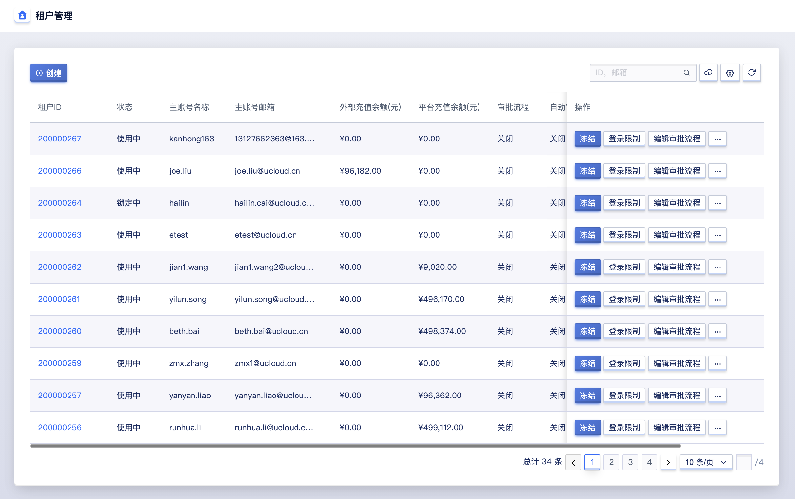

- 租户 ID：租户的 ID 。
- 状态：租户的状态信息，包括未激活、使用中、冻结中等。
  - 未激活：指用户通过平台注册账号时，未通过邮箱激活链接进行账号激活，可通过管理员在租户列表上进行激活操作。
  - 使用中：指租户的状态为使用中。
  - 冻结中：指租户已被冻结，租户下的主账号和子账号均不可进行登录和使用。
- 主账号名称：租户下主账号的名称。
- 主账号邮箱：租户下主账号的邮箱地址。
- 外部充值余额：租户的现金余额。
- 平台充值余额：租户的赠送余额。
- 审批流程：租户是否设置了审批流程，包括开启和关闭。
- 自动审批：租户是否开启了自动审批，包括开启和关闭。
- 创建时间：租户的创建时间。

管理员可通过租户列表对每个租户进行管理和操作，包括冻结、解冻、登录限制及编辑审批流程、地域授权管理、删除等操作，同时可通过详情按钮进入租户的详情，对租户的账号及配置进行全局管理，同时支持修改租户的主账号名称，如下图所示：

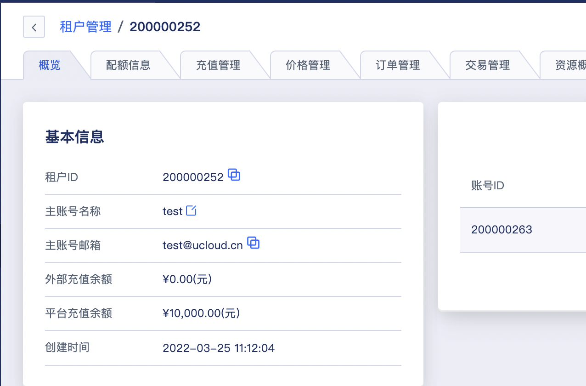

租户概览页面主要展示租户的基本信息，其中基本信息包括租户ID、主账号名称、主账号邮箱、外部充值余额、平台充值余额、创建时间。

## 7.4 冻结租户

冻结账户是指将一个租户进行锁定，被成功冻结的租户，主/子账号将无法登录云平台，不影响租户内已创建的资源及业务的正常运行。仅支持状态为【使用中】的租户进行冻结操作，管理员可通过租户列表的冻结进入冻结租户的向导页面，如下图所示：

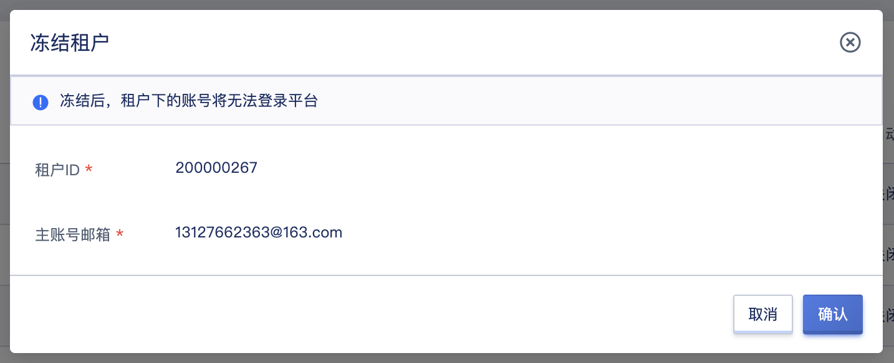

租户被冻结后，租户内的主/子账号均会被冻结，即所有的账号均无法使用，需要对租户进行解冻，租户内的所有账号才可使用。

## 7.5 解冻租户

当租户被冻结后，租户的状态为冻结中，支持管理员通过租户管理解冻一个租户，如下图所示：

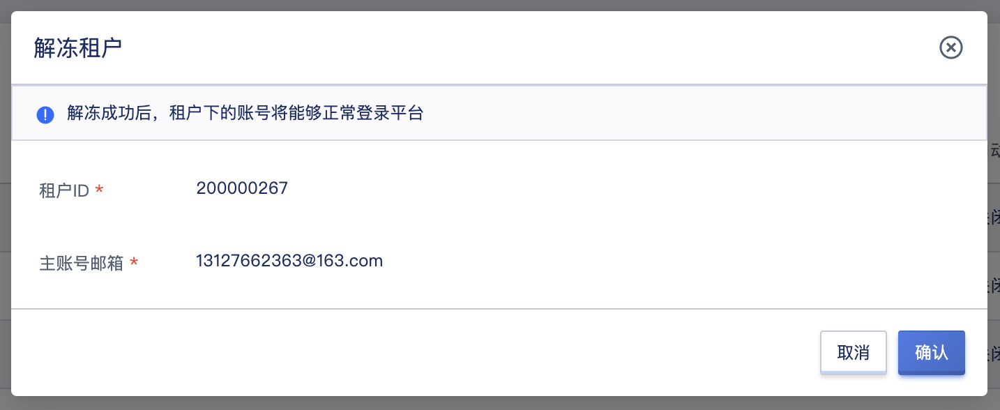

租户解冻后，默认租户中的所有账号均会被解冻，并可正常登录控制台。若冻结租户前，有子账号为冻结中，解冻租户后，之前被冻结的子账号依然保持为冻结中，需要到租户中单独解冻被冻结的子账号，适用于租户的子账号有冻结的场景。

## 7.6 登录限制

管理员可为租户设置登录限制策略，登录访问策略决定可以登录控制台和访问 API 的客户端 IP 地址，配置后账号只能从指定的 IP 登录或发起 API 访问，默认不指定任何 IP，代表不限制登录控制台和访问 API 的 IP 地址。

管理员为租户设置登录限制的场景举例：主账号设置的登录 IP 地址错误导致租户下所有账号均无法登录，可联系平台管理员通过管理控制台侧修改租户的登录访问限制。

管理员可通过租户列表操作项中的“登录访问限制”功能对租户的登录策略进行配置，如下图所示，默认为空代表全网无限制。

## 7.7 编辑审批流程

管理员可通过编辑审批流程管理租户下的审批流程设置，以开启或关闭一个租户下所有账号变更资源的审批流程方式，包括开启/关闭资源审批及开启/关闭自动审批。

## 7.8 地域授权管理

通过地域授权管理可管理一个租户在地域下的授权情况。只有在授权地域下，租户下的账号才可在该地域正常使用服务。企业可以根据云平台实际运营情况管理租户在对应地域的开通情况。

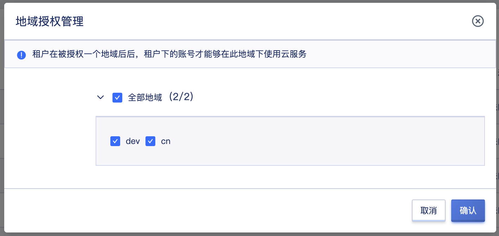

## 7.9 租户成员管理

租户成员管理支持查看并管理租户下已有主账号和子账号，包括查看账号信息、修改密码、冻结账号及解冻账号。

### 7.9.1 查看账号信息

成员列表主要展示租户下的主账号和子账号信息，包括账号 ID、状态、类型、账号名称、邮箱及操作项，同时支持对主/子账号进行搜索操作。管理员可通过租户列表中租户的 ID 进入租户详情的概览页面，查看成员的列表信息，如下图所示：

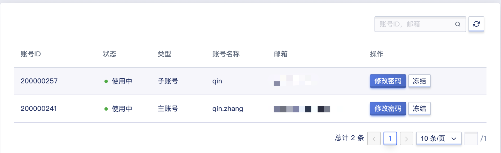

- 账号 ID：主账号/子账号在平台的唯一标识符。
- 状态：账户的状态，包括冻结中、使用中。
- 类型：账户的角色，分为主账号和子账号两种。
- 账号名称：账号的名称。
- 邮箱：账号的登录邮箱
- 状态：账户的状态，包括冻结中、使用中。

### 7.9.2 修改密码

支持管理员修改一个租户内所有的主子账号密码，以适应主子账号忘记密码的场景。

### 7.9.3 冻结账号

支持管理员单独冻结一个租户内的主账号或子账号。冻结成功的主账号，将不允许登录控制台，不影响其它子账号；冻结成功的子账号，将不允许登录控制台，不影响其它子账号及主账号。

* 若账号被冻结时，管理员将账号所属租户冻结，则账号为冻结中状态。
* 管理员将租户解冻时，不影响以前就冻结的账号，即租户解冻，该账号依然为冻结中。
* 需要单独对账号进行解冻操作，才可正常登录并使用控制台。

### 7.9.4 解冻账号

支持管理员单独解冻一个租户内的主账号或子账号，解冻成功的将允许登录控制台。如一个账号因多次输入密码错误导致账号被冻结，可在租户成员管理页面单独解冻账号。

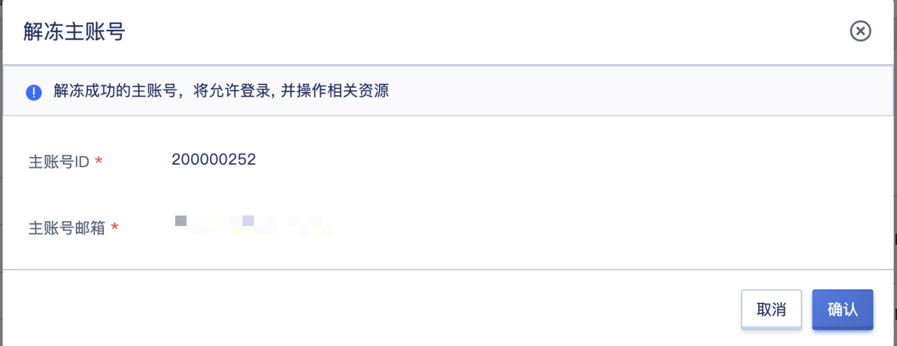

## 7.10 租户订单管理

通过租户下的订单管理可以查看租户下的订单记录，同时可通过自定义地域和查询时间查看租户在一定时间周期内产生的订单，并支持管理员下载订单管理信息为本地 Excel 文件，如下图所示：

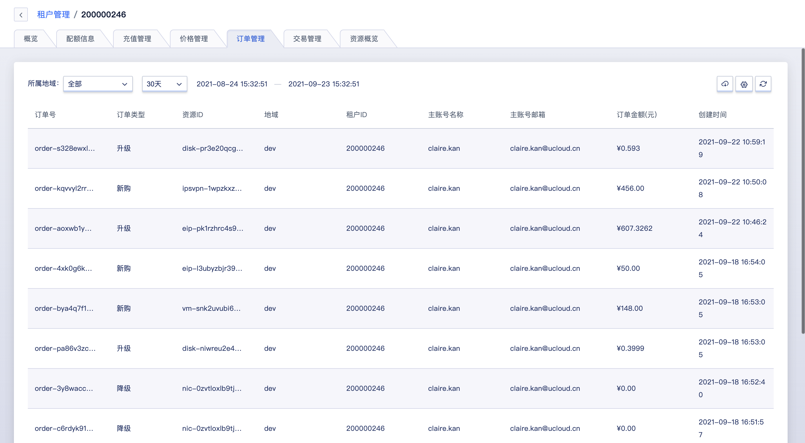

## 7.11 租户交易管理

通过租户管理，管理员可查看所属租户的交易信息，同时可通过自定义查询时间查看租户在一定时间周期内产生的交易记录，并支持管理员下载交易管理信息为本地 Excel 文件，如下图所示：

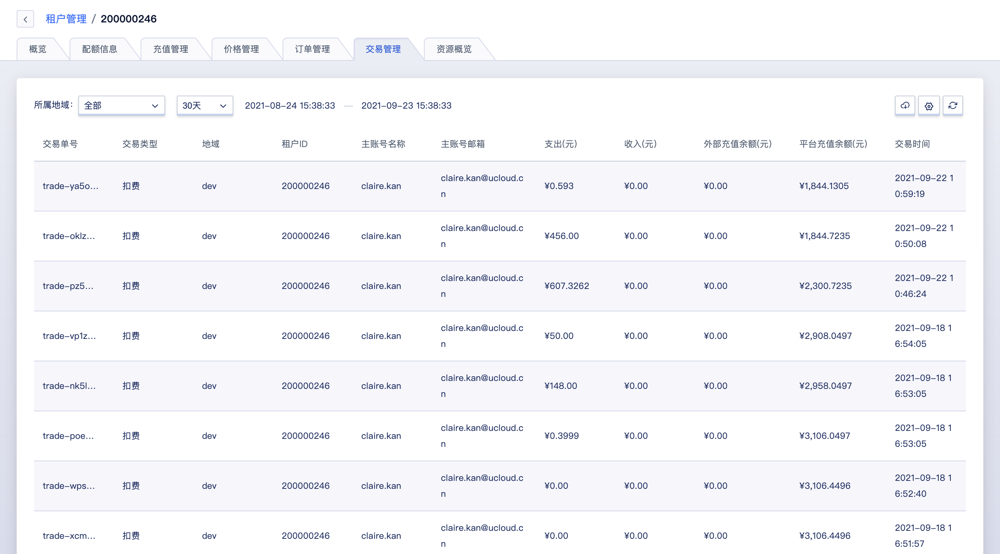

## 7.12 租户资金管理

通过租户管理，管理员可为租户进行账户充值管理和提现管理，可查看所属租户的充值及提现记录信息，可通过自定义查询时间查看租户在一定时间周期内产生的充值和提现记录。

### 7.12.1 充值管理

管理员可通过租户详情页面进入租户资金管理标签页面为租户进行充值，充值方式分为平台内部充值和外部渠道充值两种，管理员可按照使用需求，为租户充值：

* 外部渠道充值来源分为银行转账、支付宝支付、微信支付、新浪支付四种。
* 平台内部充值是平台为租户赠送的余额。

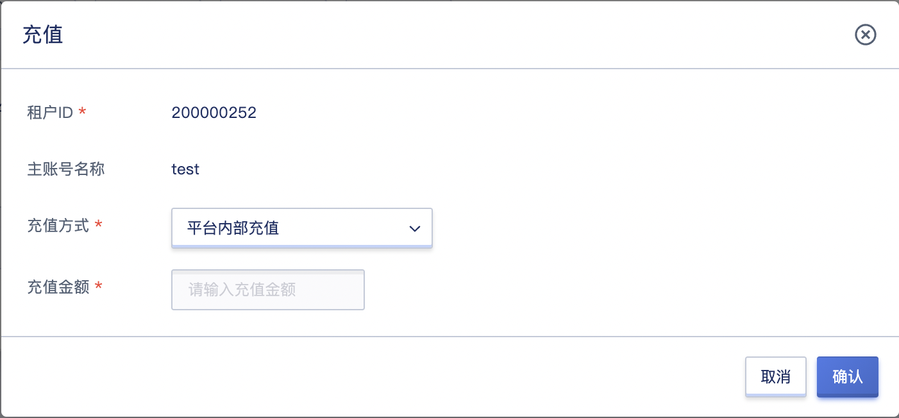

单次充值最小金额为 100 ，最大为 500000 。

### 7.12.2 查询充值信息

管理员通过充值管理，查看一定时间段内的充值记录信息，包括充值单号、充值渠道、充值金额及创建时间等，并支持管理员下载充值记录信息为本地 Excel 文件，如下图所示：

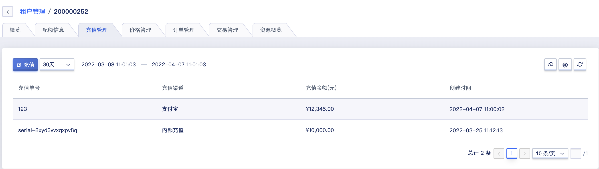

### 7.12.3 提现管理

管理员可通过租户详情页面进入租户提现管理标签页面为租户进行提现操作，提现账户分为平台账户和外部账户两种，管理员可按照使用需求，为租户进行提现，如下图所示：

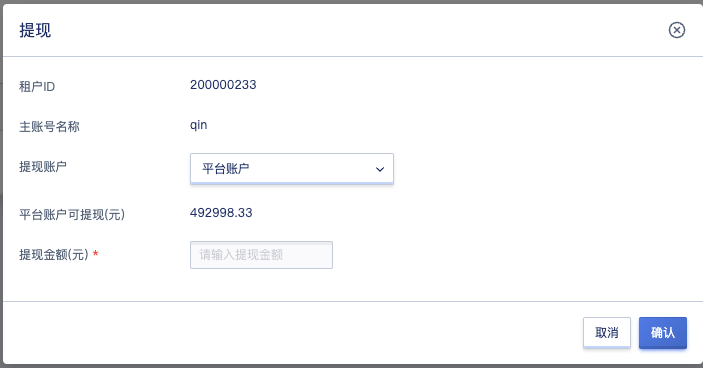

### 7.12.4 查询提现信息

管理员通过提现管理，自定义表头查看一定时间段内的提现记录信息，包括提现单号、源账户类型、提现金额及创建时间，并支持管理员下载提现记录信息为本地 Excel 文件，如下图所示：

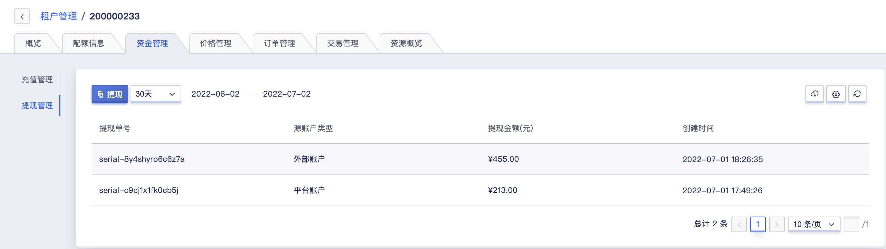

## 7.13 管理租户配额

### 7.13.1 查看租户配额

通过租户管理，选择所需查看的所属地域，管理员可查询当前租户对平台资源的配额设置，同时支持管理员修改租户下每个产品的配额信息，页面信息包括产品类型、资源类型、配额因子、配额及操作。

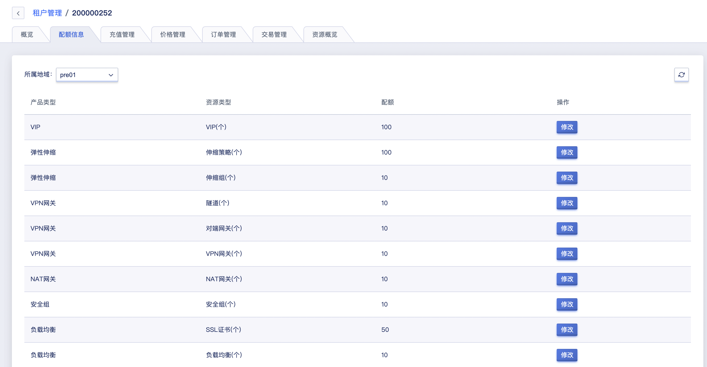

通过操作项，管理员可针对每个产品修改在该地域中的配额值。

### 7.13.2 修改租户配额

平台支持配置租户配额的产品包括虚拟机、镜像、VPC、VIP、硬盘、网卡、外网 IP、负载均衡、安全组、NAT 网关及 VPN 网关等，可根据每个产品针对每个地域及全部地域进行配额配置。

租户的配额默认继承平台全局的配额设置，管理员可自定义每个租户的产品配额。

## 7.14 租户价格管理

### 7.14.1 查看租户价格

通过租户管理，管理员可查询当前租户在平台上计费资源的价格信息，包括计费因子、所属地域、属性、计费类型、计费规则、价格、折扣、折扣价格、更新时间及操作项。

通过操作项，管理员可针对每个产品修改在地域及不同集群的价格，计费因子包括 CPU、内存、磁盘、外网IP、GPU及租户创建虚拟资源时，通过计费因子的费用合计按照付费方式进行扣费。

* 针对 CPU、内存、GPU 等计算计费因子在不同的计算集群可定义并展示不同的价格及折扣。
* 针对磁盘在不同的存储集群可定义并展示不同的价格和折扣。
* 针对外网IP可展示并定义全局的价格和折扣。
* 针对不同的外网网段可展示并定义不同的价格和折扣。

列表上的价格为平台全局【价格配置】中设置的全局价格，管理员可通过租户价格列表查看每种资源在不同集群的基准价格，同时可通过折扣价格查看资源设置折扣后的折扣率及最终价格。

### 7.14.2 设置租户折扣

租户在平台的资源价格默认继承平台全局的价格配置，管理员可自定义每个租户的产品价格折扣，设置单个资源针对租户在不同集群的价格，如下图以修改 CPU 在集群 `ComputeSetPre01` 的按月付费折扣为例：

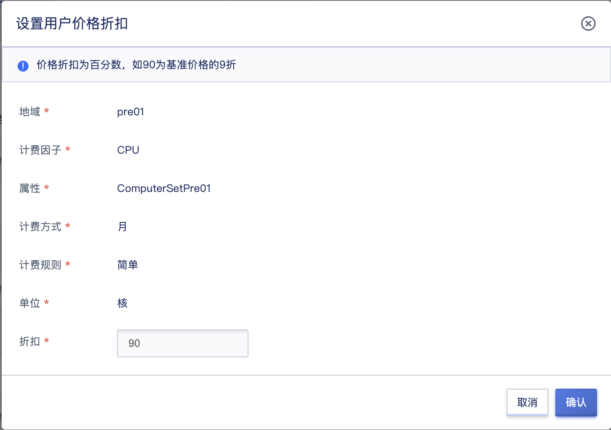

其中折扣为百分数，如 90 为基准价格的 9 折，即将租户 CPU 按月付费的价格打 9 折。修改后即会生效，租户已创建的资源不受影响，新创建的 CPU 资源将按照新的价格进行扣费。

修改租户的产品折扣只对本租户生效，不影响其它租户的价格，满足针对不同客户类型提供不同云资源价格的场景，提升运营效率。

## 7.15 账户资源概览

通过租户管理，管理员可查看所属租户的资源概览信息，包括资源使用率及资源配额使用情况，如下图所示：

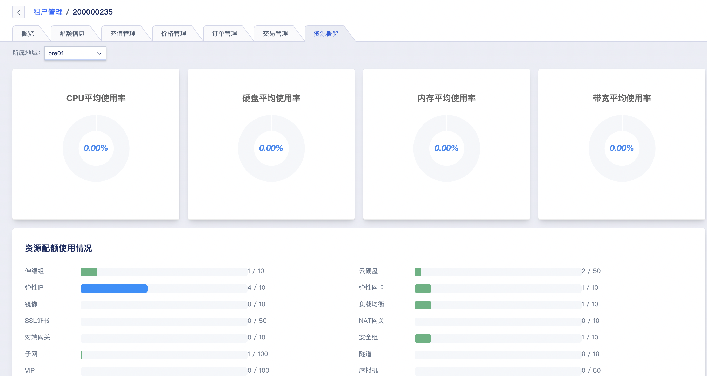

* 资源使用率：指租户在平台中的所有资源的平均使用率，包括 CPU 平均使用率、内存平均使用率、硬盘平均使用率及带宽平均使用率。
* 资源配额使用情况：指租户在平台中所有资源的配额占用情况，包括虚拟机、镜像、硬盘、弹性网卡、VPC、弹性 IP、安全组、负载均衡、NAT 网关、VPN 网关及隧道等总配额以及已使用的配额情况。

## 7.16 删除租户

支持删除租户，租户被删除后，租户下的所有账号将被同步清除，无法再使用这些账号登录平台。

> 注意，删除租户的前提是，租户下的资源已被清除。建议在删除租户前，和租户相关管理人员沟通，确认不需要再使用云平台后，及时清理资源。如果租户不自主清理资源，可在管理后台，各个资源列表处，搜索到此租户的资源后进行删除。虚拟机、云硬盘、外网IP删除后会进入回收站，需要在回收站中彻底销毁以释放资源。

