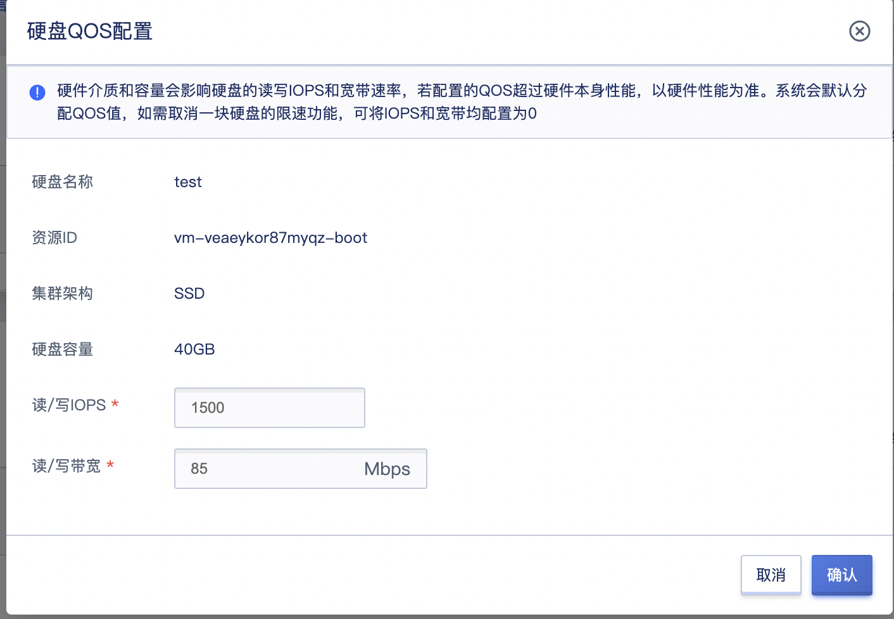

# 6 虚拟资源管理

平台为管理员提供全平台所有租户的虚拟资源全生命周期运营和管理能力，使平台管理员可通过控制台统一管控平台的整体虚拟资源，包括租户端的所有产品服务，如虚拟机、虚拟机模板、弹性网卡、VPC 网络、外网 IP、VIP、安全组、负载均衡、NAT 网关、VPN网关、外置存储、云硬盘及快照等资源，同时对于云硬盘资源还支持单盘 QoS 控制，用于控制单块云硬盘的读写 IOPS 及读写带宽。

## 6.1 虚拟机管理

平台支持管理员指定租户创建 Windows、Ubuntu、CentOS 操作系统的虚拟机，创建的虚拟机归属于指定的租户所有。

同时支持管理员对平台所有租户的虚拟机进行全生命周期管理，如查看虚拟机详情信息、USB设备信息、VNC登录、启动/重启/关机/断电、重置密码、系统盘扩容、制作镜像、重装系统、绑定外网IP、解绑外网IP、设置默认出口、修改内/外网安全组、挂载云硬盘、续费、修改虚拟机配置、热升级、获取控制台信息、修改名称和备注、修改告警模板及删除销毁虚拟机。

## 6.2 虚拟机模版

平台支持管理员指定租户创建虚拟机模板，创建的虚拟机模板归属于指定的租户所有；同时支持管理员对平台所有租户的虚拟机模板进行全生命周期管理，如查看、创建虚拟机、删除等。

## 6.3 弹性网卡管理

支持管理员指定租户创建弹性网卡，创建的弹性网卡归属于指定租户所有，仅可绑定至租户的虚拟机，并支持管理员对平台所有租户的弹性网卡进行全生命周期管理，如查看、绑定、解绑、修改安全组、调整IP带宽、续费、删除等。

## 6.4 VPC 网络管理

支持管理员指定租户创建 VPC 网络和子网，创建的 VPC 和子网归属于指定租户所有，创建虚拟资源时仅可选择租户拥有的 VPC 和子网资源；同时支持管理员对平台所有租户的VPC网络和子网进行全生命周期管理，如查看、删除、创建子网、删除子网等。

## 6.5 外网 IP 管理

支持管理员指定租户申请指定 IP 网段的外网 IP 地址，申请的 IP 地址归指定租户所有，仅支持申请指定租户有权限的网段进行 IP 地址申请；同时支持管理员对平台所有租户的外网 IP 地址进行管理，如查看、绑定、解绑、修改带宽、续费、修改告警模板、删除等，仅支持绑定给与外网 IP 地址相同租户的虚拟资源。

## 6.6 安全组管理

支持管理员指定租户创建安全组，创建的安全组归指定租户所有，仅支持绑定给与安全组相同租户的虚拟资源；同时支持管理员对平台所有租户的安全组进行全生命周期管理，如安全组的IP组和端口组管理等。

## 6.7 负载均衡管理

支持管理员指定租户创建负载均衡实例，实例归属指定租户所有，仅支持添加指定租户有权限的虚拟机资源到服务节点；同时支持管理员对平台所有负载均衡进行管理，如  VServer 、服务节点、域名转发策略及 SSL 证书管理等。

## 6.8 NAT 网关管理

支持管理员指定租户创建 NAT 网关实例，实例归属指定租户所有，仅支持添加指定租户有权限的虚拟资源到 SNAT 和 DNAT 规则；同时支持管理员对平台所有 NAT 网关进行管理，如所有 NAT 网关的 SNAT 及 DNAT 规则管理。

## 6.9 硬盘管理

### 6.9.1 租户云硬盘管理

支持管理员指定租户创建云硬盘，创建的云硬盘归指定租户所有，仅支持申请指定租户有权限的集群类型进行云硬盘创建；同时支持管理员对平台所有租户的云硬盘资源进行全生命周期管理，如查看、绑定、解绑、扩容、快照、克隆、回滚、续费、QoS配置、删除等，删除的云硬盘会进入租户的回收站，仅支持绑定与云硬盘相同租户的虚拟机，同时制作的快照归租户所有。

### 6.9.2 云硬盘 QoS

平台全局默认提供全局云硬盘 QoS 配置，即新创建的云盘会根据平台公式赋予 QoS 值，限制平台用户对磁盘性能强行占用。同时平台支持管理员对平台所有租户的云硬盘自定义设置 QoS 值，仅当全局 QoS 配置开启时，管理员为每个云硬盘自定义的  QoS  才可生效。

每一块云硬盘创建出来后，管理员可在云资源管理——云硬盘列表上进行“QoS配置” ，同时可对虚拟机详情磁盘中的系统盘进行 QoS 配置，如下图所示可设置的 QoS 项包括：

* 读/写 IOPS

  当磁盘的 Arch 架构为 HDD 时，可设置的读/写 IOPS 范围为 `0~50000` ，默认值为1000，配置为 0 不限速。

  当磁盘的 Arch 架构为 SDD 时，可设置的读/写 IOPS 范围为 `0~50000` ，默认值为计算公式根据当前硬盘容量计算的值，配置为 0 不限速。

- 读写带宽（MBps）

  当磁盘的 Arch 架构为 HDD 时，可设置的读/写带宽范围为 `0~1000Mbps` ，默认为100，配置为0则不限速。

  当磁盘的 Arch 架构为 SSD 时，可设置的读/写带宽范围为 `0~1000Mbps` ，默认为计算公式根据前当前硬盘容量计算的值，配置为0则不限速。

硬盘扩容容量后，会根据计算公式重新计算新容量的 QoS 值，根据计算的QoS值重新设置硬盘的 QoS。

- 若硬盘扩容前设置的 QoS 值  < 新容量 QoS 值，则以新容量 QoS 值为准。
- 若硬盘扩容前设置的 QoS 值 > 新容量 QoS 值，则以扩容前设置的值为准。

> 硬件介质和容量会影响硬盘的读写 IOPS 和宽带速率，若配置的 QOS 超过硬件本身性能，以硬件性能为准。系统会默认分配 QOS 值，如需取消一块硬盘的限速功能，可将 IOPS 和宽带均配置为 0。

## 6.10 快照管理

支持管理员查看并管理平台所有租户的云硬盘快照资源，如创建云硬盘、回滚和删除，仅支持将快照数据回滚至原始云硬盘。

## 6.11 外置存储管理

支持管理员查看并管理平台上已分配给租户的所有外置存储 LUN 存储卷信息，同时支持管理员对存储卷 LUN 设备进行绑定和解绑操作，仅支持绑定 LUN 设备到所属租户的虚拟机实例，为所属租户的虚拟机提供数据盘服务。

管理员在帮租户创建虚拟机时，也可选择有权限的外置存储 LUN 设备作为虚拟机的系统盘。

## 6.12 VPN网关

支持管理员指定租户创建 VPN 网关实例，实例归属指定租户所有，仅支持添加指定租户有权限的虚拟资源；同时支持管理员对平台所有 VPN 网关进行管理，如所 VPN 网关的对端网关及隧道管理。

## 6.13 VIP

支持管理员指定租户创建 VIP 实例，实例归属指定租户所有，仅支持关联指定租户有权限的虚拟资源；同时支持管理员对平台所有 VIP 进行管理，如所有 VIP 的更新和删除。

## 6.14 应用商店

支持管理员指定租户安装应用，实例归属指定租户所有，目前只有终端检测响应平台EDR、数据库审计UDAS两款应用，只支持安装部署。

## 6.15 文件存储

支持管理员指定租户在控制台创建文件存储实例，在虚拟机实例中安装文件存储客户端，使用标准挂载命令挂载创建的文件系统，就可以在多个实例间共享文件。

## 6.16 对象存储

支持管理员指定租户在控制台创建文件存储实例，在任何应用、任何时间、任何地点通过对象存储和访问任意类型的数据。

## 6.17 隔离组

隔离组是一种针对虚拟机资源的简单编排策略，支持组内或组之间的实例分散到不同物理机上，用以保障业务的高可用。

## 6.18 组播

支持管理员指定租户创建 组播 实例，实例归属指定租户所有，仅支持关联指定租户有权限的虚拟资源；同时支持管理员对平台所有 组播 进行管理，如所有 组播 的更新和删除。

## 6.19 监控告警

支持管理员查看并管理平台所有租户的监控告警资源，创建告警模版、查看告警记录等，提供全线资源实时监控数据及图表信息，并在资源故障或监控指标超过告警阈值时，以邮件的方式给予通知及预警。

## 6.20 资源事件

支持管理员查看所有租户的资源事件并管理租户下的通知规则，如通知规则的创建、更新、删除。

## 6.21 Redis

支持管理员指定租户创建Redis，创建的Redis归属指定的租户所有，同时支持管理员对平台所有租户的Redis进行全生命周期管理，如续费、创建从库、升级内存、删除等。

## 6.22 MySQL

支持管理员指定租户创建MySQL，创建的MySQL归属指定的租户所有，同时支持管理员对平台所有租户的MySQL进行全生命周期管理，如续费、创建从库、升级内存、删除等。

## 6.23 数据库备份

支持管理员指定租户绑定存储池并创建备份计划，存储池及备份计划归属指定的租户所有，同时支持管理员对平台所有租户的存储池及备份计划进行全生命周期管理，如存储池的绑定与解绑、备份计划的执行与删除等。

