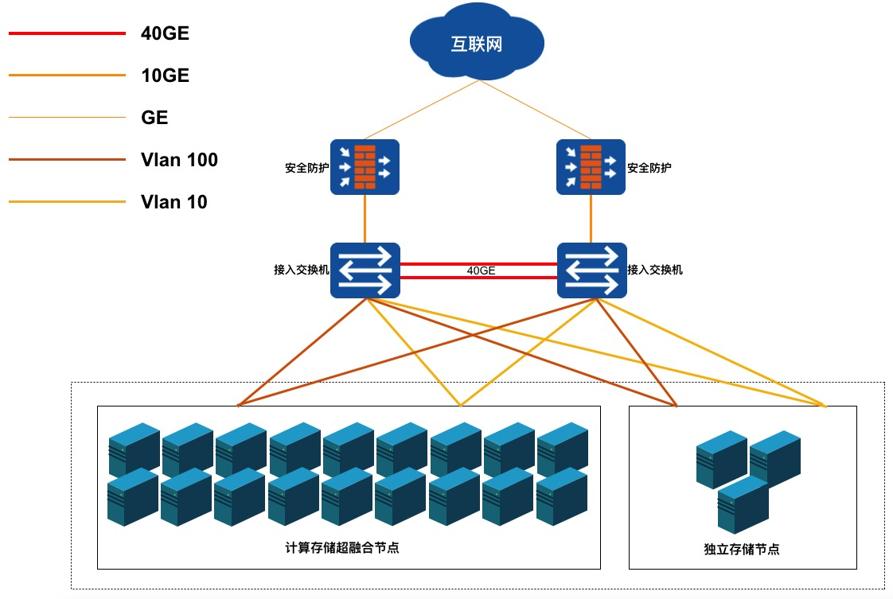
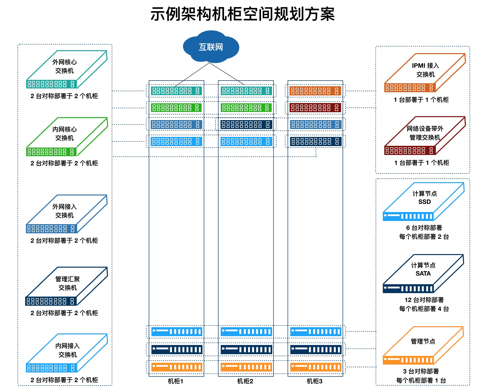

# 2 平台物理架构

## 2.1 物理集群节点

UCloudStack云平台系统常见集群节点角色有4种，分别是管理节点、计算存储融合节点、独立计算节点以及独立存储节点。

### 2.1.1 管理节点

集群内部署的核心管理服务，承载UCloudStack云平台的北向接口服务模块，包括帐户认证、计量计费、资源管理、网关及服务监控等服务，提供标准API和WEB控制台两种接入和管理方式。

* 管理节点负责虚拟资源全生命周期的管理，由于北向业务与南向实现接口分离及分布式网络机制，网络流量通过所在计算节点直接转发，平台业务扩展并不受管理节点数量限制；
* 云平台支持统一的底层资源，基于管理服务仅转发和透传管理流量，平台支持并推荐将管理服务部署于计算节点的虚拟机中，通过平台虚拟机的智能调度提供管理能力的高可用。

管理服务与计算服务间通过TCP/IP协议进行通信，提供管理服务通过内网或外网与计算节点通信的能力，支持管理服务与计算服务分离部署，如管理服务部署至公有云或其中一个数据中心，计算节点分布在各个数据中心，通过全局云管平台跨机房、跨数据中心及跨地域统一管理。

### 2.1.2 超融合节点

计算存储融合节点，同时包含计算资源和存储资源，用于运行虚拟机、虚拟网络、分布式存储、数据库服务、缓存服务等资源，同时承载智能调度控制和监控服务。

云平台分布式存储使用所有计算节点的数据磁盘，每个节点仅支持部署一种类型的数据磁盘，如SATA（使用SSD缓存加速）、SSD等。

生产环境至少部署3台以上，保证分布式系统的正常部署和运行。采用 SATA+SSD缓存的方案构建超融合节点，必须保证SSD缓存盘和HDD数据盘的容量比不高于1:20，数量比不高于1:5。

在部署上，每台计算节点均会部署用于运行计算存储网络的KVM、Qemu、Libvirt、OVS、Ceph等核心组件，同时在每个地域中至少有3台计算节点会部署核心调度及管理模块，如下图所示：

  其中【Schedule Manager】即为UCloudStack云平台的核心调度及管理模块，用于虚拟资源的运行调度及虚拟网络的流表下发管理，每一个地域仅需部署一套高可用的Schedule Manager。一般为主备模式，可在3台或多台计算节点上进行部署，当部署调度模块的主计算节点服务器物理故障时，部署调度模块的备计算节点将自动接替调度服务，保证核心调度及流表控制服务的可用性。
  
每个地域或数据中心的部署的Schedule Manager均会开放一个API端点，作为管理服务连接并管理数据中心计算资源的统一入口。API端点支持通过内网和互联网的连接模式，在TCP/IP网络通信可达的情况下，管理服务（Management Service）支持部署于相同数据中心，也可部署于公有云或其它数据中心，并可为多数据中心计算资源提供统一调度和管理，满足云平台多应用场景部署。
### 2.1.3 独立计算节点

集群内宿主机节点：

* 用于独立运行所有计算和网络资源，通过挂载独立存储节点的磁盘作为云平台的存储资源；
* 一般由几台到几千台服务器组成，生产环境至少部署2台以上，保证虚拟机的调度及稳定迁移；
* 通常建议将相同配置的计算节点服务器放置在一个集群内进行虚拟资源的调度。

### 2.1.4 独立存储节点

独立存储节点，用于独立承载分布式存储的节点，构建独立存储区域。适合将计算和存储分离，搭建独立存储网络的场景。独立存储节点，使用独立的存储网络接入设备，与计算业务物理或逻辑隔离。

* 部署独立存储节点，可节省计算节点的CPU、内存等资源；
* 一般由几台和几千台服务器组成，生产环境至少部署3台以上，保证分布式系统的正常部署和运行；
* 独立存储节点为【可选】节点，如果采用融合节点，可使用计算存储超融合节点上的数据磁盘作为分布式存储的存储池。

部署存储节点时，每个节点需配置相同介质类型的数据磁盘，如全SSD存储节点、SATA+SSD缓存存储节点等（适用于采用SSD缓存加速场景），将相同磁盘类型的节点组成一个存储集群，分别作为普通存储和高性能存储资源池。

> 注意：采用 SATA+SSD缓存的方案构建独立存储节点，须保证SSD缓存盘和HDD数据盘的容量比不高于1:20；盘数量比不高于1:5。

### 2.1.5 商业存储节点

平台支持采用独立的商业存储（如FCSAN、IPSAN等）设备作为存储节点，构建存储区域，云平台的虚拟机镜像及云服务的数据均存储于商业存储设备，适合已有商业存储设备的利旧场景，整体节省信息化转型的总拥有成本。

云平台基于ISCSI、FC协议对接商业存储，作为云平台的后端存储；并支持将存储设备中的LUN分配给租户，由租户将LUN分配或挂载至虚拟机的系统盘或数据盘，进行数据的读写。

商业存储设备采用设备已有的网络接入平台物理网络，与计算业务网络物理或逻辑隔离。

* 商业存储设备节点，可代替分布式存储节点，或与超融合、独立存储节点共同构建存储服务，构建不同的存储资源。
* 一般由几台至上百台商业存储设备组成，生产环境至少部署2台以上，保证存储系统的正常部署和运行；
* 商业存储节点为【可选】节点，可在生产环境中根据实际需要进行部署。

> 注意：平台仅将商业存储的LUN作为存储卷进行使用，不对存储卷本身进行管理，如LUN的创建、映射、扩容、快照、备份、回滚、克隆等。

### 2.1.6 推荐节点方案

UCloudStack云平台轻量且架构灵活，物理节点方案可根据企业业务需求及应用场景进行灵活调整，可部署的推荐方案举例如下：

**（1）计算存储融合节点**

如3+3的节点方案，即3台SATA+SSD缓存超融合计算节点、3台SSD超融合计算节点，管理服务部署于计算节点的虚拟机中，后续可根据业务规模水平扩展，如将SATA+SSD缓存超融合计算节点扩容为9台。

**（2）独立计算节点+独立存储节点**

适用于存算分离的大规模场景，如N（N≧2）台计算节点、3台SSD存储节点、3台SATA+SSD缓存节点，分别构建计算集群、SSD存储集群及SATA存储集群，共同构建一套云平台，后续可根据业务规模分别对集群的计算节点或存储节点进行水平扩展，满足业务发展规划。

> 注：SSD和SATA节点的配比取决于业务需求，如高存储容量需求较大，则需配置较多的SATA+SSD缓存节点；若高性能业务需求较多，则需配置较多的SSD全闪节点。

**（3）独立计算节点+商业存储设备**

适用于利旧商业存储设备的场景，如N（N≧2）台计算节点、N台商业存储设备，分别构建计算集群和商业存储集群，共同构建一套云平台，后续可根据业务规模分虽对计算集群和商业存储设备进行扩展。

**（4）计算存储融合节点+独立存储节点**

适用于超融合集群扩展大容量存储资源的场景，如N（N≧3）台计算存储融合节点、N（N≧3）台独立存储节点，分别构建计算集群和商业存储集群，共同构建一套云平台，后续可根据业务规模分虽对计算集群和存储集群进行扩展。

**（5）计算存储融合节点+独立计算节点**

适用于超融合集群扩展算力资源的场景，如N（N≧2）台计算节点、N台商业存储设备，分别构建计算集群和商业存储集群，共同构建一套云平台，后续可根据业务规模分虽对计算集群和商业存储设备进行扩展。

**（6）计算存储融合节点+独立计算节点+独立存储节点+商业存储设备**

适用于复杂型算力架构场景，将即有的设备利旧的同时，满足大规模算力和存储空间的需求。如N（N≧2）台计算节点、N台商业存储设备，分别构建计算集群和商业存储集群，共同构建一套云平台，后续可根据业务规模分虽对计算集群和商业存储设备进行扩展。

最佳实践中，生产环境至少需要3台SATA/SSD超融合节点部署搭建UCloudStack平台，即UCloudStack最小生产规模为3台服务器。具体服务器配置要求详见【硬件选型】章节的【最低配置】。
## 2.2 物理网络架构

为构建高可用、高可靠、高安全的企业专有云平台，UCloudStack平台均采用高可用冗余性设计。本文以标准网络拓扑图为基础进行物理网络架构描述，本架构设计至少需要6台万兆交换机、2台千兆交换机、多台计算&存储节点服务器。若有IPMI管理及网络设备管理等需求，可根据需求增加IPMI和Management交换机并接入网络。

UCloudStack 平台网络设计为核心、接入二层架构，接入交换机双上联到核心，且按计算业务分集群划分。本架构设计从业务场景上提供公网服务，因此整体业务架构分为内网区域和外网区域两张网络，分别承载云平台内网通信和外网通信，两张网络在网络设备层面物理隔离。

### 2.2.1 架构规模

标准的网络架构为单数据中心网络架构，以下述配置为例，单数据中心可支撑 900 ~1000 台规模的节点数量：

- 两台交换机堆叠在一起，称为一组交换机，如一组内网接入交换机或一组外网接入交换机；
- 通常一组接入交换机为 96 个业务接口（每台交换机48个接口），堆叠检测及备用占用 3\*2 个接口，可用业务端口为 90 个；
- 每个服务器节点使用两个网卡占用一组接入交换机的 2 个接口，即一组接入交换机可接入 45 台服务器；
- 每增加一组交换机即可扩展 45 个节点，一组核心交换机至少可接入 20 组接入交换机，即至少可支撑 900 个节点服务器。

### 2.2.2 网络区域

网络区域的设备通常包括内网核心交换机、外网核心交换机、内网接入交换机、外网接入交换机。若服务器节点规模较小且暂不考虑扩容，可仅采用内/外网接入交换机。

- 内网核心交换机：采用 2 台 40GE 的三层交换机堆叠作为一组内网核心，用于承载内网接入交换机的汇聚和管理；
- 外网核心交换机：采用 2 台万兆三层交换机堆叠作为一组外网核心，用于承载外网接入交换机的汇聚和管理；
- 内网接入交换机：采用 2 台万兆交换机堆叠作为一组内网接入，用于承载 45 台服务器内网接入；
- 外网接入交换机：采用 2 台千兆交换机堆叠作为一组外网接入 ，用于承载 45 台服务器外网接入；
- 除 Internet 连接外，网络均为大二层环境，采用 LLDP 协议获取网络拓扑信息，所有网络接入均为端口聚合，保证高可用；同时通过控制接口广播报文流量，抑制网络广播风暴；
- 外网核心交换机与 Internet 之间可以为二层聚合、三层聚合、L3 ECMP 、L3 A/S 等互连模式，同时支持串联或旁挂防火墙、IDS、IPS 及防 DDOS 等安全设备；
- 云平台提供的网络功能均采用软件定义的方式实现，物理交换机仅作为网络流量转发设备，即仅使用交换机部分通用能力，如**堆叠、Vlan、Trunk、LACP 及 IPV6** 等，无需采用 SDN 交换机实现虚拟网络的通信。

标准网络架构中，通常推荐至少采用万兆及以上级别的交换机，保证平台节点内网接入、虚拟资源通信及分布式存储的性能及可用性。由于外网接入带宽一般较小，通常推荐采用千兆交换机作为外网接入设备。

### 2.2.3 服务器区域

服务器区域的设备通常包括计算存储超融合节点、独立计算节点、独立存储节点、以及管理节点。若直接使用计算节点的虚拟机作为管理节点，即可省去物理管理节点服务器。

**（1）计算节点【必选】**

采用x86/ARM架构服务器作为计算节点或计算存储超融合节点，用于运行虚拟机、虚拟网络、分布式存储及数据库缓存等服务，承载整个云平台的资源核心实现及运行。

- 采用2个GE网卡分别上联到两台外网接入交换机，并做双网卡bond，作为计算节点外网接入。
- 采用2个10GE网卡分别上联到两台内网接入交换机，并做双网卡bond，作为计算节点内网接入。
- 若为超融合节点，则分布式存储使用所有计算节点上的数据磁盘，所有计算节点上的数据磁盘组成统一分存储资源池，用于构建分布式存储。
- 若为独立计算节点，则分布式存储使用存储节点上的数据磁盘作为统存储资源池，通过网络跨集群挂载。
- 为提升平台虚拟化算力资源的稳定性和可用性，若计算节点的CPU型号不一致，必须将不同型号CPU节点划分至不同集群。

**（2）独立存储节点【可选】**

若计算存储需要分离部署，可采用x86/ARM架构且磁盘较多服务器作为独立存储节点，用于承载独立的分布式存储服务。

- 存储节点与计算服务通过内网进行通信，仅需2个10GE网卡分别上联到两台内网接入交换机，并做双网卡bond，作为存储节点的内网接入。
- 如需将计算存储网络物理隔离，可采用独立存储接入交换机，存储节点的网卡上联至存储接入交换机。
- 分布式存储使用存储节点及超融合节点上的所有数据磁盘，三副本保证数据安全；若采用商业存储（SAN），则云平台服务可使用商业存储划分的LUN 存储空间作为云平台的后端存储。
- 每台分布式存储节点的数据盘仅支持单种介质类型，即单节点不支持SSD和HDD混插，分别组建不同的存储集群。
- 为保证存储性能，若分布式存储节点采用SATA机械盘组建大容量存储集群，必须配置SSD/NVME高性能磁盘作为缓存盘，并须保证SSD缓存盘和HDD数据盘的容量比不高于1:20；盘数量比不高于1:5。
- 为保证分布式存储的性能及可用性，存储节点必须采用万兆以上速率的网卡。

**（3）管理节点【可选】**

平台默认推荐使用平台虚拟机部署管理服务，如需物理服务器承载并运行管理服务，可采用x86/ARM服务器作为云平台管理节点，用于承载云平台管理塻块及服务。

- 采用2个GE网卡分别上联到两台外网接入交换机，并做双网卡bond，作为管理节点外网接入；
- 采用2个10GE网卡分别上联到两台内网接入交换机，并做双网卡bond，作为管理节点内网接入。

> 注：以上网卡bond均采用“mode=4”模式，即IEEE 802.3ad动态链路聚合。

### 2.2.4 标准架构扩展

在实际项目中，根据用户需求和所提供的环境，可对标准网络架构进行调整，如项目较小规模（ 45 节点内）或仅需一个简单的测试环境或等场景。

（1）如需内外网物理隔离且考虑接入冗余，可采用 2 组共 4 台接入交换机进行业务部署。
- 2 台堆叠用于服务器内网接入，2 台堆叠用于服务器外网接入；
- 每台服务器内外网分别使用 2 个接口绑定接入内外网接入交换机，可支持 45 台服务器节点冗余接入（每台交换机48个接口，考虑堆叠检测和备用的端口占用；下同）。

（2）如需内外网物理隔离且不考虑接入冗余，可采用 2 台接入交换机进行业务部署；
- 1 台用于服务器内网接入，1 台用于服务器外网接入；
- 每台服务器分别使用 1 个接口接入内网接入交换机及外网接入交换机，支持 45 台服务器节点接入；

（3）若内外网无需物理隔离且考虑接入冗余，可采用 2 台交换机堆叠，通过 Vlan 隔离内外网，如下图所示：

- 方案一：通过在交换机上划分 Vlan ，服务器分别使用 2 个接口绑定接入交换机内外网 Vlan 接口，即每台服务器需 2 组 `bond` (4 个接口）实现内外网业务通信，可支持 22 节点；
- 方案二：通过在服务器操作系统内划分 Vlan（即子接口），服务器分别使用 2 个接口绑定接入交换机 Trunk 接口，即每台服务器仅需 2 个接口绑定实现内外网业务通信，可支持 45 节点；

（4）若内外网无需物理隔离且不考虑接入冗余，可采用 1 台交换机，通过交换机 Vlan 或服务器内划分 Vlan 进行内外网隔离及接入。

（5）若实际环境中需要采用独立的计算节点和独立的存储节点，并需要将计算网络和存储网络进行物理隔离。

- 可以为独立存储节点单独划分一对接入交换机上联至内网核心交换机，实现计算和存储网络进行分离。
- 平台计算虚拟机可通过物理网络挂载多个存储网络的存储集群，采用独立的存储网络设计可将存储节点及分布式存储系统内部同步流量与虚拟机计算读写存储的流量进行分离，提高平台整体的稳定性和性能。

## 2.3 硬件选型

### 2.3.1 最低硬件配置

用户在部署云平台时可选择超融合节点或存算分离节点进行部署，超融合节点和独立节点最低硬件配置要求如下：

**（1）超融合节点**

用于生产环境的最低主机和网络硬件配置，一般生产环境至少需要3台超融合节点和2台万兆接入交换机。针对测试环境和生产环境最低配置要求如下：

| 配置项   | 测试环境                                                                     | 生产环境                  | 备注  |
|-------|--------------------------------------------------------------------------|-----------------------|-----|
| CPU   | CPU不低于10核 | CPU不低于16核             |每增加一块数据盘，需增加2核|
| 内存    | 内存不低于32GB| 内存不低于32GB             |每增加一块数据盘，需增加4GB|
| 网卡    | 1个10GB网口  | 2个10GB网口              |若考虑网卡冗余，推荐2张10GB网卡|
| 系统盘   | 1个SSD 480GB   | 2个SSD 480GB RAID1 ||
| 数据盘   | SSD盘：最少1块。 HDD盘：最少1块，且必须配置SSD/NVME缓存盘， 存储盘的容量比不高于1:20；数量比不高于 1:5 | SSD盘：最少1块。 HDD盘：最少1块，且必须配置SSD/NVME缓存盘， 存储盘的容量比不高于1:20；数量比不高于 1:5 |1、整个分布式存储集群，需要2TB可用容量，作为云平台自身的容量预留。 2、如节点只配置1块数据盘，单块HDD不低于2TB，单块SSD不低于1.92TB。|
| 节点数量  | 3台                                                                       |3台||
| 接入交换机 | 1台万兆以太网交换机                                               |2台万兆以太网交换机   ||

> 注意：最低配置建议，只保证云平台能正常部署，稳定运行，不考虑租户的资源预留。生产环境，服务器硬件和架构层面必须保证冗余机制。

**（2）存算分离节点**

用于生产环境的最低主机和网络硬件配置，一般生产环境至少需要2台计算节点、3台存储节点及2台万兆接入交换机。针对测试环境和生产环境最低配置要求如下：

| 硬件类型 | 配置项   | 测试环境                                                                             | 生存环境                                                 |
|------|-------|----------------------------------------------------------------------------------|------------------------------------------------------|
| 计算节点 | CPU   | CPU不低于10核                                                                        | CPU不低于16核                                            |
| 计算节点 | 内存    | 内存不低于32GB                                                                        | 内存不低于32GB                                            |
| 计算节点 | 网卡    | 1个10GB网口                                                                         | 2个10GB网口做网卡冗余                                        |
| 计算节点 | 系统盘   | 1个SSD 480GB	                                                                     | 2个SSD 480GB RAID1                                    |
| 计算节点 | 节点数量  | 1	                                                                               | 2                                                    |
| 存储节点 | CPU   | CPU不低于10核                                                                        | CPU不低于16核                                            |
| 存储节点 | 内存    | 内存不低于32GB                                                                        | 内存不低于32GB                                            |
| 存储节点 | 网卡    | 1个10GB网口                                                                         | 2个10GB网口做网卡冗余                                        |
| 存储节点 | 系统盘   | 1个SSD 480GB	                                                                     | 2个SSD 480GB RAID1                                    |
| 存储节点 | 数据盘   | SSD盘：最少1块。                                                                       | 	SSD盘：最少1块                                           |
| 存储节点 | 数据盘   | HDD盘：最少1块，且必须配置SSD/NVME缓存盘， 存储盘的容量比不高于1:20；数量比不高于 1:5                             | HDD盘：最少1块，且必须配置SSD/NVME缓存盘， 存储盘的容量比不高于1:20；数量比不高于 1:5 |
| 存储节点 | 数据盘   | 1、整个分布式存储集群，需要2TB可用容量，作为云平台自身的容量预留。 2、如节点只配置1块数据盘，单块HDD不低于2TB，单块SSD不低于1.92TB。 |
| 存储节点 | 商业存储  | 商业存储模式无需存储节点，商业存储上需预留1~2TB可用容量，作为云平台自身容量预留。                                      |
| 存储节点 | 节点数量  | 3	                                                                               | 3                                                    |
| 网络设备 | 接入交换机 | 1台万兆以太网交换机                                                                  | 2台万兆以太网交换机                                        |

> 注意：最低配置建议，只保证云平台能正常部署，稳定运行，不考虑租户的资源预留。生产环境，服务器硬件和架构层面必须保证冗余机制。

### 2.3.2 推荐硬件配置

**（1）网络设备推荐配置**

| 业务  | 配置描述                   | 构建方案         |
|-----|---------------------------|--------------|
| 内网核心交换机 | CE88-40G板卡(16口)*4，64*40GE	  | 	可选（48 节点以上扩容） |
| 外网核心交换机	| 48*10GE + 6*100GE		  | 	可选（48 节点以上扩容） |
| 内网接入交换机	| 48*10GE + 6*100GE		  | 	必选　         |
| 存储接入交换机	| 48*10GE + 6*100GE  | 		可选（独立存储区域）	 |
| 外网接入交换机	| 48*GE + 4*10GE + 2*40GE| 可选（内外网物理隔离）  |
| 管理汇报交换机	| 48*GE + 4*10GE + 2*40GE	|可选（构建运维管理网） |
| IPMI接入交换机	| 48*GE + 4*10GE + 2*40GE	|可选（构建IPMI管理网） |
| 网络设备MGT接入| 48*GE + 4*10GE + 2*40GE|可选（构建MGT管理网）|

**（2）服务器推荐配置**

| 机型      | 配置描述                                                     |
|---------|----------------------------------------------------------|
| 融合型——低配 | Factor Form 2U CPU Intel Xeon Silver 4310 Processor(12CORES_2.1GHz_120W_X86)  *2 DDR4_32GB_RDIMM_3200MHz *4 OS HDD 480G_SSD_SATA3_512E_2.5"_6Gb/s *2 Cache HDD 960G_SSD_U.2_N/A_512E_2.5"_32Gb/s*2 Data HDD SATA3_HDD_8TB *4 LSI-9311-8I*1 双口万兆光口网卡(不含光模块)*2 PSU=800W*2/导轨                         |
| 融合型——中配 | Factor Form 2U CPU Intel Xeon Silver 4310 Processor(12CORES_2.1GHz_120W_X86)  *2 DDR4_32GB_RDIMM_3200MHz *8 OS HDD 480G_SSD_SATA3_512E_2.5"_6Gb/s *2 Cache HDD 1.92T_SSD_U.2_N/A_512E_2.5"_32Gb/s*2 Data HDD SATA3_HDD_8TB *10 LSI-9311-8I 双口万兆光口网卡(不含光模块)*2 PSU=800W*2/导轨|
| 融合型——高配 | Factor Form 2U CPU Intel Xeon Silver 4310 Processor(12CORES_2.1GHz_120W_X86)  *2 DDR4_32GB_RDIMM_3200MHz *16 OS HDD 480G_SSD_SATA3_512E_2.5"_6Gb/s *2 Cache HDD 3.84T_NVME_U.2_N/A_512E_2.5"_32Gb/s*2 Data HDD SATA3_HDD_16TB *10 LSI-9311-8I 双口万兆光口网卡(不含光模块)*2 PSU=800W*2/导轨|
| 存储型——低配 | Factor Form 2U CPU Intel Xeon Silver 4310 Processor(12CORES_2.1GHz_120W_X86)  *2 DDR4_32GB_RDIMM_3200MHz *4 OS HDD 480G_SSD_SATA3_512E_2.5""_6Gb/s *2 Cache HDD 3.84T_NVME_U.2_N/A_512E_2.5""_32Gb/s*2 Data HDD SATA3_HDD_16TB *10 LSI-9311-8I 双口万兆光口网卡(不含光模块)*2 PSU=800W*2/导轨"|
| 存储型——高配 | Factor Form 4U CPU Intel® Xeon® Silver 4314 Processor(16CORES_2.4GHz_135W_X86)  *2 DDR4_32GB_RDIMM_3200MH*8 OS HDD 480G_SSD_SATA3_512E_2.5""_6Gb/s *2 Data HDD SATA3_HDD_16TB *36 LSI-9311-8I 双口万兆光口网卡(不含光模块)*2 PSU=1300W*2/导轨" |
| 计算型     | Factor Form 2U CPU Intel Xeon Silver 4310 Processor(12CORES_2.1GHz_120W_X86)  *2 DDR4_32GB_RDIMM_3200MHz *8 OS HDD 480G_SSD_SATA3_512E_2.5""_6Gb/s *2 LSI-9311-8I 双口万兆光口网卡(不含光模块)*2 PSU=800W*2/导轨|

## 2.4 平台资源占用

云平台运行本身需要占用服务器的CPU、存储及存储资源，具体如下：

| 模块    | 角色              | 数量  | CPU | 内存  | 存储    | 说明  |
|-------|-----------------|-----|-----|-----|-------|-----|
| 调度服务  | 调度管理服务          | 3   | 4C  | 8GB | 400GB |CPU内存占用管理集群物理资源，存储占用管理节点本地存储资源|
|       | 每计算节点——计算服务     | N   | 4C  | 4GB | 400GB |CPU内存占用计算集群物理资源，存储占用计算节点本地存储资源|
|       | 存储服务            | 3   | 4C  | 4GB | 400GB |均占用存储节点本地物理资源|
| 存储服务  | 每存储节点——N块硬盘存储服务 | N   | 2C  | 4GB |       |均占用存储节点本地物理资源|
|       | 缓存加速模式          | 每TB |     | 4GB |       |每TB缓存容量需要消耗4GB内存|
| 云管理服务 | 管理服务            | 1   | 4C  | 8GB | 240GB |CPU内存占用计算集群资源，存储数据占用分布式存储资源|
|  | 公共服务            | 1   | 4C  | 8GB | 640GB |CPU内存占用计算集群资源，存储数据占用分布式存储资源|

> 注意：存储服务的CPU和内存为预估值，实际生产环境中，根据使用负载等情况，可能会有变动、

## 2.5 机柜空间规划

网络设备和服务器的物理机柜空间规划如下图所示：

所有设备在机柜中对称部署，实现机柜级冗余，单机柜掉电或故障不影响云平台业务。一个机柜可支撑 15 个节点，根据网络架构设计一组接入交换机支撑 45 个节点，即一组接入交换机支撑 3 个机柜。3 个机柜为 1 组，平均 1 组机柜支撑 45 个节点、1 组内网接入交换机、1 组外网接入交换机、1 台 IPMI 接入交换机。

如上图项目案例中的设备包括 8 台业务交换机、4 台运维管理交换机、21 台服务器设备及 3 个机柜：

- 一组内网核心交换机对称部署于 2 个机柜，即其中两个机柜各部署 1 台；
- 一组内网接入交换机对称部署于 2 个机柜，即其中两个机柜各部署 1 台；
- 一组外网核心交换机对称部署于 2 个机柜，即其中两个机柜各部署 1 台；
- 一组外网接入交换机对称部署于 2 个机柜，即其中两个机柜各部署 1 台；
- 一组管理汇聚交换机对称部署于 2 个机柜，即其中两个机柜各部署 1 台；
- 1 台 IPMI 接入交换机 和 1 台网络设备带外管理交换机部署于 1个机柜；
- 3 台管理节对称部署于 3 个机柜，即每个机柜各部署 1台；
- 12 台计算 & SATA 节点对称部署于 3 个机柜，即每个机柜各部署 4 台；
- 6 台计算 & SSD 节点对称部署于 3 个机柜，即每个机柜各部署 2 台。

> 若服务器分集群部署云平台，建议不同集群的服务器对称部署于多个机柜中。

