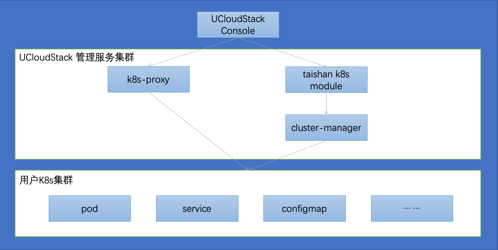
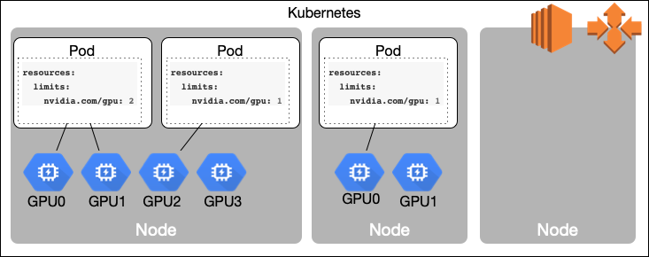
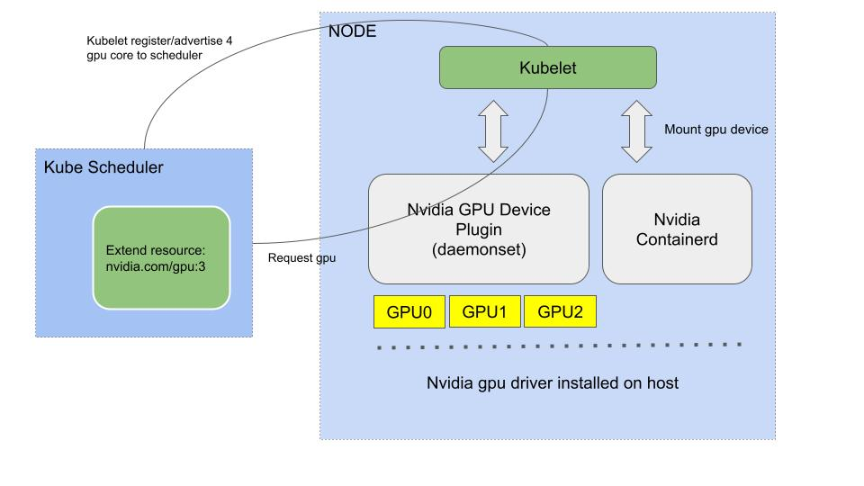
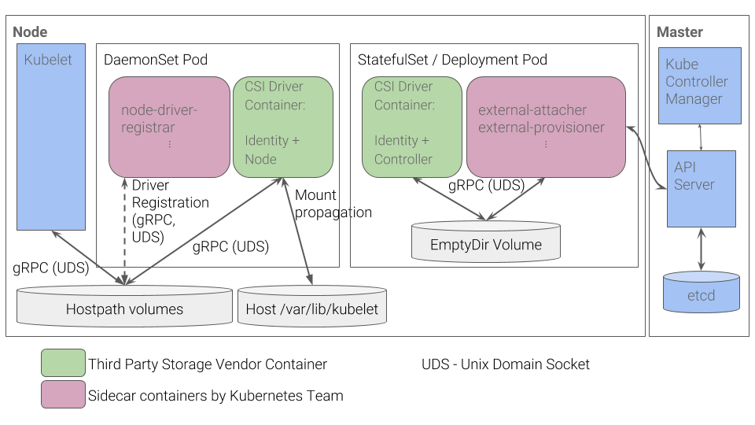
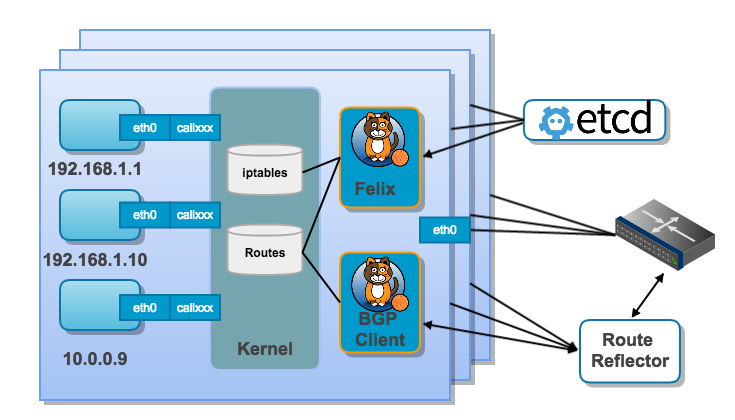
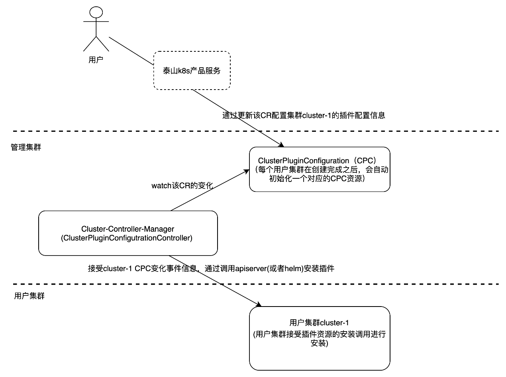
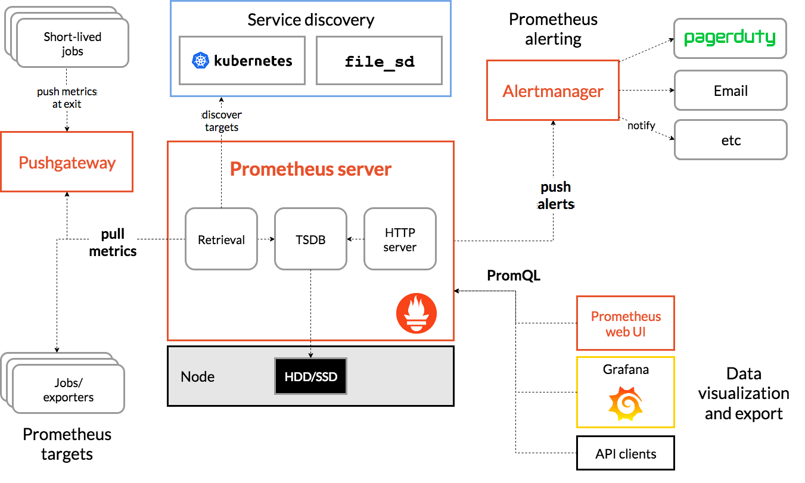
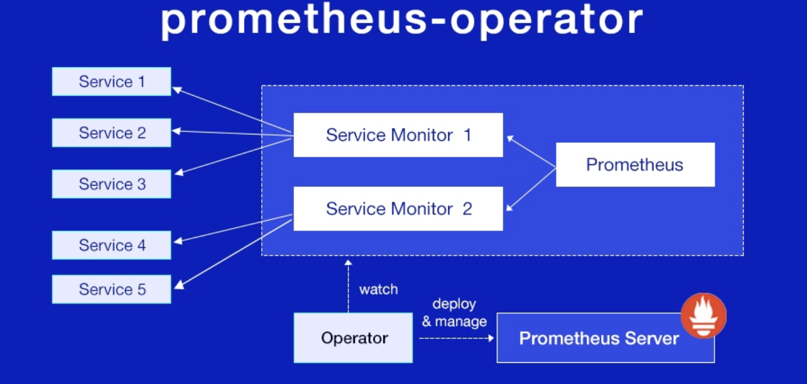
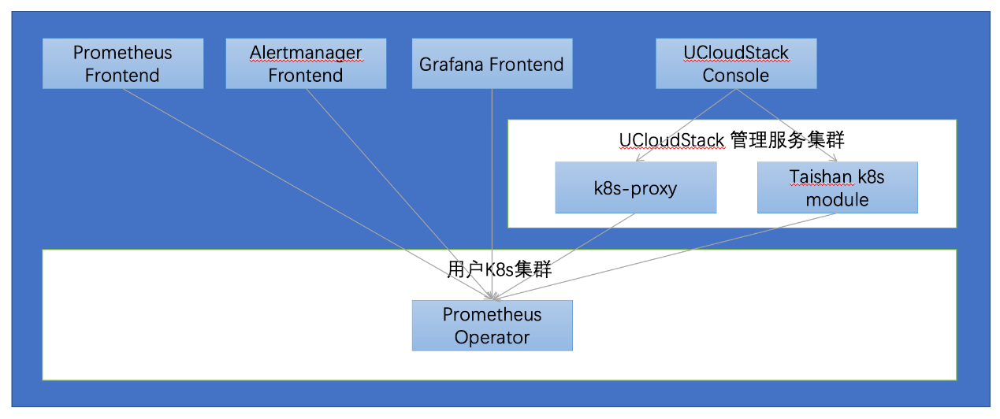

# 7 增值服务

UCloudStack 云平台在提供完善的基础服务的同时，也提供需要额外付费使用的增值服务供用户选择。

## 7.1 容器服务

UCloudStack容器服务基于Kubernetes，植入UCloud易用性与实用性结合的基因，为客户提供包含容器编排调度、可视化监控、CICD、应用中心等功能，成为助力企业容器化发展的用力支柱，帮助企业稳定高效的进行数字化转型。UCloudStack容器服务在提供了Kubernetes基础功能之外，还提供了相关组件，构成一套完整的容器应用易部署、易运维、易管理、全程可视，全生命周期管理的容器云服务。同事结合政企用户使用习惯，进行了界面以及操作流程优化，真正做到创建即用，通俗易懂，省略复杂的操作，迅速展现产品价值。

| **UCloudStack容器服务对象名称** | **Kubernetes原生概念**   |
| ------------------------------- | ------------------------ |
| 命名空间                        | Namespace                |
| 存储类                          | Storage  Class           |
| 持久卷                          | Persistent  Volume       |
| 持久卷声明                      | Persistent  Volume Claim |
| 资源配额                        | Resource  Quota          |
| 资源限制                        | Limit  Ranges            |
| 工作负载                        | Workload                 |
| 部署                            | Deployment               |
| 有状态副本集                    | StatefulSet              |
| 守护进程集                      | DaemonSet                |
| 任务                            | Job                      |
| 计划任务                        | CronJob                  |
| 容器组                          | Pod                      |
| 服务                            | Service                  |
| 配置字典                        | ConfigMap                |
| 保密字典                        | Secret                   |

​                                                                             UCloudStack容器服务与Kubernetes原生概念对照图

## 7.2 容器服务部署介绍

UCloudStack容器服务作为增值服务在部署阶段需要进行增值服务开启并进行单独授权。用户可以通过界面化操作获得激活码，将激活码转交给UCloud售后服务获得授权码，将授权码输入至部署界面即可完成容器服务的部署以及激活。

## 7.3 容器技术介绍

容器技术是实现操作系统虚拟化的一种途径，可以在资源受到隔离的进程中运行应用程序及其依赖关系。通过使用容器，可以轻松打包应用程序的代码、配置和依赖关系，将其变成容易使用的构建块，从而实现环境一致性、运营效率、开发人员生产力和版本控制等诸多目标。容器可以帮助保证应用程序快速、可靠、一致地部署，其间不受部署环境的影响。容器还赋予对资源更多的精细化控制能力，让基础设施的使用效率更高。通过下面这幅图可以很直观的反映出这两者的区别所在。

Docker属于Linux容器的一种封装，提供简单易用的容器使用接口。它是目前最流行的Linux容器解决方案。

而Linux容器是Linux发展出了另一种虚拟化技术，简单来讲，Linux容器不是模拟一个完整的操作系统，而是对进程进行隔离，相当于是在正常进程的外面套了一个保护层。对于容器里面的进程来说，它接触到的各种资源都是虚拟的，从而实现与底层系统的隔离。

Docker将应用程序与该程序的依赖，打包在一个文件里面。运行这个文件，就会生成一个虚拟容器。程序在这个虚拟容器里运行，就好像在真实的物理机上运行一样。有了Docker，就不用担心环境问题。

总体来说，Docker的接口相当简单，用户可以方便地创建和使用容器，把自己的应用放入容器。容器还可以进行版本管理、复制、分享、修改，就像管理普通的代码一样。

## 7.4 Kubernetes介绍

Kubernetes是Google开源的一个容器编排引擎，它支持自动化部署、大规模可伸缩、应用容器化管理。Kubernetes提供了服务发现和负载均衡、存储编排、自动部署和回滚、自我修复、配置管理等功能，帮助用户更好的对应用进行容器化部署。

**相关概念介绍**

**A. Master** 

作为Kubernetes集群的管理节点，负责集群的管理调度。管理节点主要有以下组件：

API server： 提供HTTP Rest接口的关键服务进程，通过该接口对Kuberenetes的对象进行增、删、改、查等操作。

Controller Manager：提供对所有Kubernetes资源对象的自动化控制，控制其当前状态达到其与其状态。

Scheduler：负责资源调度，将Pod调度到合理的Node节点。

Etcd：作为一个高可用的分布式键值数据库，存储了Kubernetes集群绝大部分数据信息。

 

**B. Node**

作为Kubernetes集群中实际运行Pod的服务节点，Node是Kubernetes集群操作的单元，用来承载被分配Pod的运行，是Pod运行的宿主机，与Master管理节点相关联。服务节点主要有以下组件：

kubelet：提供Pod对于的容器的全生命周期管理功能。

kube-proxy：提供实现Kubernetes Service的通信与负载均衡机制的功能。

Docker引擎：提供本机容器的创建和管理工作。

 

**C. Pod** 

运行在Node节点上，若干相关容器的组合。Pod是Kubernetes进行创建、调度和管理的最小单位。Pod内的所有容器使用相同的网络命名空间、IP地址和端口，能够通过localhost进行通信。

 

**D．Workload**

Workload是在 Kubernetes 上运行的应用程序。在Kubernetes中，Pod 代表的是集群上处于运行状态的一组容器。可以提供对一组 Pod进行管理的功能。使用资源配置控制器来确保合适类型的、处于运行状态的 Pod 个数是正确的，与期待状态一致。

Kubernetes 提供若干种内置的Workload：

 

Deployment：用来管理集群上的无状态应用，Deployment 中的所有 Pod 都是相互等价的，并且在需要的时候被换掉。

StatefulSet：用来管理有状态应用，能够运行一个或者多个以某种方式跟踪应用状态的 Pods。 

DaemonSet：提供节点本地支撑设施的 Pods。例如作为网络链接的辅助工具或者作为网络插件的一部分等等。每次向集群中添加一个新Node节点时，如果该Node节点与某 DaemonSet 的规约匹配，则控制面会为该 DaemonSet 调度一个 Pod 到该新节点上运行。

Job：用来表达的是一次性的任务。

CronJob ：用来表达某任务会根据其时间规划反复运行。

 

**E．Service**

Service定义了Pod的逻辑集合和访问该集合的策略，是真实服务的抽象。Service提供了一个统一的服务访问入口以及服务代理和发现机制，关联多个相同Label的Pod，用户不需要了解后台Pod是如何运行。

 

**F．Persistent Volume（PV）**

PV是集群中的一块存储，可以由管理员事先供应，或者使用[存储类（Storage Class）](https://kubernetes.io/zh/docs/concepts/storage/storage-classes/)来动态供应。 PV是集群资源，就像节点也是集群资源一样。PV 持久卷和普通的 Volume 一样，也是使用卷插件来实现的，只是它们拥有独立于任何使用 PV 的 Pod 的生命周期。

 

**G．Persistent Volume Claim（PVC）**

PVC表达的是用户对存储的请求。概念上与Pod类似。Pod会耗用节点资源，而 PVC 申领会耗用 PV 资源。Pod 可以请求特定数量的资源（CPU 和内存）；同样 PVC 申领也可以请求特定的大小和访问模式。

 

**H．Configmap**

ConfigMap是一种 API 对象，用来将非机密性的数据保存到键值对中。使用时， Pods 可以将其用作环境变量、命令行参数或者存储卷中的配置文件。

 

**I．Sercet**

Secret对象类型用来保存敏感信息，例如密码、OAuth 令牌和 SSH 密钥。将这些信息放在secret中比放在Pod的定义或者容器镜像中来说更加安全和灵活。

## 7.5 UCloudStack容器服务技术实现

### 7.5.1 集群管理

UCloudStack用户主要通过两种方式管理用户K8s集群：

1）通过k8s代理模块操作用户集群，api形式为K8s原生api形式，主要实现K8s原生功能

2）通过 UCloudStack 管理K8s模块操作cluster-manager服务管理用户集群，主要实现用户集群的生命周期管理，插件管理和扩缩容等功能，同时计费、账号权限均由管理模块提供支持

​																													用户K8S集群管理架构图

### 7.5.2 GPU节点

​																												K8S使用GPU节点架构图

 

底层资源需要先支持构建gpu的宿主资源，也就是创建的工作节点起码有一个节点带有gpu核心。宿主机资源需要安装GPU卡驱动，部署脚本在拿到部署命令的参数后，根据参数是否有gpu卡进行gpu驱动安装，目前支持NVIDIA gefore系列驱动，驱动版本型号为NVIDIA-Linux-x86_64-460.84。

部署脚本在安装过程中会安装驱动程序，这样宿主系统才可以识别出gpu具体的信息。

确认驱动安装情况可以使用NVIDIA-smi命令查看是否识别出gpu卡的信息，同时内核会加载对应的驱动模块，使用lsmod | grep NVIDIA判断。

 

​																							 k8s集群与GPU节点调用关系示意图

当前方案使用NVIDIA的device plugin提供pod访问gpu的支持。k8s集群部署的时候，会运行一个daemonset, 这个也就是NVIDIA的device plugin，默认情况下，会根据work node节点是否配置了gpu标记才启动，目前gpu标记由cluster controller进行设置，也就是创建的时候设置上，包括扩容也会设置上。

daemonset启动之后，会将资源注册到kubelet，kubelet同时会上报到kube scheduler，因而集群才感知到gpu资源的存在。需要使用gpu时，在负载资源要求出指明需要的gpu个数，kubescheduler在分配node时会将资源申请发到kubelet。

### 7.5.3 存储插件

CSI-Plugin 是Kubernetes生态中提供的一种存储扩展接口标准，主要功能是实现外置存储卷挂载到Pod内部，为Pod内部的应用提供存储服务。

​																													 CSI插件架构图

组件分类：

sidecar组件：社区提供的处理公共逻辑的镜像组件

自研组件：需要存储厂商/开发人员实现的组件，包括

CSI Controller Driver

CSI Node Driver

CSI Identity Driver（Controller、Node会同时实现该服务）

 

**sidecar组件：**

社区将CSI插件中和kubernetes交互的通用逻辑（如监听PVC的创建、volume与node的绑定关系等）进行了抽取并提供标准镜像，以sidecar容器的形式运行在自研Driver Pod中，用于简化CSI Driver的开发和部署。

**external-provisioner：**

用于CSI Controller Driver监听PVC资源，调用CSI Controller Driver的 CreateVolume/DeleteVolume 方法以 创建/删除 存储

 

**external-attacher：**

用于CSI Controller Driver监听VolumeAttachment资源，调用CSI Controller Driver的ControllerPublishVolume/ControllerUnpublishVolume 方法以将存储绑定/解绑到Node；如disk类型的driver，则是将云盘绑定到node所对应虚拟机上

 

**node-driver-registrar**

用于CSI Node Driver将CSI Node Driver按照kubelet的插件机制进行注册，以使kubelet知晓Node Driver监听的Socket地址

 

**livenessprobe**

用于CSI Controller && Node Driver简化Driver的健康检查配置，将Driver提供的GRPC方法Probe的可用性作为健康指标，通过http接口 /healthz 暴露给kubelet

 

**自研组件：**

由于sidecar容器的存在，自研组件只需根据CSI规范以及存储类型，实现对应的方法即可；自研组件通过unix domain socket将规范定义的GRPC方法暴露给调用方，如Kubelet、sidecar容器等

**CSI Identity service：**

通过GetPluginInfo方法提供驱动的信息：如驱动名称、版本

通过GetPluginCapabilities方法标明驱动支持的能力（如是否提供Controller服务、是否支持拓扑感知）

 

**CSI Controller service：**

负责存储卷的创建/删除、绑定/解绑。通常以deployment的形式部署。

 

**CSI Node service:**

负责存储的mount/unmount、格式化，以daemonset的形式部署在所有node节点上。

### 7.5.4 网络插件

UCloudStack容器服务采用Calico IPIP的模式，网络层互通即可通讯。原始包经过<tunl0>进行封装，通过路由器转发达到达到目标Node，再由其<tunl0>进行解封装，分发给目标容器。在这种模式下对物理网络环境没有特殊要求，只要节点之间IP层可以路由互通即可，同时封装协议IPIP的header更轻量，相交同类网络插件解决方案拥有更小的拆解包损耗。

​																											 Calico部署示意图

### 7.5.5 组件管理

插件系统(Plugin)为用户提供可插拔的方式扩展 UCloudStack 容器集群功能。

插件系统的是通过 kubernetes 的 Operator 机制实现的，整个控制流程在管理集群中实现，这样做的好处是无需侵入用户集群，安装类似 agent 的程序，弊端是由于无法监听用户集群内插件组件的状态变化，所以除了启用、禁用操作，无法实现更完整的状态调和。

### 7.5.6 监控告警

UCloudStack容器服务使用Prometheus来实现，Prometheus在集群范围获取metrics和事件数据，通过Grafana组件来进行展示，结合AlertManager进行告警。

​																											 Prometheus 架构图

 

上图为 Prometheus 的架构图，包含了 Prometheus 的核心模块及生态圈中的组件，简要介绍如下：

Prometheus Server: 用于收集和存储时间序列数据。

Client Library: 客户端库，为需要监控的服务生成相应的 metrics 并暴露给 Prometheus server。当 Prometheus server 来 pull 时，直接返回实时状态的 metrics。

Push Gateway: 主要用于短期的 jobs。由于这类 jobs 存在时间较短，可能在 Prometheus 来 pull 之前就消失了。为此 jobs 可以直接向 Prometheus server 端推送它们的 metrics。这种方式主要用于服务层面的 metrics，对于机器层面的 metrices，建议使用 node exporter。

Exporters: 用于暴露已有的第三方服务的 metrics 给 Prometheus。

Alertmanager: 从 Prometheus server 端接收到 alerts 后，会去除重复数据，分组，并路由到对应的接受方式，发出报警。

 

 

​																											 Prometheus Operator 架构图

Prometheus 作为一个核心的控制器，它会创建 Prometheus、ServiceMonitor、AlertManager 以及我们的 prometheus-rule 这四个资源对象，operator 会一直监控并维持这四个资源对象的状态，其中创建Prometheus 资源对象就是最为 Prometheus Server 进行监控，而 ServiceMonitor 就是我们用的 exporter 的各种抽象(exporter 就是提供我们各种服务的 metrics 的工具)。Prometheus 就是通过 ServiceMonitor 提供的 metrics 数据接口把我们数据 pull 过来的。现在我们监控 prometheus 不需要每个服务单独创建修改规则。通过直接管理 Operator 来进行集群的监控。这里还要说一下，一个 ServiceMonitor 可以通过我们的 label 标签去匹配集群内部的 service，而我们的 prometheus 也可以通过 label 匹配多个 ServiceMonitor。

​																									UCloudStack容器服务监控告警架构图

UCloudStack 容器服务监控告警服务前端通过 Kubernetes 代理服务和管理 K8S 模块与用户 K8s 集群中的 Prometheus Operator 进行交互，通过操作 Prometheus Operator 的 Kubernetes CRD 资源管理监控告警服务；用户 K8s 集群可以将 Prometheus、Alertmanager 和 Grafana 暴露内网或外网使用。