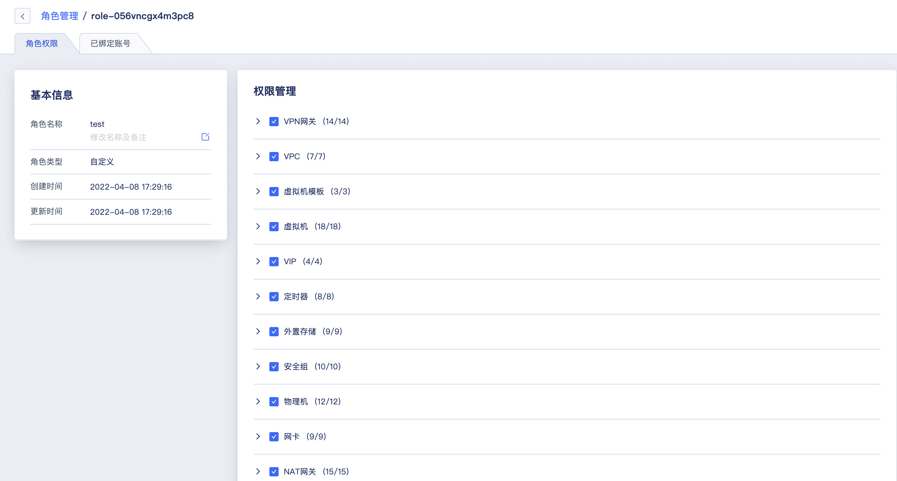
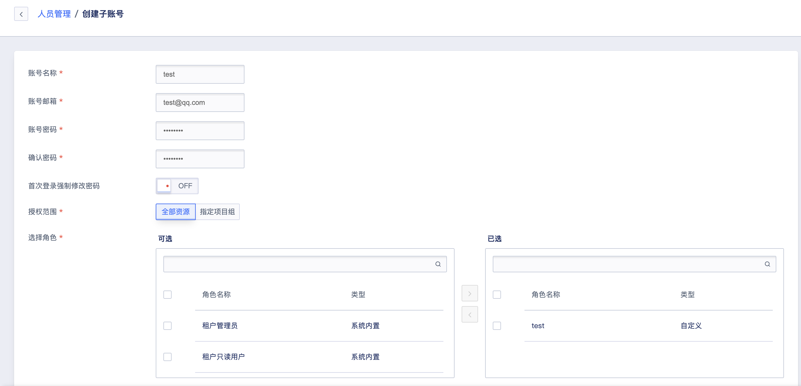

# 22 组织和账号管理

组织和账号管理主要为企业用户提供组织架构管理，支持多租户模式，每个租户可代表一个组织/公司/子公司/部门。

**概念解释**

- **租户**

  平台支持多租户模式，用于有多级组织架构的企业，可将租户作为一个单独的公司/子公司/部门进行运营，有效实现权限管理，除低总公司、子公司及不同部门资源混用可能造成的风险，并可实现资源审计。

  租户是平台中一组资源的集合，提供资源隔离、子账号、权限控制、配额及价格配置等能力。不同租户间资源通过 VPC 网络及权限实现强隔离；租户内所有主账号和子账号的资源、费用、配额及审批均归属于租户。

- **账号**
  - **主账号**：一个租户默认有一个主账号，主账号即为租户下的初始管理人员，默认有租户下所有资源的管理权限以及组织管理权限。主账号可通过创建子账号，并管理子账号的权限。
  - **子账号**：子账号是主账号创建的用户，子账号在租户下的权限由主账号控制。一个租户可拥有多个子账号，支持对子账号进行资源管理的权限控制。
- **人员**：企业中的人员，人员需要使用账号登录云平台使用资源。
- **角色**：权限的集合，为用户和成员组赋予权限可获得调用相关API进行资源操作的能力。
- **项目组**：以项目组为维度进行资源规划，可为一个具体项目或者业务建立独立的资源池，实现资源更细粒度地管理。同时针对子账号的授权也是基于项目组维度进行授权。项目组只是逻辑上面的分组，不具有资源隔离的作用。
- **流程审批**：为了满足企业对核心云资源，如虚拟机、云硬盘、外网IP等资源使用的管控需求所引入的云资源工单审批流程。
- **审批管理**：审批管理仅平台管理员admin可以进行操作。

## 22.1 我的账号

可在账号和组织/我的账号页面可以查看账号基本信息并进行账号安全设置。

账号基本信息包括账号 ID、角色 ID、账号名称、账户邮箱、外部充值余额、平台充值余额及创建时间等信息。

- 账号 ID：当前登录平台账号的唯一标识 ID  ；
- 账号名称：当前登录平台账号的账号名称或昵称，可直接通过编辑按钮进行修改，支持中文、英文或字符；
- 账号邮箱：当前登录平台账号的邮箱地址；
- 外部充值余额：指通过支付宝、微信、银行及新浪支付充值的金额；
- 平台充值余额：平台的增金，一般由平台管理员进行充值；
- 创建时间：指当前账户的注册时间或创建时间。

账号安全是平台为用户账号提供的安全防护功能，可通过定期修改登录密码、开启双子因验证登录保护，设置访问限制以保证登录账号的安全。对于需要调用API 用户，云平台可为开发者提供 API 公钥和私钥信息，可通过复制密钥信息用于操作 API 指令，具体操作方式可参考 API 开发者手册。

### 22.1.1 修改登录密码

平台支持用户修改账号登录密码，可在我的账号页面对密码进行修改。

> 修改密码需要验证旧密码，若忘记旧密码，可联系管理员在后台帮助修改密码。

### 22.1.2 开通登录保护

平台提供基于 TOTP（Time-Based One-Time Password Algorithm）的免费登录二次认证服务，开通本服务后，账号登录控制台均需通过授权认证。开通登录保护的前提条件如下：

（1）开通对象为独立主账号或子账号；

（2）移动设备上安装有 FortiToken 或其他基于 TOTP 技术的令牌工具；

（3）推荐使用 FortiToken 。

> 为了降低用户账号密码泄漏造成的风险，建议您开通账号登录二次认证

#### 22.1.2.1 开通步骤

1. 登录控制台并进入账号与组织管理页面，在我的账号页面，可查看当前登录保护设置。未设置情况下，可点击“设置”按钮开启登录保护。

2. 检查移动设备上是否安装 FortiToken ：

   - 页面提供 IOS 和 Android 用户工具下载地址，若您未安装 FortiToken 可通过扫码下载。
   - 安卓手机用户也可以通过手机品牌商提供的应用商店搜索和下载 FortiToken 。

3. 打开 FortiToken 工具，扫码获取授权码，也可手动输入密钥获取授权码。

4. 在页面方框内输入获取到的授权码，完成绑定。

#### 22.1.2.2 关闭登录保护

登录控制台并进入账号与组织管理页面，在我的账户页面，可查看当前登录保护设置。已设置情况下，如果需要关闭登录保护设置，可点击“设置”按钮。按照页面提示获取并输入授权码即可关闭二次认证功能。

#### 22.1.2.3 功能应用

二次认证服务开通后，账号密码登录平台时会要求输入认证码，系统判断认证码有效后，即可成功登录平台。

#### 22.1.2.4 登录保护 FAQ

Q：如何下载 FortiToken ？

A：账号绑定页面提供 ISO 和 Android 工具下载链接，可选择通过移动设备扫码下载。若使用的是基于 Android 系统的移动设备，可通过移动设备本身提供的应用下载市场搜索和下载 FortiToken 身份认证器。

------

Q：FortiToken 无法扫描获取授权码怎么办？

A：可切换至手动获取，手动输入账号密钥绑定并获取授权码。

------

Q：是否可以用其他工具绑定账号？

A：若使用的是 FortiToken 身份认证方式，可以用基于 TOTP 算法的其他动态令牌工具绑定账号，如微信小程序“二次验证码”等，75为安全起见，推荐使用谷歌官方 “FortiToken” 。

### 22.1.3 登录访问限制

为进一步保障账号安全，平台提供登录访问限制能力，可为租户设置可登录控制台和访问平台API的客户端API地址。配置后租户下的所有账号只能从指定的 IP 登录或发起 API 访问，有效保证账户登录及资源的安全性。

* 支持配置多个 IP 地址或 IP 地址段，多个 IP 地址/段间使用英文逗号进行分隔。
* 配置的 IP 地址 或 IP 地址段为白名单模式，即配置的 IP 地址/段客户端才可正常登录控制台或访问 API 。
* 默认不指定任何 IP ，代表不限制登录控制台和访问 API 的客户端 IP 地址，即默认全网可访问登录控制台。

> 如果出现登录 IP 地址设置错误，导致租户下所有账号均无法登录时，可联系平台管理员通过管理控制台侧修改租户的登录访问限制策略。

可通过【账号安全】中“登录访问限制”功能进行登录策略配置，如下图所示，默认为空代表全网无限制。

可在登录访问范围内输入可登录平台的 IP 地址或 IP 地址段，点击确认即可生效。配置成功后，用户使用账号在未指定的 IP 网络中无法正常登录控制台，并提示当前的 IP 地址，如下图所示：

平台仅可限制访问控制台的 IP 地址，即直接请求到控制台 URL 地址的客户端 IP 地址，如用户访问平台的客户端地址在 NAT 路由内，则平台配置登录策略时，需要放通 NAT 后的 IP 地址，即需要将 NAT 后的出口地址配置在登录访问策略的白名单中，保证 NAT 路由器内的客户端均可正常访问控制台。

### 22.1.4 API 密钥

通过账户安全租户可查看属于当前账号的 API 密钥 ，用于管理并使用 API 接口。可通过点击复制按钮进行公私密钥的信息复制，以方便 API 指令的调用。

## 22.2 查看租户配额

可在账号和组织/配额信息页面查看租户下配额限制以及配额当前使用情况。

**配额（quota**）是一个租户在单个地域下可创建的云资源上限。通过限制每个账户拥有的资源配额，可合理分配云平台资源，提升资源利用率的同时，满足云平台上每一个账号的资源需求。租户初始化时，在每个数据中心都拥有默认配额。同时，云平台管理员可自定义每个租户的资源配额。

租户下的每个人员在使用账号创建资源时，创建数量的上限不能够超过租户下配额上限。如租户中云硬盘的配额为 10 ，则主账号和子账号可创建的云硬盘数量上限不可超过 10 个。可以分地域查看每个地域下的配额信息，配额列表的字段如下：

- 产品类型和资源类型：

  虚拟机：虚拟机个数

  安全组：安全组个数

  镜像：镜像个数

  云硬盘：云硬盘个数

  VPC：VPC个数

  VPC：子网个数

  外网IP：外网弹性IP个数

  网卡：弹性网卡个数

  VPN网关：VPN网关个数

  VPN网关：隧道个数

  VPN网关：隧道个数

  NAT网关：NAT网关个数

  容器集群：容器集群个数

  容器镜像仓库：命名空间个数

  容器镜像仓库：容器镜像仓库个数

  负载均衡：负载均衡个数

  负载均衡：SSL证书个数

- 配额：当前配额项在一个地域或全部地域可创建的资源数量；

- 更新时间：当前配额项的修改更新时间。

## 22.3 项目组管理

在账号和组织管理/项目组管理页面，可对项目组进行查看和管理。项目组可以帮助进行资源分组管理，帮助解决资源的精细化管理以及授权管理等复杂性问题。

> 未被分组的资源所有用户都对其具有查看和管理的权限，分组的资源根据用户的角色授权决定用户是否对组中资源具有权限。

### 22.3.2 创建项目组

项目组可以帮助您进行资源编组管理，并且可以配合项目组对租户下人员进行精细化权限管理，建议您在租户开通后，就为租户规划好项目组。

创建项目组时输入参数：名称和备注。创建完毕后，可以通过转入/转出资源管理项目组内对资源。

> 租户下有项目组时，主账号创建资源可以指定项目组或者选择不分组，不分组的资源只有主账号能够查看和管理。子账号创建资源时，必须选择项目组。

### 22.3.3 项目组管理

支持对项目组进行资源管理，通过转入转出资源来管理项目组下的资源。转入资源到项目组时，可以选择不在当前项目组下的所有资源，可以在资源列表处查看到资源所属项目组。

转出资源到其他项目组时，只能够指定当前项目组下的资源，且转出到的项目组只能够时其他项目组。资源被转出到其他项目组后，有该项目组授权的用户将无法再查看和管理此资源。

> 资源转入/转出时以产品类型为维度，一次可以转入/转出同一产品类型下的多个资源。VPN网关、负载均衡、伸缩组中有多个维度的资源，请在转入转出时注意将关联资源分配到同一组内。

支持修改项目组名称和备注。

支持删除项目组，删除项目组不会影响资源，删除项目组后所有资源不再归属于任何项目组。您可以再将资源转入到其他项目组中。

> 项目组下存在角色授权时，需要先移除角色授权后，才能够删除项目组。

## 22.4 角色管理

在账号和组织管理/角色管理页面可查看和管理租户下所有的角色。角色分为两种类型，系统内置角色和自定义角色。其中，系统内置角色是平台提供给用户，以快速授权的角色给子账号，不能够编辑和删除。目前内置角色包括管理员和只读用户两个：
- 管理员
此角色中包含了租户下所有云资源操作和组织管理操作的授权。如果您不需要对子账号进行精细地权限管理，可直接使用系统管理员为子账号进行角色授权，更快捷地进行操作。
- 只读用户
此角色仅包含所有资源和组织管理功能的查看权限。

### 22.4.1 创建角色

可通过创建角色创建出一个自定义角色，创建角色时需要输入以下信息：
名称：为角色设置合适的名称。
备注：可选项
权限设置：可分产品类型，按照查看、增加、编辑、删除的四个维度授权每个产品的操作权限，也可以根据实际使用需求，只勾选某几项权限。

> 创建角色时，系统默认勾选的操作，为各个模块必须要授权上的操作，建议不要取消，避免影响授权的完整性。如果您不需要为用户授权某个模块的权限，可以取消默认勾选的操作。

### 22.4.2 管理角色

可对角色进行编辑、修改名称和备注、删除、查看角色详情以及查看角色的授权记录。

点击进入详情页面，查看和更新角色的权限集合，可以更新每个产品类别下的任意权限的授权。

> 更新角色授权的权限集合后，用此角色授权的用户，在授权范围下的权限也会更新。

## 21.5 人员管理

支持通过人员管理对租户下所有账号进行管理，建议谨慎地创建和管理组织下的账号，并为账号添加上适当的角色授权，防止权限扩大化，导致资源管理的混乱，影响企业IT资源使用的安全。

### 22.3.1 创建子账号

具有子账号创建权限的账号，可以在账号和组织管理/人员管理页面创建子账号。创建子账号需要输入以下参数：

- 账户名称: 为账户指定一个具有标志性的名称
- 邮箱：账户的电子邮件地址，必须实际有效的邮箱地址；
- 密码/确认密码：新建子账号的登录密码，密码须包含有大小写字母、数字、符号中的两种，密码长度为 `6-64` 个字符。
- 首次登录强制修改密码：可设置账号首次登录是否需要强制修改密码。
- 授权范围：可以选择可子账号授权所有项目组资源/指定项目组资源。当资源没有项目组时
- 角色：为子账号在授权范围下授权合适的角色，支持同时授权多个角色，最后生效的权限为多个角色所允许操作的集合。

> 创建子账号前，建议先通过项目组对资源进行编组，并配置好子账号需要授权的角色。如果不需要授权自定义角色，可直接使用系统内置角色。

用户使用子账号登录后，可以正常查看一切操作，在进行相关操作时，会提示“权限不足”。比如一个用户未被授权查看虚拟机的权限，则在虚拟机列表处看到如下提示。

### 22.3.2 查看账号列表

可在人员管理界面查看租户下所有账号列表和详情信息。租户下默认有一个主账号，可以有多个子账号。列表参数如下：

- 账号ID ：当前账号在云平台全局的唯一标识符；
- 账号名称：当前账号的名称；
- 邮箱：当前账号的登录邮箱地址；
- 类型：标识账号为主账号还是子账号
- 状态：当前账号的状态，包括使用中、冻结中、删除中：
  - 使用中的用户可登录控制台，并可使用并管理资源；
  - 冻结中的用户无法登录控制台，并禁使使用并管理资源；
- 操作项：对单个账号的操作项，包括查看详情、冻结和解冻、添加角色授权、删除

#### 22.3.2.2 子账号详情

子账号详情页面可查看基本信息和角色授权记录，并管理子账号的角色授权

- 基本信息：当前子账号的基本信息，包括 ID、角色、账号邮箱及创建时间、更新时间；
- 角色管理：可管理子账号的角色授权，包括添加新的角色授权和移除已有的授权角色。

### 22.3.3 冻结账号

冻结账号是指将一个账号进行锁定，冻结后将不允许登录控制台。仅支持状态为“**使用中**”的账号进行冻结操作，用户可点击账号列表操作项中的“冻结”对账号进行冻结。

> 平台管理员可对租户进行冻结，冻结后主账号和所有子账号都被冻结。

### 22.3.4 解冻账号

解冻账户是指解冻一个已冻结的账号，被成功解冻的的用户，可登录管理控制台。仅支持状态为“**冻结中**”的账号进行解冻操作，用户可点击子账号列表操作项中的“解冻”对子账号进行解冻。

###22.3.4 删除账号

可对账户进行删除，删除账号后用户无法再使用此账号密码登录平台。删除后，可以再使用账号邮箱在平台注册或者创建新的账号。

