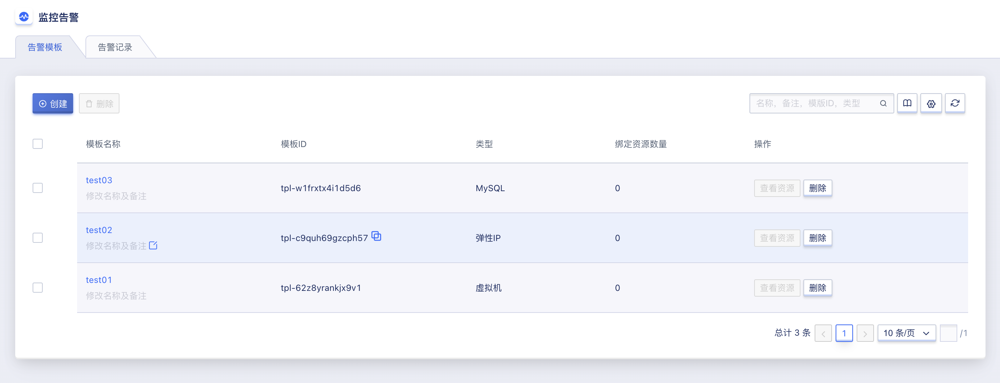
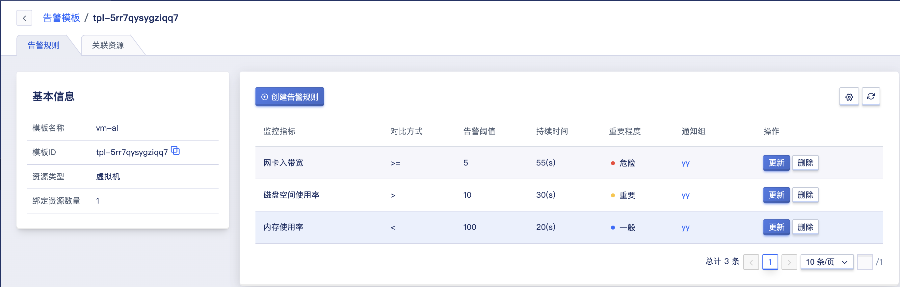
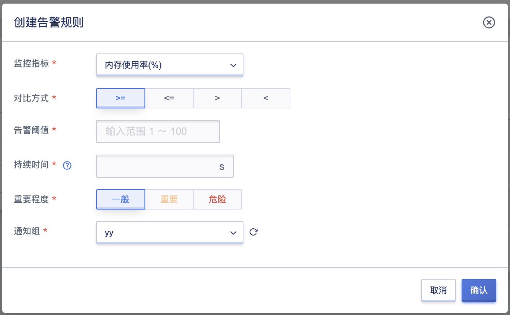
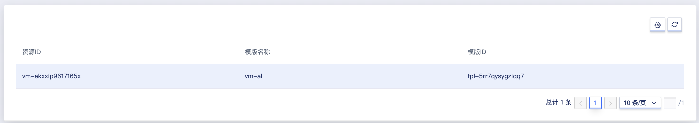
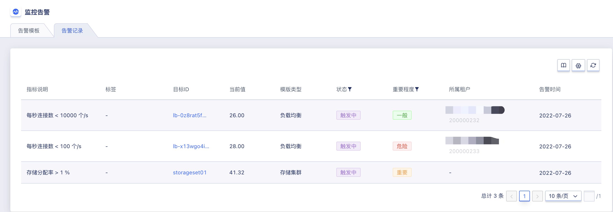

# 19 监控告警

监控告警是 UCloudStack 平台全线产品的运维监控及告警服务，提供全线资源实时监控数据及图表信息，可根据监控数据批量为资源设置告警策略，并在资源故障或监控指标超过告警阈值时，以邮件的方式给予通知及预警；同时监控告警服务实时为用户提供资源告警状态，让用户精准掌控业务和各云产品的健康状况，全方位保障业务的可靠性和安全性。

监控告警服务提供监控图表、告警模板、通知组及告警记录四大架构功能，整体架构功能均以监控数据为基准：

- 云平台通过智能化数据采集系统，租户对虚拟机、云硬盘、EIP 、负载均衡、NAT 网关、弹性伸缩、VPN 网关，对象存储，文件存储等资源指定的监控指标数据进行完整挖掘；管理员可对节点、计算集群、存储集群指定的监控指标数据进行完整挖掘；
- 将采集来的监控数据存储至数据库中，并根据指定规则对数据进行检索及统计，通过指定的时间维度及数据粒度以图形化的方式显示监控图表；
- 基于已有的监控数据，用户可通过配置告警模板，为指定的监控指标指定告警阈值、持续时间、重要程度、通知组及选择对比方式，可通过设置告警持续时间，判定区分不同等级的告警及通知；
- 为告警模板配置通知组，指定在发生告警时通知事件的通知人及通知方式；
- 在告警期间，可通过告警记录查询实时告警信息，以判断故障的发生时间和重要程度。

## 19.1 监控图表

监控图表指平台将智能化采集的资源运行数据，根据指定的资源及指标等筛选规则进行检索并统计，通过指定的数据粒度及时间维度以图形化的方式显示监控图表。通过监控图表，用户可以直观的查看并了解平台上已运行虚拟资源的性能、容量及网络状态等状态，及时了解资源的健康状况及故障节点。

平台为租户构建的虚拟机、弹性 EIP 、负载均衡、NAT 网关、弹性伸缩、VPN 网关、对象存储、文件存储分别提供多种监控指标的实时和历史监控图表，并可根据监控指标项配置相关告警模板，用于阈值超标时给予告警及通知。

- 虚拟机监控图表：通过虚拟机详情页面的监控信息栏可查看单台虚拟机的监控信息，包括网卡出/入带宽、网卡出/入包量、磁盘读/写吞吐、磁盘读/写次数、平均负载、空间使用率、内存使用率、CPU使用率、GPU使用率、GPU总显存、GPU显存使用量、GPU总消耗、GPU平均功耗、GPU温度；
- 弹性 EIP 监控图表：通过 EIP 详情页面的监控信息可查看单个 EIP 资源的监控信息，包括网卡出带宽使用率、入带宽、出带宽、入包量、出包量；
- 负载均衡监控图表：通过负载均衡详情页面的监控信息可分别查看负载均衡实例和VServer监听器的监控信息，监控图表包括LB每秒连接数、LB每秒网卡出/入流量、LB每秒网卡出包数量、VServer 连接数、HTTP 2XX、HTTP 3XX、HTTP 4XX、HTTP 5XX；
- NAT 网关监控图表：通过 NAT 网关详情页面的监控信息可查看单个 NAT 网关的监控信息，包括网卡入带宽、网卡出带宽、连接数、网卡入包量、网卡出包量。
- VPN 网关监控图表：通过 VPN 网关服务详情页面的监控信息可查看单个网关的监控信息，包括网关出/入带宽、网关出带宽使用率、网关出/入包量。
- VPN 隧道监控图表：通过 VPN 隧道服务详情页面的监控信息可查看单个隧道的监控信息，包括隧道出/入带宽、隧道出/入包量及隧道健康状态。
- 对象存储监控图表：通过对象存储服务详情页面的监控信息可查看，包括CPU使用率、内存使用率、对象数量、存储容量、当前存储量、存储容量使用率、存储总写吞吐、存储总读吞吐。
- 文件存储监控图表：通过文件存储详情页面的监控信息可查看，包括CPU使用率、内存使用率、存储容量、当前存储量、存储容量使用率、存储总写吞吐、存储总读吞吐。

平台为管理员的节点、计算集群、存储集群提供多种监控指标的实时监控图表，并可按照用户的需求对告警模版进行配置，用于阈值超标的时给予告警和通知。

- 节点监控图表：通过节点详情页面的监控信息可查看，包括CPU使用率、内存使用率、GPU使用率。
- 计算集群监控图表：通过计算集群详情页面的监控信息可查看，包括CPU分配率、内存分配率、GPU分配率。
- 存储集群监控图表：通过存储集群详情页面的监控信息可查看，包括存储分配率。

监控图表可根据时间维度展示实时监控数据，同时支持查看 1 小时及自定义时间的监控数据及图表信息。

## 19.2 告警模板

告警模板是 UCloudStack 平台监控告警服务为用户提供的一种批量设置资源告警的功能，通过预先定义模板中的告警规则及通知规则，将模板中定义的规则应用到虚拟资源；若虚拟资源的监控指标数据达到或超过告警规则中设定的阈值及条件，则根据通知规则中定义的通知方式发送告警通知到指定的联系人。

根据不同的资源类型，可定制不同监控指标及阈值的告警规则，并可选择将监控指标应用至关联资源的单个网卡或磁盘设备，满足多种应用场景下的监控报警需求。

- 告警模板是由多条告警规则及关联资源构成的；
- 一个告警模板仅支持绑定一种类型资源，包括虚拟机、外网弹性 IP、NAT 网关、负载均衡 及 VPN 网关等；
- 每个告警模板可包含多条告警规则，每条告警规则包含监控指标、对比方式、告警阈值、持续时间、重要程度及通知组；
- 每个告警模板仅支持绑定一个通知组，每个通知组可包含多个通知人，支持邮件的通知方式。

### 19.2.1 创建告警模板

用户可指定资源类型、模板名称及备注快速创建一个告警模板，在告警规则管理中创建配置适用于业务需求的告警规则，最后将告警模板关联至虚拟资源，完成监控告警的配置。用户可通过控制台导航栏“监控告警”进入监控告警配置控制台，通过“告警模板”页面的“**创建**“按钮进入告警模板创建向导页面，如下图所示：

- 模版类型：告警模板需绑定资源的类型，包括虚拟机、外网弹性 IP、NAT 网关、负载均衡，对象存储、文件存储 及 VPN 网关等，一个告警模板仅支持一种资源类型；
- 模板名称/描述：告警模板的名称标识及全局唯一标识符；

点击确定后，向导页面即返回告警模板列表，通过告警模板列表即可查看已创建的资源列表及信息。

### 19.2.2 查看告警模板

用户可通过导航栏进入告警模板资源控制台查看告警模板的资源列表，同时可通过点击列表上告警模板的名称进入模板详情页面，用于查看告警模板的详细信息、告警规则管理及绑定资源的管理。

#### 19.2.2.1 告警模板列表

告警模板列表页面可查看当前账号下已拥有的模板列表，包括名称、ID、资源类型、绑定资源数量及操作项，如下图所示：

- 名称/ID ：当前告警模板的名称和全局唯一标识符；
- 资源类型：当前告警模板创建时所指定的资源类型；
- 绑定资源数量：当前告警模板已关联的资源数量；
- 操作：对单个告警模板的操作项，包括详情、查看资源及删除；
- 可通过搜索框对资源列表进行搜索和筛选，支持模糊搜索。

#### 19.2.2.2 告警模板详情

通过告警模板列表的“名称”进入模板详情页面，可查看当前告警模板的详情信息，如下图所示，详情页面分为基本信息、告警规则管理及资源绑定管理：

- 基本信息：当前告警模板的基本信息，包括名称、ID、资源类型、已绑定的资源数量等信息，其中已绑定的资源数量若为空时，显示为 “0” ；
- 告警规则管理：当前告警模板的告警规则管理，包括告警规则的创建、查看、更新、删除等，具体管理操作详见：[告警规则管理](#19.2.5 告警规则管理) ；
- 资源绑定管理：当前告警模板关联资源的管理，即告警模板中的规则可生效的资源，包括绑定资源、已绑定资源查看及解绑资源，具体管理操作详见：[绑定资源管理](#19.2.6 查看绑定资源) 。

### 19.2.3 查看资源

查看资源指查看当前告警模板已绑定资源的信息，点击后可进入 [绑定资源管理](#19.2.6 查看绑定资源) 。

### 19.2.4 删除告警模板

仅当告警模板中未绑定任何资源时才可进行删除操作，被成功删除的告警模板将直接被销毁。用户可通过监控告警模板资源控制台中的“**删除**”进行模板的删除操作，如下图所示：

删除告警模板操作被确认后，系统自动返回至告警模板列表页面，在列表页面可查看删除过程，待该资源被清空时即成功删除。

### 19.2.5 告警规则管理

告警规则是告警模板的核心，每个告警模板均由 1 条或多条告警规则组成。被绑定至告警模板的资源监控指标数据会根据告警规则中定义的阈值触发相关告警策略，并通过告警规则中的通知方式进行告警信息的通知，以便快速入处理告警或故障。

#### 19.2.5.1 创建规则

用户可通过告警模板详情页面的“**创建**”功能进行告警规则的创建，创建告警规则时需指定监控指标、对比方式、告警阈值、持续时间、触重要程度及通知组参数，如图所示：

- 监控指标：仅可选择告警模板资源类型所包含的监控指标，一条告警规则仅支持一个监控指标：
- 对比方式：指监控指标的实际数据与告警阈值的比较方式，代表当前告警规则的告警逻辑，包括 `>=`、 `<=`、`>`、 `<` ：
  - 当选择 `>=` 时，即代表监控数据大于或等于阈值时触发一次告警周期；
  - 当选择 `<=` 时，即代表监控数据小于或等于阈值时触发一次告警周期；
  - 当选择 `>` 时，即代表监控数据大于阈值时触发一次告警周期；
  - 当选择 `<` 时，即代表监控数据小于阈值时触发一次告警周期；
- 告警阈值：指监控指标数据的临界值，与监控指标数据进行对比，符合对比方式即触发一次告警周期，如 CPU 使用率的告警阈值为 80，对比方式为大于等于，即 CPU 使用率大于等于 80% 即触发一次告警周期；
- 持续时间：监控指标数据触发阈值持续的时间，持续时间内均达到告警阈值才会触发告警 ；
- 重要程度：用户可根据业务需要在创建告警规则时选择合适的等级，分为一般、重要、危险三种，在告警记录中可根据重要程度进行记录的筛选；
- 通知组：即触发告警周期且需要发送通知时，发送告警通知的方式及联系人。

选择并配置完成后，点击确定可返回告警模板详情页面，通过告警规则列表可查看已创建成功的告警规则。

#### 19.2.5.2 查看规则

可通过告警模板详情页面查看当前模板包含的规则列表，列表信息包括监控指标、对比方式、告警阈值、持续时间、重要程度、通知组及操作项，如下图所示：

其中操作项是指对单条通知规则的操作，包括更新及删除，分别指对单条告警规则的修改和删除。

#### 19.2.5.3 更新规则

更新规则是指对单条告警规则的修改，修改项的选择与配置与创建告警规则相同，可参考 [创建规则](#_19251-创建规则) 。

#### 19.2.5.4 删除规则

删除告警规则指对单条告警规则的删除。规则被删除后即直接销毁，可重新添加该监控指标的告警规则。

### 19.2.6 查看绑定资源

通过告警模板详情的资源标签，进入告警模板资源绑定管理页面，可查看已绑定资源的列表及信息，包括绑定资源的 ID、模版名称、模版ID，如下图所示：

## 19.3 告警记录

告警记录是指当前账户所有告警记录及信息，通过告警记录实时的历史告警信息：

如上图所示，告警记录列表信息包括告警的指标说明、目标ID、模版类型、标签、当前值、状态、重要程度及告警时间：

- 指标说明：触发当前告警记录的资源监控指标项，即数据来源；
- 模版类型：触发当前告警记录的资源类型及资源；
- 标签：显示磁盘空间使用率指标的数据盘信息；
- 目标ID：告警模版监控的资源ID；
- 当前值：即触发告警或恢复告警时当前告警记录监控指标的数据值；
- 状态：告警记录的当前状态，分为触发中、待触发、未触发，可根据需求进行状态的筛选；
- 重要程度：根据监控规则显示当前告警记录的重要程度，包含危险、重要、一般，可根据需求进行告警记录的筛选；
- 告警时间：触发告警规则的具体时间。

