# 24 应用商店

## 24.1 应用介绍

### 24.1.1 终端检测响应平台EDR

深信服终端检测响应平台EDR，围绕终端资产安全生命周期，通过预防、防御、检测、响应赋予终端更为细致的隔离策略、更为精准的查杀能力、更为持续的检测能力、更为快速的处置能力。在应对高级威胁的同时，通过云网端联动协同、威胁情报共享、多层级响应机制，帮助用户快速处置终端安全问题，构建轻量级、智能化、响应快的下一代终端安全系统。

### 24.1.2 数据库审计UDAS

数据库审计系统（UCloud Database Audit System）是一款专业对数据库实时记录网络上的数据库活动，对数据库操作进行细粒度审计的合规性管理，对数据库遭受到的风险行为进行实时告警，方便事故追根溯源，同步加强内外部数据库网络行为的监控与审计，提高数据资产安全，帮助企业满足网络安全等级保护等合规要求。

### 24.1.3 堡垒机

运维审计系统也是运维审计型堡垒机，用于对运维人员的操作权限进行控制和操作行为审计。堡垒机的作用主要体现在以下几个方面：杜绝权限滥用,发现违规操作,降低人为安全风险,降低工作复杂度。堡垒机综合了运维管理和安全性，切断了人员对网络和服务器资源的直接访问，而是采用协议代理的方式，接管了人员对网络和服务器的访问。形象的说，人员对云主机的访问需要经过堡垒机的翻译。

### 24.1.4 山石vRAS

山石网科vRAS以虚拟机形态部署，适用于云计算环境。山石网科漏洞扫描系统（Remote Assessment System，简称“RAS”）是一款综合漏洞管理系统，能够提供全方位的系统扫描检查与评估方案，支持对主流操作系统、Web站点、数据库系统、网络设备、安全设备等进行深度扫描，协助管理者高效、准确的对内部系统进行实时自检，及时发现可被攻击者利用的安全漏洞、弱口令、错误配置等安全问题，并提供详细、专业的安全建议和修补方案，有效提升整个网络的健壮性、安全性。

## 24.2 应用使用

### 24.2.1 查看终端检测响应平台EDR

云平台用户可通过控制台查看终端检测响应平台EDR的产品概述，产品亮点，终端系统支持的硬件信息，推荐配置，使用场景，默认访问信息等。

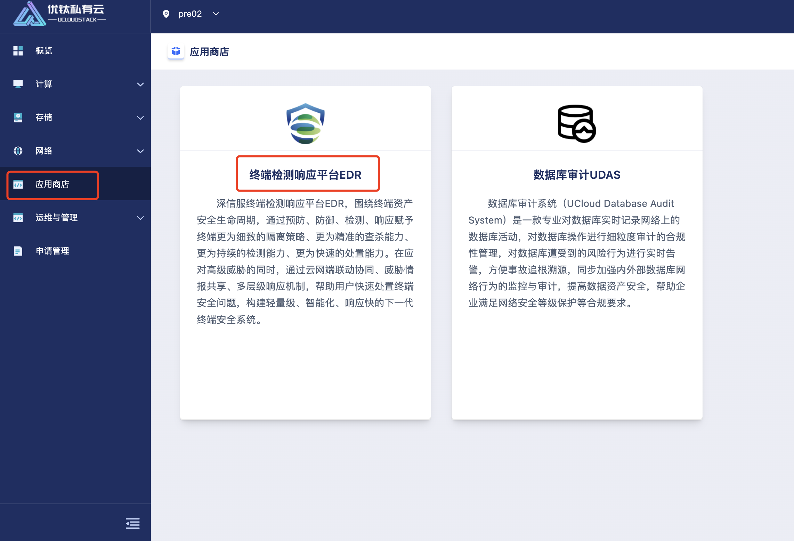
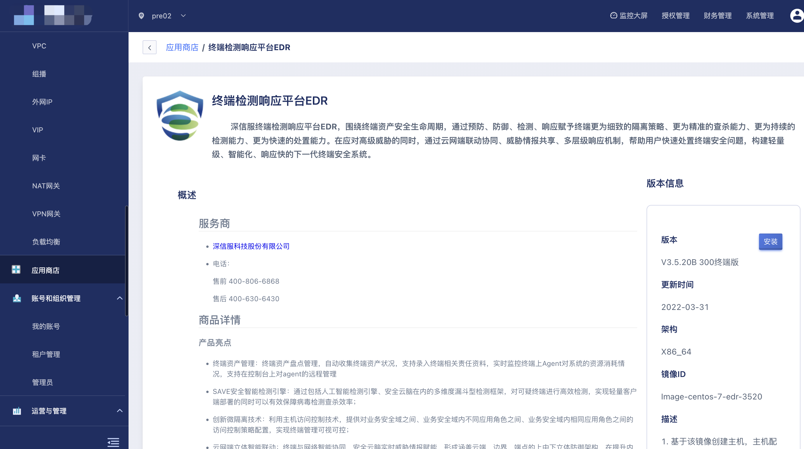

### 24.2.2 安装终端检测响应平台EDR

云平台用户可通过 API 接口或控制台安装终端检测响应平台EDR，快速搭建终端安全系统，安装终端检测响应平台EDR前需保证账户至少拥有一个 VPC 网络和子网。通过导航栏进入应用商店控制台管理页面，点击“终端检测响应平台EDR”产品进入安装终端检测响应平台EDR页面，安装完EDR会跳到虚拟机页面显示机器信息，如下是安装终端检测响应平台EDR的示意图:

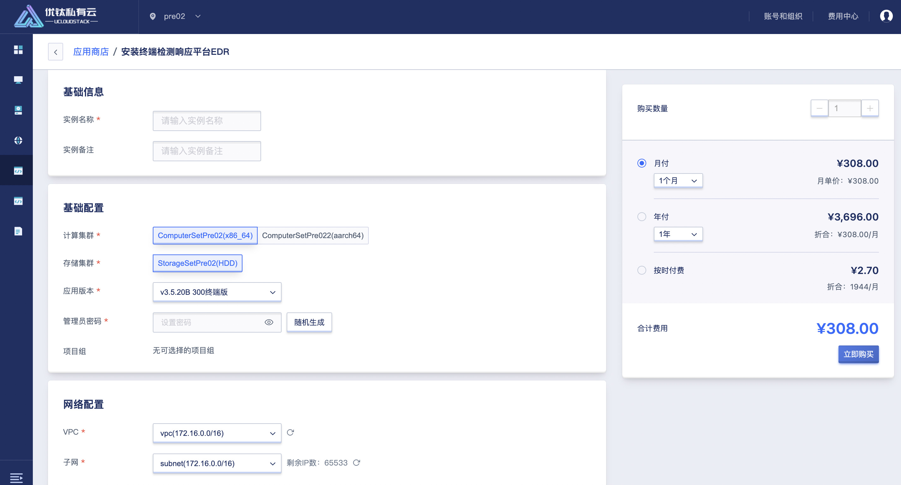
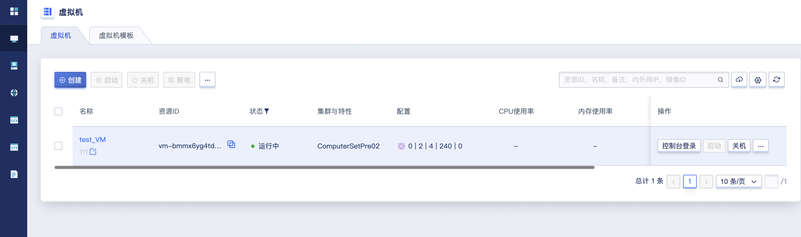

* 实例名称/备注: 安装终端检测响应平台EDR 的名称和备注，安装时必须指定名称。
* 计算集群: EDR实例所在节点的集群类型，由平台管理员自定义，如 x86 机型和 ARM 机型。
* 存储集群: 由平台管理员自定义，如 HDD 云盘或 SSD 高性能云盘。
* 应用版本: 终端检测响应平台EDR支持的安装版本，如 v3.5.20B 300终端版、v3.5.20B 1000终端版、v3.5.20B 2000终端版、v3.5.20B 10000终端版。
* VPC 网络: EDR所服务的 VPC 网络，同时EDR实例本身会运行在所指定的 VPC 网络中。
* 子网: EDR实例所在子网，系统将自动根据所选子网分配内网 IP 地址作为内网EDR的入口地址，通常常建议选择可用 IP 数量充足的子网。
* 外网 IP: 当选择绑定外网 IP，可配置EDR实例自动绑定的外网 IP 地址，仅支持绑定 IPv4 且有默认路由的 外网 IP 地址作为EDR的入口地址。
* 外网安全组: 当选择绑定外网 IP，外网安全组才会生效，用于外网访问EDR的安全控制。

### 24.2.3 使用终端检测响应平台EDR

通过内网或者外网访问终端检测响应平台EDR，EDR页面访问地址:https://[ip]

* 管理页面访问地址： https://[ip]
* 默认账号: admin 密码： admin 
* 机器默认锁定22远程登录端口，开放需登录EDR控制页面进行设置

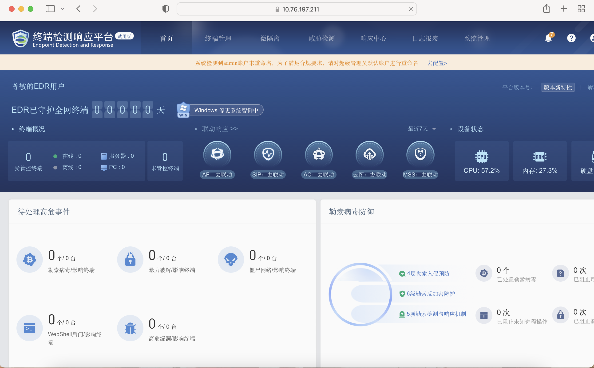

### 24.2.4 查看数据库审计UDAS

云平台用户可通过控制台查看数据库审计UDAS的产品概述、服务商信息、产品亮点、推荐配置、页面示例、默认信息等。

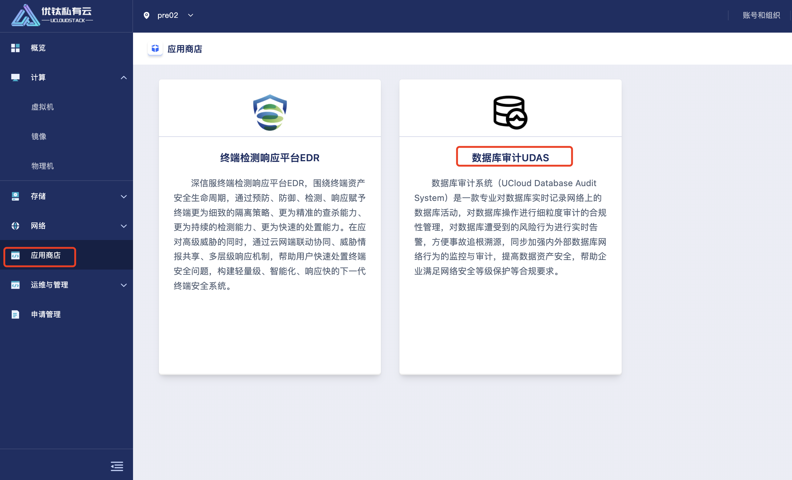
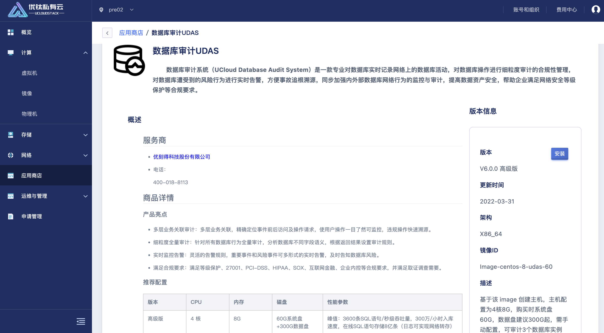

### 24.2.5 安装数据库审计UDAS

云平台用户可通过 API 接口或控制台安装数据库审计UDAS，快速搭建数据库审计系统，安装数据库审计UDAS前需保证账户至少拥有一个 VPC 网络和子网。通过导航栏进入应用商店控制台管理页面，点击“数据库审计UDAS”产品进入安装数据库审计UDAS页面，安装完UDAS会跳到虚拟机页面显示机器信息，如下是安装数据库审计UDAS的示意图:

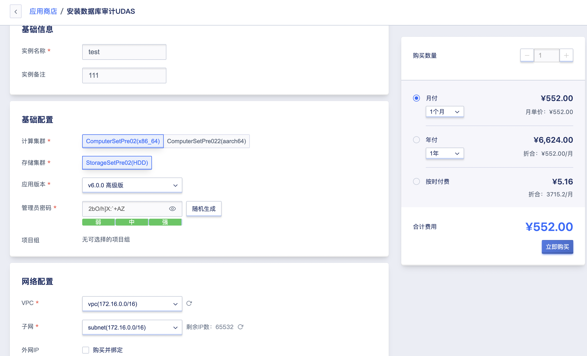
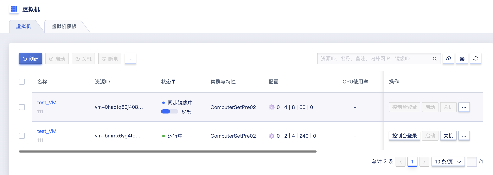

* 实例名称/备注: 安装数据库审计UDAS 的名称和备注，安装时必须指定名称。
* 计算集群: UDAS实例所在节点的集群类型，由平台管理员自定义，如 x86 机型和 ARM 机型。
* 存储集群: 由平台管理员自定义，如 HDD 云盘或 SSD 高性能云盘。
* 应用版本: 数据库审计UDAS支持的安装版本，如 v6.0.0 高级版、v6.0.0 企业版、v6.0.0 旗舰版。
* VPC 网络: EDR所服务的 VPC 网络，同时UDAS实例本身会运行在所指定的 VPC 网络中。
* 子网: UDAS实例所在子网，系统将自动根据所选子网分配内网 IP 地址作为内网EDR的入口地址，通常常建议选择可用 IP 数量充足的子网。
* 外网 IP: 当选择绑定外网 IP，可配置UDAS实例自动绑定的外网 IP 地址，仅支持绑定 IPv4 且有默认路由的 外网 IP 地址作为UDAS的入口地址。
* 外网安全组: 当选择绑定外网 IP，外网安全组才会生效，用于外网访问UDAS的安全控制。

### 24.2.6 使用数据库审计UDAS

通过内网或者外网访问数据库审计UDAS，UDAS页面访问地址: https://[ip]

* 管理页面访问地址： https://[ip]
* 默认系统管理员账号： sysadmin 密码： 3edc$RFV
* 默认安全管理员账号： secadmin 密码： 3edc$RFV
* 默认审计管理员账号： auditadmin 密码：3edc$RFV

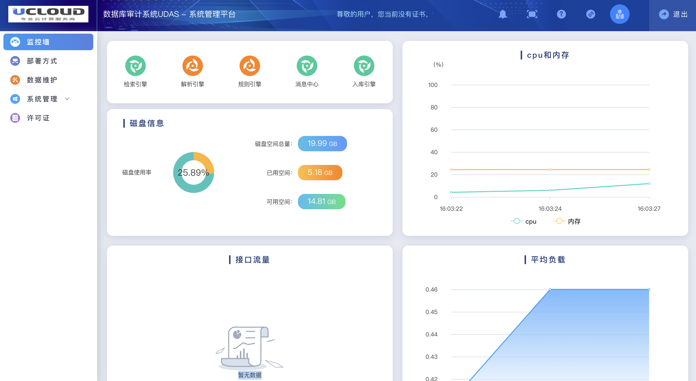

### 24.2.7 查看堡垒机

云平台用户可通过控制台查看堡垒机的产品概述，产品亮点，终端系统支持的硬件信息，推荐配置，使用场景，默认访问信息等。

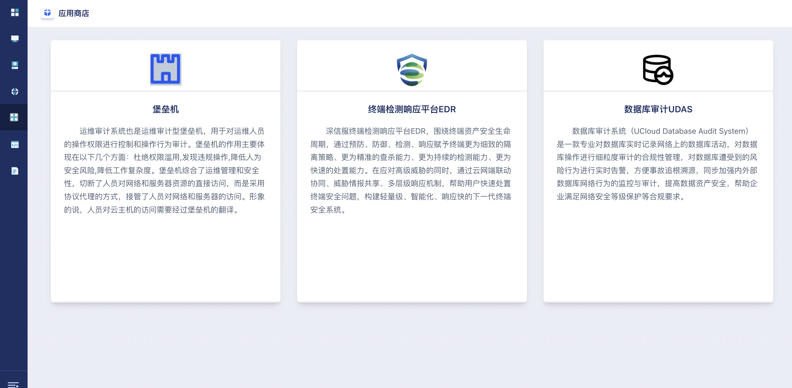

### 24.2.8 创建堡垒机

云平台用户可通过 API 接口或控制台安装堡垒机，快速搭建终端安全系统，安装堡垒机前需保证账户至少拥有一个 VPC 网络和子网。通过导航栏进入应用商店控制台管理页面，点击“堡垒机”产品进入安装页面，安装完会跳到虚拟机页面显示机器信息，如下是安装堡垒机的示意图:

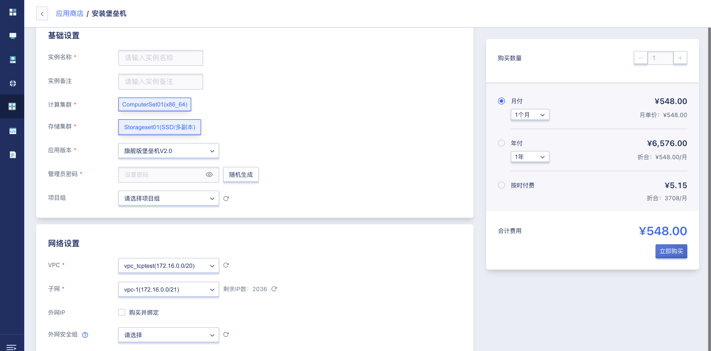

* 实例名称/备注: 安装堡垒机 的名称和备注，安装时必须指定名称。
* 计算集群: UDAS实例所在节点的集群类型，由平台管理员自定义，如 x86 机型和 ARM 机型。
* 存储集群: 由平台管理员自定义，如 HDD 云盘或 SSD 高性能云盘。
* 应用版本: 堡垒机目前支旗舰版V2.0。
* VPC 网络: EDR所服务的 VPC 网络，同时UDAS实例本身会运行在所指定的 VPC 网络中。
* 子网: 堡垒机实例所在子网，系统将自动根据所选子网分配内网 IP 地址作为内网EDR的入口地址，通常常建议选择可用 IP 数量充足的子网。
* 外网 IP: 当选择绑定外网 IP，可配置堡垒机实例自动绑定的外网 IP 地址，仅支持绑定 IPv4 且有默认路由的 外网 IP 地址作为堡垒机的入口地址。
* 外网安全组: 当选择绑定外网 IP，外网安全组才会生效，用于外网访问堡垒机的安全控制。

### 24.2.9 使用堡垒机

* 管理页面访问地址： https://[ip]
* 默认系统管理员账号： admin 密码： admin

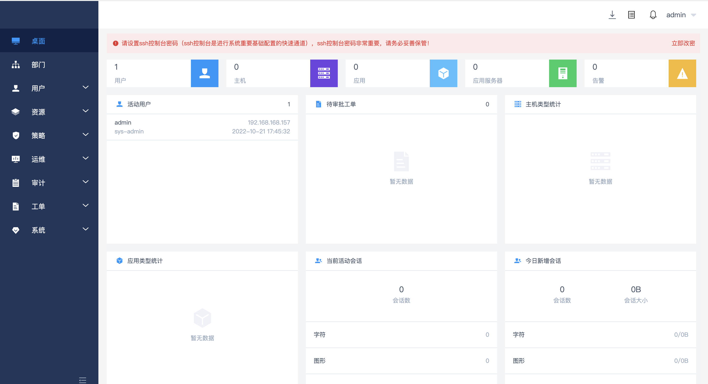

### 24.2.10 查看山石vRAS

云平台用户可通过控制台查看数据库审计UDAS的产品概述、服务商信息、产品亮点、推荐配置、页面示例、默认信息等。

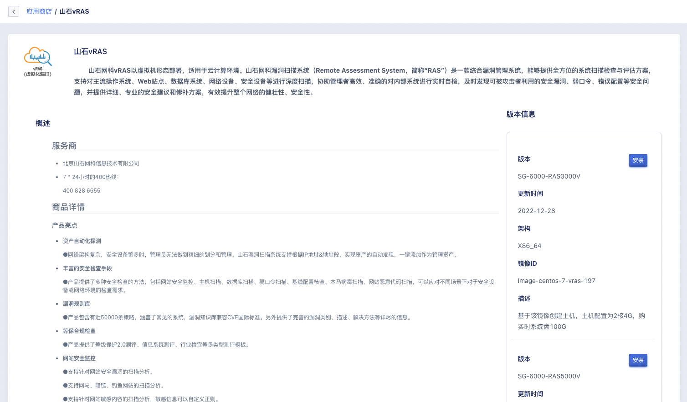

### 24.2.11 创建山石vRAS

云平台用户可通过 API 接口或控制台安装山石vRAS，快速搭建山石vRAS，安装山石vRAS前需保证账户至少拥有一个 VPC 网络和子网。通过导航栏进入应用商店控制台管理页面，点击“山石vRAS”产品进入安装山石vRAS页面，安装完会跳到虚拟机页面显示机器信息，如下是安装数据库审计UDAS的示意图:

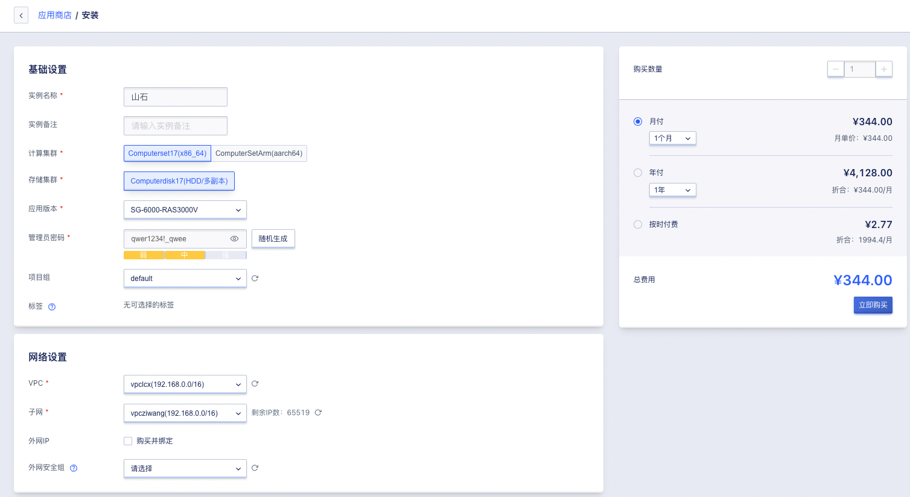

### 24.2.12 使用山石vRAS

* 管理页面访问地址： https://[ip]
* 默认系统管理员账号： admin 密码： Hillstone@2020
* 安装最低配置要求分别是2个vCPU，4G内存。