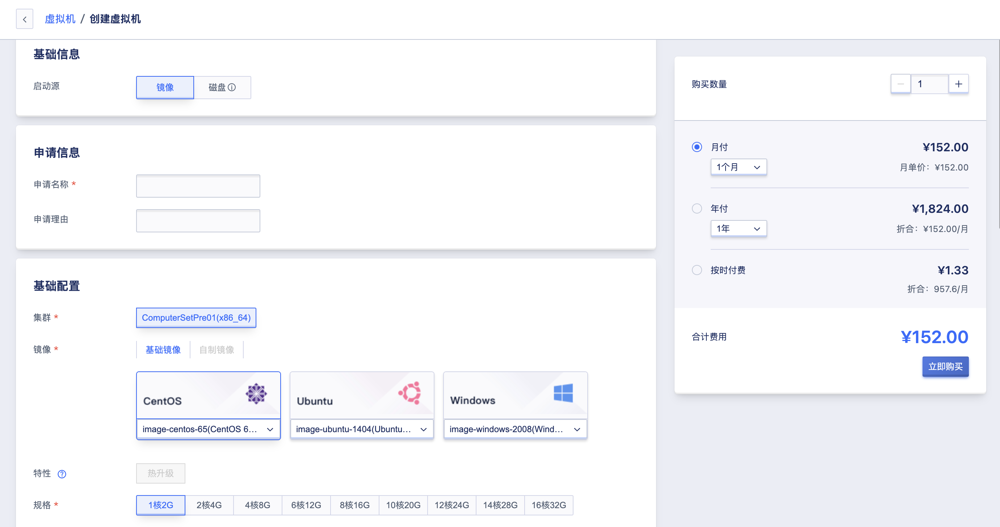
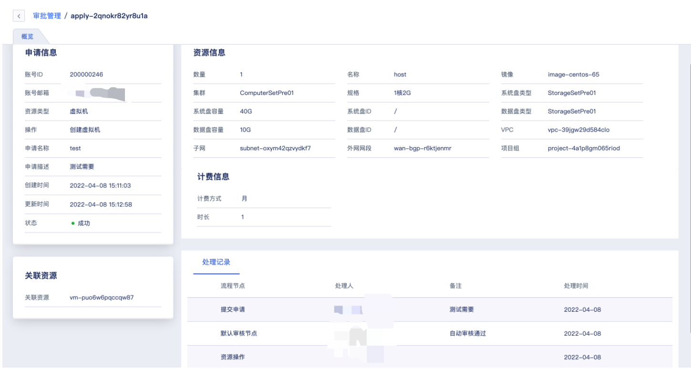

# 18 审批流程

## 18.1 概述

### 18.1.1 产品简介

随着信息化数字转型在政企、教育、金融、制造等行业的实践和应用，企业对资源管理的标准化、流程化管理需求日益旺盛，对于云化资源同样需要设置标准的审批流程，满足平台资源的申请、审批的业务使用流程的需求。

针对企业云化资源的管理，云平台为为企业管理者提供的自助模式的资源审批服务，用于制定信息系统云化资源的标准使用流程，在租户或子账号需要使用或管理资源时，按照流程中定义的审批人和审批层级完成审批后，由平台自动化交付用户需要业务资源。

平台审批流程由平台管理员进行定义和发布，并由平台管理者设置是否为一个租户设置开通审批流程，支持手动审批和自动审批。

* 手动审批：租户下主账号和子账号进行虚拟资源操作时需要走申请、审批流程，待审批通过后，平台会自动为用户创建或操作所需资源，并生一条审批记录用于追溯。
* 自动审批：租户下主账和子账号进行虚拟资源操作无需人工介入，系统将自动审批通过，并自动生成一条审批记录用于保留相关申请记录和审批记录。

开通资源审批的前提是设置审批流程，用于定义租户申请资源时，需要多少层级的审批，每一层级由谁进行审批，所有层级均通过后才可进行资源的创建和变更操作。为满足企业多种场景的审批业务，平台内置默认审批流程。

默认审批流程提供简单的审批逻辑，仅支持 1 级审批，当平台管理者为租户开启资源审批流程后，租户及子账号下资源的创建及变更申请统一由【平台管理员】进行审批，即平台管理员审批通过后，平台将自动执行资源的变更操作。

审批流程支持多种资源的变更操作，包括虚拟机、云硬盘、VPC 网络、外网 IP 及负载均衡 ，支持的变更如下：

* 虚拟机：创建虚拟机、修改配置、扩容系统盘、扩容数据盘；
* 云硬盘：创建云硬盘、扩容磁盘；
* VPC 网络：创建 VPC ；
* 外网 IP：创建外网 IP、调整带宽；
* 负载均衡：创建负载均衡。

### 18.1.2 审批使用流程

本文以申请虚拟机为示例描述手工审批的使用流程：

**（1）前置条件：管理员为租户开启审批流程。**

**（2）申请入口：创建虚拟机。**

* 进入虚拟机控制台，通过【创建虚拟机】进入虚拟机创建引导页面，如下图所示：

  

* 填写申请名称和申请备注，按照虚拟机的创建要求输入其它必填信息，点击【立即购买】提交申请。

* 提交申请后，页面会自动跳转至【申请管理】页面，并在申请列表中自动新增一条待审批的申请记录。

  

**（3）管理员审批**：由平台管理员 admin 账号进行审批。

* 若平台管理员通过申请，则申请状态变更为【已申请】，并会自动执行虚拟机的创建操作，可通过虚拟机列表查看正在创建的虚拟机资源，待资源创建成功后，申请状态变更为【成功】。
* 若平台管理员拒绝申请，则申请状态变更为【已拒绝】，申请的资源变更将不被执行，可联系平台管理员或查看审批备注了解拒绝原因。

## 18.2 申请管理

租户在对资源进行变更并提交申请后，可通过申请管理控制台查看申请记录及申请状态。

### 18.2.1 查看申请列表

用户通过我的申请列表可查看租户下所有已提交的申请记录，包括手工审批和自动审批的所有记录。如下图所示：

* 申请名称：本次申请的名称。
* 资源类型：本次申请的资源类型，包括虚拟机、硬盘、VPC、外网IP、负载均衡等五类资源。

* 操作：针对资源的操作。比如创建虚拟机，创建 VPC 。

* 账号邮箱：申请人的账号邮箱。

* 账号 ID：申请人的账号 ID 。

* 状态：申请的状态，包括处理中、成功、失败。

* 当前节点：申请的当前节点，快速了解申请的进展。

* 当前处理人：申请的当前处理人，默认流程均为平台管理员。

* 创建日期：本次资源变更的申请时间。

### 18.2.2 查看申请详情

用户通过申请记录右侧“详情”按钮可进入申请的概览页面。在此页面可查看申请信息、申请涉及到的资源的信息、申请的处理记录、申请的关联资源。

（1）申请信息：描述本次申请的详细信息，如申请名称、申请资源类型、申请的变更操作及申请的状态及时间。

（2）关联资源：描述本次申请的关联资源信息。**管理员审批通过的申请记录会存在关联资源，被拒绝的申请将不执行资源操作，不会产生关联资源信息。**

（3）资源信息：代表本次申请时提交的资源变更具体配置信息，如申请创建虚拟机时的规格、VPC 网络、镜像等，同时包括资源的申请时的计费信息。

（4）处理记录：当前申请记录的处理记录，并可查看所有处理节点的流程节点、处理人、备注及处理时间。

* 流程节点：指当前申请记录所使用的审批流程的所有节点，如平台默认的审批流程包括提交申请、默认审核节点、资源操作等。
* 处理人：指每一个流程节点的处理人，如提交申请人的邮件地址为 cinder.lv@ucloud.cn ，默认审核节点的处理人为 admin@ucloud.cn 。
* 备注：指每一流程节点的备注，如平台管理员通过或拒绝申请时给予的说明。
* 处理时间：指每一个流程节点人的处理时间。

> 有关租户审批流程开通、变更及平台管理者审批管理，可参考平台管理员手册中【审批流程】章节。

