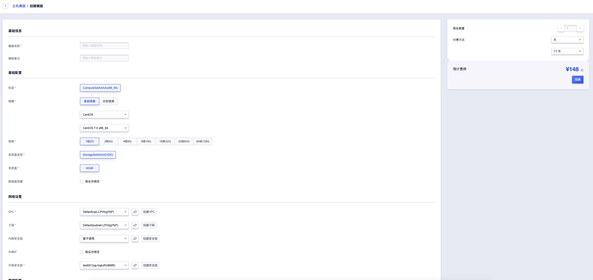
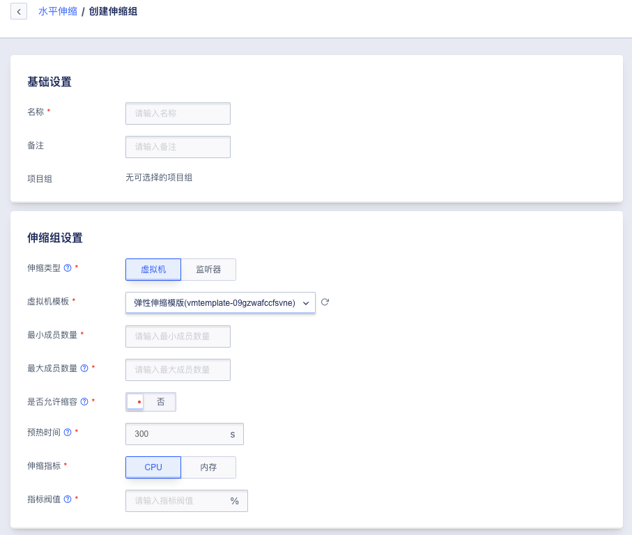
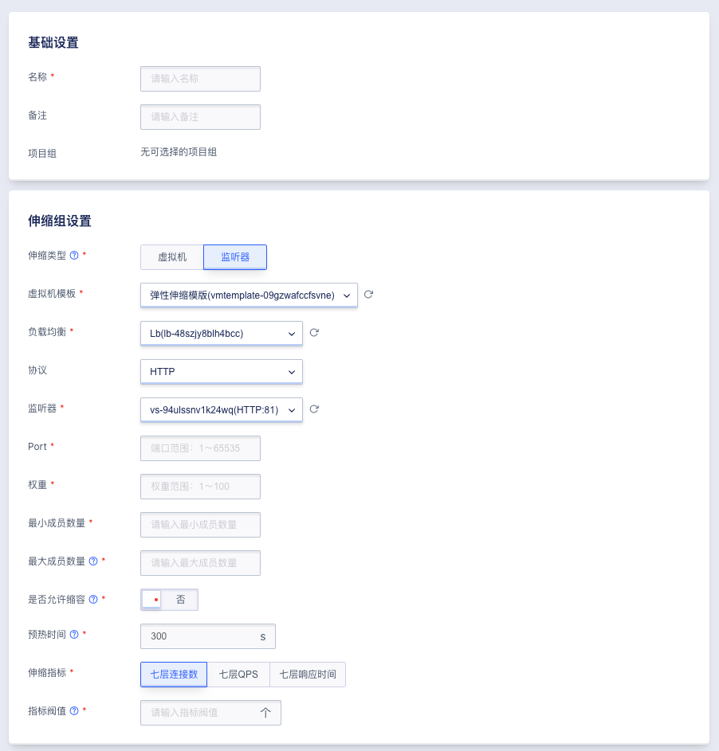
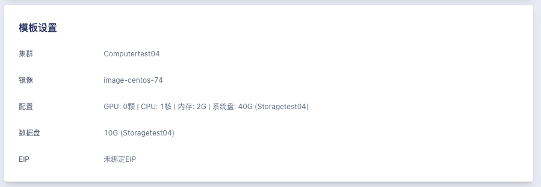
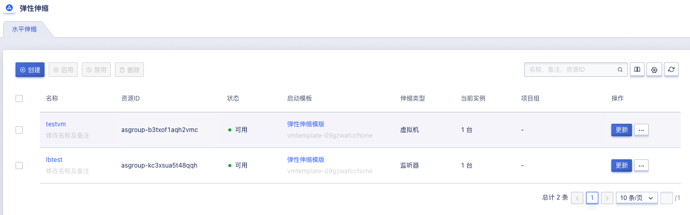
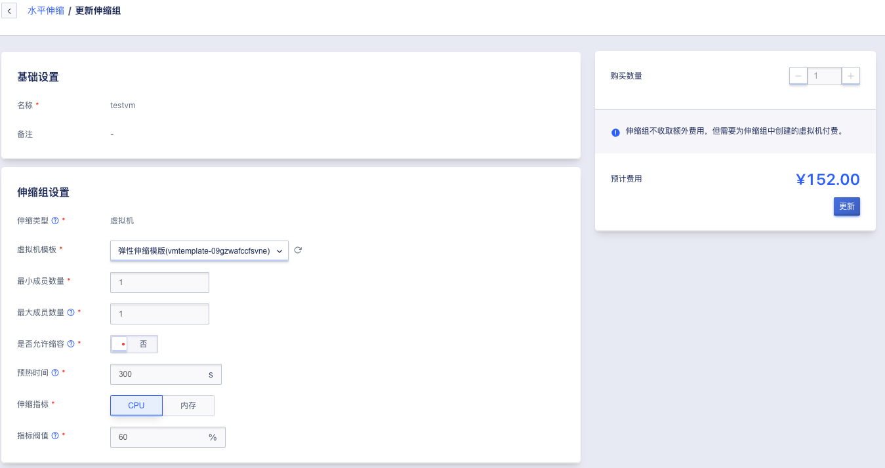
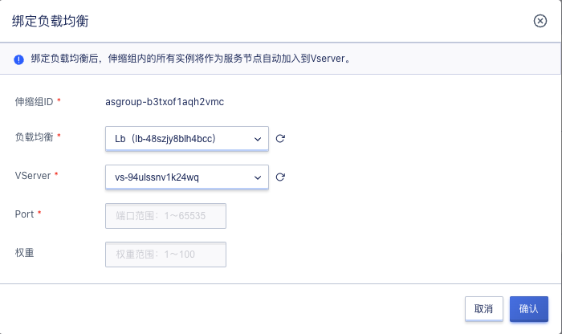
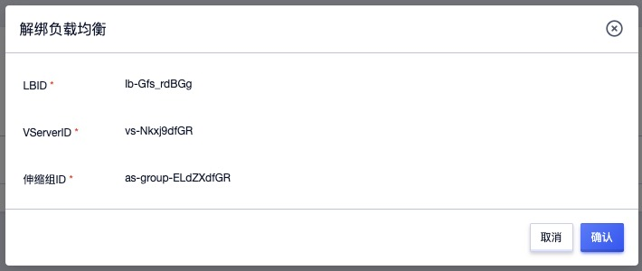
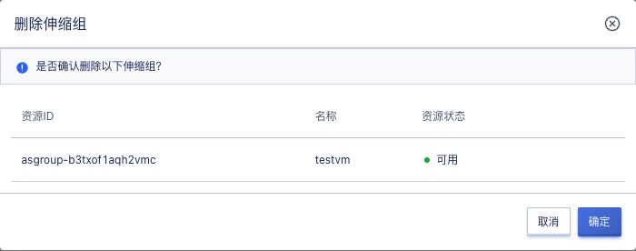

# 14  弹性伸缩

## 14.1 产品简介

### 14.1.1 概述

弹性伸缩（Auto Scaling）是指在业务需求增长时自动增加计算资源（虚拟机）以保证计算能力，在业务需求下降时自动减少计算资源以节省成本；同时可结合负载均衡及健康检查机制，满足请求量波动和业务量稳定的场景。

用户可通过弹性伸缩服务，定制弹性伸缩组及伸缩策略，在伸缩组内资源量达到策略定义的阈值后，根据定制的虚拟机模板自动增减虚拟机数量，提升业务部署及运维的效率。

### 14.1.2 逻辑架构

弹性伸缩从逻辑架构上可分为三部分，分别为伸缩组、伸缩器及虚拟机模板。

* 伸缩组：负责将组内的实例数量维持在“期望”的水位，添加/缩减虚拟机的动作均由伸缩组进行操作，支持“自动伸缩”和“固定数量” 两种模式维护伸缩组内的实例数量。
* 伸缩器：即伸缩策略，用于定义伸缩组内虚拟机伸缩的规则，支持定义伸缩组最小及最大实例数量，并可配置是否允许缩容。
  * 虚拟机类型 根据**CPU、内存**使用率的阈值触发伸缩动作，
  * 监听器类型 根据负载均衡中Vsever的 **七层连接数、七-层QPS、七层响应时间、四层连接数、四层CPS** 的阈值触发伸缩动作
* 虚拟机模板：用户根据需求自定义虚拟机模板，用于弹性伸缩时自动创建虚拟机的模板，同时支持通过虚拟机模板手动创建虚拟机。

伸缩组定义好伸缩模式后，伸缩组的实例“期望”值由伸缩策略接管并动态修改，最终由伸缩组负责虚拟机的动态扩容和缩容，新增虚拟机实例时会根据虚拟机模板创建新的虚拟机实例。

### 14.1.3 伸缩组工作流程

伸缩组内的虚拟机实例可定义预热时间，指为虚拟机创建成功后需要一定的时间拉起应用程序以承接业务流量。因此在伸缩组发起创建虚拟机的请求后，在虚拟机创建成功并处于运行中状态时，伸缩组中虚拟机的状态为“启动中”，代表虚拟机在预热中，待超过预热时间后，会自动转换为“运行” ，代表虚拟机为健康状态。

伸缩组每 15 秒 获取一次被其控制的所有虚拟机状态，判断是否需要添加或删除实例。若伸缩组关了负载均衡，则由负载均衡判断伸缩组内的实例是否健康，若不健康具体流程如下：

* 健康实例等于期望值

  伸缩组会自动将不健康（基于三个周期健康检测的判断）的实例移出伸缩组，并执行删除虚拟机操作。

* 健康实例大于期望值

  选择将最晚创建的健康虚拟机实例移出伸缩组，并执行删除虚拟机操作，同时将不健康的实例移出伸缩组并执行删除操作。

* 健康实例小于期望值

  伸缩组会自动以虚拟机模板发起创建实例操作，并将实例数量维持在期望值，同时会将不健康的实例移出伸缩组并执行删除操作。

### 14.1.4 伸缩器工作流程

伸缩器会根据伸缩策略中设置的最小和最大实例值，每 15 秒采集一次伸缩组中健康实例的 伸缩阈值数据，用于判断是否需要扩容或缩容伸缩组中的实例。

* 扩容

  若伸缩组中健康实例的伸缩阈值大于伸缩策略定义的阈值，则会触发伸缩组进行扩容实例操作。

* 缩容

  通常伸缩组中健康实例的伸缩阈值小于伸缩策略定义的阈值，则会触发伸缩组进行缩容实例操作。**为避免频繁的缩容导致伸缩组内集群服务震荡，缩容时会获取伸缩组过去 10 分钟内所有健康实例的伸缩指标监控数据平均值，用于判断是否需要缩容伸缩组中的实例**。

### 14.1.5 功能特性

弹性伸缩通过伸缩组、伸缩策略及虚拟机模板共同维护集群内虚拟机的实例数量，虚拟机类型可结合负载均衡对伸缩组内虚拟机实例的业务健康进行检测并及时剔除处于不健康状态的虚拟机实例，保证整体集群业务的可用性和可靠性。监听器类型的伸缩组创建时需要绑定负载均衡。

* 支持定义虚拟机模板，用于伸缩组自动创建虚拟机的模板，同时支持通过虚拟机模板手动创建虚拟机。
* 支持伸缩组预热时间，使虚拟机创建成功后有时间拉起应用程序以承接业务流量。
* 支持自动伸缩和固定数量两种伸缩模式，适应多种自动伸缩场景。
  * 自动伸缩模式依据伸缩器的伸缩策略维护伸缩组中的实例数量；
  * 固定数量模式依据用户指定的实例数量维伸缩组中的实例。
* 支持按照伸缩组中健康实例的虚拟机和监听器指标作为自动伸缩模式中是否需要扩缩容的依据。
* 支持设置伸缩策略的最大实例数量，避免因阈值过高，无限制扩容伸缩组内实例数量，如集群虚拟机被攻击等。
* 支持设置伸缩策略的最小实例数量，避免因阈值过低而导致伸缩组中实例数量为 0 ，导致业务中断或服务停止等问题。
* 支持设置伸缩策略的缩容策略，即限制一个伸缩组内的实例只允许扩容，不允许缩容。
* 支持用户查看伸缩组的伸缩日志和已添加至伸缩组的实例信息，用于查看自动伸缩组所有执行动作及原因，方便用户对伸缩组集群业务进行维护。
* 支持用户启用或禁用一个伸缩组，伸缩组禁用后即为不可用状态，将不会在触发伸缩策略执行实例伸缩和健康检查，禁用伸缩组不影响伸缩组中已存在实例的正常运行。
* 提供伸缩组中所有实例的平均监控指标数据，并可通过告警模板对监控数据进行告警配置，在使伸缩指标触发扩缩容时，为用户发送告警邮件。

  虚拟机类型的伸缩策略支持弹性伸缩与负载均衡进行关联，通过将伸缩组中的实例添加至负载均衡的监听器中，为伸缩组中的虚拟机业务提供负载均衡服务，同时通过监听器的健康检查机制，判断伸缩组中所有实例的业务健康状况，自动剔除业务不健康的实例并新增健康实例到业务集群。

## 14.2 虚拟机模板管理

虚拟机模板是用户根据需求自定义虚拟机模板，用于弹性伸缩时自动创建虚拟机的模板，同时支持通过虚拟机模板手动创建虚拟机，支持虚拟机模板的创建、查看、删除及创建虚拟机等生命周期管理。

### 14.2.1 创建虚拟机模板

用户可根据业务需要通过虚拟机控制台——虚拟机模板资源列表创建适合业务的虚拟机模板，用于伸缩器自动增加虚拟机实例时的模板。虚拟机模板与创建虚拟机一致，只需要额外提供模板名称及模板备注即可，如下图所示：

模板名称和备注是指当前要创建的虚拟机模板的名称和描述，基础配置、网络设备、管理配置与创建虚拟机一致，代表使用该模板创建虚拟机时指定的参数，如虚拟机规格和操作系统等；同时虚拟机模板无需指定虚拟机名称，由弹性伸缩组创建时自动生成虚拟机名称。

创建模板时需要指定模板中虚拟机的付费方式，即代表通过该模板创建的虚拟机的付费方式，如按月；同时创建模板时会展示该模板创建虚拟机时需要付的费用。

> 创建模板时并不会真正扣费，仅当弹性伸缩组自动创建实例时才会根据预计费用进行扣费。

### 14.2.2 查看虚拟机模板

用户可通过虚拟机模板列表页面查看虚拟机模板的列表信息，包括名称、ID、VPC、子网、机型、配置、关联资源、计费方式及操作项，如下图所示：

* 名称/ID：指虚拟机模板的名称及全局唯一标识符。
* VPC/子网：指通过虚拟机模板创建的虚拟机所属 VPC 和子网。
* 机型/配置：指通过虚拟机模板创建的虚拟机所属机型及配置。
* 关联资源：指虚拟机模板已关联的弹性伸缩组，即伸缩组会通过虚拟机模板中的配置创建实例。
* 计费方式：指通过虚拟机模板创建的虚拟机的付费方式。

列表上操作项是指通过虚拟机模板手动创建虚拟机，同时用户也可点击虚拟机模板的名称进入虚拟机模板详情，查看虚拟机模板的详细信息，包括基本信息、虚拟机配置、网络配置及存储配置信息。

### 14.2.3 模板创建虚拟机

支持用户通过模板手动创建虚拟机，适用于需要通过模板创建虚拟机的场景。如下图所示：

通过模板创建虚拟机时需要指定虚拟机名称，也可指定虚拟机的登录密码，如不指定则采用创建模板时指定的登录密码。

### 14.2.4 修改名称和备注

修改虚拟机模板的名称和备注，在任何状态下均可进行操作。可通过点击虚拟机模板列表⻚面每个镜像名称右侧的“编辑”按钮进行修改。

## 14.3 伸缩组管理

伸缩组负责将组内的实例数量维持在“期望”的水位，添加/缩减虚拟机的动作均由伸缩组进行操作，支持“自动伸缩”和“固定数量” 两种模式维护伸缩组内的实例数量，适应多种自动伸缩场景。伸缩组是通过伸缩策略中对于伸缩规则及伸缩实例数来维护组内实例的期望水平，并通过虚拟机模板创建新的实例。

* 自动伸缩模式依据伸缩器的伸缩策略维护伸缩组中的实例数量；
* 固定数量模式依据用户指定的实例数量维伸缩组中的实例，即固定数量模式无需指定伸缩策略。

支持伸缩组预热时间，使虚拟机创建成功后，在预热时间内拉起应用程序以承接业务流量；同时支持虚拟机类型伸缩组关联负载均衡，为伸缩组中的虚拟机业务提供负载均衡服务，同时通过监听器的健康检查机制，判断伸缩组中所有实例的业务健康状况，自动剔除业务不健康的实例并新增健康实例到业务集群。

作为自动伸缩服务的最核心模块，支持伸缩组的全生命周期管理，包括创建伸缩组、查看伸缩组、修改伸缩组、启动/禁用伸缩组、绑定/解绑负载均衡、查看伸缩日志及删除伸缩组等。

### 14.3.1 创建伸缩组

用户可通过伸缩组控制台，指定虚拟机模板、预热时间、伸缩模式创建一个弹性伸缩组，用于动态扩缩组内的虚拟机实例，适应需要弹性伸缩的业务场景。如下两图创建虚拟机类型和监听器类型的伸缩组示例：

**虚拟机伸缩类型**目前支持设置 CPU、内存 使用率作为伸缩指标，可后续绑定负载均衡为伸缩组中资源提供负载均衡服务。
**监听器伸缩类型**目前支持 TCP、HTTP、HTTPS 三种协议类型，选择TCP协议时伸缩指标可选 四层连接数、四层CPS 作为伸缩指标，选择http以及https协议时可选择 七层连接数、七层QPS、七层响应时间 作为伸缩指标。监听器类型伸缩组创建时需要预先创建负载均衡以及相应协议的Vsever监听器。

* 名称/备注：伸缩组的名称和备注信息，用于标识伸缩组。
* 虚拟机模板：伸缩组为组内新增虚拟机实例时所使用的虚拟机模板，即会根据所选虚拟机模板为组内新增虚拟机实例，创建时必须指定，仅支持选择有权限的虚拟机模板。
* 预热时间：伸缩组内虚拟机实例创建成功后的预热时间，在预热时间内虚拟机可拉起应用程序以承接业务流量，预热中的虚拟机实例在伸缩组中处于【启动中】状态。创建时必须指定，默认为 300s 。
* 成员数量设置：可设置最小成员数量和最大成员数量，调度后的资源数量不会超过设置的成员数量上下限。如果想要达到固定数量的效果，可以将最大成员数量、最小成员数量设置成一致。
* 是否允许缩容：允许缩容时伸缩组会在未满足指标时减少资源数量，缩容时会给虚拟机内的业务进程发送 SIGTERM 信号，最多等待90秒后关闭并删除虚拟机，业务进程可利用该机制优雅关闭。
* 伸缩指标
  * 虚拟机指标 CPU 内存 （单位%）
  * 监听器指标 七层连接数（个）、七层QPS（个/s）、七层响应时间（ms）、四层连接数（个）、四层CPS（个/s）
* 指标阈值：统计标准10min内所有虚拟机监控数据的平均值

模板配置界面展示了当前伸缩组所使用的模版基本信息，包括 镜像、CPU、内存、磁盘配置，外网绑定情况（如果绑定EIP，模版启动虚拟机时将自动申请EIP）如下图所示

点击创建后，平台即会根据指定的配置创建伸缩组，并自动维护伸缩组内的实例数量，同时会扣取新增实例的费用（伸缩组不收取额外费用，但用户需要为伸缩组中创建的虚拟机实例付费），用户可通过伸缩组列表及详情查看伸缩组的实例及相关信息。

### 14.3.2 查看伸缩组

#### 14.3.2.1 伸缩组列表

用户可通过弹性伸缩控制台查看账户内拥有的所有伸缩组的列表及相关信息，并可通过列表的名称进入伸缩组详情查看伸缩组的监控信息、实例信息、伸缩日志，同时可通过伸缩组的负载均衡对伸缩组进行负载均衡的绑定和解绑操作，具体列表信息如下图所示：

* 名称/ID：伸缩组的名称及全局唯一标识符。
* 启动模板：伸缩组关联的虚拟机模板，即组内新增实例时所使用的虚拟机模板。
* 伸缩类型：伸缩类型分为虚拟机和监听器两种。
* 当前实例：伸缩组内当前的虚拟机实例数量，正常情况下等于期望实例数量。
* 状态：指伸缩组的运行状态，包括可用、不可用。

列表上支持对伸组组进行更新、启动、禁用、删除等操作，同时支持对伸缩组进行批量启用、批量禁用及批量删除操作。

#### 14.3.2.2 伸缩组详情

用户可进入伸缩组详情查看伸缩组内的详细信息，包括伸缩组的基本信息、伸缩策略、监控信息、实例信息、伸缩日志及关联的负载均衡信息，如下图所示：

（1）基本信息：包括资源 ID、资源名称、虚拟机模板、预热时间、当前实例数量。

（2）伸缩策略：包括伸缩模式和期望寮例数量。

（3）监控信息：伸缩指标的监控信息，用户可通过监控信息查看组内所有虚拟机实例的平均 CPU 使用率，并可通过告警模板对监控数据进行告警配置，在使用率过高而触发扩缩容时，为用户发送告警邮件，默认可查看一小时，可通过时间筛选，查看自定义时间的监控信息。

（4）实例信息：指伸缩组内当前实例的列表信息，包括实例的名称、ID、启动模板、IP 地址、创建时间及状态，详见 [查看伸缩组实例](#_14323-查看伸缩组实例)。

（5）伸缩日志：指伸缩组内的实例伸缩日志，如添加或移除实例的日志信息，详见[查看伸缩日志](#_14324-查看伸缩日志)。

（6）负载均衡：指伸缩组已关联的负载均衡实例，并可通过负载均衡管理绑定或解绑负载均衡，详见[负载均衡管理](#_1445-负载均衡管理)。

#### 14.3.2.3 查看伸缩组实例

用户可通过伸缩组详情中的【实例】标签页查看当前伸缩组中的实例信息，如下图所示：

伸缩组实例支持从已创建的虚拟机资源中添加到伸缩组中，也可从伸缩组实例中移除虚拟机，移除后的虚拟机将会被自动删除，
* 实例的名称为伸缩组自动命名，通常为伸缩组的名称+随机字符串。
* 启动模板为创建当前实例所使用的虚拟机模板，可通过虚拟机模板查看具体配置信息。
* IP 地址为虚拟机实例的 VPC 内网 IP 地址。
* 状态为当前实例的状态信息，包括启动中、运行及其它虚拟机相关状态信息。
  * 其中启动中指伸缩组中的虚拟机正在启动，或在伸缩组预热时间内，实例的状态会一直保持启动中，待超过预热时间后，会自动转换为运行，代表虚拟机为健康状态。
  * 伸缩组每 15 秒 获取一次被其控制的所有虚拟机状态，判断是否需要添加或删除实例。若伸缩组关了负载均衡，则由负载均衡判断伸缩组内的实例是否健康。
* 创建时间指当前实例的创建时间。

#### 14.3.2.4 查看伸缩日志

用哀悼可通过伸缩组详情中【伸缩日志】查看当前伸缩组中的实例变更日志，如添加实例或移除实例，并展示每次变更的详情原因和状态，包括操作时间、执行动作、原因及状态，方便用户对伸缩组集群业务进行维护，如下图所示：

* 操作时间：指当前伸缩组内实例变更日志的操作时间。
* 执行动作：当前缩伸组日志的变更操作，如添加实例、删除实例。
* 原因：当前伸缩日志的变更原因，如实例数小于期望实例数而添加实例，或实例非健康状态而删除实例。
* 状态：当前伸缩实例变更的状态，包括操作成功或操作失败。

### 14.3.3 修改伸缩组

支持用户自定义修改伸缩组的虚拟机模板、最小成员数量、最大成员数量、缩容策略、预热时间、伸缩指标、指标阈值，可通过伸缩组列表操作项中的更新进行操作，伸缩类型在创建后不可修改，如下图所示：

* 虚拟机模板

  若用户修改了伸缩组的虚拟机模板，不影响组内已有的虚拟机实例配置和参数，仅影响新添加实例，即更新后新添加实例时以新的虚拟机模板创建虚拟机。

* 预热时间

  用户修改预热时间后，新添加的实例会根据新的预热时间进行运行状态，并接受业务处理。

* 实例数量/伸缩策略/伸缩指标/缩容策略/指标阈值

  用户修改伸缩组后，伸缩组会立即依据新的伸缩期望的实例数量维护组内虚拟机实例。

### 14.3.4 启用/禁用伸缩组

支持用户启用或禁用一个伸缩组，伸缩组禁用后即为不可用状态，将不会在触发伸缩策略执行实例伸缩和健康检查，禁用伸缩组不影响伸缩组中已存在实例的正常运行。

仅支持在禁用状态启用伸缩组，从禁用状态执行启用后，伸缩组的状态变更为可用，并会根看成伸缩模式期望的实例数量对伸缩组执行实例数量及健康状态维护。

### 14.3.5 负载均衡管理

平台支持伸缩组关联负载均衡，**仅虚拟机类型伸缩组可绑定解绑**，为伸缩组中的虚拟机业务提供负载均衡服务，同时通过监听器的健康检查机制，判断伸缩组中所有实例的业务健康状况，自动剔除业务不健康的实例并新增健康实例到业务集群。

一个伸缩组可支持绑定多个负载均衡的监听器（VServer），使伸缩组对外提供多种业务服务。每一个负载均衡的监听器均会对组内虚拟机实例进行负载均衡的业务健康检查，并会自动剔除非健康实例，并由伸缩组自动启动健康实例到组内。

伸缩组每 15 秒 获取一次被其控制的所有虚拟机状态，判断是否需要添加或删除实例。当伸缩组关了负载均衡，则由负载均衡判断伸缩组内的实例是否健康，若不健康具体流程如下：

* 健康实例等于期望值

  伸缩组会自动将不健康（基于三个周期健康检测的判断）的实例移出伸缩组，并执行删除虚拟机操作。

* 健康实例大于期望值

  选择将最晚创建的健康虚拟机实例移出伸缩组，并执行删除虚拟机操作，同时将不健康的实例移出伸缩组并执行删除操作。

* 健康实例小于期望值

  伸缩组会自动以虚拟机模板发起创建实例操作，并将实例数量维持在期望值，同时会将不健康的实例移出伸缩组并执行删除操作。

平台支持支持对伸缩组的负载均衡进行绑定、解绑及查看已绑定负载均衡等管理，使用户可基于自动伸缩的负载均衡为伸缩组内的虚拟机实例提供负载分发服务，提升业务的可用性。

#### 14.3.5.1 绑定负载均衡

支持用户将一个伸缩组绑定至多个负载均衡的 VServer 监听器**仅虚拟机类型伸缩组可绑定解绑**，由负载均衡监听器监控伸缩组内虚拟机实例的健康状态，绑定后伸缩组内的所有实例将自动作为服务节点加入至所绑定的负载均衡 VServer ，用户可通过伸缩组详情——负载均衡中的绑定进入向导页面，如下图所示：

* 负载均衡/ VServer ：需要绑定的负载均衡及 VServer 监听器，必须指定已存在且有权限的负载均衡实例，绑定时必须指定，一次仅允许指定一个。
* Port：伸缩组内加入到负载均衡服务节点的虚拟机实例所提供的业务服务端口，即负载均衡转发流量至虚拟机的后端服务端口。

绑定后伸缩组内的所有实例将自动作为服务节点加入至所绑定的负载均衡 VServer ，由负载均衡负责检查组内虚拟机实例的健康状态。

#### 14.3.5.2 查看已绑定负载均衡

伸缩组绑定负载均衡后，可通过伸缩组内的负载均衡详情查看已绑定的负载均衡信息，包括负载均衡、VServerID、端口、权重及操作项，如下图所示：

在列表中负载均衡和 VServer 为已绑定的负载均衡名称及 VServer 的实例 ID ；端口和权重代表伸缩组内虚拟机实例加入至负载均衡服务节点中的后端服务端口及权重。

同时在列表上操作项中可对每一个已绑定的负载均衡进行解绑操作，支持批量解绑，方便资源维护。

#### 14.3.5.3 解绑负载均衡

用户可在业务需求时将伸缩组与负载均衡的关联进行解绑，解绑后伸缩组内的虚拟机实例均会从负载均衡的服务节点中进行移除，不会影响组内虚拟机及业务本身的运行，健康状态由伸缩组进行检查。用户可通过伸缩组详情——负载均衡中的解绑或批量解绑进行操作，如下图所示：

### 14.3.6 删除伸缩组

平台支持用户删除不适合业务场景的伸缩组，在任何状态下均可进行删除。如下图所示：

删除后伸缩组会自动与虚拟机模板、伸缩策略、负载均衡进行解绑，同时会自动删除伸缩组创建出来的虚拟机，被伸缩组删除的虚拟机实例会直接销毁，不会进入回收站。

