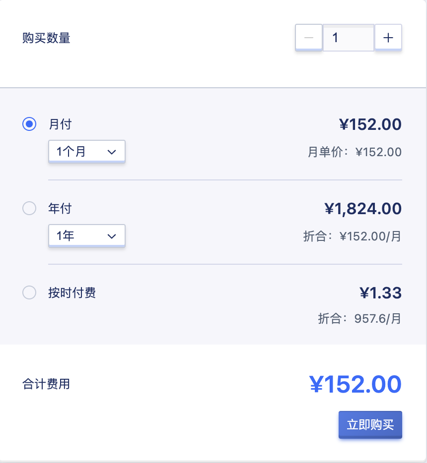
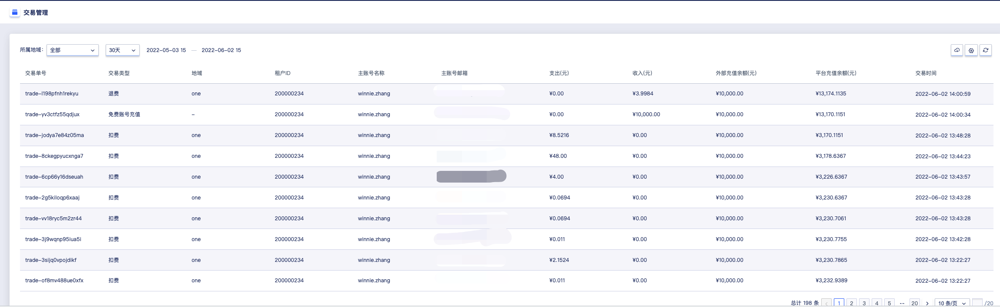
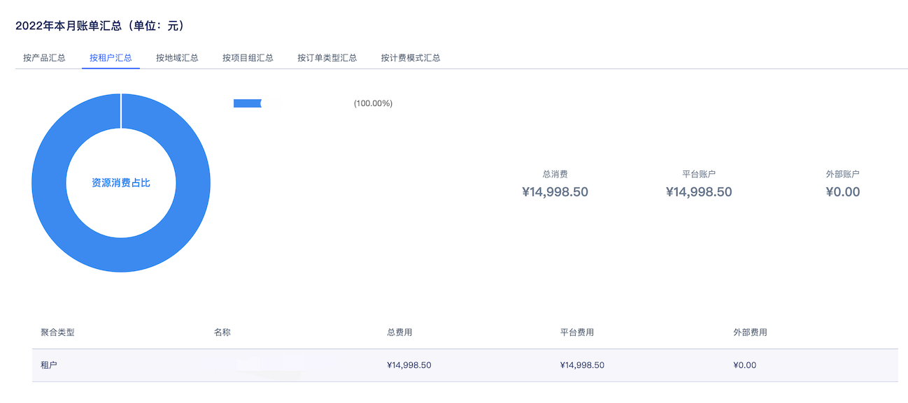
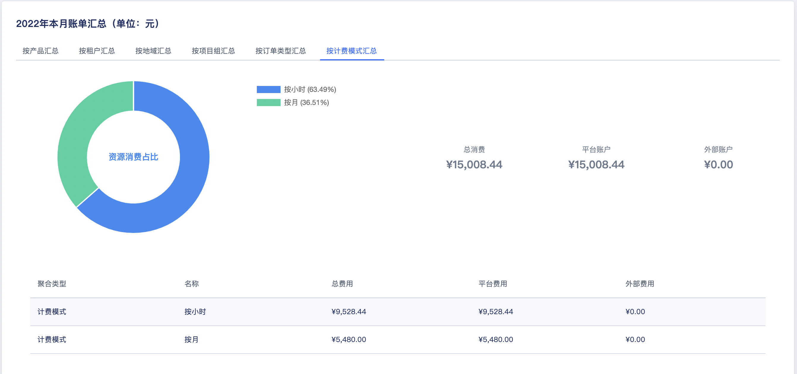
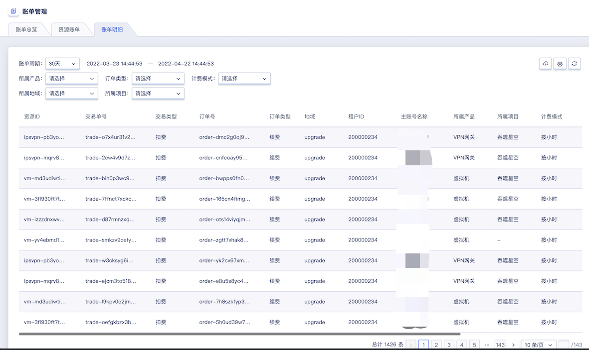

# 23 计费管理

计费管理为用户资源分配和使用提供计量计费服务，需计费的资源均支持按时、按年、按月三种计费方式，支持资源的计费、扣费、续费及过期回收等订单管理操作，同时基于基于账户提供充值、扣费等交易管理。子账号共享主账号的账户余额，通过子账号创建的资源可直接通过共享余额进行扣费，并可通过主账号或子账号查看账户的交易流水及订单明细。

平台资源计费均为预付费模式，即无论按时、按年、按月付费，在资源创建时都需保证账户余额可满足一个计费周期的扣费，下一个计费周期开始前即进行扣费。

- 按时计费：一小时为一个计费周期，资源按照每小时的单价进行预扣费；
- 按月计费：一个月（非自然月）为一个计费周期，资源按照每个月的单价进行预扣费；
- 按年计费：一年（顺延年）为一个计费周期，资源按照每年的单进行预扣费；

> 按年按月购买的资源支持随时升降级配置并在升级配置后自动补齐差价。

账户余额不足下一个计费周期时，资源即会自动进入回收站，需要对资源账号及资源进行续费操作后，才可恢复使用；对于 NAT 网关和负载均衡资源，账户余额不足下一个计费周期时，资源会自动进行删除。

云平台管理员在全局开启"**资源自动续费**"且**账户余额充足时**，则资源在下一个计费周期会进行自动续费操作；若云平台管理员在全局关闭"**资源自动续费**"且**账户余额充足时**，则资源在下一个计费周期会自动进入回收站，需在回收站对资源进行续费操作，并恢复资源。

资源在创建时，所有计费资源的计费计价均会通过资源计价器按照计费方式进行展示，用于确认订单的费用。每个计费周期内的资源均支持释放和删除，当账户余额不足时，可通过云平台管理员进行充值。

## 23.1 资源计价器

资源计价器为用户提供资源付费方式的选择，并展示付费模式下所有资源的费用信息及资源的"**购买**"确认按钮，如下图示例所示：

- 计价器中付费方式支持用户选择时、月、年，分别代表按时计费、按月计费、按年计费，其中选择月和年时，可以选择购买的月份数量和年份数量。
  - 月份可选择 1 ~ 11 ，分别代表 1 个月或 11 个月；
  - 年份可选择 1~ 5 ，分别代表 1 年或 5 年；
- 合计费用指当前订单中所有计费资源一个计费周期的费用合计，如一个虚拟机订单中，包括指定的 CPU 内存、云盘(若有)、EIP(若有)等资源按照付费方式的费用合计。

点击立即购买后，即从账号余额扣除合计费用金额，并产生一个新购订单及一笔扣费的交易流水；若账号余额不足一个计费周期时，无法点击立即购买，需要先对账号进行充值，才可进行购买和创建资源操作。

## 23.2 订单管理

订单管理是平台为用户提供的订单查询及统计服务，通过订单管理可以查看平台账号及子账号所有订单记录，支持查看某个地域、 1 天、3天、 7 天、14 天、1 个月及自定义时间的历史订单记录。对资源进行创建、续费或变更配置时，会分别产生新购、续费及升级等类型订单，如下图所示：

- 订单号：指当前订单的全局唯一标识符；
- 资源 ID ：产生当前订单的资源标识符；
- 地域：当前订单资源所在的区域；
- 订单类型：当前订单的类型，包括新购、续费及升级三种类型；
  - 新购是指用户新创建的计费资源，包括虚拟机、云硬盘、弹性 IP、 NAT 网关及负载均衡等；
  - 续费是指预付费资源每一个计费周期续费时产生的订单，包括手动续费和系统自动续费；
  - 升级是指按月按年计费的资源变更配置时产生的续费订单，如升级带宽、升级虚拟机配置等；
- 订单金额：当前订单金额，即订单在新购所付的费用或升级时补的差价；
- 创建时间：当前订单记录的生成时间，如图上所示，一个按时计费的资源，每小时产生一条续费订单。

> 主账号与所有子账号的订单管理及数据相同，可通过一个账号查看所有订单记录。

## 23.3 交易管理

交易管理是平台为用户提供的账号金额相关的收支明细，包括扣费、充值及统计服务。通过交易管理可查看平台账号及子账号所有交易流深水记录，支持查看某个地域、 1 天、3天、 7 天、14 天、1 个月及自定义时间的历史交易记录，如下图：

- 交易单号：当前交易记录在全局唯一的 ID 标识符，一般扣费以 `trans` 开头，充值以 `trade` 作为开头；
- 交易类型：当前交易记录的类型，根据平台对资源的不同操作，分别包括充值和扣费：
  - 充值指平台管理员通过后台为租户进行的充值操作；
  - 扣费指系统针对每个资源的计费方式，在每个计费周期自动从账号余进行的扣费操作，如按小时计费的虚拟机，每小时按照单价进行一次扣费；
- 支出：当前交易记录所扣费的金额，仅当交易类型为扣费时有效，充值类型显示为 `0.00` ；
- 收入：当前交易记录进账的金融，仅当交易类型为充值时有效，扣费类型显示为`0.00` ；
- 免费余额：当前账户在当前交易记录发生后的当前余额；
- 交易时间：当前交易记录发生时间。

> 主账号与所有子账号的交易流水记录相同，可通过一个账号查看租户的整体收支记录。

## 23.4 账单管理

### 23.4.1 概述

账单管理包括账单总览、资源账单、账单明细。其中，账单总览可以查看费用趋势以及本月账单汇总，资源账单与账单明细支持筛选导出功能。

### 23.4.2 账单总览

租户可通过导航栏进入账单管理控制台，查看账单总览。账单总览包括费用趋势与本月账单汇总两个模块。

### 23.4.3 费用趋势

租户可在帐号总览页面查看费用趋势，可通过自定义费用类型查看云平台在近六个月内产生的交易信息，如下图所示：

### 23.4.4 本月账单汇总

本月账单汇总从按产品汇总、按租户汇总、按地域汇总、按项目组汇总、按订单类型汇总及按计费模式汇总六个方面用饼图展示，列表包括聚合类型、名称、总费用、平台费用及外部费用。

* 按产品汇总

* 按租户汇总

* 按地域汇总

* 按项目组汇总

* 按订单类型

* 按计费模式汇总

### 23.4.5 资源账单

租户可从账单周期/所属产品/计费模式/所属地域/所属项目五个维度查看云平台的资源账单信息，列表包括资源ID、地域、租户ID、主账号名称、主账号邮箱、所属产品、所属项目、计费模式、总费用、平台账户、外部账户及交易时间，如下图所示：

- 资源ID：账单的全局唯一标识符
- 地域：资源所在的地域信息
- 租户ID：产生订单的租户信息
- 主账号名称：充值的租户下的主账号名称
- 主账号邮箱：充值的主账号邮箱
- 所属产品：云平台的产品，包括虚拟机、云硬盘、外网IP、VPN网关、负载均衡、NAT网关、网卡
- 所属项目：本次交易资源所绑定的项目
- 计费模式：按小时、月、年的计费模式
- 总费用：本次交易的总费用
- 平台账户：本次交易消费平台账户的金额
- 外部账户：本次交易消费外部账户的金额
- 交易时间：本次交易产生的时间

### 23.4.6 导出资源账单

平台支持租户从账单周期、所属产品、计费模式、所属地域、所属项目五个维度筛选资源账单，并导出到本地 Excel 文件，为便平台运营管理和报表统计，如下图所示：

### 23.4.7 账单明细

租户可从账单周期/所属产品/订单类型/计费模式/所属地域/所属项目六个维度查看云平台的账单明细，列表包括资源ID、交易单号、交易类型、订单号、订单类型、地域、租户ID、主账号名称、主账号邮箱、所属产品、所属项目、计费模式、总费用、平台账户、外部账户及交易时间，如下图所示：

- 资源ID：账单的全局唯一标识符
- 交易单号：交易记录在云平台的唯一标识
- 交易类型：账户充值和扣费均会生成一次交易记录，因此交易类型包括账户余额充值、免费账户充值及扣费
- 订单号：订单在云平台的唯一标识符
- 订单类型：包括升级和新购两种
- 地域：资源所在的地域信息
- 租户ID：产生订单的租户信息
- 主账号名称：充值的租户下的主账号名称
- 主账号邮箱：充值的主账号邮箱
- 所属产品：云平台的产品，包括虚拟机、云硬盘、外网IP、VPN网关、负载均衡、NAT网关、网卡
- 所属项目：本次交易资源所绑定的项目
- 计费模式：按小时、月、年的计费模式
- 总费用：本次交易的总费用
- 平台账户：本次交易消费平台账户的金额
- 外部账户：本次交易消费外部账户的金额
- 交易时间：本次交易产生的时间

### 23.4.8 导出账单明细

平台支持租户从账单周期、所属产品、订单类型、计费模式、所属地域、所属项目六个维度筛选账单明细，并导出到本地 Excel 文件，为便平台运营管理和报表统计，如下图所示：

