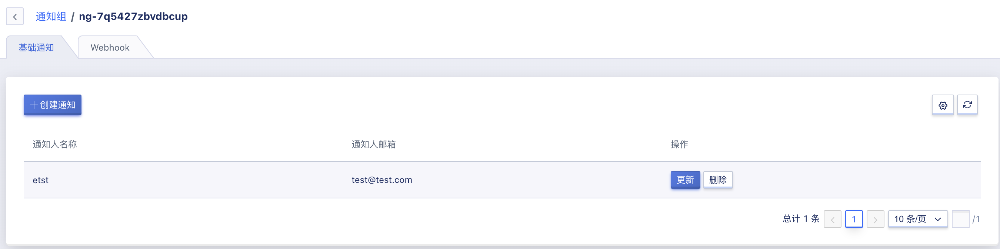
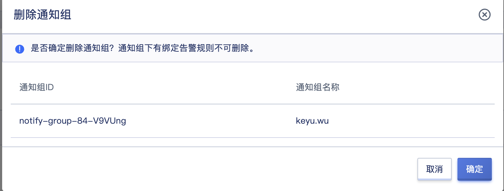
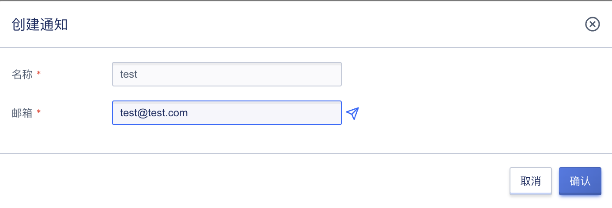

# 30 通知组

通知组是指监控报警发送告警通知的方式及联系人信息，通过对用户邮箱的收集，将不同资源告警通过邮件的方式通知给通知人，以便划分全责，精细化处理告警通知。

- 通知组是一组通知人的组合，可以包含一个或多个联系人；
- 同一个联系人，可以加入多个通知组；
- 通知方式包括邮件通知。

在使用监控告警模板时，需要先创建一个通知组，添加相关联系人信息，并设置通知组的通知方式，以便关联告警模板，通知组具体管理详见下文。

### 30.1 创建通知组

用户可通过控制台导航栏“监控”进入监控告警配置控制台，切换至“**通知组**”页面进行通知组管理页面的“**创建**”按钮进入通知组的创建向导页面，如下图所示指定通知组名称及通知方式进行创建操作：

- 通知组名称：当前需要创建的通知组名称及标识；
- 通知方式：当前需要创建的通知组通知方式，即触发告警通知时通过什么渠道通知用户，包括邮件通知等方式；

点击确定后，进入通知组列表页面，可查看已创建的通知组信息，并对通知组进行相关操作及管理。

### 30.2 查看通知组

用户可通过监控告警控制台进入通知组页面查看通知组列表信息，同时可通过点击列表上通知组的名称进入详情页面，用于查看通知组的详细信息及通知人的管理。

#### 30.2.1 通知组列表

通知组列表页面可查看当前账号下已拥有的通知组列表，列表信息包括 ID、名称、通知方式及对单个通知组的操作项，如下图所示：

- 名称/ID ：通知组的名称标识及全局唯一标识符；
- 通知方式：当前通知组的通知方式；
- 操作：对单个通知组的操作项，包括详情、更新、删除等。

#### 30.2.2 通知组详情

通过通知组列表的 `ID` 进入通知组详情页面，可查看当前通知组的基本信息，并可通过通知人管理进行通知联系人的管理，如下图所示：

- 基本信息：当前通知组的基本信息，包括通知组 ID、名称及通知方式；
- 通知人管理：当前通知组的通知联系人管理，包括通知人的创建、查看、更新及删除，详见[通知人管理](#19.3.5 通知人管理) 。

### 30.3 更新通知组

更新通知组是指对单个通知组的修改，修改项的选择与配置与创建通知组相同，可参考 [创建通知人](#19.3.1 创建通知组) 。

### 30.4 删除通知组

删除通知组前需确认通知组未被绑定至任何一个告警规则中，若已被添加至一个告警规则，则无法删除。被成功删除的通知组即被销毁，需用户确认才可成功删除。用户可通过通知组控制台列表操作项中的“删除”进行通知组删除，如下图所示：

### 30.5 通知人管理

通知人是指告警规则发送通知的具体联系人，包括联系人姓名、邮箱等信息。每个通知组可添加 1 个或多个通知人，在资源发生告警时会发送邮件至所有通知人。

#### 30.5.1 添加通知人

用户可通过通知组详情页面的“**创建**”功能进行通知人的添加，创建通知人时需指定通知人姓名、邮箱等参数，如下图所示：

- 通知人名称：指当前需要创建的联系人姓名或昵称；
- 通知人邮箱：指当前需要创建的联系人邮箱地址；

点击确定后，即可成功创建一个通知联系人，可通过通知组详情的通知人列表查看联系人信息。

#### 30.5.2 更新通知人信息

更新通知人信息是指对单个通知人的信息进行修改，修改项的配置与创建通知人规则相同，可参考[创建通知人](#19.3.5.1 添加通知人)。

#### 30.5.3 删除通知人

删除通知人指对单个通知人进行删除，通知人删除后即直接销毁，可重新添加联系人信息。

