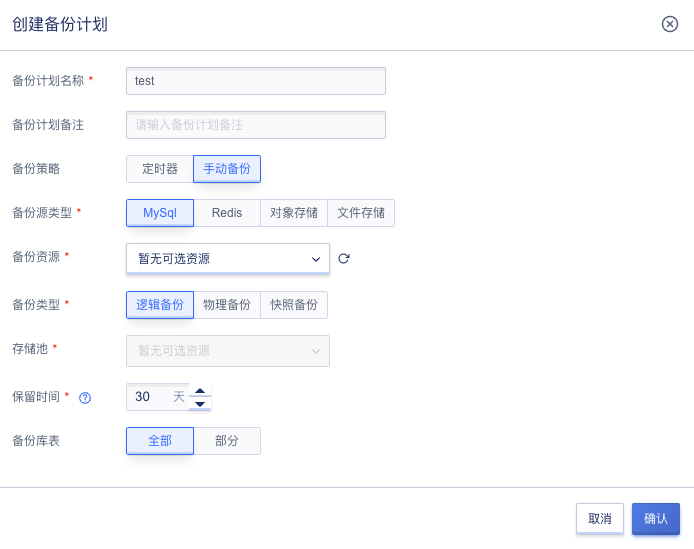

# 34 数据库备份服务

## 34.1 概述

数据库备份服务（Database Backup Service，简称 DBS）是平台为用户提供数据保护的备份服务。数据库备份提供一套完整的数据备份服务，支持定时自动备份和手动备份。

## 34.2 绑定存储池

平台支持用户进行存储池绑定操作，存储类型支持对象存储。可通过导航栏进入【数据库备份】模块，切换到“**存储池**”页面进行操作，如下图所示：

## 34.3 查看存储池列表

平台支持用户查看存储池列表，包括名称、资源ID、状态、存储类型、对象存储、关联备份计划、创建时间、更新时间、操作，如下图所示：

## 34.4 更新存储池

平台支持用户对存储池进行更新操作，更新内容包括存储池名称、存储池备注。可通过存储池列表中操作项“**更新**”按钮进行操作，如下图所示：

## 34.5 解绑存储池

平台支持用户对已绑定存储池进行解绑操作，可通过存储池列表中操作项“**解绑**”按钮进行操作，如下图所示：

## 34.6 创建备份计划

平台支持用户进行备份计划创建操作，支持指定备份策略、备份源类型、备份资源、存储池、保留时间等信息。可通过导航栏进去【数据库备份】进行操作，如下图所示：

备份策略为定时器的备份计划创建成功后，定时器会生成一条定时备份任务，如下图所示：

## 34.7 查看备份计划列表

平台支持用户查看备份计划列表，包括名称、资源ID、状态、存储池、源数据类型、源数据地域、源数据、备份策略、定时器、备份类型、备份保留时间(天)、创建时间、更新时间、操作。如下图所示：

## 34.8 更新备份计划

平台支持用户进行备份计划的更新操作，更新内容包括备份计划名称/备注、备份策略、备份源类型、备份资源、重复周期、执行日期、执行时间、存储池、保留时间等。可通过备份计划列表中操作项的“**更新**”按钮进行操作如下图所示：

## 34.9 执行备份计划

平台支持用户对备份计划进行执行操作，包括备份策略为定时器和手动备份的备份计划。可通过备份计划列表中操作项的“**执行**”按钮进行操作，如下图所示：

## 34.10 删除备份计划

平台支持用户对备份计划进行删除操作，可通过备份计划列表中操作项的“**删除**”按钮进行操作，如下图所示：

备份计划删除成功后，定时器中的备份任务也会被删除。

