# 6 云硬盘

## 6.1 云硬盘概述

云硬盘是一种基于分布式存储系统为虚拟机和数据库服务提供持久化存储空间的块设备。具有独立的生命周期，支持随意绑定/解绑至多个虚拟机使用，并能够在存储空间不足时对云硬盘进行扩容，基于网络分布式访问，为云主机提供高安全、高可靠、高性能及可扩展的数据磁盘。


存储系统兼容并支持多种底层存储硬件，如通用服务器（计算存储超融合或独立通用存储服务器）和商业存储，并将底层存储硬件分别抽像不同类型集群的存储资源池，由分布式存储系统统一调度和管理。在实际应用场景中，可以将普通 SATA 接口的机械盘统一抽像为【SATA 存储集群】，将 SSD 全闪磁盘统一抽象为【SSD 存储集群】，分别由统一存储封装后提供平台用户使用。

如示意图所示，将 SATA 存储集群的资源封装为普通云盘，将 SSD 全闪存储集群的资源封装为高性能云盘。平台的虚拟机和数据库服务可根据需求挂载不同存储集群类型的磁盘，支持同时挂载多种集群类型的云硬盘。云平台管理员可通过管理员控制台自定义存储集群类型的别名，用于标识不同磁盘介质、不同品牌、不同性能或不同底层硬件的存储集群，如 EMC 存储集群、SSD 存储集群等。

> 通常 SSD 磁盘介质的云硬盘的性能与容量的大小成线性关系，容量越大提供的 IO 性能越高，如对 IO 性能有强烈需求，可考虑扩容 SSD 磁盘介质的云硬盘。

分布式存储底层数据通过条带化、PG 映射的方式进行数据存储，同时以多副本存储的方式保证数据安全，即写入至云平台存储集群的数据块会同时保存多份至不同服务器节点的磁盘。多副本存储的数据提供一致性保证，可能导致写入的多份数据因误操作或原始数据异常导致数据不准确；为保证数据的准确性，云平台提供硬盘快照能力，将云盘数据在某一时间点的数据文件及状态进行备份，在数据丢失或损坏时，可通过快照快速恢复数据，包括数据库数据、应用数据及文件目录数据等，可实现分钟级恢复。

云硬盘由统一存储从存储集群容量中分配，为平台虚拟资源提供块存储设备并共享整个分布式存储集群的容量及性能；同时通过块存储系统为用户提供云硬盘资源及全生命周期管理，包括云硬盘的创建、绑定、解绑、扩容、克隆、快照及删除等管理。

* 支持秒级创建云硬盘，最小支持 10G 的容量，步长为 1GB ，可自定义控制单块云硬盘的最大容量，最大支持 32000GB；
* 具有独立的生命周期，可自由绑定至任意虚拟机或数据库服务，解绑后可重新挂载至其它虚拟机；
* X86 架构的虚拟机最多支持绑定 25 块云硬盘，ARM 架构虚拟机最多支持绑定 3 块云硬盘；
* 支持在线和离线的方式扩容磁盘容量，磁盘存储容量扩容后需在虚拟机操作系统中进行文件系统及分区扩展；
* 为保证数据安全性及准确性，云硬盘仅支持磁盘扩容，不支持磁盘缩容；
* 支持云硬盘克隆，即将云硬盘内的数据复制成为一个新的云硬盘；
* 支持对云硬盘进行快照备份，包括虚拟机的系统盘快照及弹性云盘快照，并可从快照回滚数据至云硬盘，用于数据恢复和还原场景；
* 支持从快照创建云硬盘，创建的硬盘大小与快照的原始硬盘大小相等，从快照创建云硬盘，该云硬盘只能与快照所对应的原始云硬盘归属同一存储集群，可以用系统盘快照创建的云硬盘创建虚拟机；
* 支持对全局及每一块云硬盘的 QoS 进行配置，可根据不同业务模式调整磁盘的性能，以平衡平台整体性能；
* 支持设置存储集群类型权限，即可以将部分存储资源设置为租户独享，满足需要独享底层存储资源的场景。

支持自动精简配置，在创建云硬盘时，仅呈现分配的逻辑虚拟容量。当用户向逻辑存储容量中写入数据时，按照存储容量分配策略从物理空间分配实际容量。如一个用户创建的云硬盘为 1TB 容量，存储系统会为用户分配并呈现 1TB 的逻辑卷，仅当用户在云硬盘中写入数据时，才会真正的分配物理磁盘容量。

## 6.2 创建云硬盘

在平台控制台上，用户可通过指定云硬盘的类型、容量及名称即可快速创建一块云硬盘，作为虚拟机的数据盘。创建前需确认账户的余额及硬盘配额充足。

1、通过控制台进入硬盘资源控制台，通过“**创建硬盘**”按钮，即可进入云硬盘创建向导页面，如下图所示，根据需求选择并配置硬盘类型、硬盘容量、硬盘名称、硬盘密钥等参数。
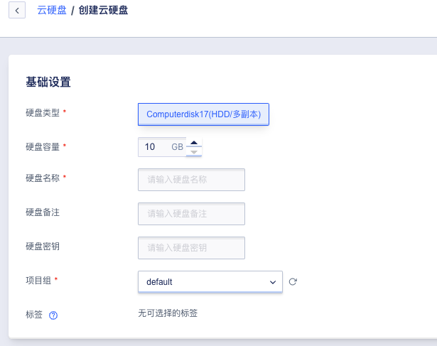

* 硬盘类型：即云硬盘类型，即存储集群类型，由平台管理员自定义，如 HDD 云盘或 SSD 高性能云盘；
* 硬盘容量：云硬盘分配的逻辑容量，默认最小 10GB ，步长为 1GB ，最大支持 32000GB ，可由云平台管理员在控制台自定义容量规格；
* 云硬盘名称：需要创建的云硬盘名称；
* 硬盘密钥：输入密钥后该硬盘将加密；

2、选择购买数量和付费方式，如下图所示确认订单并点击“立即购买” 进行云硬盘购买及创建操作：

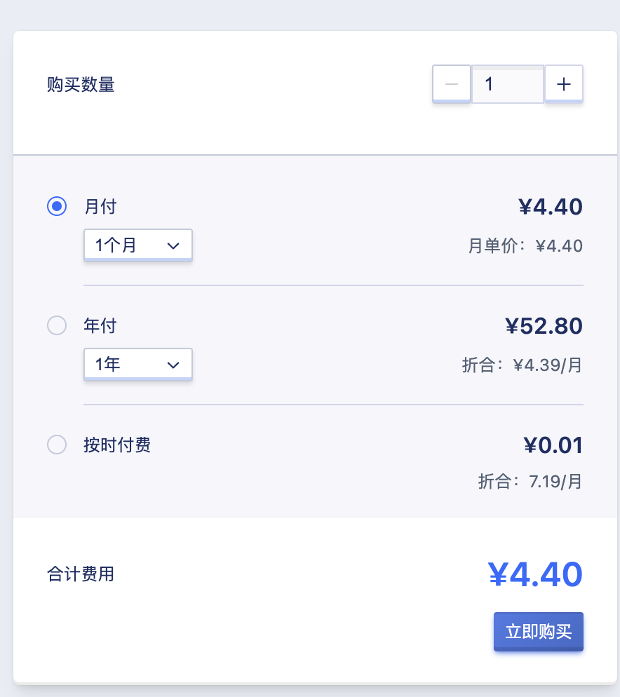

- 购买数量：选择需要创建的云硬盘数量，一次最多支持批量创建 10 块相同规格的云硬盘。
- 付费方式：选择虚拟机的计费方式，支持按时、按年、按月三种方式，可根据需求选择适合的付费方式；
- 合计费用：用户选择创建云硬盘资源按照付费方式的费用展示；
- 立即购买：点击立即购买后，会返回云硬盘资源列表页，在列表页可查看云硬盘的创建过程，创建成功后，云硬盘状态显示为“未绑定”。

## 6.3 查看云硬盘

通过导航栏进入虚拟机控制台，切换至硬盘管理页面可查看当前账户下云硬盘资源的列表及相关详细信息，包括名称、资源 ID、状态、集群类型、硬盘容量、绑定资源、计费方式、创建时间、过期时间、项目组及操作项，如下图所示：


* 名称/ID：云硬盘的名称和全局唯一标识符；
* 状态：云硬盘的当前状态，包括创建中、未绑定、绑定中、已绑定、解绑中、正在被克隆中	、及删除中等，其中正在被克隆中指当前硬盘正在克隆，快照中指当前硬盘正在快照备份中。
* 是否加密：磁盘的加密状态；
* 集群类型：即云硬盘类型，即存储集群类型，由平台管理员自定义，如 HDD 云盘或 SSD 高性能云盘；
* 硬盘容量：云硬盘的容量，GB 为单位；
* 绑定资源：云硬盘已绑定的虚拟机名称和 ID ，未指定则为空；
* 计费方式：云硬盘在创建时指定的计费方式，如按月、按年、按时；
* 创建时间/过期时间：云硬盘的创建时间和计费周期过期时间；
* 项目组：当前云硬盘的项目组信息；


列表上的操作项是指对单块硬盘的操作，包括绑定、解绑、扩容、克隆、快照及删除等，可通过搜索框对硬盘列表进行搜索和筛选，支持模糊搜索。

为方便租户对硬盘资源的统计及维护，平台支持下载当前用户所拥有的所有硬盘资源列表信息为 Excel  表格；同时支持对硬盘进行批量解绑和批量删除操作。

## 6.4 绑定云硬盘

绑定是指将一块云硬盘挂载至一台虚拟机，为虚拟机添加数据磁盘，用于数据存储。

* 仅支持状态为“未绑定”的硬盘进行绑定，为保证数据安全，一块云硬盘同时仅支持绑定至一台虚拟机；
* 云硬盘具有地域（数据中心）属性，仅支持绑定相同数据中心且处于关机或运行状态的虚拟机；
* **X86 架构虚拟机最多可绑定 25 块硬盘，ARM 架构虚拟机最多支持绑定 3 块硬盘；**

可通过硬盘管理资源列表操作项的“**绑定**”功能，进行硬盘绑定操作，如下图所示：


绑定时需选择绑定硬盘的虚拟机，绑定过程中硬盘的状态为“绑定中”，待状态变转换为“已绑定” 即代表绑定成功。用户可通过虚拟机的硬盘信息查看已绑定云盘资源及信息，包括容量、挂载等，同时用户也可登录虚拟机操作系统中查看是否已识别到新的磁盘设备，如 Linux 操作系统用户可输入 `fdisk -l`  查看新增块设备的信息。

**云硬盘绑定后，默认不进行格式化（如需）和系统挂载操作，需用户登录已挂载的虚拟机操作系统，根据需求对云盘进行格式化及挂载(`mount`) 操作，有关操作系统内格式化及挂载数据盘，详见[格式化并挂载数据盘](#_66-格式化并挂载数据盘)。**

## 6.5 解绑云硬盘

解绑云硬盘是指将云硬盘从虚拟机上分离出来，解绑的云硬盘可重新绑定至其它虚拟机，解绑后云硬盘的数据不会丢失，重新挂载新虚拟机后，可直接使用云硬盘上的数据。

仅支持解绑已绑定状态的硬盘资源，用户可通过硬盘列表或已绑定虚拟机详情硬盘页面进行硬盘的解绑操作，如下图所示：


解绑时，虚拟机的状态必须处于关机或运行状态。解绑操作执行过程中，云硬盘的状态会转换为“解绑中”；状态转换为“未绑定”，即代表解绑成功，可将硬盘重新绑定至其它虚拟机。

> 为保存数据完整性，解绑操作前建议暂停对当前硬盘所有文件系统的读写操作，并进入操作系统进行 `umount`或脱机操作（Linux 系统需确认已 `umount` 硬盘所对应的文件系统； Windows 系统需确认至磁盘管理中进行磁盘下线操作），避免因强制解绑云硬盘导致文件系统损坏或丢失。

## 6.6 格式化并挂载数据盘

云硬盘成功挂载到虚拟机后，需要格式化后才可正常读写数据。本章节主要描述如何用一块新的云硬盘创建一个单分区的数据盘。Linux 的虚拟机和 Windows 的虚拟机使用云硬盘的方式不同，Linux 虚拟机格式化后，需要挂载到文件系统的一个目录中使用；Windows 的虚拟机首先需要初始化磁盘，进行分区并格式化后即可正常使用。

> 格式化和分区磁盘具有一定的风险，格式化后云硬盘中的数据将被清空，请慎重操作。

### 6.6.1 Linux 虚拟机

Linux 虚拟机挂载的云硬盘设备名是由系统默认分配的，从 `/dev/vdb` 递增排列，包括`/dev/vdb 到 /dev/vdz`。本示例挂载一块 100GB 的云硬盘至 Linux 虚拟机，设备名为 `/dev/vdb` 。具体操作步骤如下：

1. 创建云硬盘，并挂载至一台 Linux 的虚拟机，并通过 SSH 远程连接并登录虚拟机；
2. 使用 `fdisk -l ` 命令查看虚拟机上的云硬盘，检测是否挂载成功，如下图所示挂载的数据盘为 100GB `/dev/vdb` 设备；


3. 创建文件系统，使用 `mkfs.ext4 /dev/vdb` 命令进行格式化并新建一个文件系统，分区格式化可选择`ext3`、`ext4   `等文件系统的格式，示例采用 `ext4 ` 格式；

```bash
[root@localhost ~]# mkfs.ext4 /dev/vdb
mke2fs 1.41.12 (17-May-2010)
文件系统标签=
操作系统:Linux
块大小=4096 (log=2)
分块大小=4096 (log=2)
Stride=0 blocks, Stripe width=0 blocks
6553600 inodes, 26214400 blocks
1310720 blocks (5.00%) reserved for the super user
第一个数据块=0
Maximum filesystem blocks=4294967296
800 block groups
32768 blocks per group, 32768 fragments per group
8192 inodes per group
Superblock backups stored on blocks: 
	32768, 98304, 163840, 229376, 294912, 819200, 884736, 1605632, 2654208, 
	4096000, 7962624, 11239424, 20480000, 23887872

正在写入inode表: 完成                            
Creating journal (32768 blocks): 完成
Writing superblocks and filesystem accounting information: 完成
```

4. 挂载数据盘，创建挂载点 `/data` 目录，使用 `mount /dev/vdb /data` 命令挂载新分区，并使用 `df -h` 验证云硬盘是否挂载成功；

```bash
[root@localhost ~]# mkdir /data
[root@localhost ~]# mount /dev/vdb /data
[root@localhost ~]# df -h
Filesystem      Size  Used Avail Use% Mounted on
/dev/vda1        20G  874M   18G   5% /
tmpfs           1.9G     0  1.9G   0% /dev/shm
/dev/vdb         99G  188M   94G   1% /data
```

5. 配置开机自动挂载，添加云硬盘的挂载信息至 `/etc/fstab` ，如下：

```bash
echo '/dev/vdb /data ext4 defaults 0 0' >> /etc/fstab
```

6. 挂载成功，即可正常使用云硬盘，若云硬盘在控制台被解绑，重新绑定至虚拟机后，需要重复执行 `mount /dev/vdb /data` 命令，或者需要重启虚拟机进行自动挂载；
7. 若云硬盘在控制台被解绑，重新绑定至其它 Linux 虚拟机后，需要按照第 4~5 步骤执行挂载操作。 

### 6.6.2 windows 虚拟机

Windwos 虚拟机挂载云硬盘后，需要进行初始化和格式化分区操作，才可正常使用。Windows 操作系统可进入 “磁盘管理” 界面进行分区与格式化操作，本章节以 Windows 2012 R2 为例进行格式化与分区操作，如下：

1. 创建云硬盘，并挂载至一台 windows 的虚拟机，通过 VNC 或远程桌面远程连接并登录虚拟机；
2. 点击【开始】—【管理工具】—【计算机管理】—【磁盘管理】，打开“磁盘管理” 界面，查看已挂载的云硬盘，如下图所示的磁盘 1 ：


3. 在磁盘 1 上右键单击，选择【联机】，如下图所示：


4. 在磁盘 1 上右键单击，选择【初始化磁盘】，进入磁盘初始化向导界面，如下图所示：


5. 根据分区形式的不同，选择【GPT】或【MBR】，单击【确定】按钮；

* MBR 目前仍是最常用的分区形式，支持处理不大于 2 TB 的数据盘，仅支持分 4 个主区，如果您要将磁盘分成更多的区，需要将某个主区作为扩展区并在其中创建逻辑分区。
* GPT 是一种新的分区形式，早期版本的 Windows 不能识别这种分区形式。GPT 能处理的数据盘容量由操作系统和文件系统决定。在 Windows 操作系统里，GPT 最多可以支持 128 个主分区。

6. 磁盘分区，右键点击磁盘 1 右侧【未分配】的区域，选择【新建简单卷】，进入新建简单卷向导，如下图：


7. 点击下一步，输入分区所需的磁盘大小，若只需一个分区，使用默认值，单击下一步；


8. 分配驱动器号和路径，选择一个驱动器号（即盘符），如本示例中选择 D，单击 **下一步**；

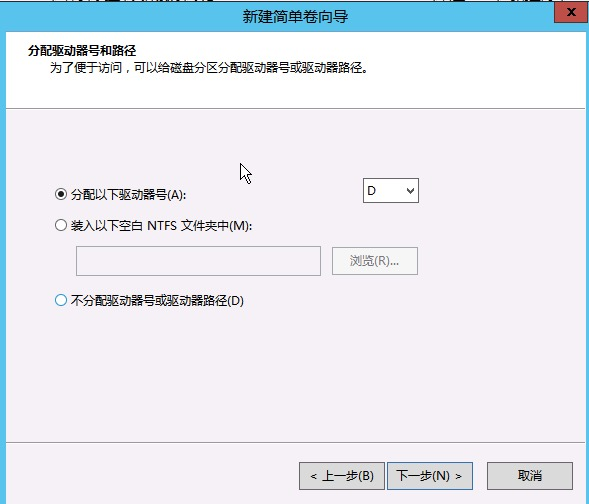

9. 格式化分区，选择格式化设置，包括文件系统、分配单元大小和卷标，确认是否 **执行快速格式化** 和 **启用文件和文件夹压缩**，这里使用默认设置，单击 **下一步**；


10. 点击完成，开始创建新简单卷，返回磁盘管理工具，磁盘 1 的状态良好，如下图所示：


## 6.7 扩容云硬盘

### 6.7.1 扩容云盘容量

平台支持用户扩容云硬盘的容量，适应于业务发生变化需扩容磁盘容量的场景。平台仅支持扩容磁盘容量，不支持磁盘容量的缩容。支持在线和离线两种硬盘扩容方式：

* 在线是指对运行状态虚拟机上绑定的云盘进行容量扩容；
* 离线是指对未绑定至虚拟机或关机状态虚拟机上绑定的云盘进行容量扩容。

磁盘容量扩容范围即当前硬盘类型的规格，默认为 10GB~32000GB ，平台管理员可至平台管理后台全局配置中，进行磁盘规格配置。

扩容硬盘容量会对虚拟机费用产生影响，按小时付费的硬盘，扩容容量下个付费周期按新配置扣费；按年按月付费的硬盘，扩容容量即时生效，并按比例自动补差价。用户可点击云硬盘控制台操作中的“**扩容**” 进行硬盘容量扩容操作，如下图所示：

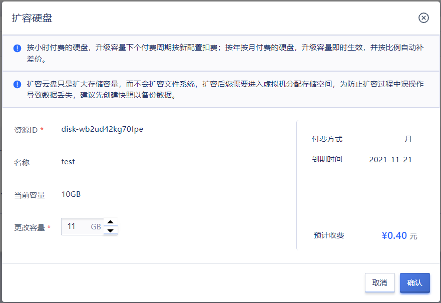

如图所示，**扩容硬盘需指定更改容量的大小**，即硬盘需要扩容的容量。平台已展示当前硬盘的容量大小，由于不支持缩容，扩容时更改容量必须大于当前容量大小。

用户可通过硬盘列表或虚拟机硬盘信息查看硬盘的新容量；若硬盘已绑定虚拟机，用户也可登录虚拟机操作系统中查看绑定磁盘设备的容量，如 Linux 操作系统用户可输入 `fdisk -l`  查看新增块设备的信息。

> 由于 MBR 格式分区不支持大于 2TB 的磁盘容量。在扩容云硬盘时，若待扩容的硬盘采用 MBR 分区格式且需要扩容到 2TB 及以上容量时，建议重新创建并挂载一块硬盘，使用 GPT 分区方式并将数据拷贝至新硬盘中。

扩容操作仅对硬盘的块设备容量进行增加，并未对操作系统内文件系统和分区进行扩展。在容量扩容成功后，需进入挂载的虚拟机操作系统进行分区扩展或新建分区操作，详见【6.7.2 磁盘分区扩容】。

### 6.7.2 磁盘分区扩容

扩容硬盘容量后，需要进入操作系统对磁盘分区进行扩容，即需对文件系统进行扩容，才可使操作系统正常使用已扩容的磁盘容量。针对不同的操作系统分区扩容操作有所不同，如 Linux 通常通过 `fdisk` 或`parted`  工具；Windows 通常使用自带的磁盘管理工具进行扩容操作。根据不同磁盘扩容场景，分区扩容大致分为如下场景：

* 裸磁盘扩容（Linux）
* 单分区磁盘扩容（Linux）
* 单分区磁盘扩容（Windows）
* 多分区磁盘扩容（Linux）
* 多分区磁盘扩容（Windows）
* 2TB 硬盘分区扩容（Linux）
* 2TB 硬盘分区扩容（Windows）

#### 6.7.2.1 裸磁盘扩容（Linux）

裸磁盘是指未进行分区的云硬盘，即创建的云硬盘挂至主机后，直接对磁盘进行格式化进行使用，用户可通过对硬盘扩容容量后，进入操作系统对裸磁盘进行扩容操作。

> 裸磁盘直接格式化使用，仅适用于 Linux 系统，Windows 必须进行格式化并分区才可进行挂载使用。

本示例以 CentOS 6.5 操作系统（内核版本为 2.6.32-431.el6.x86_64  ）为示例环境版本，云硬盘大小为 40GB ，扩容至 50GB ，挂载点为 `/dev/vdb` ，实际环境中需根据实际情况进行操作。

* 查看当前磁盘的信息，包括挂载点、文件系统类型及分区情况。

  

  注：结果显示 vdb 磁盘为 ext4 分区且磁盘下无分区，为裸磁盘，可按照本文档所述方案扩容；若 vdb 下有分区，需参考单分区扩容或多分区扩容章节内容。

* 通过控制台或 API 对硬盘进行容量扩容操作，并在操作系统中查看磁盘的容量，如下图所示，扩容至50GB；

  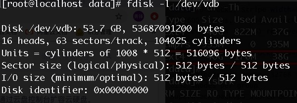

* umount 磁盘，进行文件系统扩容操作，不同的文件系统扩容命令操作不同，本文分别以 ext4 及 xfs 文件系统为例进行扩容操作；

* ext4 文件系统扩容，执行 `resize2fs /dev/vdb`  进行系统磁盘扩容操作，最后重新 mount 挂载磁盘即可；

  

  如上图所示，扩容并挂载磁盘后，`/data` 目录所显示的容量为扩容后的 50GB 。

* 若磁盘为 xfs 文件系统，则需要执行 `xfs_growfs /data/` 命令进行磁盘扩容操作

> 注意：xfs 文件系统的磁盘扩容，需要在操作系统中将磁盘 `mount` 后操作。

#### 6.7.2.2 单分区扩容（Linux）

单分区磁盘是指云盘在扩容之前已被挂载过虚拟机且只划分过 1 个分区，用户可通过对硬盘扩容容量后，进入操作系统对单分区磁盘进行分区扩容操作。单分区扩容在 Linux 及 Windows 操作系统上的操作不同，本章节为 Linux 单分区扩容操作指南。

本示例以 CentOS 6.5 操作系统（内核版本为 2.6.32-431.el6.x86_64  ）为示例环境版本，云硬盘大小为 10G 单分区，扩容至 20GB ，挂载点为 `/dev/vdb1` ，实际环境中需根据实际情况进行操作。若磁盘上划分多个分区，可参考多分区扩容章节。

> 本操作示例默认磁盘容量小于 2TB ，若磁盘容量大于 2TB 请参考 [2TB磁盘分区扩容（Linux）](#_6726-2TB-磁盘分区扩容（Linux）) 章节。

* 通过 `lsblk` 查看当前磁盘的信息，包括挂载点、文件系统类型及分区情况；

  

  注：结果显示 vdb 下只有一个 10GB 的分区，分区格式为 ext4 ，挂载至 `/mnt` 目录 。

* 通过控制台或 API 对硬盘进行容量扩容操作，并在操作系统中通过 fdisk 或 lsblk 查看扩容后的磁盘容量；

* 在操作系统中 umount 磁盘，使用 `fdisk /dev/vdb` 命令删除原来的分区并创建新分区；

  

  > 注：删除分区不会造成磁盘内数据丢失。

* 检查文件系统并进行文件系统扩容操作，不同的文件系统扩容命令操作不同，本文分别以 ext4 及 xfs 文件系统为例进行扩容操作；

* ext4 文件系统扩容，执行 `e2fsck -f /dev/vdb1` 和  `resize2fs /dev/vdb1` 进行检查和扩容操作；

  

  如上图所示，扩容分区扩容成功后，重新 mount 分区，并查看分区大小及相关信息。

* 若磁盘为 xfs 文件系统，则先执行 `xfs_repair /dev/vdb1` 检查文件系统，如下图所示：

  

  最后使用 mount 重新挂载磁盘，并执行 `xfs_growfs /mnt` 对磁盘分区进行扩容操作。

#### 6.7.2.3 单分区扩容（Windows）

单分区磁盘是指云盘在扩容之前已被挂载过虚拟机且只划分过 1 个分区，用户可通过对硬盘扩容容量后，进入操作系统对单分区磁盘进行分区扩容操作。单分区扩容在 Linux 及 Windows 操作系统上的操作不同，本章节为 windows 单分区扩容操作指南。

本示例以 Windows Server 2012R2 操作系统为示例环境版本，云硬盘大小为 10GB ，扩容至 20GB ，挂载点为 Disk1 ，实际环境中需根据实际情况进行操作。具体操作如下：

> 本操作示例默认磁盘容量小于 2TB ，若磁盘容量大于 2TB 请参考 [2TB磁盘分区扩容（Windows）](#_6727-2TB-磁盘分区扩容（Windows）)。

* 查看当前磁盘的分区及挂载信息，确认磁盘是当前需要扩容的磁盘，如下图所示：

  

* 在操作系统中对磁盘进行脱机操作，并通过控制台及 API 对当前磁盘进行容量扩容操作，并通过操作系统磁盘管理工具查看扩容后的磁盘大小，如下图所示：

  

* 右键单击新分区 D 空白处，选择扩展卷（Extend Volume），并在弹出的对话框中，对磁盘分区进行扩展操作，如以下图示：

  

  

  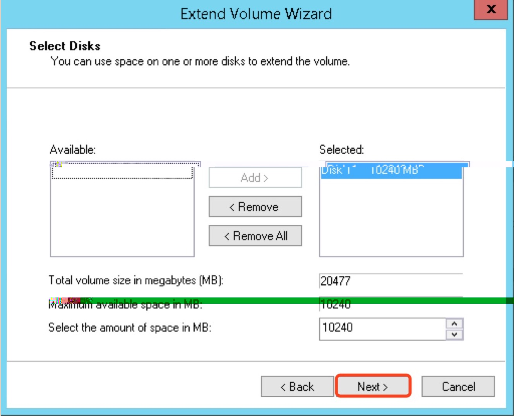

  

  

* 分区扩展成功后，查看扩容后分区信息，如下图所示：

  

#### 6.7.2.4 多分区扩容（Linux）

多分区磁盘是指云盘在扩容之前已被挂载过虚拟机且划分过多个分区，用户可通过对硬盘扩容容量后，进入操作系统对多分区磁盘进行分区扩容操作。由于新扩容的空间是附加在虚拟云盘的末端，对于多分区的场景，只支持对排在最后的分区进行扩容操作。

多分区扩容在 Linux 及 Windows 操作系统上的操作不同，本章节为 Linux 多分区扩容操作指南。本示例以 CentOS 6.5 操作系统为示例环境版本，云硬盘大小为 20G ，两个分区分别 10GB ，挂载点分别为 `/dev/vdb1`和`/dev/vdb2` ，扩容至 30GB ，即将最后一个分区扩容为 20GB ，实际环境中需根据实际情况进行操作。

> 本操作示例默认磁盘容量小于 2TB ，若磁盘容量大于 2TB 请参考 [2TB磁盘分区扩容（Linux）](#_6726-2TB-磁盘分区扩容（Linux）)章节。

* 通过 `lsblk` 及 `df` 查看当前磁盘的信息，包括挂载点、文件系统类型及分区情况；

  

  结果显示 vdb 下有两个 10GB 的分区（vdb1 和 vdb2），且分别挂载至 /mnt 及 /data 目录下，扩容操作仅可对 vdb2 分区进行扩容操作，即将 vdb2 扩容为 20GB 。

* 通过控制台或 API 对硬盘进行容量扩容操作，并在操作系统中通过 fdisk 或 lsblk 查看扩容后的磁盘容量；

* 在操作系统中 umount 磁盘，使用 `fdisk /dev/vdb` 命令删除最后一个分区（vdb2）并创建新分区；

  

  > 注：删除分区不会造成磁盘内数据丢失，以上示例为删除 vdb2 ，即磁盘的最后一个分区。

* 检查文件系统并进行文件系统扩容操作，不同的文件系统扩容命令操作不同，本文分别以 ext4 及 xfs 文件系统为例进行扩容操作；

* ext4 文件系统扩容，执行 `e2fsck -f /dev/vdb2 ` 和  `resize2fs /dev/vdb2` 进行检查和扩容操作，扩容分区扩容成功后，重新 mount 分区，并查看分区大小及相关信息；

* 若磁盘为 xfs 文件系统，则先执行 `xfs_repair /dev/vdb2` 检查文件系统后，使用 mount 将磁盘重新挂载至 `/data`目录，最后使用 `xfs_growfs  /data` 命令对 vdb2 磁盘分区进行扩容操作。

#### 6.7.2.5 多分区扩容（Windows）

多分区磁盘是指云盘在扩容之前已被挂载过虚拟机且划分过多个分区，用户可通过对硬盘扩容容量后，进入操作系统对多分区磁盘进行分区扩容操作。由于新扩容的空间是附加在虚拟云盘的末端，对于多分区的场景，只支持对排在最后的分区进行扩容操作。

多分区扩容在 Linux 及 Windows 操作系统上的操作不同，本章节为 Windows 多分区扩容操作指南。本示例以 Windows Server 2012R2 操作系统为示例环境版本，云硬盘大小为 10G ，两个分区分别 5GB ，挂载点 Disk1 ，扩容至 20GB ，即将最后一个分区扩容为 15GB ，实际环境中需根据实际情况进行操作。

> 本操作示例默认磁盘容量小于 2TB ，若磁盘容量大于 2TB 请参考 [2TB磁盘分区扩容（Windows）](#_6727-2TB-磁盘分区扩容（Windows）)章节。

* 查看当前磁盘的分区及挂载信息，确认磁盘是当前需要扩容的磁盘，如下图所示：

  

* 在操作系统中对磁盘进行脱机操作，并通过控制台及 API 对当前磁盘进行容量扩容操作，并通过操作系统磁盘管理工具查看扩容后的磁盘大小，如下图所示：

  

* 右键点击新分区 E （最后一个分区）空白处，选择扩展卷（Extend Volume），对分区进行扩容；

  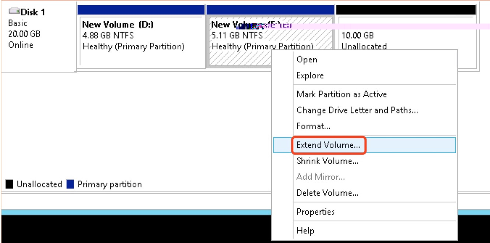

  通过点击下一步及相关配置，完成新分区的容量扩容；

* 完成扩容后，查看扩容后分区情况，如下图所示：

  

  如结果显示，E 盘被扩展为 15GB ，即在原来的基础之上扩容 10GB 的容量。

#### 6.7.2.6 2TB 磁盘分区扩容（Linux）

当一块磁盘的容量大于 2TB 时，在 linux 下无法通过 fdisk 工具命令对对进行分区，需通过 parted 命令进行分区及扩容操作。2TB 以上磁盘在 Linux 及 Windows 操作系统上的操作不同，本章节为 Linux 下大于 2TB 磁盘扩容操作指南。

本示例以 CentOS 6.5 操作系统为示例环境版本，云硬盘大小为 2TB ，挂载点为 `/dev/vdb` ，扩容至 2.1TB ，即将云盘及分区扩容为 100GB ，实际环境中需根据实际情况进行操作。具体操作如下：

（1）若磁盘为新创建，则需要通过 parted 工具先进行分区，具体操作如下图：

* 通过输入 `parted /dev/vdb` 进行分区操作，其中 `mklabel gpt` 是将磁盘分区设置为 GPT 格式；

  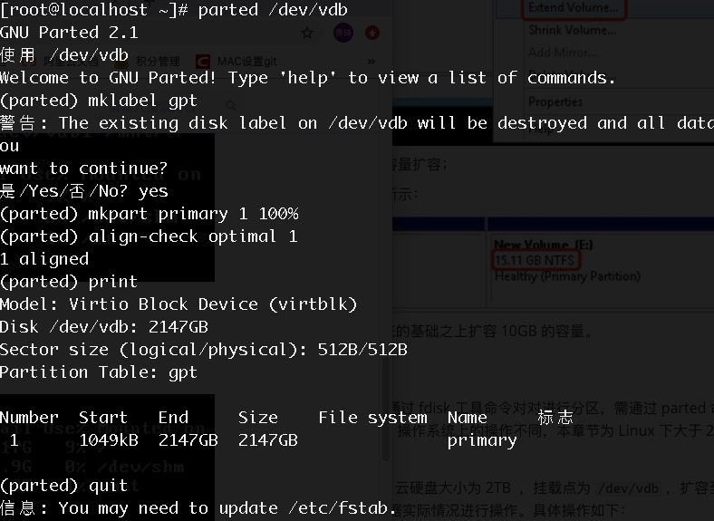

* 分区后，可通过 lsblk 查看磁盘分区是否成功，并通过 mkfs.ext4  /dev/vdb1 将分区进行格式化并进行挂载才可正常使用，如下图所示：

  

* 格式化成功后，通过挂载并查看磁盘的信息，如下图所示 `/dev/vdb1` 被挂载至 `/mnt` ，容量为 2TB 。

  

（2）扩容大于 2TB 磁盘的具体操作如下：

* 通过 `lsblk` 及 `df` 查看当前磁盘的信息，包括挂载点、文件系统类型及分区情况；

* 通过控制台或 API 对硬盘进行容量扩容操作，并在操作系统中通过 fdisk 或 lsblk 查看扩容后的磁盘容量，本示例中将磁盘扩容为 2.1TB ，即 2100GB ，如下图所示：

  

* 在操作系统中 umount 磁盘，使用 `parted /dev/vdb` 命令删除原来分区并创建新分区，同时使用 `lsblk` 命令查看 vdb1 分区信息。若为多分区则删除最后一个分区并创建新分区；

  

  如图所示，其中`unit s 代表将显示和操纵单位变成 sector ` ；`rm 1` 是删除当前分区；` mkpart test 2048s 100% ` 是创建一个名称为 test ，起始扇区为 2048s ，使用磁盘全部空间的新分区 。注：删除当前分区不会造成磁盘内数据丢失。

* 执行`e2fsck -f /dev/vdb1`命令检查文件系统，并使用 `resize2fs /dev/vdb1` 对分区进行扩容操作；

  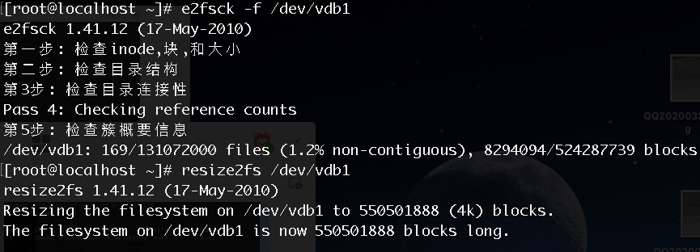

* 重新 mount  磁盘并查看磁盘情况，检查扩容是否成功

  

#### 6.7.2.7 2TB 磁盘分区扩容（Windows）

当一块磁盘的容量大于 2TB 时，在 Windows 下无法使用 MBR 分区形式，需要使用 GPT 分区表形式进行磁盘初始化，并通过磁盘管理工具进行分区及扩容操作。2TB 以上磁盘在 Linux 及 Windows 操作系统上的操作不同，本章节为 Windows 下大于 2TB 磁盘扩容操作指南。

本示例以 Windwos Server 2012R2 操作系统为示例环境版本，云硬盘大小为 2TB  ，挂载点为 Disk1（磁盘1） ，扩容至 2.1TB ，即将云盘及分区扩容为 100GB ，实际环境中需根据实际情况进行操作。具体操作如下：

（1）若磁盘为新创建，则需要磁盘管理工具对磁盘进行联机并初始化操作，具体操作如下：

* 当在控制台创建一台 2T 的硬盘挂载至 Windows 虚拟机后，在磁盘管理工具会出现类似 磁盘1 或 Disk1 的磁盘，并且磁盘的状态为脱机；

  

* 如上图所示，右键点击磁盘1 右边空白处，单击联机，将磁盘置为联机状态；

* 磁盘联机后，磁盘状态为 “没有初始化” ，可点击磁盘空白处，点击初始化磁盘；

  

* 在初始化磁盘界面，选择 “GPT（GUID分区表）” 选项，进行磁盘初始化操作；

  

* 磁盘初始化成功后，右键点击磁盘1 未分配区域，点击单建简单卷进行分区及格式化操作；

  

* 在新建简单卷导向中，选择卷大小、驱动器号及格式化选项后，成功创建新的分区，如下图所示：

  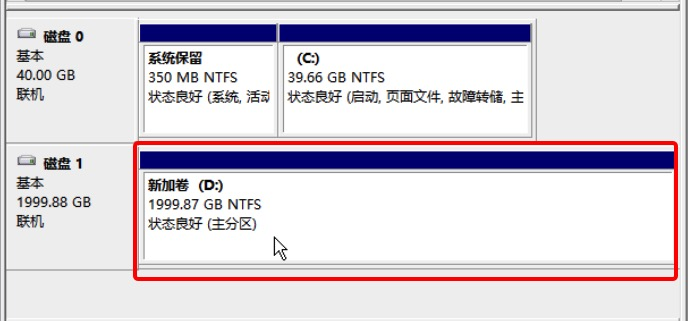

（1）若要扩容 Windows 上 2T 的磁盘，可按如下操作进行扩容：

* 通过控制台或 API 对磁盘 1 进行扩容，扩容后可通过 Windows 操作系统的磁盘管理工具"重新扫描磁盘"查看新扩容磁盘信息，如下图所示磁盘1多出来 100GB 的未分配空间；

  ]

* Windows 扩容分区，可将多余的 100GB 单独划分一个分区，也支持将 100GB 空间扩容至已有分区中，本示例演示将 100GB 未分配的容量扩容至已有分区 D 盘中；

* 右键点击已有分区的空白处（本示例为 D 盘），单击扩展卷，通过扩展卷向导将未分配容量扩展至 D 盘中；

  

* 在扩展卷向导中，选择磁盘1，并输需扩展的容量，通常系统已默认选择所有未分配容量，并确认扩展卷操作

  

* 扩展成功后，未分配容量已成功扩容至已有分区 D 盘中，如上图所示，磁盘总容量为 2.1T ；

  

## 6.8 硬盘克隆

硬盘克隆是指将云硬盘内的数据复制到一个新的云硬盘，硬盘大小和类型与原硬盘一致。仅支持克隆状态为未绑定状态的硬盘，同时在硬盘克隆过程中，源硬盘不可进行绑定、克隆、扩容等操作。

用户可通过云硬盘硬盘资源列表上的“**克隆**”功能，进行云硬盘克隆操作，如下图所示：


* 源硬盘名称/ID：需要进行克隆的硬盘名称和 ID ；
* 源硬盘容量：需要进行克隆操作硬盘的容量，即源硬盘容量；
* 目标硬盘名称：新克隆的硬盘名称。

克隆会基于源硬盘复制出一块新的硬盘，需选择新硬盘的相关计费配置，包括购买数量、付费方式及合计费用等：

- 购买数量：按照所选配置及参数批量创建多块云硬盘，目前仅支持同时克隆一块硬盘。
- 付费方式：选择硬盘的计费方式，支持按时、按年、按月三种方式，可根据需求选择适合的付费方式；
- 合计费用：用户选择创建云硬盘资源按照付费方式的费用展示；
- 确认：点击确认购买后，会返回云硬盘资源列表页，在列表页可查看云硬盘的克隆过程，克隆成功后，云硬盘状态显示为“未绑定”。

> 硬盘克隆可用于硬盘数据的备份及快照等应用场景，克隆出的硬盘与源硬盘数据完全一致，克隆云硬盘继承加密属性。

## 6.9 删除云硬盘

支持用户删除"未绑定"状态的云硬盘资源，被删除的云硬盘会自动进入“**回收站**”中，可进行还原及销毁。删除云硬盘后，通过当前云硬盘创建的快照资源会同时被销毁。

用户可通过云硬盘管理控制台的“删除”功能删除云硬盘，删除后可在回收站查看已删除的云硬盘资源。如图所示：

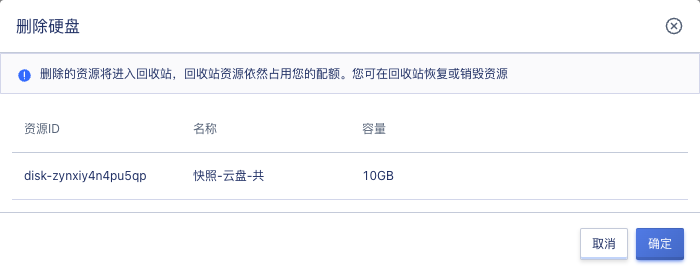

## 6.10 修改名称和备注

修改硬盘的名称和备注，在任何状态下均可进行操作。可通过硬盘列表页面每个硬盘名称右侧的“编辑”按钮进行修改。

## 6.11 续费云硬盘

支持用户手动对云硬盘进行续费，续费操作只针对资源本身，不对资源额外关联的虚拟机资源进行续费。额外关联的资源到期后，会自动解绑，为保证业务正常使用，需及时对相关资源进行续费操作。


云硬盘续费时支持更改续费方式，只可由短周期改为长周期，例如按月的续费方式可更改为按月、按年。

云硬盘续费时会按照续费时长收取费用，续费时长与资源的计费方式相匹配，当云硬盘的计费方式为【小时】，则续费时长指定为 1 小时；当云硬盘的计费方式为【按月】，则续费时长可选择 1 至 11 月；当云硬盘的计费方式为【按年】，则云硬盘的续费时长为 1 至 5 年。

## 6.12 快照管理

云平台分布式存储支持磁盘快照能力，可降低因误操作、版本升级等导致的数据丢失风险，是平台保证数据安全的一个重要措施。

### 6.12.1 快照概述

快照是某一时间点一块云盘的数据状态文件，可以理解云硬盘某个时刻的数据备份，云硬盘的数据写入和修改不会对已创建的快照造成影响。

支持**定时快照策略**，即一个可周期性执行的自动创建快照的策略，快照策略与快照分离，拥有独立的生命周期。在实际应用中，磁盘快照可降低因误操作、版本升级等导致的数据丢失风险，可大致应用于以下业务场景：

- **容灾备份：** 定时为云硬盘制作快照，当系统出现问题时，可快速回退，避免数据丢失。
- **版本回退：** 在业务做重大升级时，建议预先做好快照，当升级版本出现系统问题无法修复时，可通过快照恢复到历史版本。

平台支持对已绑定虚拟机的系统盘及数据盘进行快照操作，同时支持将快照回滚操作，即将快照数据回滚到关联的云硬盘，以满足数据恢复的应用场景。

### 6.12.2 创建快照

用户可在云硬盘列表页面，为某块云硬盘创建快照；若硬盘已挂载虚拟机，也可通过虚拟机详情页面的硬盘信息列表对硬盘进行快照操作， 同时支持对虚拟机系统盘进行快照备份。为保证数据及磁盘的安全：

* 仅支持对未绑定及已绑定的硬盘进行快照操作，若硬盘在扩容或快照中，无法进行快照备份；
* 创建快照时，不可进行磁盘挂载/卸载及修改虚拟机状态（如开机或关机），否则可能会导致快照创建异常；
* 快照仅捕获已写入硬盘的数据，不包含应用程序或操作系统缓存在内存中的数据，建议在快照暂停对硬盘的 I/O 操作后进行快照制作，如关机或卸载硬盘。

在实际操作中，可通过云硬盘列表页或虚拟机详情磁盘列表操作项中的“**快照**”为云硬盘创建快照。如创建快照向导页面所示，用户可通过核验所需创建的硬盘信息，并输入快照名称，进行快照创建操作。


一个硬盘同时一时间仅支持创建一个快照，快照创建过程中快照的状态为“创建中”，待状态转换为“正常”即代表快照创建成功，用户可通过快照列表页面查看已创建的快照状态及相关信息。

### 6.12.3 查看快照信息

快照创建成功后，用户可通过虚拟机控制台，切换至快照页面查看快照资源列表信息及相关信息，包括名称、资源 ID、磁盘、磁盘类型、状态、是否加密、创建时间及操作项，如下图所示：


* 资源名称/ID ：代表当前快照的名称及全局唯一标识符；
* 磁盘：代表当前快照对应的磁盘，即代表该快照是由该磁盘创建；
* 磁盘类型：代表当前快照所属硬盘的属性，如数据盘或系统盘；
* 状态：代表当前快照的运行状态，包括创建中、正常、恢复中、删除中，其中恢复中代表当前快照正在进行回滚操作；
* 创建时间：当前快照的创建时间。

列表上的操作项是指对单个快照的操作，包括回滚和删除。为方便租户对快照资源的统计及维护，平台支持下载当前用户所拥有的所有快照资源列表信息为 Excel  表格，同时支持对快照进行批量删除操作。

### 6.12.4 回滚快照

回滚快照是将某一时刻的快照数据回滚到关联的云硬盘，应对快照数据恢复的应用场景。

* 回滚时云硬盘必须处于未绑定或绑定的虚拟机必须处于关机状态；
* 仅支持正常状态的快照进行回滚操作。

用户可通过快照资源列表操作项中的 “**回滚**” 对快照进行回滚操作，仅支持回滚快照至所属硬盘，如下图所示：

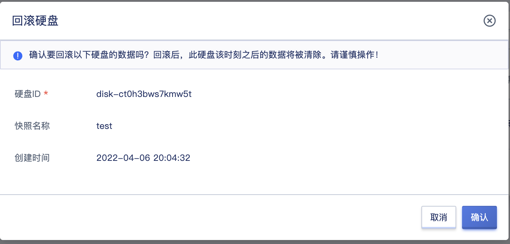

点击确认后，即返回快照列表页面，快照及所属硬盘均转换为 “恢复中” 状态，待回滚成功后，硬盘转换为 “未绑定” 状态，快照转换为 “正常” 状态。快照回滚成功后，所属父硬盘上回滚操作前的数据将被清除，由快照中的数据覆盖，即父硬盘中的数据与当前快照上捕获的数据一致。


若快照所属硬盘处于挂载状态且挂载的虚拟机为开机状态，则无法进行数据回滚操作，如下图所示，需先关闭虚拟机或解绑硬盘。

### 6.12.5 删除快照

平台快照为增量快照，后续快照只保留前一块快照的变化数据，当用户删除中间某个快照后，只会删除该快照中未被后序快照引用的 Block，被引用部分的 Block 将记录到后续快照。

支持用户删除一块硬盘的任何一个快照，假设用户对一块硬盘做了 10 个快照，删除任何一个快照，都不影响快照回滚后的数据。

* 如用户删除第 1 个快照，则系统会将第 1 个快照中的数据合并至第 2 个快照中，保证通过第 2 个快照回滚的数据准确性；
* 如用户只删除了第 2 个快照，则系统会只会删除快照 2 中未被快照 3 引用的数据块，被 3 引用的数据块会被自动记录至快照 3 中，保证快照 3 快照回滚数据的准确性。


仅支持删除正常状态的快照，如上图所示，用户可通过控制台快照列表页面对某个快照进行删除操作，快照删除后将彻底销毁。

### 6.12.6 修改快照名称

修改快照的名称和备注，在任何状态下均可进行操作。可通过快照资源列表页面每个快照名称右侧的“编辑”按钮进行修改。

### 6.12.7 创建云硬盘

支持从快照创建云硬盘，创建的硬盘大小与快照的原始硬盘大小相等，继承加密属性，从快照创建云硬盘，该云硬盘只能与快照所对应的原始云硬盘归属同一存储集群，可以用系统盘快照创建的云硬盘创建虚拟机。

在实际操作中，可通过快照列表页或云硬盘详情快照列表操作项中的“**创建云硬盘**”从快照创建云硬盘。如创建云硬盘向导页面所示，用户可通过核验所需创建的关联硬盘信息，快照信息，并输入云硬盘名称，进行云硬盘创建操作。
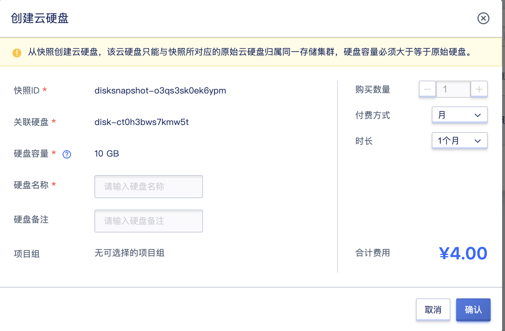

