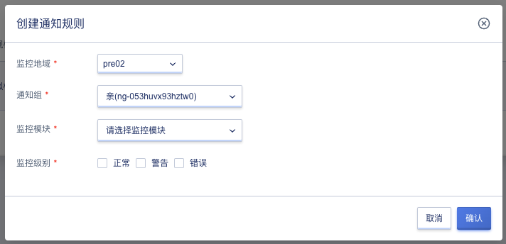

# 31 资源事件

## 31.1 资源事件

资源事件是用于对云平台核心资源的部分操作进行记录及通知，如资源生命周期状态的变化，操作运维执行情况等。资源事件会记录用户在资源类型的部分核心操作事件，提供事件详细记录查询及筛选，并及时通知用户、定位问题。

租户通过资源事件控制台可查看整个平台的资源事件记录信息等，支持根据所属地域、资源类型、资源选择、事件周期进行查询资源事件的详细信息，具体包括资源ID、资源类型、事件类型、事件等级、事件内容、事件发生次数、开始事件及更新事件，如下图所示：

* 资源ID：指资源事件监控的资源ID。
* 资源类型：当前资源事件记录所指定的资源类型。
* 事件类型：事件类型分为生命周期变化事件和操作运维事件，例如虚拟机调度，虚拟机开关机，挂载磁盘等。
* 事件等级：事件等级分为以下几类，正常，警告，错误。
* 事件内容：详细记录触发事件的具体信息。
* 事件发生次数：记录该事件累计触发次数。
* 开始时间：第一次资源事件发现的时间。
* 更新时间：第二次及以后触发资源事件的时间。

为了便于用户查看资源事件，控制台支持事件的筛选，同时支持用户导出资源事件为本地Excel表格，方便用户查看和定位。资源事件支持查看全部事件信息，即不对所属模块进行筛选；可根据事件等级进行筛选；查询时间范围支持 1 小时及自定义时间的日志筛选。

## 31.2 通知规则

通过创建通知规则，对资源事件进行监控并通过邮件通知通知人，可通过选择监控地域、通知组、监控模块及监控级别设置通知规则，资源事件符合通知规则要求时，会发送监控邮件到通知组内的成员。

### 31.2.1 创建通知规则

用户可通过资源事件的通知规则页面“创建”按钮创建通知规则，创建通知规则时需指定监控地域、通知组、监控模块及监控级别。如下图所示：

* 监控地域：通知规则的地域信息。
* 通知组：邮件通知的通知组信息，仅支持选择一个通知组。
* 监控模块：监控的资源模块内容，如虚拟机。
* 监控级别：对实例正常运行的影响程度进行划分，包括正常、警告、错误，可多选。

### 31.2.2 查看通知规则

支持用户查看账号下的通知规则信息，包括监控地域、通知组、监控模块及监控级别，如下图所示：

### 31.2.3 更新通知规则

支持用户更新账号下的通知规则，包括监控地域、通知组、监控模块及监控级别。如下图所示：

### 31.2.4 删除通知规则

支持用户删除账号下的通知规则，规则删除后即直接销毁，如下图所示：

