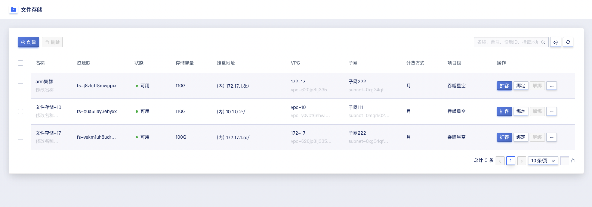
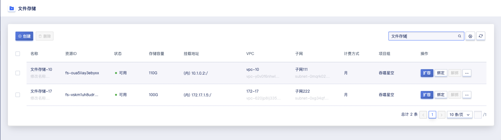

# 25 文件存储

## 25.1 文件存储概述

文件存储是 UCloudStack 云平台提供的 NFS 文件服务器，可以与虚拟机实例和本地服务器搭配使用。文件存储提供了标准的 NFS 文件访问协议，协议版本为 NFSv4，支持 POSIX 文件接口。

用户在控制台创建文件存储实例后，只需在虚拟机实例中安装文件存储客户端，使用标准挂载命令挂载创建的文件系统，就可以轻松地在多个实例间共享文件。

## 25.2 创建文件存储

云平台用户可以通过指定计算集群、存储集群、容量、VPC、子网、外网IP、外网安全组、项目组、文件存储名称等相关基础信息创建文件存储。

可通过导航栏进入【文件存储】资源控制台，通过 “**创建**” 进入向导页面，如下图所示：


1. 选择并配置文件存储的基础配置、网络设置及管理配置信息：

* 名称/备注：申请文件存储的名称和备注，申请时必须指定名称；
* 容量：支持的容量范围为 100~1024 GB；
* 创建文件存储时必须选择 VPC 网络和所属子网，即选择要加入的网络及 IP 网段；
- 外网 IP 为文件存储提供外网挂载服务，支持创建文件存储时申请并绑定一个外网 IP 作为外网挂载地址。平台支持 IPv4/IPv6  双栈网络，也可在文件存储创建成功后为文件存储绑定多个外网 IP 地址，最多支持绑定 50 个 IPv4 和 10 个 IPv6 外网 IP 地址。

2. 选择购买数量和付费方式，确认订单金额并点击“立即购买” 进行文件存储的创建：

- 购买数量：默认支持创建 1 个文件存储；
- 付费方式：选择文件存储的计费方式，支持按月、按年、按时三种方式，可根据需求选择合适的付费方式；
- 合计费用：用户选择文件存储资源按照付费方式的费用展示；
- 立即购买：点击立即购买后，会返回文件存储资源列表页，在列表页可查看文件存储的创建过程，通常会先显示“初始化”的状态，几秒内转换为“可用”状态，即代表创建成功。

### 25.2.1 通过内网挂载文件存储

用户可通过文件存储列表的内网挂载地址挂载文件存储服务：

```
mkdir /datanfs
yum install -y nfs-utils
mount -t nfs4 10.0.0.28:/ /datanfs
```

### 25.2.2 通过外网挂载文件存储

用户可通过文件存储列表的外网挂载地址挂载文件存储服务：

```
mkdir /datanfs
yum install -y nfs-utils
mount -t nfs4 192.168.179.179:/ /datanfs
```

## 25.3 文件存储列表

通过导航栏进入文件存储控制台，可查看文件存储资源列表。

文件存储列表可查看当前账户下所有文件存储资源的列表信息，包括名称、资源 ID、状态、存储容量、挂载地址、VPC、子网、计费方式、项目组、创建时间、过期时间及操作项，如下图所示：



- 名称：文件存储资源的名称；
- 资源 ID：文件存储的资源ID作为全局唯一标识符；
- 状态：文件存储资源的状态，包括初始化、可用、删除中等状态；
- 存储容量：文件存储的内存容量，容量范围为 100~1024 GB；
- 挂载地址：可通过内网/外网挂载地址挂载文件存储服务；
- VPC/子网：文件存储创建时所指定的 VPC 网络和子网，即文件存储内网 IP 所在的 VPC 网络和子网信息；
- 计费方式：文件存储的付费方式，包括按时、按年、按月；
- 项目组：文件存储创建时所绑定的项目组；
- 创建时间/过期时间：文件存储资源的创建时间和费用过期时间；
- 操作：列表上的操作项是对单个文件存储的操作，包括扩容、绑定、解绑、续费及删除。

## 25.4 扩容文件存储容量

平台支持用户扩容文件存储的容量，适应于业务发生变化需扩容文件存储容量的场景。平台仅支持扩容文件存储容量，不支持文件存储容量的缩容。

文件存储容量扩容范围即当前硬盘类型的规格，默认为 100GB~1024 GB。

扩容文件存储容量会对费用产生影响，按小时付费的硬盘，扩容容量下个付费周期按新配置扣费；按年按月付费的硬盘，扩容容量即时生效，并按比例自动补差价。用户可点击文件存储控制台操作中的 “**扩容**” 进行容量扩容操作，如下图所示：


如图所示，**更改容量**，即文件存储需要扩容的容量。平台已展示当前文件存储的容量大小，由于不支持缩容，扩容时更改容量必须大于当前容量大小。用户可通过文件存储列表查看新容量。

## 25.5 绑定外网 IP

绑定外网 IP 是指将 EIP 地址绑定至文件存储，用户可通过外网挂载地址使用文件存储服务。

用户可通过文件存储资源列表操作项的 “**绑定**” 进入外网 IP 绑定向导页面，进行资源绑定操作，如下图所示：


绑定时需选择被绑定的弹性IP，绑定成功后，文件存储列表的挂载地址会新增外网挂载地址。

## 25.6 解绑外网 IP

解绑外网 IP 是指将 EIP 地址从一个文件存储资源上分离出来，并可重新绑定至其它虚拟资源。仅支持解绑已绑定文件存储的外网 IP 资源，用户可通过文件存储资源列表操作项的 “**解绑**” 进入外网 IP 解绑向导页面，进行资源解绑操作，如下图所示：


## 25.7 文件存储续费

支持用户手动对文件存储进行续费。

文件存储续费时支持更改续费方式，只可由短周期改为长周期，例如按月的续费方式可更改为按月、按年。

文件存储续费时会按照续费时长收取费用，续费时长与资源的计费方式相匹配，当文件存储的计费方式为【小时】，则续费时长可指定为 1 小时；当文件存储的计费方式为【按月】，则续费时长可选择 1 至 11 月；当文件存储的计费方式为【按年】，则续费时长为 1 至 5 年。可通过文件存储列表操作项中的 “**续费**” 进行操作，如下图所示：


## 25.8 删除文件存储

用户可在控制台删除账户内文件存储，支持对文件存储进行批量删除操作。可通过文件存储列表操作项中的 “**删除**” 进行操作，如下图所示：


## 25.9 搜索文件存储

用户可通过搜索框对文件存储列表进行搜索和筛选，支持从名称、备注、资源ID、挂载地址进行模糊搜索，如下图所示：



## 25.10 修改文件存储名称与备注

修改文件存储的名称和备注。可通过点击文件存储列表名称右侧的 “编辑” 按钮进行修改，如下图所示：


