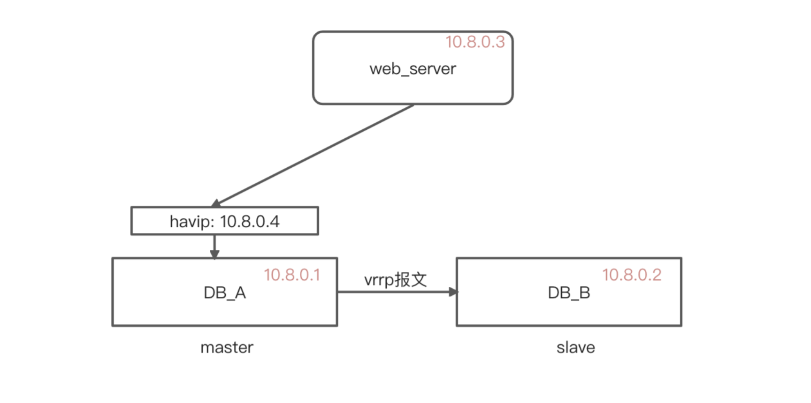
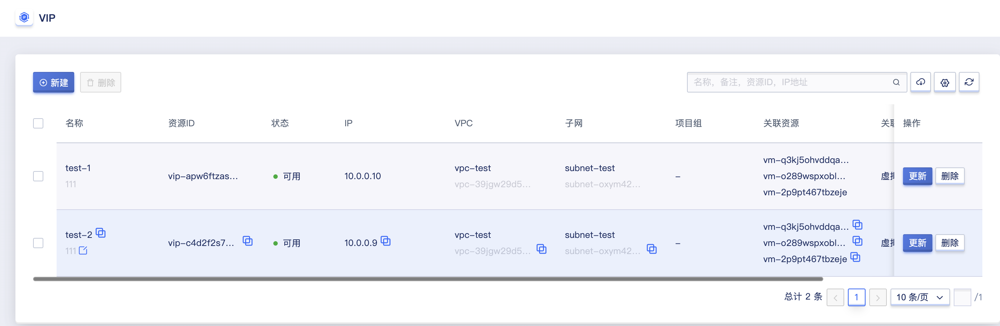
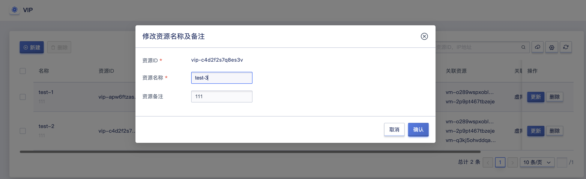
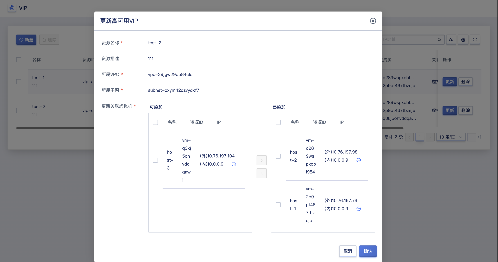
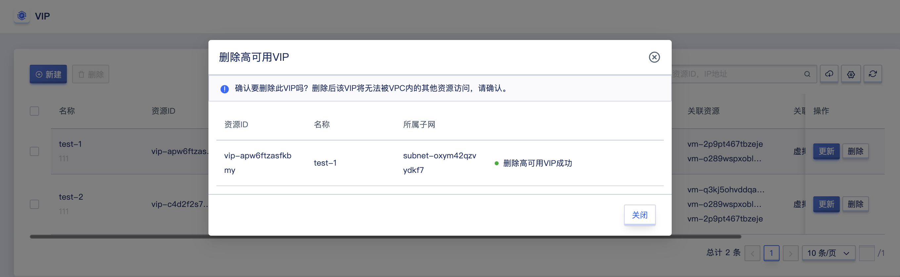

# 15 高可用VIP

##  15.1 高可用VIP 简介

### 15.1.1 概述

高可用VIP（ High available Virtual IP Address ，简称 HAVIP ），高可用虚拟IP地址，是归属于VPC内某个子网内的可漂移内网IP，用户可将HAVIP与高可用服务结合，以便在服务出现故障时进行服务入口的漂移，以实现服务的高可用。

### 15.1.2 工作原理

HaVIP作为一个不绑定特定设备的浮动IP，通常和高可用软件（keepalived、heartbeat、Failover Cluster）配合使用，用于搭建高可用主备集群，比如HA负载均衡、主备版数据库。这里以keepalived为例介绍下HaVIP的工作原理

* master和slave均安装 keepalived，配置 从控制台申请出来的HaVIP 为 VRRP VIP，分别设置优先级（priority值）；
* Keepalived 中的 VRRP 协议通过对比两台虚拟机的初始优先级大小，选举出 Master 服务器；
* Master 服务器向外发送 ARP 报文，宣告 VIP，实现 VIP 和 MAC 的地址映射更新（arp缓存)；
* 此时真正对外提供服务的服务器为 Master 服务器，通信的内网 IP 为 HaVIP ；
* Master 服务器周期性发送 VRRP 报文给 slave 服务器。如果 Master 服务器异常，Backup 服务器在一定时间内没有收到 VRRP 报文，则会将自己设置为 Master，并对外发送 ARP更新（GARP），报文携带自己的 MAC 地址；
* 此时 slave 服务器 将作为Master服务器对外提供通信服务，外部访问的报文将转发至 slave 处理，直至实现了realserver的切换；

## 15.2 申请高可用VIP 

云平台用户可通过 API 接口或控制台创建高可用VIP，用于服务的高可用，创建高可用VIP前需保证账户至少拥有一个 VPC 网络和子网。通过导航栏进入虚拟机控制台，切换至【VIP】管理页面，点击“新建”按钮进入高可用VIP创建向导弹窗，如下是创建高可用VIP的示意图:

* 名称/备注：申请高可用VIP 的名称和备注，申请时必须指定名称。
* 所属网络：高可用VIP的所属网络，创建时必须指定。
* IP 地址：用户手动指定 IP 地址申请HAVIP，指定的 IP 地址必须在所选网段的 IP 范围内。
* 关联虚拟机：用户可以选择所属vpc下的虚拟机，并绑定HAVIP。
  * 单VIP可绑定虚拟机不超过3台
  * 一台虚拟机只能绑定五个vip
* 确认创建：点击确认后，会返回 HAVIP 资源列表页，在列表页可查看 HAVIP 的资源状态，通常创建成功后会显示“可用”的状态，如果因为某些原因没有创建成功会显示”失败“的状态。

## 15.3 查看高可用VIP 
通过导航栏进入虚拟机控制台，切换至VIP管理页面可查看高可用VIP资源的列表及相关信息，包括高可用VIP的名称备注、资源 ID、状态、vpc子网、IP 地址、关联资源、项目组、创建时间及操作项，如下图所示：

* 名称/备注：申请高可用VIP 的名称和描述。
* 资源ID：高可用VIP的全局唯一标识符。
* vpc子网：高可用VIP的所属网络
* IP 地址：用户手动指定 IP 地址申请HAVIP，指定的 IP 地址必须在所选网段的 IP 范围内。
* 关联虚拟机：用户可以选择所属vpc下的虚拟机，并绑定HAVIP。
* 创建时间：当前弹性网卡的创建时间。
* 状态：高可用VIP当前的状态，包括可用、失败、删除中等状态

列表上的操作项是指对单个HAVIP的操作，包括创建、更新、删除等，可通过搜索框对HAVIP列表进行搜索和筛选，支持模糊搜索。

为方便租户对HAVIP资源的统计及维护，平台支持下载当前用户所拥有的所有HAVIP资源列表信息为 Excel 表格；同时支持对HAVIP进行批量删除操作。

## 15.4 更新高可用VIP 
修改HAVIP的名称和备注，在任何状态下均可进行操作。可通过VIP列表页面每个HAVIP名称右侧的“编辑”按钮进行修改；更新关联虚拟机，可以替换、删除、新增虚拟机，关联虚拟机数量不可超过3台，如图所示：

## 15.5 更新高可用VIP
支持用户删除高可用VIP资源，可支持删除【可用】【失败】状态的高可用VIP。删除弹性网卡后，会自动解绑与之关联的虚拟机。用户可通过VIP列表进行高可用VIP的删除操作，支持批量删除。

