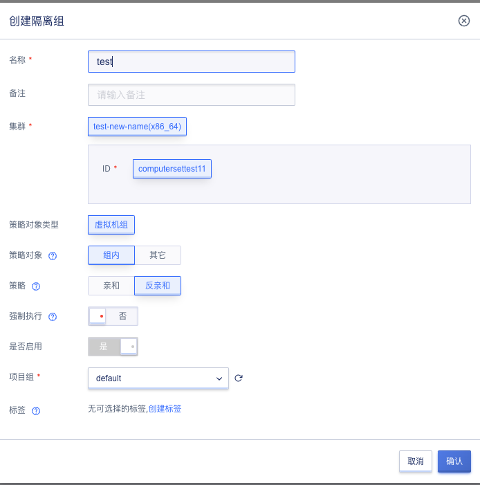
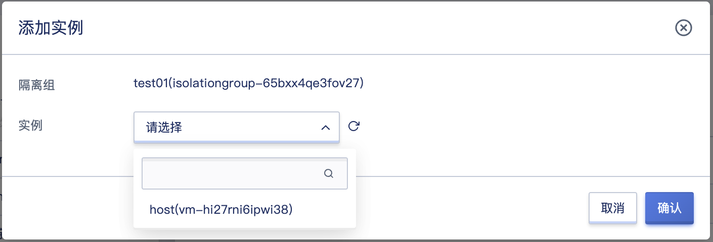

# 28 隔离组

## 28.1 产品概述

隔离组是一种针对虚拟机资源的简单编排策略，支持组内或组之间的实例分散到不同物理机上，用以保障业务的高可用。

## 28.2 创建隔离组

在平台控制台上，用户可通过指定名称、集群、策略对象及是否强制执行创建隔离组,隔离组默认启用，如下图所示：

- 名称：隔离组的名称。
- 备注：隔离组的备注信息。
- 集群：隔离组所属的计算集群。
- 策略对象类型：隔离组。
- 策略对象：目前隔离组支持指定隔离策略对象为组内或组间，组内隔离即同组内虚拟机根据策略调度，组间即为两组隔离组之间的虚拟机根据策略调度。
- 策略：目前隔离组支持亲和以及反亲和策略。
- 强制执行：强制执行开启后，如果节点不能满足虚拟机调度策略，虚拟机实例将会一直处于调度中状态，直到调度策略条件满足。
- 是否启用：是否启用隔离组，默认启用。

## 28.3 查看隔离组

通过导航栏进入隔离组页面可查看当前账户下隔离组资源的列表及相关详细信息，包括隔离组名称、资源 ID、计算集群ID、状态、主机数、策略对象、策略、是否强制执行、是否启用、创建时间及操作项，如下图所示：

- 隔离组名称：当前隔离组名称。
- 资源ID：隔离组唯一ID标识。
- 计算集群ID： 隔离组所属计算集群的ID（隔离组的调度隔离粒度在一个集群ID下打散）。
- 状态：隔离组的状态，包括完成（隔离组内除关机断电外的所有虚拟机调度完成）， 调度中（隔离组内有虚拟机未调度完成），删除中。
- 主机数：隔离组下虚拟机数量。
- 策略对象：目前隔离组支持指定隔离策略对象为组内或组间，组内隔离即同组内虚拟机互斥调度，组间即为两组隔离组之间的虚拟机成组互斥调度。
- 策略：目前隔离组支持亲和以及反亲和策略。
- 是否强制执行：强制执行开启后，如果节点不能满足虚拟机调度策略，虚拟机实例将会一直处于调度中状态，直到调度策略条件满足。
- 启用：是否启用隔离组。
- 创建时间：隔离组的创建时间。
- 操作项：对隔离组的修改，禁用，删除。

## 28.4 查看隔离组详情

通过隔离组名称进入隔离组详情页面可查看当前隔离组下的基本信息和实例信息，如下图所示：

**（1）基本信息**

隔离组的基本信息，包括名称、计算集群、计算集群ID、策略、策略对象、实例数量、强制执行、是否启用、状态。

**（2）实例信息**

隔离组详情页展示当前隔离组下的实例列表，包括名称、资源ID、状态、所属隔离组、节点及操作。

## 28.5 加入实例

支持将关机/断电状态下且与隔离组所属计算集群一致的的虚拟机加入隔离组，如下图所示：

- 隔离组：隔离组名称和ID。
- 实例：可加入的实例。

## 28.6 移除实例

支持将隔离组下的实例移除，如下图所示：

- 名称：实例名称。
- 状态：实例电源状态。

## 28.7 启用隔离组

隔离组为禁用状态且已绑定策略对象时，可操作启用隔离组。

## 28.7 禁用隔离组

隔离组为启用状态时，可操作禁用隔离组。禁用隔离组时，隔离组内实例会被移除，且不允许操作加入实例。

## 28.8 修改隔离组

隔离组状态为禁用时，可操作修改隔离组内容。支持修改策略对象和是否强制执行，如下图所示：

## 28.9 删除隔离组

支持用户操作删除隔离组，隔离组状态为空闲时，可操作删除。隔离组状态为调度中/调度完成，需先操作禁用隔离组，然后操作删除。如下图所示：

