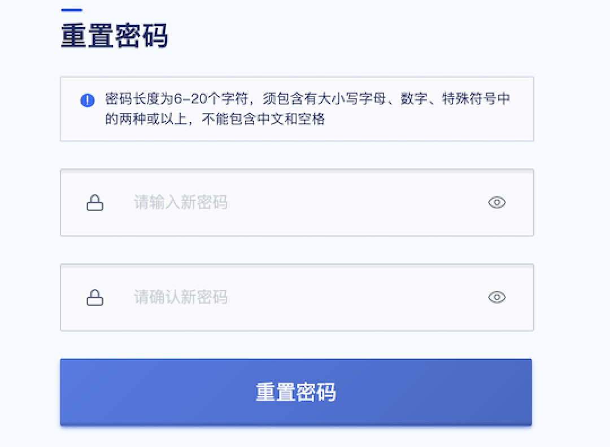

# 2 主账号

## 2.1 主账号注册登录

本平台支持多租户模式，租户即为主账号，平台管理员可通过管理员控制台自主创建主账号并为主账号充值，同时平台提供自助注册流程，用户可通过注册链接，自动化的进行注册并使用云平台。可通过平台注册链接进入账号页面，进行简单的账号注册。

1. 如上图注册界面所示，注册需要的信息如下：
   * 账号名称：注册账号的名称，仅支持中英文字符，长度在5-50字符之间；
   * 登录邮箱：用于登录云平台的邮箱账号，邮箱账号需要支持接收验证邮件；
   * 登录密码：允许进行密码复杂度的修改，密码须包含有大写字母、小写字母、数字、特殊符号(除空格)中的两种或以上，密码长度为6-30个字符；
2. 提交注册后，平台会给邮箱账号发送激活邮件，您可以登录邮箱完成激活操作；
3. 点击邮箱中 “**私有云平台激活账户**” 邮件的链接后，完成注册，如下图所示。

4. 通过注册的邮件和密码登录 UCloudStack 云平台，本文使用 **[UCloudStack 在线 POC 环境]** 作为示例。

> 云平台资源支持计量计费，在使用前需要联系平台管理员对账号进行充值，才可正常创建并使用资源。

5. 登录成功后，会为用户展示 UCloudStack 云平台的概览页面，如下图所示：

云平台用户登录控制台会默认进入概览页面，概览页展示的是当前登录账号的资源综合统计信息，包括当前账号最近12小时的告警记录信息、资源状态信息、系统信息、虚拟机CPU使用率Top5数据、虚拟机内存使用率Top5数据、虚拟机磁盘总读吞吐Top3数据、虚拟机磁盘总写吞吐Top3数据、资源配额使用情况，其中资源状态信息包括虚拟机、硬盘和外网IP的总数量、非稳定状态数量及已过期资源列表，并可对平台进行登出操作：

- 最近 12 小时告警记录信息展示当前账号拥有资源最近 12 小时的告警记录，方便快速查看资源健康状况。
- 资源状态信息信息：当前账号下虚拟机、硬盘和外网IP的总数量、非稳定状态数量及已过期资源列表。
- 系统信息：云平台的系统信息，包括系统ntp服务、计费功能、资源自动续费功能、资源是否可删除。
- 虚拟机CPU使用率Top5:当前账号下CPU使用率前5的虚拟机。
- 虚拟机内存使用率Top5:当前账号下内存使用率前5的虚拟机。
- 虚拟机磁盘总读吞吐Top3:当前账号下磁盘总读吞吐前3的虚拟机。
- 虚拟机磁盘总写吞吐Top3:当前账号下磁盘总写吞吐前3的虚拟机。
- 资源配额使用情况：当前账号各种资源的配额及占用信息，资源配额值可通过管理员控制台进行配置，并可通过账号信息查看当前租户的资源配额。

通过点击概览页面的告警记录可进入告警历史记录页面，查看更多告警记录。点击资源ID可进入资源详情页，查看资源详情信息。点击配额使用情况“查看更多”按钮，可进入配额信息页面，查看更多资源配额信息。

## 2.2 OAuth 登录认证

平台支持第三方 OAuth 2.0 登录认证，用户可通过将企业内 OAuth 统一认证登录系统与云平台进行对接，使用企业统一登录用户即可登录并使用云平台的资源。

如 2.1 章节登录示例图所示，平台已于 OAuth 2.0 系统进行对接，并在登录页面提供第三方登录入口。企业用户可通过自有的 OAuth 统一认证平台登录跳转至云平台，同时也可通过云平台第三方登录入口通过统一用户密码认证登录云平台，如下图所示：

用户在第三方登录平台使用用户名和密码登录平台后，即可跳转至云平台概览页面，使用统一的用户认证方式管理云平台资源。

## 2.3 找回密码

平台支持主账号在忘记密码时通过控制台自主找回密码，找回密码时需通过邮箱进行验证，请确保管理员添加的账号为真实可用的邮箱。通过登录页面的【找回密码】功能，即可使用邮箱地址验证重新为主账号设置新密码，如下图所示：

重置密码成功后，即可使用最新设置的密码登录云平台，进行云平台资源的使用和管理。

