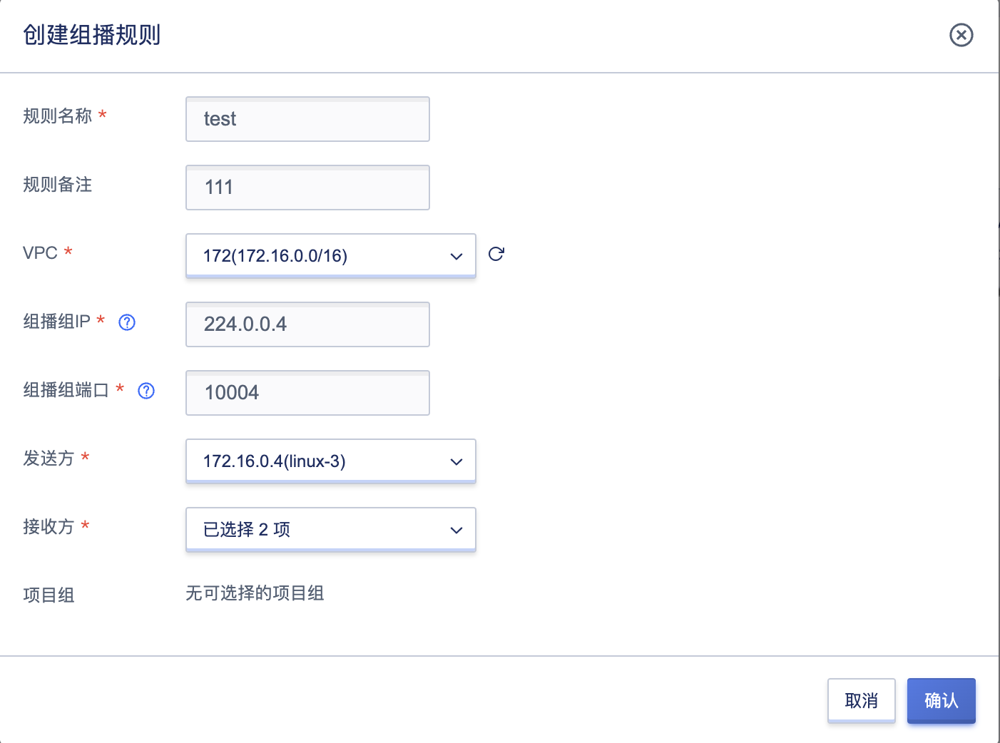
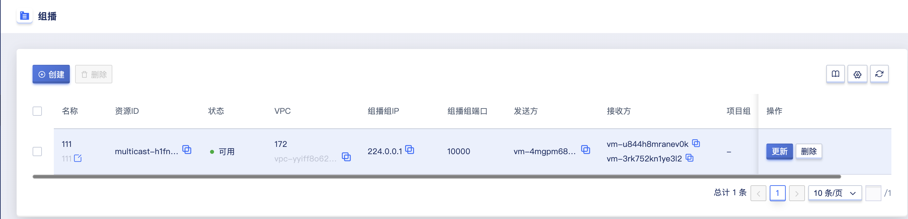
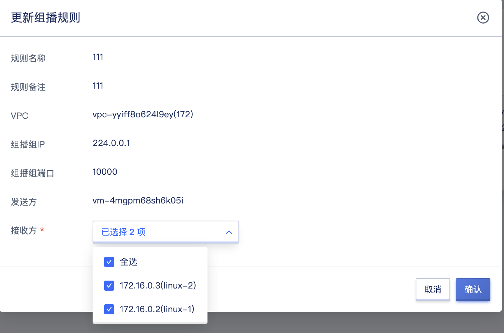

# 29 组播

## 29.1 组播简介

### 29.1.1 组播概述
作为一种与单播（Unicast）和广播（Broadcast）并列的通信方式，组播（Multicast）技术能够有效地解决单点发送、多点接收的问题，从而实现了网络中点到多点的高效数据传送，能够节约大量网络带宽、降低网络负载。

利用网络的组播特性方便地提供一些新的增值业务，包括在线直播、网络电视、远程教育、远程医疗、网络电台、实时视频会议等互联网的信息服务领域。

组播是主机间一对多的通讯模式， 组播是一种允许一个或多个组播源发送同一报文到多个接收者的技术。组播源将一份报文发送到特定的组播地址，组播地址不同于单播地址，它并不属于特定某个主机，而是属于一组主机。一个组播地址表示一个群组，需要接收组播报文的接收者都加入这个群组。

### 29.1.2 组播组概述

用IP组播地址进行标识的一个集合。任何用户主机（或其他接收设备），加入一个组播组，就成为了该组成员，可以识别并接收发往该组播组的组播数据。

### 29.1.3 组播源概述
信息的发送者称为“组播源”，一个组播源可以同时向多个组播组发送数据，多个组播源也可以同时向一个组播组发送报文。组播源通常不需要加入组播组，由源端DR负责管理组播源的注册和SPT（Shortest Path Tree）的建立。

### 29.1.4 组播组成员概述
所有加入某组播组的主机便成为该组播组的成员，组播组中的成员是动态的，主机可以在任何时刻加入或离开组播组。组播组成员可以广泛地分布在网络中的任何地方。

### 29.1.5 组播路由器概述
支持三层组播功能的路由器或交换机。组播路由器不仅能够提供组播路由功能，也能够在与用户连接的末梢网段上提供组播组成员的管理功能。

### 29.1.6 IPv4 组播地址
IANA（Internet Assigned Numbers Authority，互联网编号分配委员会）将D类地址空间分配给IPv4组播使用。IPv4地址一共32位，D类地址最高4位为1110，因此地址范围从224.0.0.0到239.255.255.255，具体分类及含义见下表：

  | 地址范围                                            | 含义                                                                                                                         |
  |-----------------------------------------------------|----------------------------------------------------------------------------------------------------------------------------|
  | 224.0.0.0～224.0.0.255                               | 永久组地址。IANA为路由协议预留的IP地址（也称为保留组地址），用于标识一组特定的网络设备，供路由协议、拓扑查找等使用，不用于组播转发。 |
  | 224.0.1.0～231.255.255.255 233.0.0.0～238.255.255.255 | ASM组播地址，全网范围内有效。说明： 其中，224.0.1.39和224.0.1.40是保留地址，不建议使用。                                           |
  | 232.0.0.0～232.255.255.255                           | 缺省情况下的SSM组播地址，全网范围内有效。                                                                                      |
  | 239.0.0.0～239.255.255.255                           | 本地管理组地址，仅在本地管理域内有效。在不同的管理域内重复使用相同的本地管理组地址不会导致冲突。                                |

### 29.1.7 组播转发机制
在组播模型中，IP报文的目的地址字段为组播组地址，组播源向以此目的地址所标识的主机群组传送信息。因此，转发路径上的组播路由器为了将组播报文传送到各个方位的接收站点，往往需要将从一个入接口收到的组播报文转发到多个出接口。
* 为了保证组播报文在网络中的传输，必须依靠单播路由表或者单独提供给组播使用的路由表（如MBGP路由表）来指导转发；
* 为了处理同一设备在不同接口上收到来自不同对端的相同组播信息，需要对组播报文的入接口进行RPF（Reverse Path Forwarding，逆向路径转发）检查，以决定转发还是丢弃该报文。RPF检查机制是大部分组播路由协议进行组播转发的基础。

## 29.2 创建组播

云平台用户可以通过指定VPC、组播组IP、组播组端口、发送方机器、接收方机器、项目组、组播名称等相关基础信息创建组播。

可通过导航栏进入【组播】资源控制台，通过 “**创建**” 进入向导页面，如下图所示：

1、选择并配置组播的基础配置：

* 规则名称/备注：申请组播的名称和备注，申请时必须指定名称
* 组播组IP：组播IP仅支持224.0.0.0/4网段内的IP
* 组播组端口：组播组端口需要用户指定，端口默认范围为10000-64999
* vpc：创建组播时必须选择 VPC 网络，即选择要加入的网络
* 发送方：发送和接收方为相同VPC下的虚拟机，发送方为单一虚拟机
* 接收方：发送和接收方为相同VPC下的虚拟机，接收方可以为多个虚拟机
* 单个vpc可以添加的组播组规则限制为9个，一个组播组接收方数量限制为9个
## 29.3 组播列表

通过导航栏进入组播控制台，可查看组播资源列表。

组播列表可查看当前账户下所有组播资源的列表信息，包括名称、资源ID、状态、VPC、组播组IP、组播组端口、发送方、接收方、项目组、创建时间、更新时间及操作项，如下图所示：

- 名称：组播资源的名称；
- 资源 ID：组播的资源ID作为全局唯一标识符；
- 状态：组播资源的状态，包括可用、删除中等状态；
- 组播组IP：需要用户指定，组播IP仅支持224.0.0.0/4网段内的IP
- 组播组端口：需要用户指定，端口默认范围为10000-64999
- 发送方：同vpc下的发送机器，可以作为组播源发送组播消息
- 接收方：同vpc下的接收机器，可以接收组播消息
- VPC：组播创建时所指定的 VPC 网络；
- 项目组：组播创建时所绑定的项目组；
- 创建时间/更新时间：组播资源的创建时间和更新组播规则的时间；
- 操作：列表上的操作项是对单个组播的操作，包括更新、删除。

## 29.4 更新组播规则

更新组播的规则，添加或删除接收方的机器。可通过点击组播列表名称右侧的 “更新” 按钮进行修改，如下图所示：

## 29.5 删除组播

用户可在控制台删除账户内组比，支持对组播进行批量删除操作。可通过组播列表操作项中的 “**删除**” 进行操作，如下图所示：

