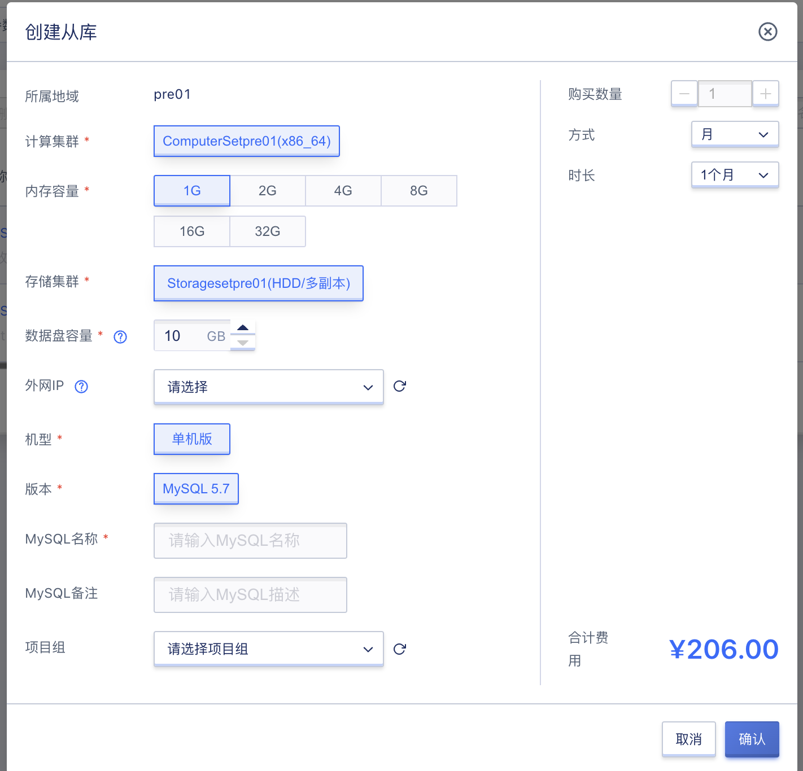

# 32 MySQL

## 32.1 概览

MySQL是平台提供的一种数据库服务，支持单机版和主备版两种机型，并提供了备份、升级机型、监控等功能。

## 32.2 创建MySQL

平台用户可以通过指定集群、内存容量、数据盘、版本、参数模板、VPC、子网、外网IP、外网安全组、MySQL名称、密码等相关基础信息创建MySQL，可通过导航栏进入[MySQL]资源控制台，通过“**创建**”按钮进入向导页面，如下图所示：

1. 选择并配置MySQL的基础配置、网络设置及管理配置信息：

* 集群：创建MySQL的集群信息，支持X86集群；
* 内存容量：选择创建MySQL的内存容量，支持1G、2G、4G、8G、16G、32G;
* 数据盘：创建MySQL的数据信息，可选容量10-32000GB；
* VPC和子网：创建MySQL时必须选择 VPC 网络和所属子网，即选择要加入的网络及 IP 网段；
* 外网IP：外网 IP 为MySQL提供外网访问服务，支持创建MySQL时申请并绑定一个外网 IP 作为外网访问地址，MySQL支持最多绑定一个外网IP；

2. 选择购买数量和付费方式，确认订单金额并点击“立即购买” 进行Redis的创建：

- 购买数量：默认支持创建 1 个MySQL；
- 付费方式：选择MySQL的计费方式，支持按月、按年、按时三种方式，可根据需求选择合适的付费方式；
- 合计费用：用户选择MySQL资源按照付费方式的费用展示；
- 立即购买：点击立即购买后，会返回MySQL资源列表页，在列表页可查看MySQL的创建过程。

## 32.3 查看MySQL列表

平台支持用户查看MySQL列表信息，包括名称、资源ID、状态、机型、集群、存储类型、版本、IP、内存容量、数据盘容量、VPC、子网、安全组、计费方式、项目组、创建时间、过期时间、操作。可通过导航栏进入[MySQL]资源控制台查看，如下图所示：

* 名称：MySQL的名称，可点击进入MySQL详情页；
* 资源ID：MySQL的资源ID，作为全局唯一标识；
* 状态：MySQL的状态，包括启动中、更改配置中、删除中等；
* 机型：MySQL的机型信息，支持单机版和主备版；
* 版本：MySQL的版本信息，目前支持MySQL 5.7；
* IP：MySQL的网络信息，包括内网IP和外网IP；
* 内存容量：MySQL创建时选择的内存容量信息，可通过配置升级功能升级内存容量；
* 数据盘容量：MySQL创建时选择的数据盘容量，可通过配置升级功能升级数据盘容量；
* VPC/子网：MySQL内网信息，包括VPC/子网的名称和资源ID；
* 安全组：MySQL绑定外网IP后支持关联安全组；
* 计费方式：MySQL资源的计费方式，支持小时、月、年；
* 项目组：MySQL资源所属的安全组，可通过安全组的转入/转出功能修改关联关系；
* 创建时间/过期时间；MySQL的创建时间和过期时间；
* 操作：MySQL资源的可操作项内容，包括创建从库、删除、续费、重置密码、应用参数模板、配置升级、升级至主备版、修改告警模板、绑定外网IP、解绑外网IP、修改安全组等。

## 32.4 查看MySQL概览信息

平台支持用户查看MySQL资源概览信息，包括基本信息、配置信息、监控信息。可通过点击MySQL列表中的名称进入概览页面，如下图所示：

## 32.5 MySQL创建从库

平台支持用户对MySQL主库进行创建从库的操作，可选择内存容量、数据盘容量、外网IP、安全组，可通过MySQL列表中操作项的“**创建从库**”按钮进行操作，如下图所示：

每个MySQL主库支持最多创建5个从库。

## 32.6 MySQL续费

平台支持用户对MySQl进行续费操作，可通过MySQL列表中操作项的“**续费**”按钮进行操作，如下图所示：

续费支持更改续费方式和续费时长，更改续费方式只支持由短周期改为长周期，比如从“**小时**”更改为“**月**”。

## 32.7 MySQL重置密码
 
平台支持用户对MySQl进行重置密码操作，可通过MySQL列表中操作项的“**重置密码**”按钮进行操作，如下图所示：

## 32.8 参数配置

平台支持用户对MySQL进行参数配置相关操作，包括修改实例参数、应用参数模板、导入参数文件、导出为模板、导出参数文件。可点击MySQL名称进入详情页，切换到“**参数设置**”页面查看，如下图所示：

### 32.8.1 修改实例参数

平台支持用户对MySQL进行修改实例参数操作，可点击“**修改实例参数**”按钮进行操作，如下图所示：

### 32.8.2 应用参数模板

平台支持用户对MySQL进行应用参数模板操作，可点击“**应用参数模板**”进行操作，也可通过MySQL列表操作项的“**应用参数模板**”进行操作，如下图所示：

### 32.8.3 导入参数文件

平台支持用户对MySQL进行导入参数文件操作，可点击“**导入参数文件**”进行操作，如下图所示：

### 32.8.4 导出为模板

平台支持用户对MySQL参数配置进行导出为模板操作，可点击“**导出为模板**”进行操作，如下图所示：

导出为模板操作成功后，参数模板列表新增一条模板数据。

### 32.8.5 导出参数文件

平台支持用户对MySQL参数配置进行导出参数文件操作，可点击“**导出参数文件**”进行操作，下载参数配置文件。

## 32.9 配置升级

平台支持用户对MySQL进行配置升级操作，包括内存容量和数据盘容量更改。可点击MySQL列表中操作项的“**配置升级**”按钮进行操作，如下图所示：
 

## 32.10 升级主备版

平台支持用户对单机版MySQL进行升级至主备版操作，计算集群、内存容量、存储集群、数据盘容量不可修改。可点击MySQL列表中操作项的“**升级至主备版**”按钮进行操作，如下图所示：
 

## 32.11 修改告警模板

平台支持用户对MySQL进行修改告警模板操作。可点击MySQL列表中操作项的“**修改告警模板**”按钮进行操作，如下图所示：

## 32.12 网络

平台支持用户查看MySQL的网络信息，包括基本信息和IP列表。可点击MySQL名称进入详情页，切换到“**网络**”页面进行查看，如下图所示：

### 32.12.1 查看网络列表

平台支持用户查看MySQL的网络列表信息，包括IP、IP ID、IP版本、状态、网络类型、所属网络、是否VIP、带宽、绑定资源、MAC地址、操作，如下图所示：

### 32.12.2 绑定外网IP

平台支持用户对MySQL进行绑定外网IP操作，可通过“**绑定**”按钮进行操作，也可通过MySQL列表中操作项的“**绑定外网IP**”进行操作，如下图所示：

外网IP绑定成功后，在MySQL网络列表中新增一条IP数据。

每个MySQL支持最多绑定一个外网IP。

### 32.12.3 解绑外网IP

平台支持用户对已绑定外网IP的MySQL进行解绑外网IP操作，可通过“**解绑**”按钮进行操作，也可通过MySQL列表中操作项的“**解绑外网IP**”进行操作，如下图所示：

## 32.13 修改安全组

平台支持用户对已绑定外网IP的MySQL进行修改安全组操作，可通过MySQL列表中操作项的“**修改安全组**”进行操作，如下图所示：

## 32.14 备份管理

### 32.14.1 查看备份管理列表

平台支持用户查看备份管理列表信息，包括资源ID、状态、所属存储池、来源备份计划、保留时间(天)、保存路径、创建时间、更新时间、到期时间、操作。可点击MySQL名称进入详情页，切换到“**备份管理**”页面进行查看，如下图所示：

### 32.14.2 删除备份

平台支持用户对备份数据进行删除操作，可点击备份列表中操作项的”**删除**“按钮进行操作，也可通过备份列表的“**批量删除**”按钮进行操作，如下图所示：

### 32.14.3 从备份创建

平台支持用户从备份创建mysql。

## 32.15 查看操作日志

平台支持用户查看MySQL的操作日志，并可根据操作结果和操作周期进行筛选，可点击MySQL名称进入详情页，切换到“**操作日志**”页面进行查看，如下图所示：

## 32.16 查看事件

平台支持用户查看MySQL的事件，并可根据事件周期进行筛选，可点击MySQL名称进入详情页，切换到“**事件**”页面进行查看，如下图所示：

## 32.17 删除MySQL

平台支持用户对MySQL进行删除操作，删除主库前需先将从库删除。可点击MySQL列表中操作项的“**删除**”按钮进行操作，如下图所示：

## 32.18 创建参数模板

平台支持用户指定创建方式创建参数模板，包括复制现有模板和导入模板文件，如下图所示：

## 32.19 应用到实例

平台支持用户对参数模板进行应用到实例操作，可选择要应用到的MySQL资源，点击参数模板列中操作项的“**应用到实例**”按钮进行操作，如下图所示：

## 32.20 下载参数模板

平台支持用户进行下载参数模板操作，可点击参数模板列中操作项的“**应用到实例**”按钮进行操作。

## 32.21 删除参数模板

平台支持用户对自定义参数模板进行删除操作，可点击参数模板列中操作项的“**删除**”按钮进行操作，如下图所示：

## 32.22 修改IP

支持用户修改mysql的内网IP(VIP)地址。

