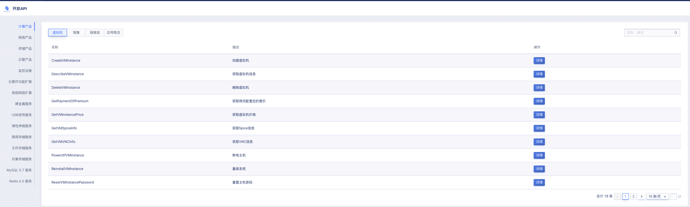
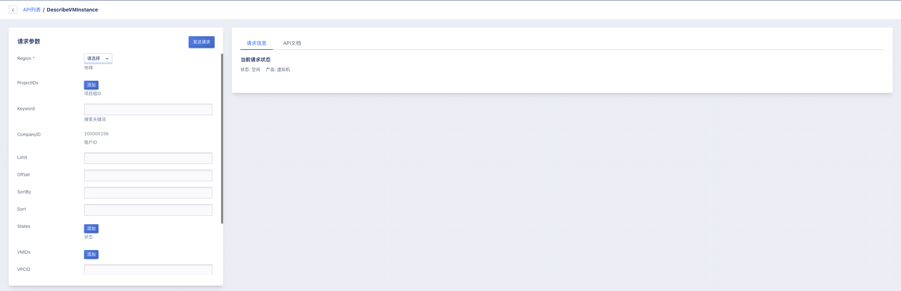
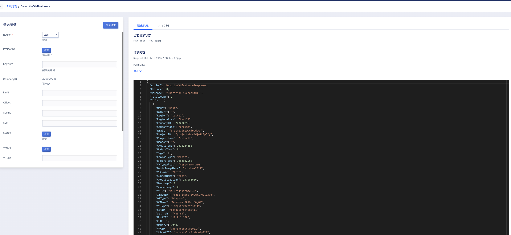
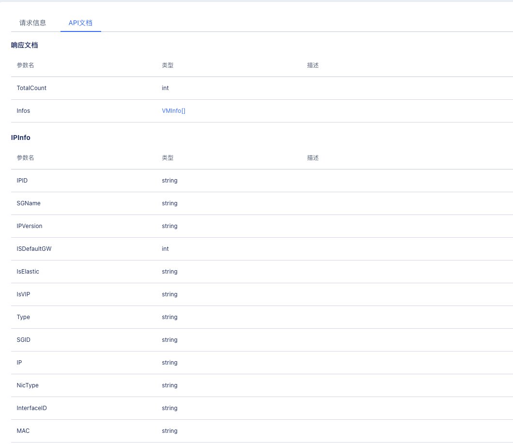

# 36 开放API

## 36.1 概述

云平台API接口文档，提供对云平台API 的调用和参数的解释说明。按照租户权限展示可以调用的API列表。租户可以在页面添加请求参数，发送请求对当前账号的线上资源操作，请求发送成功后会在请求信息中展示当前请求状态，请求内容，以及响应结果，在API文档中展示响应文档，展示响应值的参数，类型，及对应描述。

## 36.2 查看API列表

在开发API列表中，租户可以按照产品模块查看对应产品子模块的API列表，例如下图所示，计算产品，虚拟机的相关API信息。支持按照API名称和描述进行模糊搜索。

## 36.3 查看API详情

点击API操作栏“***详情***”按钮，跳转至API详情页，如下图所示:

## 36.4 发送请求

添加请求参数后点击发送请求，返回请求信息，包含当前请求状态，请求内容，响应信息，如下图所示:

## 36.5 查看API文档

API文档中展示响应文档，包含参数名，类型，描述。如下图所示：

