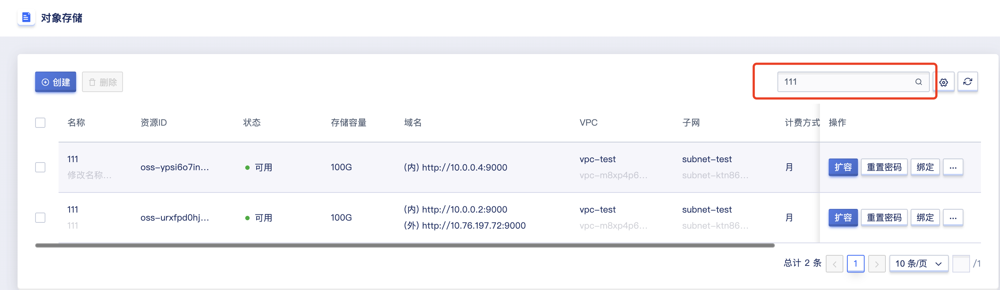
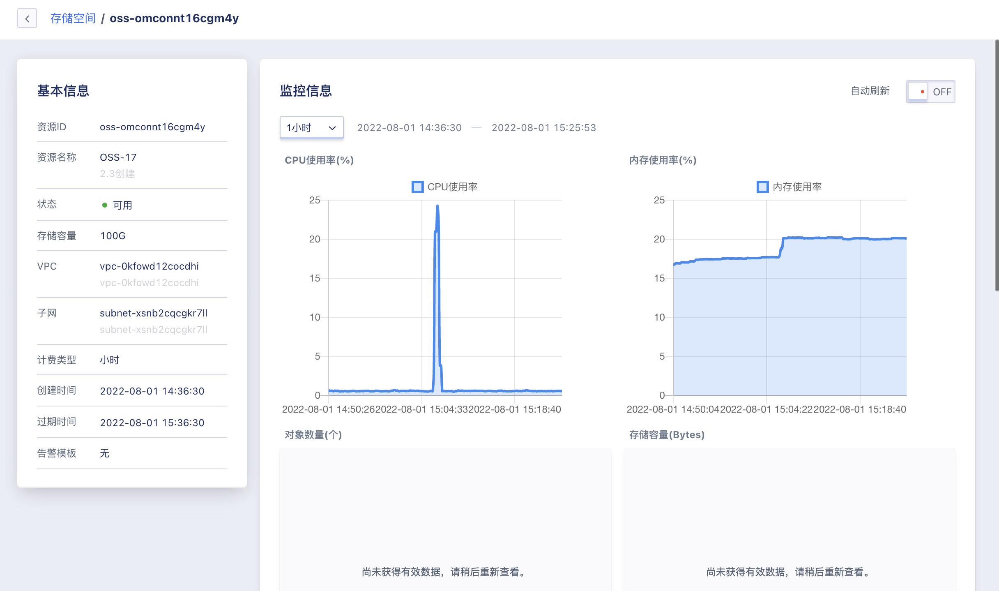

# 26 对象存储

## 26.1 对象存储概述

对象存储服务OSS（Object Storage Service），兼容亚马逊云的 S3 API（接口协议），仅需在UCloudStack平台上创建对象存储实例，便可以在任何应用、任何时间、任何地点通过存储和访问任意类型的数据。对象存储为云原生设计，即使在高负载的情况下也可以高效利用CPU和内存资源，适合私有云场景。

## 26.2 创建对象存储

云平台用户可以通过指定计算集群、存储集群、容量、VPC、子网、外网IP、外网安全组、项目组、对象存储名称等相关基础信息创建对象存储。

可通过导航栏进入【对象存储】资源控制台，通过 “**创建**” 进入向导页面，如下图所示：


1. 选择并配置对象存储的基础配置、网络设置及管理配置信息：

* 名称/备注：申请对象存储的名称和备注，申请时必须指定名称；
* 容量：支持的容量范围为 100~1024 GB；
* 创建对象存储时必须选择 VPC 网络和所属子网，即选择要加入的网络及 IP 网段；
- 外网 IP 为对象存储提供外网访问服务，支持创建对象存储时申请并绑定一个外网 IP 作为外网访问地址。平台支持 IPv4/IPv6  双栈网络，也可在对象存储创建成功后为对象存储绑定多个外网 IP 地址，最多支持绑定 50 个 IPv4 和 10 个 IPv6 外网 IP 地址。

2. 选择购买数量和付费方式，确认订单金额并点击“立即购买” 进行对象存储的创建：

- 购买数量：默认支持创建 1 个对象存储；
- 付费方式：选择对象存储的计费方式，支持按月、按年、按时三种方式，可根据需求选择合适的付费方式；
- 合计费用：用户选择对象存储资源按照付费方式的费用展示；
- 立即购买：点击立即购买后，会返回对象存储资源列表页，在列表页可查看对象存储的创建过程，通常会先显示“初始化”的状态，几秒内转换为“可用”状态，即代表创建成功。

### 26.2.1 通过内网配置对象存储

用户可通过对象存储列表的内网地址配置对象存储服务：

```
wget -c https://dl.min.io/client/mc/release/linux-amd64/mc
chmod +x mc
./mc alias set 名称 http://内网ip:9000 admin 密码
```

### 26.2.2 通过外网配置对象存储

用户可通过对象存储列表的外网地址配置对象存储服务：

```
wget -c https://dl.min.io/client/mc/release/linux-amd64/mc
chmod +x mc
./mc alias set 名称 http://外网ip:9000 admin 密码
```

## 26.3 对象存储列表

通过导航栏进入对象存储控制台，可查看对象存储资源列表。

对象存储列表可查看当前账户下所有对象存储资源的列表信息，包括名称、资源 ID、状态、存储容量、域名、VPC、子网、计费方式、项目组、创建时间、过期时间及操作项，如下图所示：


- 名称：对象存储资源的名称；
- 资源 ID：对象存储的资源ID作为全局唯一标识符；
- 状态：对象存储资源的状态，包括初始化、可用、删除中等状态；
- 存储容量：对象存储的内存容量，容量范围为 100~1024 GB；
- 域名：可通过内网/外网访问地址配置对象存储服务；
- VPC/子网：对象存储创建时所指定的 VPC 网络和子网，即对象存储内网 IP 所在的 VPC 网络和子网信息；
- 计费方式：对象存储的付费方式，包括按时、按年、按月；
- 项目组：对象存储创建时所绑定的项目组；
- 创建时间/过期时间：对象存储资源的创建时间和费用过期时间；
- 操作：列表上的操作项是对单个对象存储的操作，包括扩容、绑定、解绑、续费及删除。

## 26.4 扩容对象存储容量

平台支持用户扩容对象存储的容量，适应于业务发生变化需扩容对象存储容量的场景。平台仅支持扩容对象存储容量，不支持对象存储容量的缩容。

对象存储容量扩容范围即当前硬盘类型的规格，默认为 100GB~1024 GB。

扩容对象存储容量会对费用产生影响，按小时付费的硬盘，扩容容量下个付费周期按新配置扣费；按年按月付费的硬盘，扩容容量即时生效，并按比例自动补差价。用户可点击对象存储控制台操作中的 “**扩容**” 进行容量扩容操作，如下图所示：


如图所示，**更改容量**，即对象存储需要扩容的容量。平台已展示当前对象存储的容量大小，由于不支持缩容，扩容时更改容量必须大于当前容量大小。用户可通过对象存储列表查看新容量。

## 26.5 绑定外网 IP

绑定外网 IP 是指将 EIP 地址绑定至对象存储，用户可通过外网访问地址使用对象存储服务。

用户可通过对象存储资源列表操作项的 “**绑定**” 进入外网 IP 绑定向导页面，进行资源绑定操作，如下图所示：


绑定时需选择被绑定的弹性IP，绑定成功后，对象存储列表的访问地址会新增外网访问地址。

## 26.6 解绑外网 IP

解绑外网 IP 是指将 EIP 地址从一个对象存储资源上分离出来，并可重新绑定至其它虚拟资源。仅支持解绑已绑定对象存储的外网 IP 资源，用户可通过对象存储资源列表操作项的 “**解绑**” 进入外网 IP 解绑向导页面，进行资源解绑操作，如下图所示：


## 26.7 对象存储续费

支持用户手动对对象存储进行续费。

对象存储续费时支持更改续费方式，只可由短周期改为长周期，例如按月的续费方式可更改为按月、按年。

对象存储续费时会按照续费时长收取费用，续费时长与资源的计费方式相匹配，当对象存储的计费方式为【小时】，则续费时长指定为 1 小时；当对象存储的计费方式为【按月】，则续费时长可选择 1 至 11 月；当对象存储的计费方式为【按年】，则续费时长为 1 至 5 年。可通过对象存储列表操作项中的 “**续费**” 进行操作，如下图所示：


## 26.8 重置密码

支持用户重置对象存储密码，可通过对象存储列表操作项中的 “**重置密码**” 操作，如下图所示：


## 26.9 删除对象存储

用户可在控制台删除账户内对象存储，支持对对象存储进行批量删除操作。可通过对象存储列表操作项中的 “**删除**” 进行操作，如下图所示：


用户可通过命令行工具在client端重新设置密码

```
./mc alias set 名称 http://外网ip:9000 admin 新密码
```

## 26.10 搜索对象存储

用户可通过搜索框对对象存储列表进行搜索和筛选，支持从名称、备注、资源ID、域名进行模糊搜索，如下图所示：



## 26.11 修改对象存储名称与备注

修改对象存储的名称和备注。可通过点击对象存储列表名称右侧的 “编辑” 按钮进行修改，如下图所示：


## 26.12 对象存储监控页面

用户可通过点击对象存储列表操作项中的 “**名称**”，进入对象存储的监控页面，还可以通过操作项中的 “**修改告警模版**”，对监控数据进行告警




## 26.13 外网对象存储绑定解绑安全组

用户可通过点击对象存储列表操作项中的 “**修改外网安全组**”对外网做网络安全策略


## 26.14 修改IP

支持用户修改对象存储的内网IP地址。


## 26.15 从备份创建

用户可以通过备份创建对象存储。


## 26.16 MinIO Client常用命令
```

mc version                          输出mc版本

mc ls play                          列出所有https://play.min.io上的存储桶

mc mb play/mybucket                 在https://play.min.io上创建一个名叫"mybucket"的存储桶

mc cat play/mybucket/myobject.txt   显示myobject.txt文件的内容

mc cp myobject.txt play/mybucket    拷贝一个文本文件到对象存储

mc rm play/mybucket/myobject.txt    删除一个对象

mc find s3/bucket --name "*.jpg" --watch --exec "mc cp {} play/bucket"    持续从s3存储桶中查找所有jpeg图像，并复制到minio "play/bucket"存储桶

```
