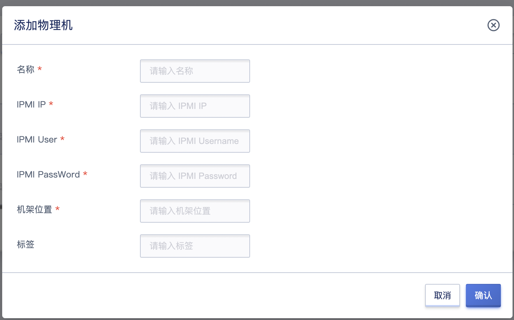
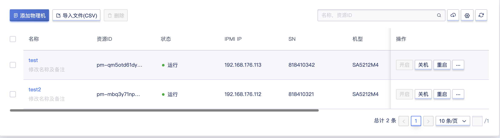
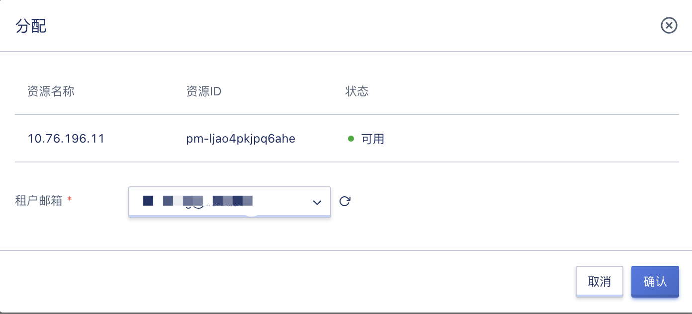
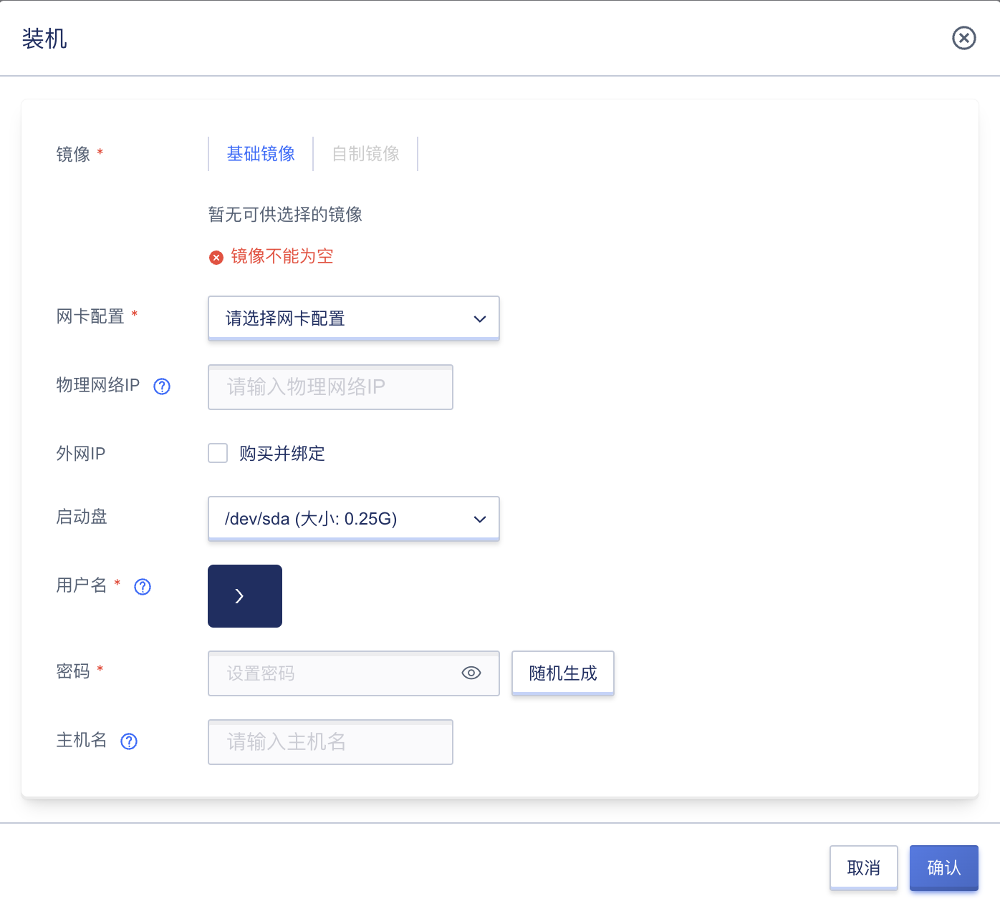

# 17 裸金属

## 17.1 产品简介

### 17.1.1 概述

裸金属为用户提供统一纳管存量裸金属能力的服务，用户在控制台即可对已纳管的裸金属进行电源管理、访问远程控制台和查看硬件监控等基础运维操作。

### 17.1.2 使用流程

在使用裸金属服务前，必须提前准备好裸金属设备，并根据需求将裸金属服务器的 IPMI 网络及业务网络与平台网络进行打通，在通过平台录入设备信息，将设备添加给租户管理。裸金属服务的使用流程分为【平台管理员流程】和【租户流程】两大部分，具体如下：

1. **硬件环境装备**

   准备好硬件环境，配置物理网络交换机及服务器 IPMI 网络，使平台物理网络与 IPMI 网络可互相通信。

2. **为租户添加裸金属**

   由【平台管理员】为租户添加裸金属信息，包括服务器的名称、IPMI IP、IPMI User、IPMI PassWord、机架位置、标签及租户邮箱，支持批量导入裸金属信息。

3. **租户添加裸金属**

   由【平台租户】通过控制台裸金属功能，根据需求自主添加裸金属，包括服务器的名称、IPMI IP、IPMI User、IPMI PassWord、机架位置及标签，支持批量导入裸金属信息，支持机型SA5212M4、ThinkSystem SR650、ThinkSystem SR658、R4900 G2、UniServer R4900 G3。

4. **裸金属管理**

   由【平台租户】对已申请的裸金属进行生命周期管理，支持开启、关机、重启、准备控制台、控制台登录、释放控制台、装机、重装、强制关机及关机并重新开机。

平台租户在使用裸金属服务的前提是裸金属准备好并添加给租户，租户在控制台即可对已纳管的裸金属进行电源管理、访问远程控制台和查看硬件监控等基础运维操作。

## 17.2 添加裸金属

在平台已提供裸金属服务时，租户的主账号和子账号可在平台上直接单独添加或批量导入裸金属进行管理。用户可登录控制台，通过控制台导航栏【裸金属】中的添加裸金属操作进入向导页面，如下图所示：

* 租户邮箱：裸金属仅可通过租户管理员添加，指定所需用户。
* 名称：指裸金属在平台的名称标识，添加时必须指定。
* 机架位置：裸金属所处的机架位置，添加时必须指定。驱动类型：默认IPMI。
* IPMI IP：指裸金属的 IPMI IP 地址，添加时必须指定，IP 地址必须从平台可达
* IPMI 用户：裸金属的 IPMI 用户名，添加时必须指定。
* IPMI 密码：裸金属的 IPMI 密码，添加时必须指定。
* 标签：裸金属的标签。

租户添加提交后列表将生成一条【资源准备中】的裸金属信息，待添加成功后，会置为【运行】状态，此时租户可对裸金属进行管理。

## 17.3 查看裸金属

租户的管理员可通过裸金属列表及详情查看账号下已添加的裸金属信息及当前状态，如下图所示：

* 名称/资源 ID：裸金属的名称和全局资源唯一标识符。
* SN：裸金属的整机序列号。
* IPMI IP：裸金属的 IP 地址。
* 机型：裸金属的机型。
* 机架位置：裸金属所处的机架位置。
* 电源：裸金属的电源状态，如开启、关机中、关机等。
* KVM状态：裸金属控制台的状态，如未准备、准备中、就绪等。
* 创建时间：裸金属的添加时间。
* 状态：当前裸金属的资源状态，如运行、资源准备中等，裸金属首次添加时，状态为纳管，。

列表上的操作项中可对单台裸金属进行开启、关机、重启、准备控制台、控制台登录、释放控制台、强制关机、关机并重新开机、更新裸金属及删除等操作，支持批量删除裸金属，其中删除后租户可重新进行添加。

租户也可通过访问列表上裸金属的名称进入裸金属的详情页面，查看裸金属的详细信息，包括基本信息和配置信息：

* 基本信息包括：裸金属的名称、ID、IPMI IP、SN 序列号及电源状态。
* 配置信息包括：裸金属的 CPU 信息、内存信息及PCIE信息等。

## 17.4 分配裸金属

租户管理员可对已上架裸金属进行分配操作，如下图所示：

## 17.5 裸金属装机

租户管理员可对已上架裸金属进行装机操作，如下图所示：

## 17.5 裸金属开机/关机

平台支持租户对已添加的裸金属进行关机、开启、重启、强制关机、关机并重新开机操作，用于维护和管理裸金属的生命周期。电源状态为开启时，才可执行关机、重启、强制关机、关机并重新开机操作；电源状态为关闭时，才可执行开启操作。

裸金属开启过程中，裸金属的电源状态为开机中，待开机成功后流转为开启；当用户触发关机时，裸金属的状态为关机中，待关机成功后流转为关闭。

## 17.6 裸金属控制台操作

租户可在控制台对已纳管的裸金属进行电源管理、访问远程控制台和查看硬件监控等基础运维操作。裸金属KVM状态为未准备时，需执行准备控制台操作，执行完毕后，KVM状态流转为就绪；裸金属KVM状态为就绪时，支持控制台登录和释放控制台。

