# 33 Redis

## 33.1 概览

Redis是平台提供的一种数据库服务，支持单机版和主备版两种机型，并提供了备份、监控等功能，满足高读写的性能场景。

## 33.2 创建Redis

平台用户可以通过指定集群、内存容量、参数模板、VPC、子网、外网IP、外网安全组、Redis名称/备注、密码、项目组等相关基础信息创建Redis，可通过导航栏进入[Redis]资源控制台，通过“**创建**”按钮进入向导页面，如下图所示：

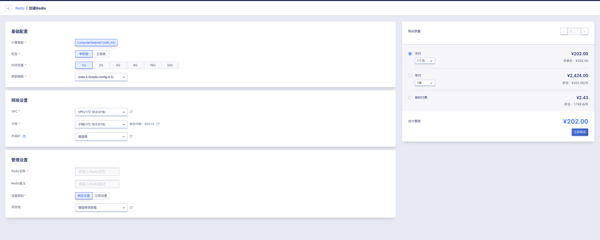

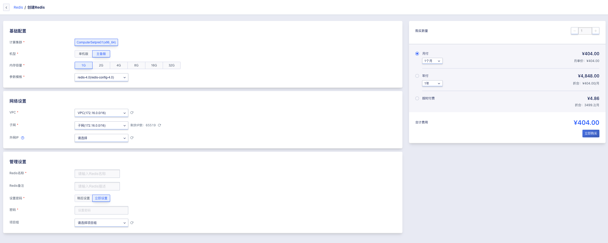

1. 选择并配置Redis的基础配置、网络设置及管理配置信息：

* 集群：创建Redis的集群信息；
* 内存容量：选择创建Redis的内存容量，支持1G、2G、4G、8G、16G、32G;
* 数据盘：创建Redis的数据信息，可选容量10-33000GB；
* VPC和子网：创建Redis时必须选择 VPC 网络和所属子网，即选择要加入的网络及 IP 网段；
* 外网IP：外网 IP 为Redis提供外网访问服务，支持创建Redis时申请并绑定一个外网 IP 作为外网访问地址，Redis支持最多绑定一个外网IP；

2. 选择购买数量和付费方式，确认订单金额并点击“立即购买” 进行Redis的创建：

- 购买数量：默认支持创建 1 个Redis；
- 付费方式：选择Redis的计费方式，支持按月、按年、按时三种方式，可根据需求选择合适的付费方式；
- 合计费用：用户选择Redis资源按照付费方式的费用展示；
- 立即购买：点击立即购买后，会返回Redis资源列表页，在列表页可查看Redis的创建过程。

## 33.3 查看Redis列表

平台支持用户查看Redis列表信息，包括名称、资源ID、状态、机型、IP和端口、实例容量、VPC、子网、安全组、计费方式、项目组、创建时间、过期时间、操作。可通过导航栏进入[Redis]资源控制台查看，如下图所示：

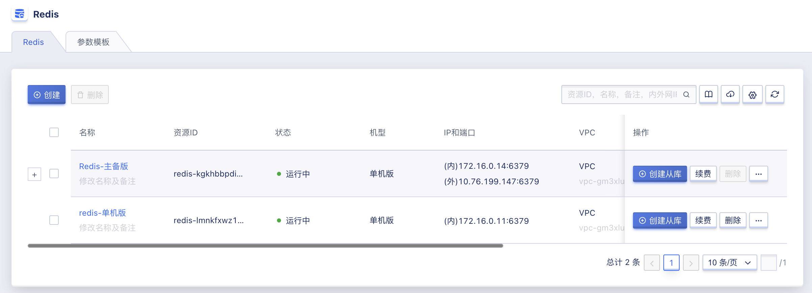

* 名称：Redis的名称，可点击进入Redis详情页；
* 资源ID：Redis的资源ID，作为全局唯一标识；
* 状态：Redis的状态，包括启动中、更改配置中、删除中等；
* 机型：Redis的机型信息，支持单机版和主备版；
* IP和端口：Redis的网络信息，包括内/外网IP和端口；
* 实例容量：Redis创建时选择的内存容量信息，可通过升级内存功能升级内存容量；
* VPC/子网：Redis内网信息，包括VPC/子网的名称和资源ID；
* 安全组：Redis绑定外网IP后支持关联安全组；
* 计费方式：Redis资源的计费方式，支持小时、月、年；
* 项目组：Redis资源所属的安全组，可通过安全组的转入/转出功能修改关联关系；
* 创建时间/过期时间；Redis的创建时间和过期时间；
* 操作：Redis资源的可操作项内容，包括创建从库、删除、续费、重置密码、应用参数模板、升级内存、清除数据、升级至主备版、修改告警模板、绑定外网IP、解绑外网IP、修改安全组等。

## 33.4 查看Redis概览信息

平台支持用户查看Redis资源概览信息，包括基本信息、配置信息、监控信息。可通过点击Redis列表中的名称进入概览页面，如下图所示：

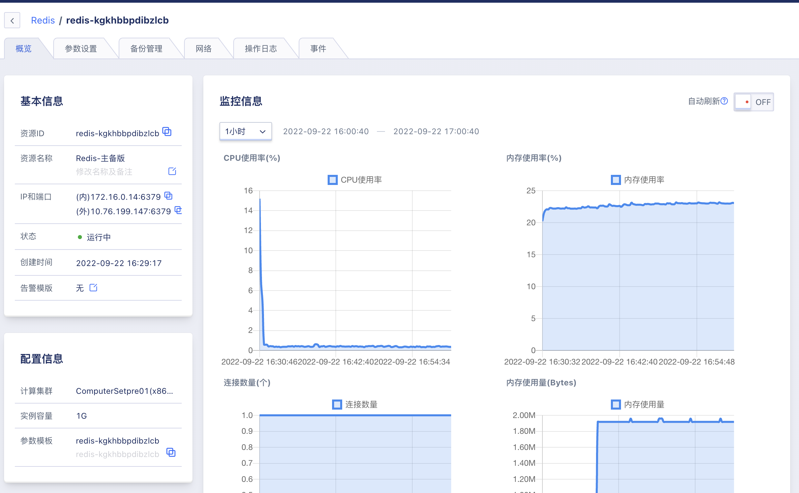

## 33.5 Redis创建从库

平台支持用户对Redis主库进行创建从库的操作，可选择内存容量、外网IP、安全组，内存容量不可低于主库。可通过Redis列表中操作项的“**创建从库**”按钮进行操作，如下图所示：

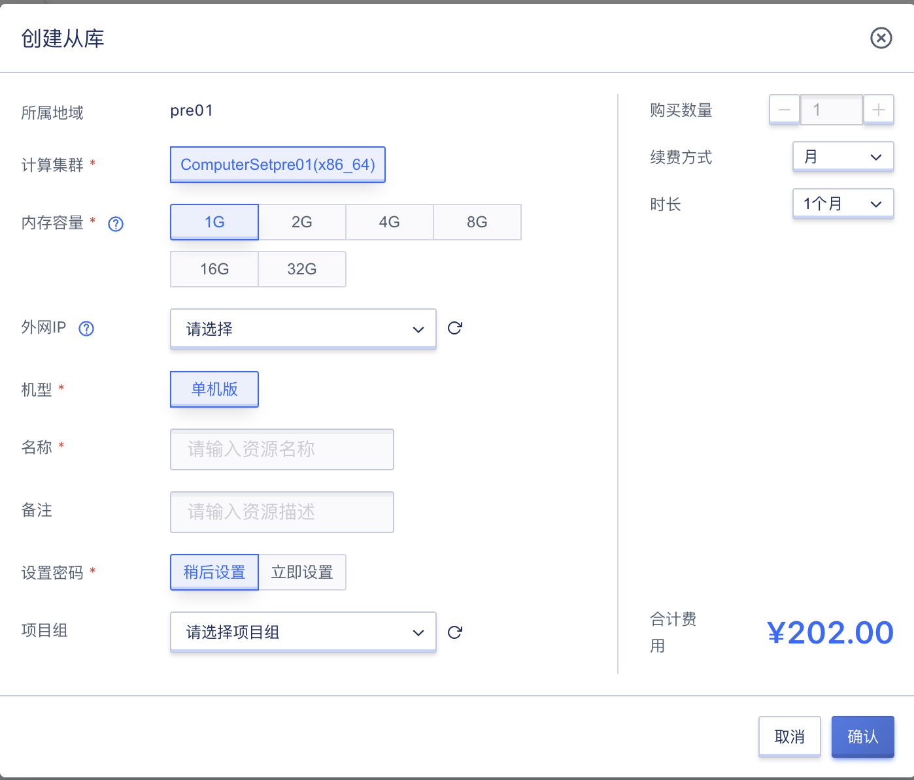

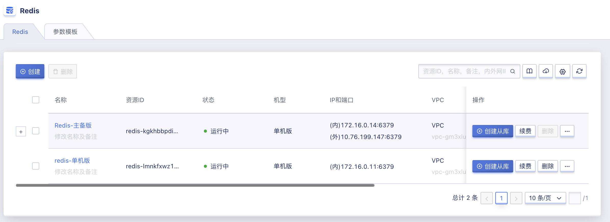

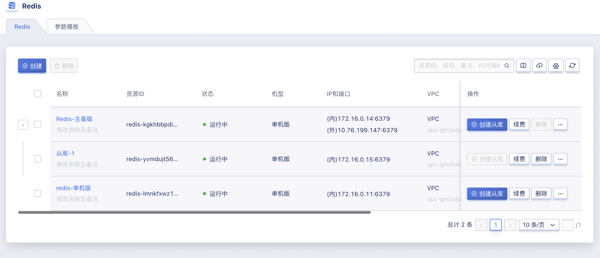

每个Redis主库支持最多创建5个从库。

## 33.6 Redis续费

平台支持用户对Redis进行续费操作，可通过Redis列表中操作项的“**续费**”按钮进行操作，如下图所示：

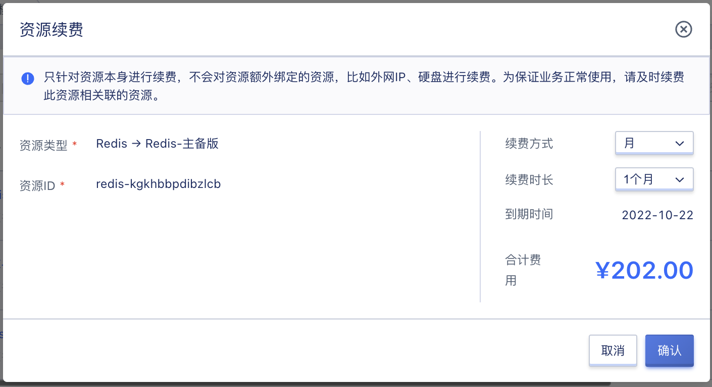

续费支持更改续费方式和续费时长，更改续费方式只支持由短周期改为长周期，比如从“**小时**”更改为“**月**”。

## 33.7 Redis重置密码
 
平台支持用户对Redis进行设置密码操作，可通过Redis列表中操作项的“**设置密码**”按钮进行操作，如下图所示：

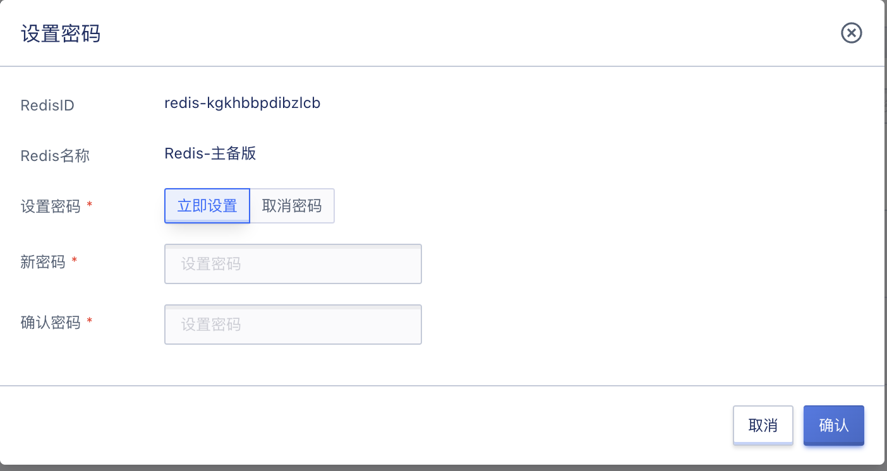

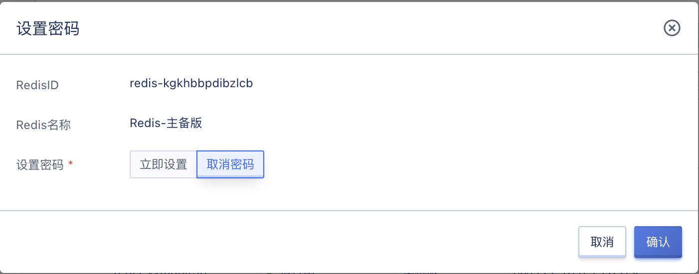

## 33.8 参数配置

平台支持用户对Redis进行参数配置相关操作，包括修改实例参数、应用参数模板、导入参数文件、导出为模板、导出参数文件。可点击Redis名称进入详情页，切换到“**参数设置**”页面查看；也可通过Redis列表操作项的“**修改实例参数**”按钮点击跳转，如下图所示：

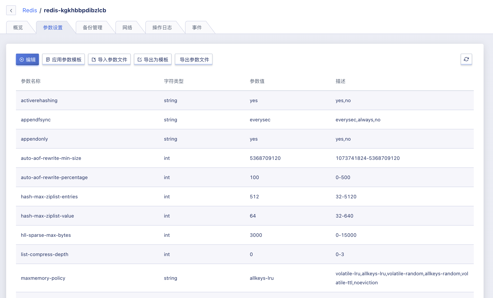

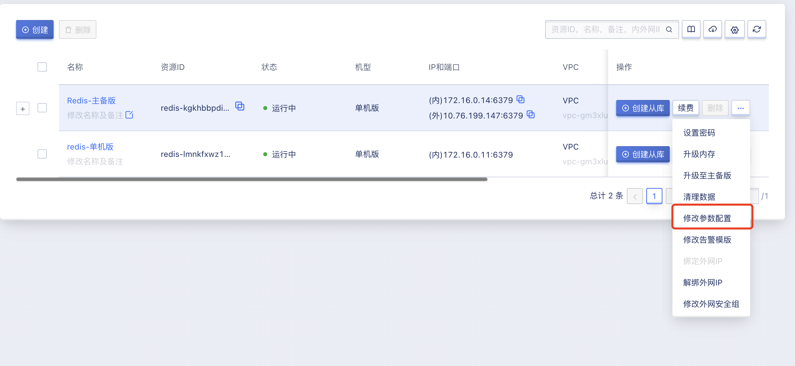

### 33.8.1 修改实例参数

平台支持用户对Redis进行修改实例参数操作，可点击“**修改实例参数**”按钮进行操作，如下图所示：

### 33.8.2 应用参数模板

平台支持用户对Redis进行应用参数模板操作，可点击“**应用参数模板**”进行操作，，如下图所示：

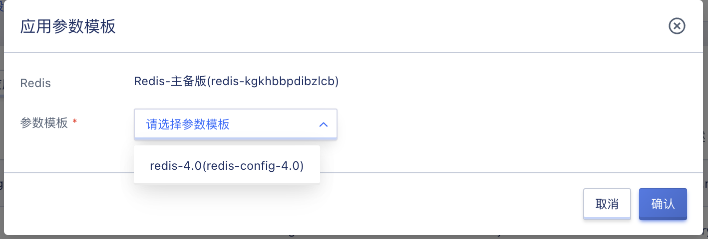

### 33.8.3 导入参数文件

平台支持用户对Redis进行导入参数文件操作，可点击“**导入参数文件**”进行操作，如下图所示：

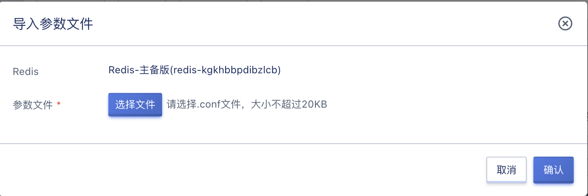

### 33.8.4 导出为模板

平台支持用户对Redis参数配置进行导出为模板操作，可点击“**导出为模板**”进行操作，如下图所示：

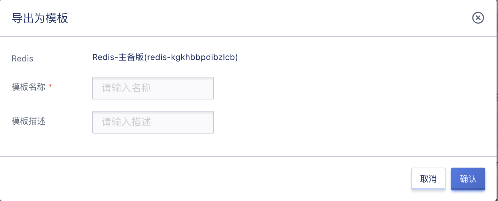

导出为模板操作成功后，参数模板列表新增一条模板数据。

### 33.8.5 导出参数文件

平台支持用户对Redis参数配置进行导出参数文件操作，可点击“**导出参数文件**”进行操作，下载参数配置文件。

## 33.9 升级内存

平台支持用户对Redis进行升级内存操作，可点击Redis列表中操作项的“**升级内存**”按钮进行操作，如下图所示：
 
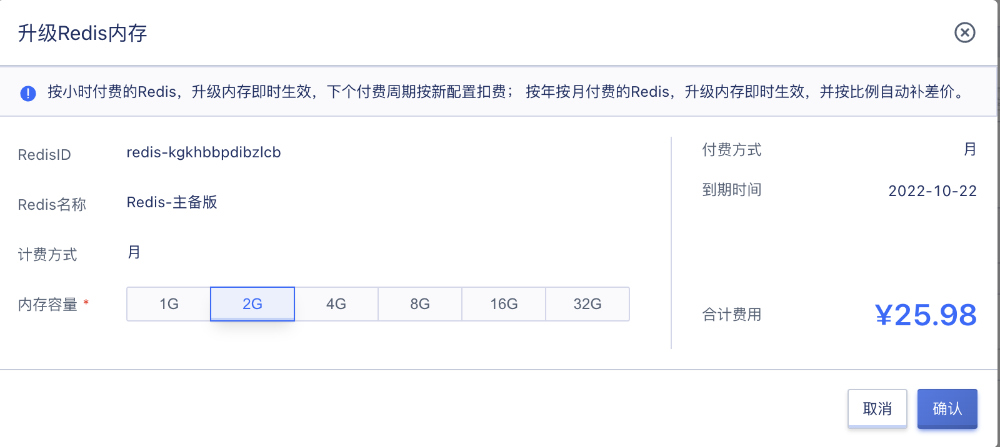

## 33.10 升级主备版

平台支持用户对单机版Redis进行升级至主备版操作，计算集群、内存容量、存储集群、数据盘容量不可修改。可点击Redis列表中操作项的“**升级至主备版**”按钮进行操作，如下图所示：
 
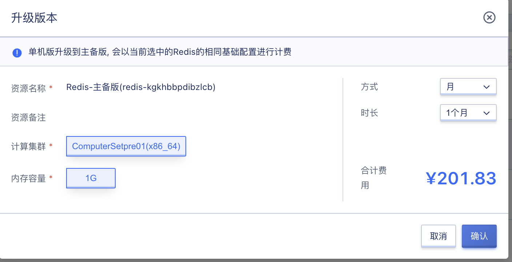

## 33.11 修改告警模板

平台支持用户对Redis进行修改告警模板操作。可点击Redis列表中操作项的“**修改告警模板**”按钮进行操作，如下图所示：

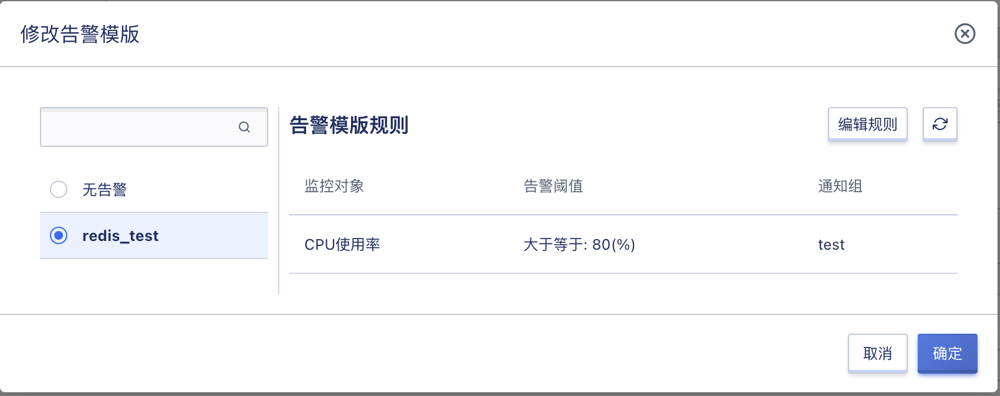

## 33.12 网络

平台支持用户查看Redis的网络信息，包括基本信息和IP列表。可点击Redis名称进入详情页，切换到“**网络**”页面进行查看，如下图所示：

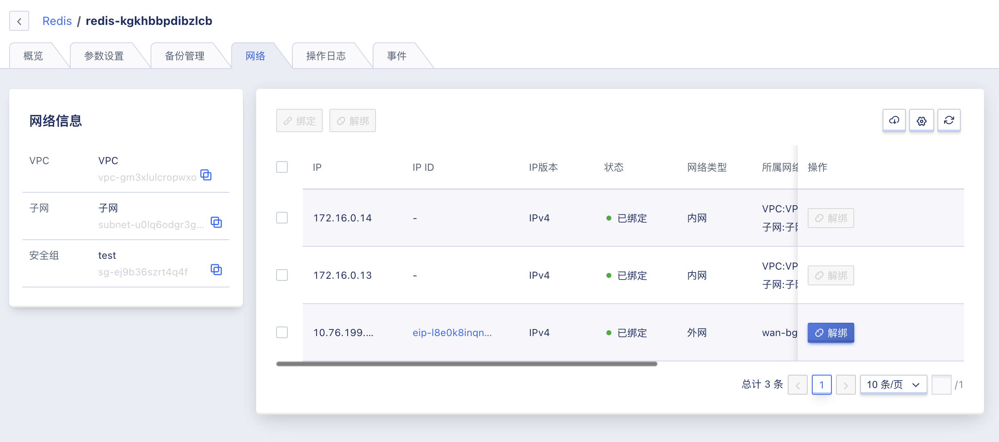

### 33.12.1 查看网络列表

平台支持用户查看Redis的网络列表信息，包括IP、IP ID、IP版本、状态、网络类型、所属网络、是否VIP、带宽、绑定资源、MAC地址、操作，如下图所示：

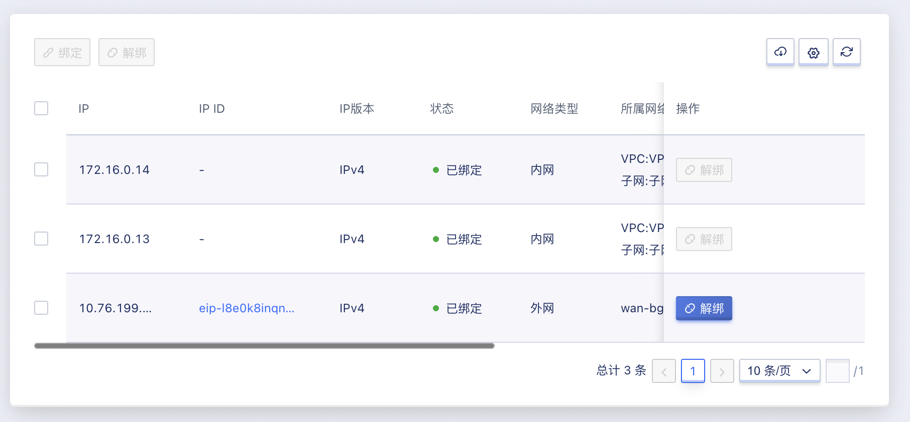

### 33.12.2 绑定外网IP

平台支持用户对Redis进行绑定外网IP操作，可通过“**绑定**”按钮进行操作，也可通过Redis列表中操作项的“**绑定外网IP**”进行操作，如下图所示：

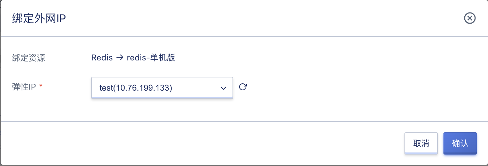

外网IP绑定成功后，在Redis网络列表中新增一条IP数据。

每个Redis支持最多绑定一个外网IP。

### 33.12.3 解绑外网IP

平台支持用户对已绑定外网IP的Redis进行解绑外网IP操作，可通过“**解绑**”按钮进行操作，也可通过Redis列表中操作项的“**解绑外网IP**”进行操作，如下图所示：

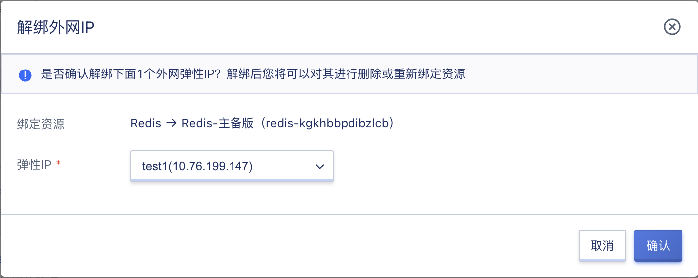

## 33.13 修改安全组

平台支持用户对已绑定外网IP的Redis进行修改安全组操作，可通过Redis列表中操作项的“**修改安全组**”进行操作，如下图所示：

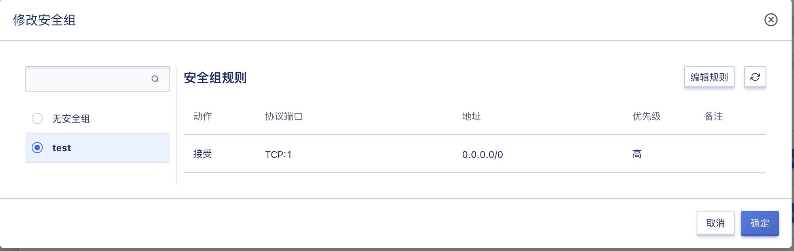

## 33.14 清理数据

平台支持用户对Redis进行清理数据操作，可通过Redis列表中操作项的“**清理数据**”进行操作，如下图所示：

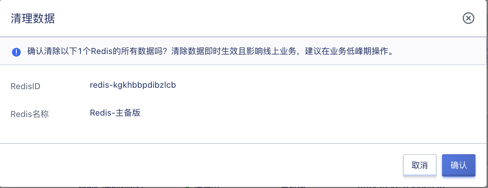

## 33.15 备份管理

### 33.15.1 查看备份管理列表

平台支持用户查看备份管理列表信息，包括资源ID、状态、所属存储池、来源备份计划、保留时间(天)、保存路径、创建时间、更新时间、到期时间、操作。可点击Redis名称进入详情页，切换到“**备份管理**”页面进行查看，如下图所示：

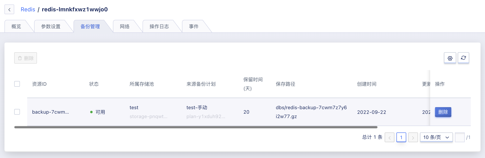

### 33.15.2 删除备份

平台支持用户对备份数据进行删除操作，可点击备份列表中操作项的”**删除**“按钮进行操作，也可通过备份列表的“**批量删除**”按钮进行操作，如下图所示：

## 33.16 查看操作日志

平台支持用户查看Redis的操作日志，并可根据操作结果和操作周期进行筛选，可点击Redis名称进入详情页，切换到“**操作日志**”页面进行查看，如下图所示：

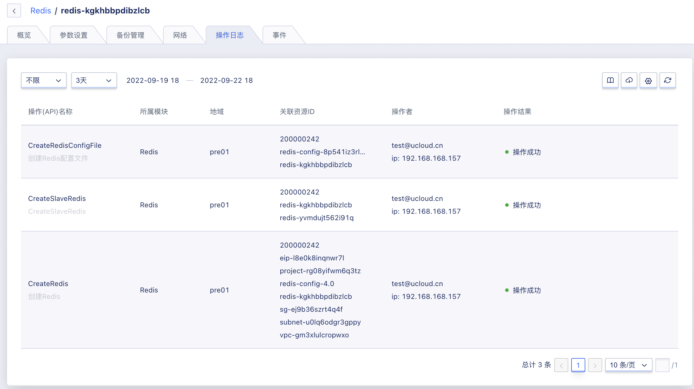

## 33.17 查看事件

平台支持用户查看Redis的事件，并可根据事件周期进行筛选，可点击Redis名称进入详情页，切换到“**事件**”页面进行查看，如下图所示：

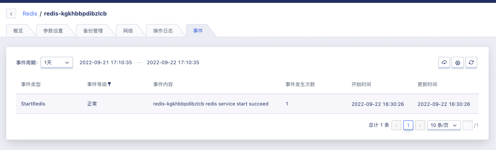

## 33.18 删除Redis

平台支持用户对Redis进行删除操作，删除主库前需先将从库删除。可点击Redis列表中操作项的“**删除**”按钮进行操作，如下图所示：

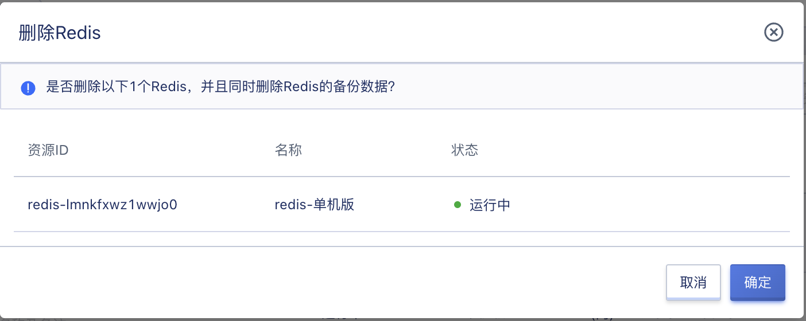

## 33.19 创建参数模板

平台支持用户指定创建方式创建参数模板，包括复制现有模板和导入模板文件，如下图所示：

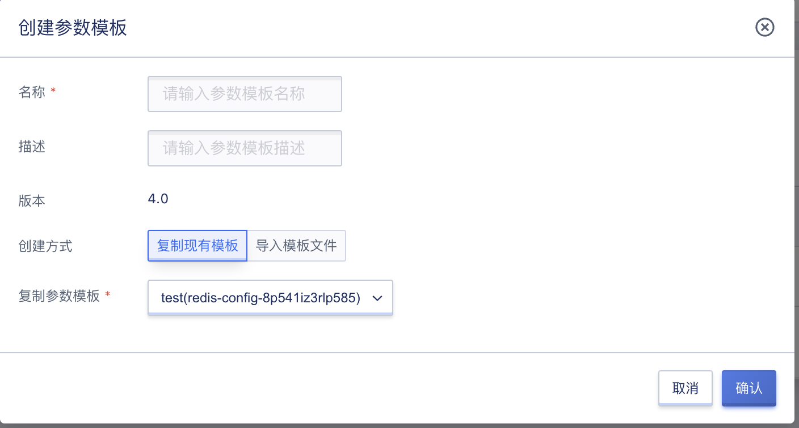

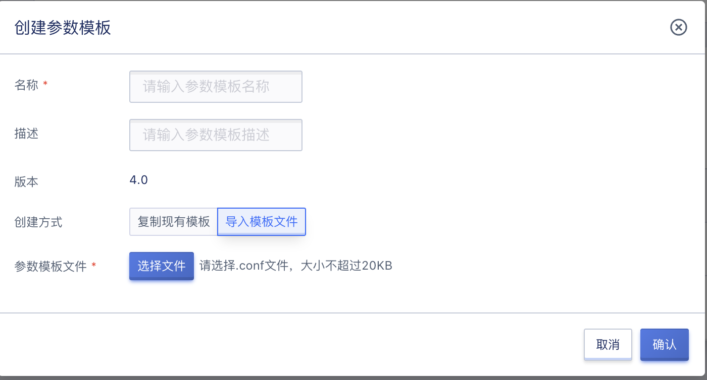

## 33.20 删除参数模板

平台支持用户对自定义参数模板进行删除操作，可点击参数模板列中操作项的“**删除**”按钮进行操作，如下图所示：

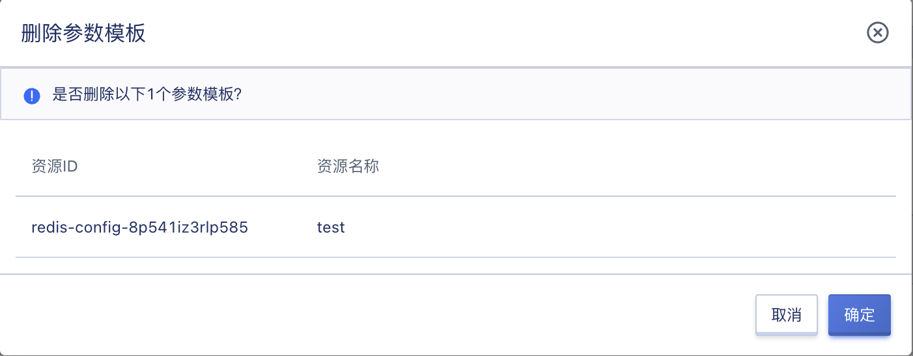
