# 10 安全组

## 10.1 安全组简介

### 10.1.1 概述

安全组（ Security Group ）是一种类似 [IPTABLES](https://en.wikipedia.org/wiki/Iptables) 的虚拟防火墙，提供出入双方向流量访问控制规则，定义哪些网络或协议能访问资源，用于限制虚拟资源的网络访问流量，支持 IPv4 和 IPv6 双栈限制，为云平台提供必要的安全保障。

平台安全组基于 Linux Netfilter 子系统，通过在 [OVS](http://www.openvswitch.org/) 流表中添加流表规则实现，需开启宿主机 IPv4 和IPv6 包转发功能。每增加一条访问控制规则会根据网卡作为匹配条件，生成一条流表规则，用于控制进入 OVS 的流量，保证虚拟资源的网络安全。

安全组仅可作用于**同一个数据中心** 内具有相同安全需求的虚拟机、弹性网卡、负载均衡及 NAT 网关，工作原理如下图所示：

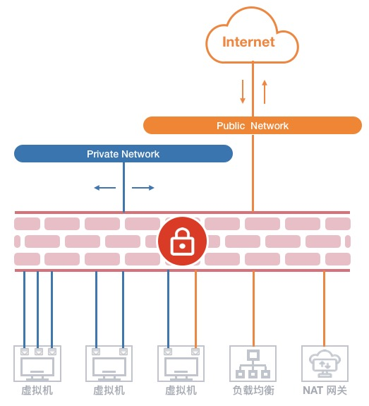

安全组具有独立的生命周期，可以将安全组与虚拟机、弹性网卡、负载均衡、NAT 网关绑定在一起，提供安全访问控制，与之绑定的虚拟资源销毁后，安全组将自动解绑。

- 安全组对虚拟机的安全防护针对的是一块网卡，即安全组是与虚拟机的默认虚拟网卡或弹性网卡绑定在一起，分别设置访问控制规则，限制每块网卡的出入网络流量；
- 如安全组原理图所示，安全组与提供外网 IP 服务的虚拟外网网卡绑定，通过添加出入站规则，对南北向（虚拟机外网）的访问流量进行过滤；
- 安全组与提供私有网络服务的虚拟网卡或弹性网卡绑定，通过添加出入站规则，控制东西向（虚拟机间及弹性网卡间）网络访问；
- 安全组与外网类型的负载均衡关联，通过添加出入站规则，可对进出外网负载均衡的外网 IP 流量进行限制和过滤，保证外网负载均衡器的流量安全；
- 安全组与 NAT 网关绑定，通过添加出入站规则，可对进入 NAT 网关的流量进行限制，保证 NAT 网关的可靠性和安全性；
- 一个安全组支持同时绑定至多个虚拟机、弹性网卡、NAT 网关及外网负载均衡实例；
- 虚拟机支持绑定一个内网安全组和一个外网安全组，分别对应虚拟机默认的内网网卡和外网网卡上，其中外网安全组对绑定至虚拟机的所有外网 IP 地址生效；
- 弹性网卡仅支持绑定一个安全组，与虚拟机默认网卡绑定的安全组相互独立，分别限制对应网卡的流量；
- 外网负载均衡和 NAT 网关实例仅支持绑定一个安全组，可更换安全组应用不同的网络访问规则。

创建虚拟机时必须指定外网安全组，支持随时修改安全组的出入站规则，新规则生成时立即生效，可根据需求调整安全组出/入方向的规则。支持安全组全生命周期管理，包括安全组创建、修改、删除及安全组规则的创建、修改、删除等生命周期管理。

### 10.1.2 安全组规则

安全组规则可控制允许到达安全组关联资源的入站流量及出站流量，提供双栈控制能力，支持对 IPv4/IPv6 地址的 TCP、UPD、ICMP、GRE 等协议数据包进行有效过滤和控制。

每个安全组支持配置多条规则，根据优先级对资源访问依次生效。**规则为空时，安全组将默认拒绝所有流量；规则不为空时，除已生成的规则外，默认拒绝其它访问流量。**

**支持有状态的安全组规则，可以分别设置出入站规则，对被绑定资源的出入流量进行管控和限制。**每条安全组规则由协议、端口、地址、动作、优先级及方向六个元素组成：

- 协议：支持 TCP、UDP、ICMPv4、ICMPv6 四种协议数据包过滤。
  - ALL 代表所有协议和端口，ALL TCP 代表所有 TCP 端口，ALL UDP 代表所有 UDP 端口；
  - 支持快捷协议指定，如 FTP、HTTP、HTTPS、PING、OpenVPN、PPTP、RDP、SSH 等；
  - ICMPv4 指 IPv4 版本网络的通信流量；ICMPv6 指 IPv6 版本网络的通信流量。
- 端口：源地址访问的本地虚拟资源或本地虚拟资源访问目标地址的 TCP/IP 端口。
  - TCP 和 UDP 协议的端口范围为 1~65535 ；
  - ICMPv4 和 ICMPv6 不支持配置端口。
- 地址：访问安全组绑定资源的网络数据包来源地址或被安全组绑定虚拟资源访问的目标地址。
  - 当规则的方向为入站规则时，地址代表访问被绑定虚拟资源的源 IP 地址段，支持 IPv4 和 IPv6 地址段；
  - 当规则的方向为出站规则时，地址代表被绑定虚拟资源访问目标 IP 地址段，支持 IPv4 和 IPv6 地址段；
  - 支持 CIDR 表示法的 IP 地址及网段，如 `120.132.69.216` 、 `0.0.0.0/0` 或 `::/0` 。
- 动作：安全组生效时，对数据包的处理策略，包括 “接受” 和 “拒绝” 两种动作。
- 优先级：安全组内规则的生效顺序，包括高、中、低三档规则。
  - 安全组按照优先级高低依次生效，优先生效优先级高的规则；
  - 同优先级的规则，优先生效精确规则。
- 方向：安全组规则所对应的流量方向，包括出站流量和入站流量。

**安全组支持数据流表状态，规则允许某个请求通信的同时，返回数据流会被自动允许，不受任何规则影响。即安全组规则仅对新建连接生效，对已经建立的链接默认允许双向通信。**如一条入方向规则允许任意地址通过互联网访问虚拟机外网 IP 的 80 端口，则访问虚拟机 80 端口的返回数据流（出站流量）会被自动允许，无需为该请求添加出方向允许规则。

> 注：通常建议设置简洁的安全组规则，可有效减少网络故障。

## 10.2 安全组管理

### 10.2.1 创建安全组

系统默认提供的安全组无法满足需求时，可指定安全组名称并添加相关安全组规则，快速创建一个属于用户独立的安全组，可关联或绑定至相关资源，为相关资源提供内网或外网的访问控制，保证网络访问的安全性。

用户可通过导航栏进入【安全组】资源控制台，通过“**创建安全组**”可进入安全组创建向导页面，如下图所示：

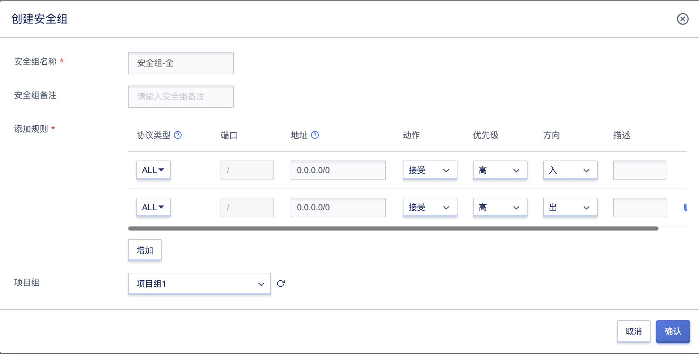

可根据向导页面的提示，选择并配置安全组名称，并根据需求配置安全组规则，包括协议类型、端口、地址、动作、优先级、方向及描述等。

其中安全组名称指当前需要创建的安全组的名称标识。添加规则指增加安全组相应的入和出的流量规则，可批量增加多条，也可在安全组创建后在进行规则的添加。

- 协议：一条规则仅支持一种协议，可选择 ALL 或 ALL TCP、ALL UDP 等。
- 端口：端口支持选择自定义端口或端口组，端口组列表展示当前租户下创建的端口组，可到端口组页面进行创建操作。
- 地址：地址栏支持选择自定义 IP 或 IP 地址组， IP 地址组列表展示当前租户下创建的 IP 组，可到 IP 组页面进行创建操作。
- 动作：规则的协议、端口、地址及方向相同时，不支持同时配置接受和拒绝两种动作。
- 方向：规则的流量方向，包括入站和出站，一条规则仅支持选择一个方向。
- 描述：指当前安全组规则的描述。

点击确定后，自动返回至安全组列表页面，在列表页面可查看新建安全组的创建过程，待安全组的状态由“创建中”转换为“可用”时，即代表创建成功。

### 10.2.2 查看安全组

通过导航栏进入安全组资源控制台，可查看当前账户安全组资源列表，并可通过列表上安全组名称进入详情页面查看安全组基本信息、安全组规则及已绑定的资源等信息。

#### 10.2.2.1 安全组列表

安全组列表页面可查看当前账户下安全组资源列表及相关信息，包括名称、ID、规则数量、绑定资源数量、创建时间、状态及操作项等，如下图所示：

- 名称/ID ：安全组的名称及全局唯一标识符；
- 规则数量：安全组已添加的安全组规则数量，以数字表示；
- 绑定资源数量：安全组已绑定的资源数量，以数字表示，未绑定时显示为 0 ；
- 创建时间：安全组的创建时间；
- 状态：安全组的运行状态，包括可用、创建中、删除中等；

列表上的操作项是可对单个安全组进行删除操作，支持安全组批量删除操作，可通过搜索框对安全组列表进行搜索和筛选，支持模糊搜索。

#### 10.2.2.2 安全组详情

在安全组资源列表上，点击安全组名称可查看当前安全组的详情及安全组规则信息，同时可切换至资源页面查看当前安全组已绑定的资源信息，如下图概览页所示：

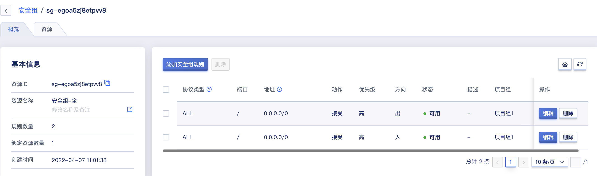

- 基本信息：当前安全组的基本信息，包括名称、ID、规则数量、已绑定资源数量及创建时间等信息。
- 安全组规则管理：当前安全组的访问控制规则管理，包括添加、查看、编辑、删除等，详见[安全组规则管理](#_103-安全组规则管理)。
- 已绑定资源：当前安全组已绑定资源的列表信息，详见[已绑定资源](#_10223-已绑定资源)。

#### 10.2.2.3 已绑定资源

已绑定资源指安全组已绑定资源的列表信息，可通过列表信息查看当前安全组已经绑定或关联的虚拟资源信息。用户可通过安全组详情页面进入“**资源**”子页面，查看已绑定的资源信息。

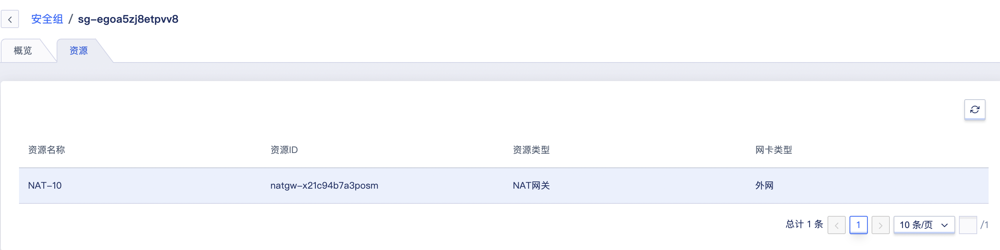

如上图列表图所示，已绑定资源的列表信息包括资源名称、资源类型、资源ID等信息，其中资源类型包括虚拟机、弹性网卡、NAT 网关、负载均衡等。

### 10.2.3 批量绑定虚拟资源

支持用户批量绑定安全组至虚拟资源，已绑定的资源可在安全组的详情页“**资源**”子页面进行查看。用户可通过安全组列表操作栏的“**绑定**”按钮进入绑定安全组向导页。

* 支持虚拟机绑定内网和外网安全组，如下图所示：

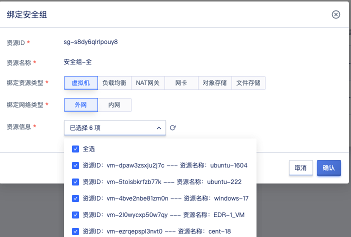

- 资源 ID：安全组的全局唯一标识符；
- 资源名称：安全组的名称；
- 绑定资源类型：安全组支持绑定的资源类型，包括虚拟机、负载均衡、 NAT 网关、网卡、对象存储及文件存储；
- 绑定网络类型：安全组支持绑定虚拟机的网络类型，包括外网和内网；
- 资源信息：资源信息列表展示虚拟机资源列表，可多选。

* 支持负载均衡绑定安全组，如下图所示：

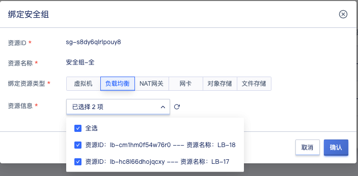

- 资源 ID：安全组的全局唯一标识符；
- 资源名称：安全组的名称；
- 绑定资源类型：安全组支持绑定的资源类型，包括虚拟机、负载均衡、 NAT 网关、网卡、对象存储及文件存储；
- 资源信息：资源信息列表展示负载均衡资源列表，可多选。

* 支持nat网关绑定安全组，如下图所示：

- 资源 ID：安全组的全局唯一标识符；
- 资源名称：安全组的名称；
- 绑定资源类型：安全组支持绑定的资源类型，包括虚拟机、负载均衡、 NAT 网关、网卡、对象存储及文件存储；
- 资源信息：资源信息列表展示NAT网关资源列表，可多选。

* 支持网卡绑定安全组，如下图所示：

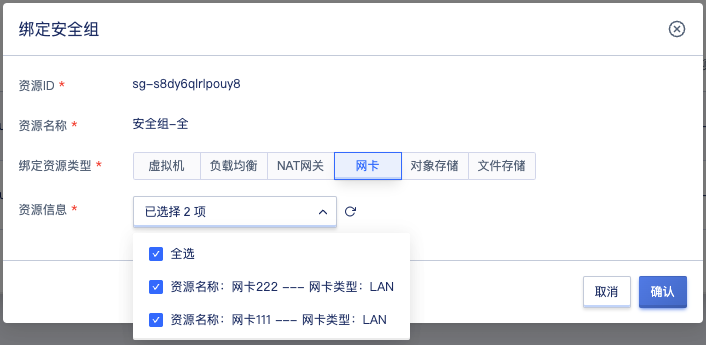

- 资源 ID：安全组的全局唯一标识符；
- 资源名称：安全组的名称；
- 绑定资源类型：安全组支持绑定的资源类型，包括虚拟机、负载均衡、 NAT 网关、网卡、对象存储及文件存储；
- 资源信息：资源信息列表展示网卡资源列表，可多选。

* 支持对象存储绑定安全组，如下图所示：

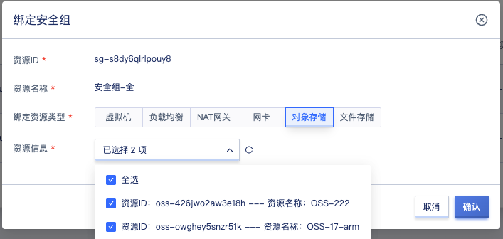

- 资源 ID：安全组的全局唯一标识符；
- 资源名称：安全组的名称；
- 绑定资源类型：安全组支持绑定的资源类型，包括虚拟机、负载均衡、 NAT 网关、网卡、对象存储及文件存储；
- 资源信息：资源信息列表展示对象存储资源列表，可多选。

* 支持文件存储绑定安全组，如下图所示：

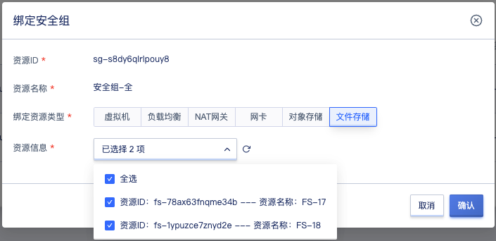

- 资源 ID：安全组的全局唯一标识符；
- 资源名称：安全组的名称；
- 绑定资源类型：安全组支持绑定的资源类型，包括虚拟机、负载均衡、 NAT 网关、网卡、对象存储及文件存储；
- 资源信息：资源信息列表展示文件存储资源列表，可多选。

### 10.2.4 批量解绑资源

支持用户批量解绑安全组，可通过安全组列表操作栏的“**解绑**”按钮进入解绑安全组向导页，如下图所示：

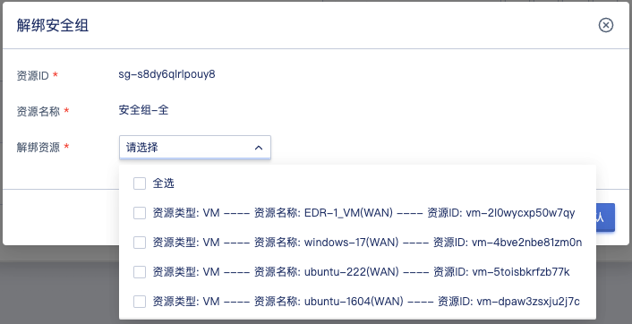

- 资源 ID：安全组的全局唯一标识符；
- 资源名称：安全组的名称；
- 解绑资源：展示支持解绑的资源列表，可多选。

### 10.2.5 修改安全组名称

修改安全组资源的名称和备注，在任何状态下均可进行操作。可通过点击安全组资源列表页面每个安全组名称右侧的“编辑”按钮进行修改。

### 10.2.6 删除安全组

支持用户删除未被任何资源绑定的安全组资源。安全组删除后，会被彻底销毁，删除前需保证安全组未被任何资源绑定或关联。可通过安全组列表页面操作项中的“删除”进行安全组的删除，如下图所示：

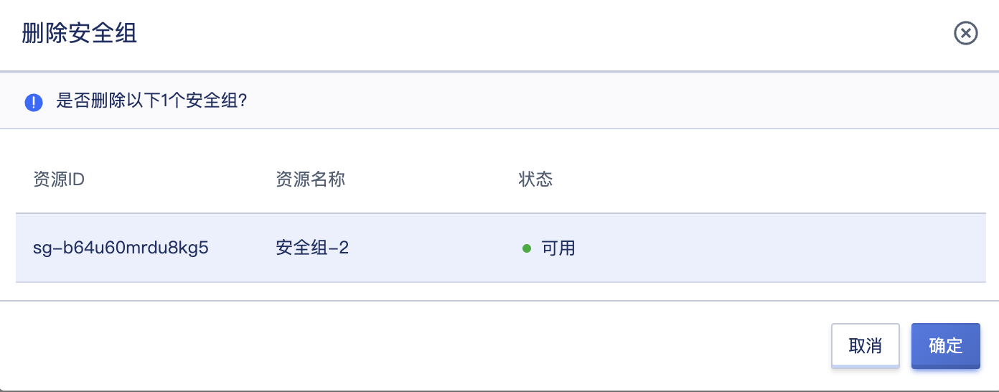

## 10.3 安全组规则管理

### 10.3.1 新建规则

为已绑定资源提供网络安全访问控制的主要手段是制定合理的安全组规则，每个安全组支持配置多条规则，根据优先级对资源访问依次生效。**规则为空时，安全组将默认拒绝所有流量；规则不为空时，除已生成的规则外，默认拒绝其它访问流量。**

用户可指定规则的协议类型、端口、地址、动作、优先级、方向及描述等信息进行规则的添加，通过安全组详情页面的“**新建规则**”即可进入新建规则向导页面，具体操作与 [创建安全组](#_1021-创建安全组) 中的添加规则相同，可根据具体业务网络安全控制需求，新建安全组规则。

### 10.3.2 查看规则

通过安全组详情页面的规则列表可查看当前安全组已生成的规则信息，并可通过列表的操作项对已有规则进行编辑和删除等操作。规则列表信息包括协议类型、端口、地址、动作、优先级、方向、描述、创建时间及操作项等，如下图所示：

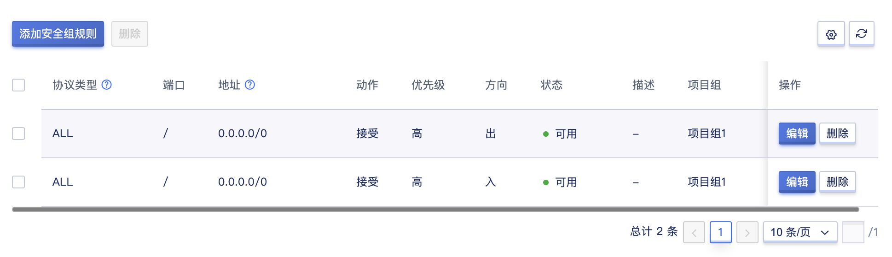

### 10.3.3 编辑规则

已有安全组规则不能满足业务需求时，可通过安全组规则列表操作项中的“**编辑**”进行修改及变更操作，修改项与新建规则时指定的参数相同，可根据实际情况修改指定参数。

- 当协议类型为 ALL 或 ICMPv4/ICMPv6 时，端口不可选择并显示为`“/”` ；
- 地址支持 IP 地址和 CIDR IP 网段格式，若需指定所有 IP 地址可配置为 `0.0.0.0/0` 或 `::/0`。

>  规则编辑后即时生效，同时会对已绑定的资源网络访问产生影响，请慎重操作。

### 10.3.4 删除规则

已有安全组规则需被删除时，可通过安全组规则列表操作项中的“**删除**”操作，删除的规则会被即时销毁。为避免影响业务，建议删除前确认安全组规则是否有必要删除。删除安全组规则后，安全组信息中的规则数量会重新统计，显示最新的规则数量。

## 10.4 IP组

### 10.4.1 创建IP组

可根据向导页面的提示，创建并配置 IP 组，包括 IP 组名称、 IP 地址、 IP 组备注及项目组等。

其中 IP 组名称指当前需要创建的 IP 组的名称标识， IP 地址可增加多条，如下图所示：

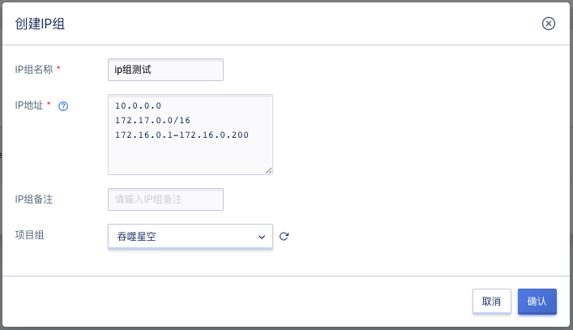

- IP 组名称：IP组的名称；
- IP 地址：地址栏支持批量输入多个 IP 地址，多个 IP 地址换行输入，IP 支持以下格式:
    - 单个 IP : 10.0.0.1 或 FF05::B5
    - 网段: 10.0.1.0/24 
    - 连续地址段: 10.0.0.1-10.0.0.100
- IP 组备注：当前IP组的备注；
- 项目组：可绑定当前租户下创建的项目组。

点击确定后，自动返回至 IP 组列表页面， IP 组的状态为“可用”时，即代表创建成功。

### 10.4.2 查看IP组

用户查看已创建的 IP 组信息，包括名称、资源 ID 、IP/网段、绑定资源数量、项目组、创建时间及操作项，如下图所示：

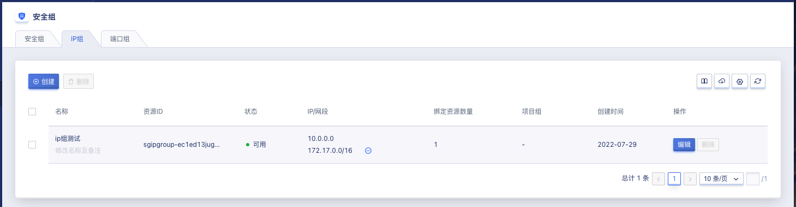

- 名称：IP 组的名称；
- 资源 ID ：IP 组的全局唯一标识符；
- 状态：IP 组的状态，包括可用、失败；
- IP/网段：源数据（入站）或目标数据（出站）的 IP，地址的形式为 IP 地址、网段或连续地址段，例如 10.0.0.1 或 192.168.0.0/16；
- 绑定资源数量：IP 组绑定资源的数量，可以悬浮查看到具体的安全组规则 ID 列表，点击相应安全组ID可以跳到该安全组详情列表；
- 项目组：IP 组绑定的项目组；
- 创建时间：IP 组的创建时间。

列表上操作项是指对单条 IP 组的操作，包括编辑和删除，仅当 IP 组绑定资源数量为 0 时，才可进行删除操作；同时为方便租户对资源的维护支持对端口组进行批量删除操作。

### 10.4.3 编辑IP组

支持用户编辑 IP 组的 IP 地址，IP 组名称不可修改，可通过点击 IP 组列表操作栏的 “**编辑**” 按钮进行修改，如下图所示：

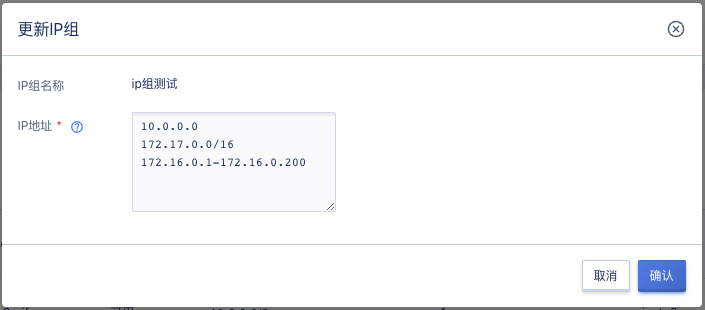

### 10.4.4 删除IP组

用户可在控制台删除账户内 IP 组，支持对 IP 组进行批量删除操作。可通过 IP 组列表操作项的 “**删除**” 进行操作，如下图所示：

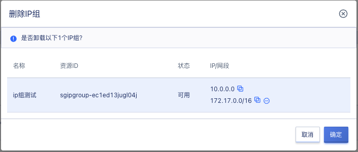

## 10.5 端口组

### 10.5.1 创建端口组

可根据向导页面的提示，创建并配置端口组，包括端口组名称、协议端口及项目组等。

其中端口组名称指当前需要创建的端口组的名称标识，协议端口可增加多条，如下图所示：

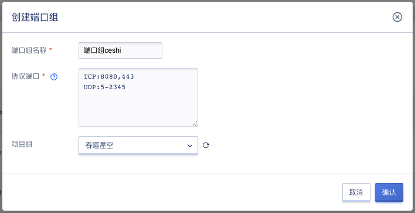

- 端口组名称：IP组的名称；
- 协议端口：支持换行输入多个协议端口，端口支持以下格式:
    - 单个端口: 80
    - 多个单个端口: 80,443
    - 连续端口段: 3306-20000
- 项目组：可绑定当前租户下创建的项目组。

点击确定后，自动返回至端口组列表页面，端口组的状态为“可用”时，即代表创建成功。

### 10.5.2 查看端口组

用户查看已创建的端口组信息，包括名称、资源 ID 、端口、绑定资源数量、项目组、创建时间及操作项，如下图所示：

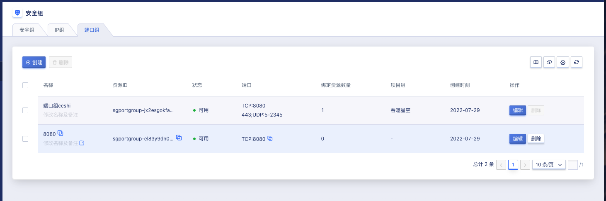

- 名称：端口组的名称；
- 资源 ID：端口组的全局唯一标识符；
- 状态：端口组的状态，包括可用、失败；
- 端口：以协议：端口格式展示，协议类型如 TCP、UDP 等，源数据（入站）或目标数据（出站）的端口，值范围：1-65535；
- 绑定资源数量：端口组绑定资源的数量，可以悬浮查看到具体的安全组规则 ID 列表，点击相应安全组ID可以跳到该安全组详情列表；
- 项目组：端口组绑定的项目组；
- 创建时间：端口组的创建时间。

列表上操作项是指对单条端口组的操作，包括编辑和删除，仅当端口组绑定资源数量为 0 时，才可进行删除操作；同时为方便租户对资源的维护支持对端口组进行批量删除操作。

### 10.5.3 编辑端口组

支持用户编辑端口组的协议端口，端口组名称不可修改，可通过点击端口组列表操作栏的 “**编辑**” 按钮进行修改，如下图所示：

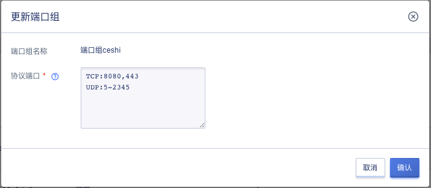

### 10.5.4 删除端口组

用户可在控制台删除账户内端口组，支持对端口组进行批量删除操作。可通过端口组列表操作项的 “**删除**” 进行操作，如下图所示：

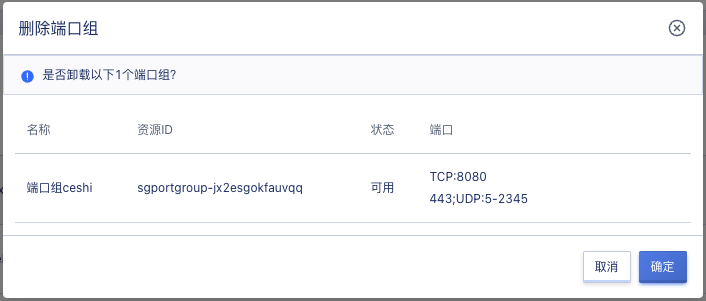

