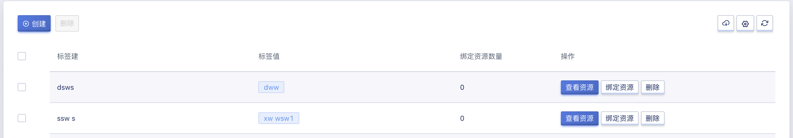
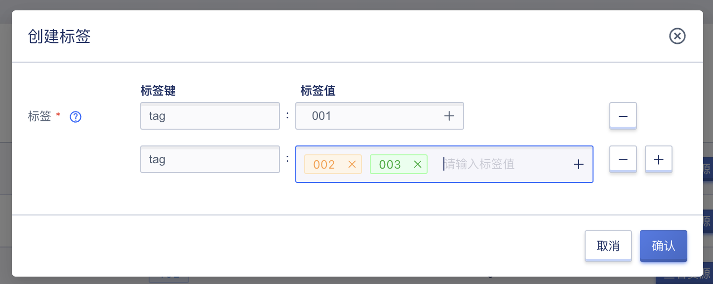
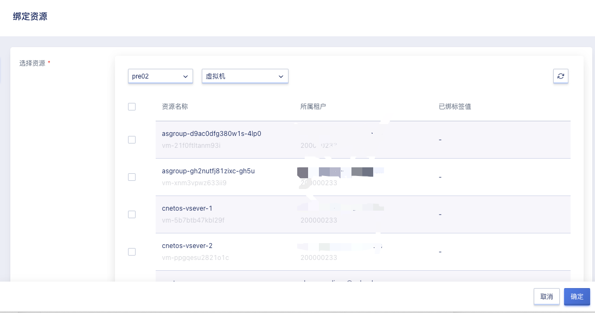
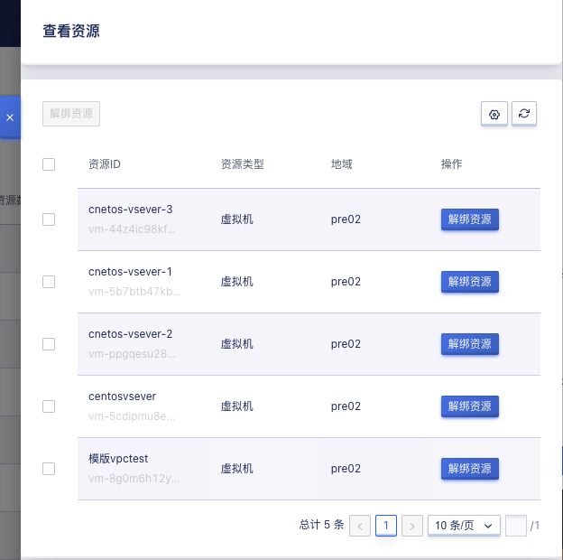
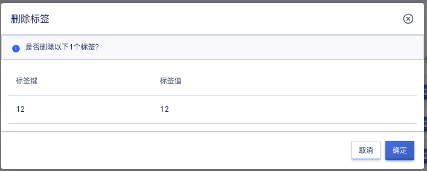

# 35 标签管理

## 35.1 标签功能简介

### 35.1.1 产品概述
标签用于标记各项云资源，从不同维度对具有相同特征的云资源进行分类、搜索和聚合，让资源管理变得更加方便。
标签由一对键值对（key:value）构成，用户可根据需求自定义键值对内容，绑定不同资源。

### 35.1.2 标签功能
标签管理模块具有以下功能：

- 支持标签批量创建，单次创建，删除标签功能
- 支持查看资源，展示该条标签下所有绑定的资源
- 支持绑定资源，可选择不同地域下不同资源类型进行绑定
- 支持解绑资源，可批量解绑

同时，标签支持资源创建时选择需要的标签进行添加，支持在资源界面对标签进行添加与删除操作。资源界面将会展示当前资源所绑定的标签键值对。
支持统一的搜索入口，可根据 key/value，资源ID，资源类型，三个维度进行绑定资源到查询，灵活操作资源，可在云资源界面以及标签管理界面进行搜索，方便查询管理较大数量的标签，以及快速的匹配资源。

### 35.1.3 使用限制
**标签命名限制**
- 标签键以及value值支持最大127位字符，不能为空，区分大小写
- 标签key以及value内容支持utf-8格式表示的大小写数字、汉字、数字、空格以及特殊字符

**数量规范**
- 1个资源最多可以绑定50个标签
- 1个标签包含1个标签键和1个标签值（tagKey:tagValue）
- 1个资源上的同一个标签键只能对应1个标签值
- 单次批量创建标签数量最多不超过5个

**资源状态限制**
- 虚拟机除过删除，删除中和失败的资源不能更新标签，其他状态下可修改资源绑定的标签内容。

### 35.1.4 支持的资源
目前租户侧支持的资源类型包括：虚拟机
管理侧支持的资源类型包括：虚拟机、外网网络

## 35.2 标签操作指南

### 35.2.1 查看标签管理界面
进入运维与管理模块，点击标签管理进入管理界面，支持查看标签的标签键、标签值、绑定资源数量、操作（查看资源、绑定资源、删除）如下图所示：

### 35.2.2 创建标签
点击标签管理左上角创建按钮，弹出标签创建弹窗，按照格式要求[使用限制](#_3513-使用限制)填写标签键和标签值，点击添加行后面加号可添加新的一条键值对，点击标签值后边的加号可添加该标签下的新value值。如下图所示：

### 35.2.3 标签添加资源

点击标签操作中的绑定资源按钮，弹出绑定资源弹窗，支持查看不同地域下不同类型的可绑定资源列表。点击列表前方框可批量添加资源，已绑定标签值中展示的是当前键下该资源已绑定的一个value的值。未展示则该键下当前资源还未绑定value值。添加界面如下图所示：

**如果该资源在此键下已绑定标签值，绑定新标签值后将与旧标签值解绑**，每个资源同一个标签键只能对应1个标签值.

虚拟机界面可在操作中点击更多操作，点击修改标签，修改该虚拟机下绑定的标签资源，支持对该资源下的标签进行删除，添加操作。

### 35.2.4 标签解绑资源

点击标签操作中的查看资源，弹出此标签所绑定的资源列表，支持查看资源ID，资源类型，地域信息，操作解绑资源。选择资源前方框可批量选择，点击左上方解绑资源批量解绑，也可在资源行最后通过解绑资源按钮来实现解绑资源。

### 35.2.5 删除标签

点击标签行删除按钮，弹出如下图所示弹窗，点击确定删除标签，支持批量删除。删除时需要确定标签内未绑定资源，否则无法删除。

